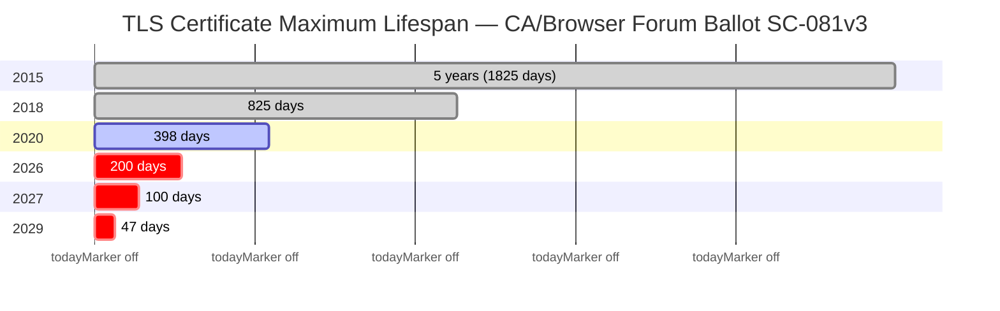

<p align="center">
  
</p>

# certctl — Self-Hosted Certificate Lifecycle Platform

[](LICENSE)
[](https://goreportcard.com/report/github.com/certctl-io/certctl)
[](https://github.com/certctl-io/certctl/releases)
[](https://github.com/certctl-io/certctl/stargazers)

TLS certificate lifespans are shrinking fast. The CA/Browser Forum passed [Ballot SC-081v3](https://cabforum.org/2025/04/11/ballot-sc081v3-introduce-schedule-of-reducing-validity-and-data-reuse-periods/) unanimously in April 2025, setting a phased reduction: **200 days** by March 2026, **100 days** by March 2027, and **47 days** by March 2029. Organizations managing dozens or hundreds of certificates can no longer rely on spreadsheets, calendar reminders, or manual renewal workflows. The math doesn't work — at 47-day lifespans, a team managing 100 certificates is processing 7+ renewals per week, every week, forever.

certctl is a self-hosted platform that automates the entire certificate lifecycle — from issuance through renewal to deployment — with zero human intervention. It works with any certificate authority, deploys to any server, and keeps private keys on your infrastructure where they belong. It's free, self-hosted, and covers the same lifecycle that enterprise platforms charge $100K+/year for.



> **Actively maintained — shipping weekly.** Found something? [Open a GitHub issue](https://github.com/certctl-io/certctl/issues) — issues get triaged same-day. CI runs the full test suite with race detection, static analysis, and vulnerability scanning on every commit.

**Ready to try it?** Jump to the [Quick Start](#quick-start) — you'll have a running dashboard in under 5 minutes.

## Documentation

| Guide | Description |
|-------|-------------|
| [Why certctl?](docs/getting-started/why-certctl.md) | How certctl compares to ACME clients, agent-based SaaS, and enterprise platforms |
| [Concepts](docs/getting-started/concepts.md) | TLS certificates explained from scratch — for beginners who know nothing about certs |
| [Quick Start](docs/getting-started/quickstart.md) | 5-minute setup — dashboard, API, CLI, discovery, stakeholder demo flow |
| [Docker Compose Environments](deploy/ENVIRONMENTS.md) | Service-by-service walkthrough of all 4 compose files, env var reference |
| [Deployment Examples](docs/getting-started/examples.md) | 5 turnkey scenarios (ACME+NGINX, wildcard DNS-01, private CA, step-ca, multi-issuer) with migration guides |
| [Advanced Demo](docs/getting-started/advanced-demo.md) | Issue a certificate end-to-end with technical deep-dives |
| [Architecture](docs/reference/architecture.md) | System design, data flow diagrams, security model |
| [Connector Reference](docs/reference/connectors/index.md) | Configuration for all issuer, target, and notifier connectors |
| [ACME Server](docs/reference/protocols/acme-server.md) | Run certctl as a drop-in ACME server — cert-manager / Caddy / Traefik walkthroughs + [threat model](docs/reference/protocols/acme-server-threat-model.md) |
| [Approval Workflow](docs/operator/approval-workflow.md) | Two-person-integrity gate for certificate issuance — RBAC, audit, bypass mode |
| [CA Hierarchy](docs/reference/intermediate-ca-hierarchy.md) | Multi-level intermediate CA management — FedRAMP boundary CA, financial-services policy CA, internal-PKI patterns |
| [Cloud Target Runbook](docs/operator/runbooks/cloud-targets.md) | AWS ACM + Azure Key Vault deploy connectors — config, debugging, atomic-rollback semantics |
| [Expiry Alert Runbook](docs/operator/runbooks/expiry-alerts.md) | Per-policy multi-channel routing matrix — severity tiers, fault-isolating dispatch |
| [MCP Server](docs/reference/mcp.md) | AI integration via Model Context Protocol — setup, available tools, examples |
| [OpenAPI 3.1 Spec](docs/reference/api.md) | API reference guide with endpoint overview ([raw spec](api/openapi.yaml)) |
| [Compliance Mapping](docs/compliance/index.md) | SOC 2 Type II, PCI-DSS 4.0, NIST SP 800-57 alignment guides |
| [Migrate from certbot](docs/migration/from-certbot.md) | Step-by-step migration from certbot cron jobs to certctl |
| [Migrate from acme.sh](docs/migration/from-acmesh.md) | Migration guide for acme.sh users, DNS hook compatibility |
| [certctl for cert-manager users](docs/migration/cert-manager-coexistence.md) | How certctl complements cert-manager for mixed infrastructure |
| [Test Environment](docs/contributor/test-environment.md) | Docker Compose test environment with real CA backends |
| [Testing Guide](docs/testing-guide.md) | Comprehensive test procedures, smoke tests, and release sign-off checklist |

## Supported Integrations

### Certificate Issuers

| Issuer | Type | Notes |
|--------|------|-------|
| Local CA (self-signed + sub-CA + tree mode) | `GenericCA` | Sub-CA mode chains to enterprise root (ADCS, etc.). **Tree mode (Rank 8)** manages multi-level intermediate CAs (`intermediate_cas` table) with RFC 5280 §3.2 / §4.2.1.9 / §4.2.1.10 enforcement — FedRAMP boundary CAs, financial-services policy CAs, internal PKI. See [`docs/reference/intermediate-ca-hierarchy.md`](docs/reference/intermediate-ca-hierarchy.md). |
| ACME v2 (Let's Encrypt, ZeroSSL, etc.) | `ACME` | HTTP-01, DNS-01, DNS-PERSIST-01 challenges. EAB auto-fetch from ZeroSSL. Profile selection (`tlsserver`, `shortlived`). |
| step-ca (Smallstep) | `StepCA` | JWK provisioner auth, issuance + renewal + revocation |
| OpenSSL / Custom CA | `OpenSSL` | Shell script adapter — any CA with a CLI |
| HashiCorp Vault PKI | `VaultPKI` | Token auth with **automatic renewal at TTL/2** + Prometheus metric, synchronous issuance, CRL/OCSP delegated to Vault, opaque `*secret.Ref` credential storage |
| DigiCert CertCentral | `DigiCert` | Async order model, OV/EV support, PEM bundle parsing |
| Sectigo SCM | `Sectigo` | 3-header auth, DV/OV/EV, collect-not-ready graceful handling |
| Google Cloud CAS | `GoogleCAS` | OAuth2 service account, synchronous issuance, CA pool selection |
| AWS ACM Private CA | `AWSACMPCA` | Synchronous issuance, configurable signing algorithm/template ARN |
| Entrust Certificate Services | `Entrust` | mTLS client certificate auth, synchronous/approval-pending issuance |
| GlobalSign Atlas HVCA | `GlobalSign` | mTLS + API key/secret dual auth, serial-based tracking |
| EJBCA (Keyfactor) | `EJBCA` | Dual auth (mTLS with auto-reload-on-mtime via `mtlscache`, or OAuth2), self-hosted open-source CA |

**Note:** ADCS integration is handled via the Local CA's sub-CA mode — certctl operates as a subordinate CA with its signing certificate issued by ADCS. Any CA with a shell-accessible signing interface can be integrated via the OpenSSL/Custom CA connector.

### Deployment Targets

| Target | Type | Notes |
|--------|------|-------|
| NGINX | `NGINX` | Atomic write + `nginx -t` validate + `nginx -s reload` + post-deploy TLS verify + rollback (deploy-hardening I) |
| Apache httpd | `Apache` | Atomic write + `apachectl configtest` + graceful reload + post-deploy TLS verify + rollback |
| HAProxy | `HAProxy` | Combined PEM atomic write + `haproxy -c -f` validate + `systemctl reload` + post-deploy TLS verify + rollback |
| Traefik | `Traefik` | Atomic write + post-deploy TLS verify + rollback (file watcher auto-reloads) |
| Caddy | `Caddy` | Atomic write (file mode) or `POST /load` (api mode) + admin API ValidateOnly probe |
| Envoy | `Envoy` | Atomic write + SDS file watcher auto-reload |
| Postfix | `Postfix` | Atomic write + `postfix check` + `postfix reload` + post-deploy TLS verify + rollback |
| Dovecot | `Dovecot` | Atomic write + `doveconf -n` + `doveadm reload` + post-deploy TLS verify + rollback |
| Microsoft IIS | `IIS` | Local PowerShell or remote WinRM, PEM→PFX, SNI support, explicit pre-deploy backup + post-rollback re-import |
| F5 BIG-IP | `F5` | iControl REST via proxy agent, transaction-based atomic updates + post-deploy TLS verify on Virtual Server |
| SSH (Agentless) | `SSH` | SFTP cert/key deployment + pre-deploy SCP backup + tls.Dial post-verify |
| Windows Certificate Store | `WinCertStore` | PowerShell Import-PfxCertificate + Get-ChildItem snapshot for rollback |
| Java Keystore | `JavaKeystore` | PEM→PKCS#12→keytool pipeline + keytool snapshot for rollback |
| Kubernetes Secrets | `KubernetesSecrets` | `kubernetes.io/tls` Secrets, atomic API + SHA-256 verify + kubelet sync poll |
| **AWS Certificate Manager** | `AWSACM` | SDK-driven `ImportCertificate` (fresh ARN or rotate-in-place) + `DescribeCertificate` snapshot for atomic rollback + tag re-application. See [`docs/operator/runbooks/cloud-targets.md`](docs/operator/runbooks/cloud-targets.md). |
| **Azure Key Vault** | `AzureKeyVault` | SDK-driven PEM→PKCS#12 import via `ImportCertificate` (always new version) + snapshot CER bytes for atomic rollback + tag carry-forward. |

**Deploy-hardening I** (post-2026-04-30 master bundle): every connector now goes through `internal/deploy.Apply` for atomic-write + ownership-preservation + SHA-256 idempotency + per-target-type Prometheus counters (`certctl_deploy_*_total`). See [`docs/reference/deployment-model.md`](docs/reference/deployment-model.md) for the operator guide.

### Enrollment Protocols

| Protocol | Standard | Use Case |
|----------|----------|----------|
| **EST (production-grade)** | RFC 7030 + RFC 9266 channel binding | Native EST server hardened for enterprise WiFi/802.1X, IoT bootstrap, and corporate device enrollment (post-2026-04-29 hardening master bundle). All six RFC 7030 endpoints — `cacerts` / `simpleenroll` / `simplereenroll` / `csrattrs` (profile-driven) / `serverkeygen` (CMS EnvelopedData wire format). Multi-profile dispatch (`/.well-known/est/<pathID>/`). Per-profile auth modes: mTLS sibling route at `/.well-known/est-mtls/<pathID>/`, HTTP Basic enrollment-password (constant-time compare + per-source-IP failed-auth limiter), RFC 9266 `tls-exporter` channel binding (TLS 1.3, opt-in per profile). Per-(CN, sourceIP) sliding-window rate limit. EST-source-scoped bulk revoke (`POST /api/v1/est/certificates/bulk-revoke`, M-008 admin-gated). Tabbed admin GUI at `/est` (Profiles / Recent Activity / Trust Bundle). `SIGHUP`-equivalent trust-bundle reload. libest reference-client interop tested in CI (`deploy/test/libest/Dockerfile` + `deploy/test/est_e2e_test.go`). Typed audit-action codes per failure dimension (`est_simple_enroll_success`/`_failed`, `est_auth_failed_basic`/`_mtls`/`_channel_binding`, `est_rate_limited`, `est_csr_policy_violation`, `est_bulk_revoke`, `est_trust_anchor_reloaded`, etc. — full set in `internal/service/est_audit_actions.go`). CLI + matching MCP tool family (rebuild count via `grep -cE '"est_' internal/mcp/tools_est.go`). See [`docs/reference/protocols/est.md`](docs/reference/protocols/est.md) for the operator guide — WiFi/802.1X + FreeRADIUS recipe, IoT bootstrap, troubleshooting matrix per audit-action code. |
| SCEP (Simple Certificate Enrollment Protocol) | RFC 8894 | MDM platforms (Jamf, Intune), network devices, ChromeOS. Full RFC 8894 wire format: EnvelopedData decryption, signerInfo POPO verification, CertRep PKIMessage builder; PKCSReq + RenewalReq + GetCertInitial messageType dispatch; multi-profile dispatch (`/scep/<pathID>`); per-profile RA cert + key. Lightweight raw-CSR clients keep working via the legacy MVP fall-through path. |
| **Microsoft Intune SCEP fleet (drop-in NDES replacement)** | RFC 8894 + Intune Connector signed-challenge dispatcher | Per-profile Intune dispatcher validates the Connector's signed challenge against an operator-supplied trust anchor; binds device claim to CSR (set-equality on CN + SAN-DNS/RFC822/UPN); replay cache + per-device rate limit; `SIGHUP`-reloadable trust pool; admin GUI **SCEP Administration** page at `/scep` (Profiles tab with per-profile RA cert expiry + mTLS status, Intune Monitoring tab with per-status counters + reload, Recent Activity tab with full SCEP audit log filter). See [`docs/reference/protocols/scep-intune.md`](docs/reference/protocols/scep-intune.md) for the migration playbook + Microsoft support statement. |
| ACME v2 client | RFC 8555 | Public CA automated issuance (Let's Encrypt, ZeroSSL) |
| **ACME v2 server (drop-in for cert-manager / Caddy / Traefik)** | RFC 8555 + RFC 9773 ARI | Run certctl as your internal ACME CA. Per-profile endpoints at `/acme/profile/{id}/*` (directory, new-nonce, new-account, new-order, finalize, account, order, authz, challenge, key-change, revoke-cert, renewal-info). Per-profile `acme_auth_mode`: `trust_authenticated` for internal PKI; `challenge` for HTTP-01 / DNS-01 / TLS-ALPN-01 validation. Doubly-signed key rollover (§7.3.5), revoke-cert (§7.6, both kid-path and jwk-path auth), per-account rate limiting (orders/hour, key-change/hour, challenge-respond/hour), scheduler-driven nonce/authz/order GC. Three client walkthroughs: [cert-manager](docs/migration/acme-from-cert-manager.md), [Caddy](docs/migration/acme-from-caddy.md), [Traefik](docs/migration/acme-from-traefik.md). Reference: [`docs/reference/protocols/acme-server.md`](docs/reference/protocols/acme-server.md) + [threat model](docs/reference/protocols/acme-server-threat-model.md). |
| ACME ARI (Renewal Information) | RFC 9773 | CA-directed renewal timing — the CA tells you when to renew (client-side and server-side) |

### Standards & Revocation

| Capability | Standard | Notes |
|------------|----------|-------|
| DER-encoded X.509 CRL | RFC 5280 + RFC 7232 caching | Per-issuer, signed by issuing CA, 24h validity. Pre-generated by the scheduler (`CERTCTL_CRL_GENERATION_INTERVAL`, default 1h) and cached in `crl_cache` so HTTP fetches do not rebuild per request. **Production hardening II:** weak-form `ETag` (W/"<sha256-prefix>") + `Cache-Control: public, max-age=3600, must-revalidate` + `If-None-Match` HTTP 304 short-circuit on `GET /.well-known/pki/crl/{issuer_id}` — CDNs and reverse proxies serve repeated fetches from edge cache. |
| CRL DistributionPoints auto-injection | RFC 5280 §4.2.1.13 | **Production hardening II.** Local issuer config field `CRLDistributionPointURLs []string` — when set, every issued cert carries the `id-ce-cRLDistributionPoints` extension pointing at certctl's own CRL endpoint. Refusing to silently inject an empty CDP is deliberate (silent-empty fails relying-party validation worse than no CDP). |
| Embedded OCSP responder | RFC 6960 + §4.4.1 nonce echo | GET + POST forms (`POST /.well-known/pki/ocsp/{issuer_id}` per §A.1.1). Signed by a per-issuer dedicated OCSP responder cert (RFC 6960 §2.6) carrying `id-pkix-ocsp-nocheck` (§4.2.2.2.1) — the CA private key is never used directly for OCSP signing. Responder cert auto-rotates within 7d of expiry. **Production hardening II:** RFC 6960 §4.4.1 nonce extension echoed in the response (defends against replay attacks); empty/oversized (>32 bytes per CA/B Forum BR §4.10.2) nonces produce the canonical "unauthorized" status (status 6) — never echo malformed bytes. |
| OCSP pre-signed response cache | — | **Production hardening II.** Per-`(issuer, serial)` pre-signed responses in the new `ocsp_response_cache` table; read-through facade in `CAOperationsSvc.GetOCSPResponseWithNonce` consults the cache for nil-nonce requests. **Load-bearing security wire:** `RevocationSvc.RevokeCertificateWithActor` calls `InvalidateOnRevoke` after a successful revoke so the next OCSP fetch returns the revoked status — no stale-good window. |
| Per-endpoint rate limits | — | **Production hardening II.** OCSP per-source-IP cap at `CERTCTL_OCSP_RATE_LIMIT_PER_IP_MIN` (default 1000/min, zero disables); cert-export per-actor cap at `CERTCTL_CERT_EXPORT_RATE_LIMIT_PER_ACTOR_HR` (default 50/hr, zero disables). OCSP rate-limit trip returns the canonical "unauthorized" OCSP blob plus `Retry-After: 60`; cert-export trip returns HTTP 429. The OCSP limiter does NOT honor `X-Forwarded-For` (publicly reachable; spoofed headers would bypass the cap). |
| Cert-export typed audit | — | **Production hardening II.** Typed action constants (`cert_export_pem` / `cert_export_pkcs12` / `cert_export_pem_with_key` reserved / `cert_export_failed`) emitted via split-emit alongside the legacy bare codes for back-compat. Detail map carries `has_private_key` (always false in V2) and `cipher` (`AES-256-CBC-PBE2-SHA256` — pinned so a future dependency upgrade that changes the encoder default surfaces in audit drift review). |
| Prometheus per-area metrics | OpenMetrics | `GET /api/v1/metrics/prometheus` — production hardening II surfaces `certctl_ocsp_counter_total{label="..."}` per-event series (`request_get`/`_post`, `request_success`/`_invalid`, `nonce_echoed`/`_malformed`, `rate_limited`, `signing_failed`, etc.) wired from the shared counter table that ticks in the cache hot path. CRL / cert-export / EST / SCEP / Intune per-area counters plug in via the same `SetXxxCounters` setter pattern as follow-up commits. |
| Disaster-recovery runbook | — | **Production hardening II.** [`docs/operator/runbooks/disaster-recovery.md`](docs/operator/runbooks/disaster-recovery.md) — 8-section operator-grade runbook: CRL cache recovery, OCSP responder cert recovery, OCSP response cache recovery, CA private-key rotation 9-step playbook, Postgres restore + operator-managed-artifacts list, trust-bundle reload semantics, printable DR checklist. The SOC 2 / PCI procurement-team deliverable. |
| S/MIME certificates | RFC 8551 | Email protection EKU, adaptive KeyUsage flags (`DigitalSignature \| ContentCommitment` instead of the TLS default `DigitalSignature \| KeyEncipherment`). |
| Certificate export | — | PEM (JSON/file) and PKCS#12 (cert-only trust-store mode via `pkcs12.Modern` — AES-256-CBC PBE2 with SHA-256 KDF). Key-bearing PKCS#12 export deferred — V2 export is cert-only by design (private keys live on agents, never touch the control plane). |
| ACME DNS-PERSIST-01 | IETF draft | Standing validation record, no per-renewal DNS updates |

### Notifiers

| Notifier | Type |
|----------|------|
| Email (SMTP) | `Email` |
| Webhooks | `Webhook` |
| Slack | `Slack` |
| Microsoft Teams | `Teams` |
| PagerDuty | `PagerDuty` |
| OpsGenie | `OpsGenie` |

All connectors are pluggable — build your own by implementing the [connector interface](docs/reference/connectors/index.md).

### Screenshots

<table>
<tr>
<td><a href="docs/screenshots/v2-dashboard.png"></a><br><b>Dashboard</b><br><sub>Stats, expiration heatmap, renewal trends, issuance rate</sub></td>
<td><a href="docs/screenshots/v2-certificates.png"></a><br><b>Certificates</b><br><sub>Inventory with bulk ops, status filters, owner/team columns</sub></td>
</tr>
<tr>
<td><a href="docs/screenshots/v2-issuers.png"></a><br><b>Issuers</b><br><sub>Catalog with 10 CA types, GUI config, test connection</sub></td>
<td><a href="docs/screenshots/v2-jobs.png"></a><br><b>Jobs</b><br><sub>Issuance, renewal, deployment queue with approval workflow</sub></td>
</tr>
</table>

**[See all screenshots →](docs/screenshots/)**

## Why certctl

Certificate lifecycle tooling falls into two camps: enterprise platforms (Venafi, Keyfactor) that cost six figures and take months to deploy, or single-purpose tools (certbot, cert-manager) that handle one slice of the problem. certctl fills the gap — full lifecycle automation, self-hosted, free, CA-agnostic, and target-agnostic. If you're running certbot cron jobs, manually renewing certs, or stitching together scripts across mixed infrastructure, certctl replaces all of that.

Built for **platform engineering and DevOps teams** managing 10–500+ certificates, **security and compliance teams** who need audit trails and policy enforcement for SOC 2, PCI-DSS 4.0, or NIST SP 800-57 ([compliance mapping included](docs/compliance/index.md)), and **small teams without enterprise budgets** who need Venafi-grade automation for a 50-server environment. For a detailed comparison, see [Why certctl?](docs/getting-started/why-certctl.md)

**Architecture.** Go 1.25 control plane with handler→service→repository layering, PostgreSQL 16 backend (35+ tables), and a pull-only deployment model — the server never initiates outbound connections. Agents poll for work. For network appliances and agentless servers, a proxy agent in the same network zone handles deployment via the target's API (WinRM, iControl REST, SSH/SFTP). Background scheduler runs 7 loops: renewal with ARI integration (1h), job processing (30s), agent health (2m), notifications (1m), short-lived cert expiry (30s), network scanning (6h), certificate digest (24h). See [Architecture Guide](docs/reference/architecture.md) for full system diagrams.

**Security-first.** Agents generate ECDSA P-256 keys locally — private keys never touch the control plane. API key auth enforced by default with SHA-256 hashing and constant-time comparison. CORS deny-by-default. Shell injection prevention on all connector scripts. SSRF protection (reserved IP filtering) on the network scanner. Atomic idempotency guards on scheduler loops. Issuer and target credentials encrypted at rest with AES-256-GCM. Every API call recorded to an immutable audit trail with actor attribution, body hash, and latency tracking. CI runs race detection, 11 linters, and vulnerability scanning on every commit.

**Key design decisions.** TEXT primary keys — human-readable prefixed IDs (`mc-api-prod`, `t-platform`, `o-alice`) so you can identify resources at a glance in logs and queries. Idempotent migrations (`IF NOT EXISTS`, `ON CONFLICT DO NOTHING`) safe for repeated execution. Dynamic configuration via GUI with AES-256-GCM encrypted credential storage and env var backward compatibility. Handlers define their own service interfaces for clean dependency inversion.

## What It Does

**Automated lifecycle.** Certificates renew and deploy themselves. The scheduler monitors expiration, issues through your CA, and deploys to targets — zero human intervention. ACME ARI (RFC 9773) lets the CA direct renewal timing. Ready for 47-day (SC-081v3) and 6-day (Let's Encrypt shortlived) certificate lifetimes.

**Operational dashboard.** 30+ page GUI covers the entire lifecycle: certificate inventory with bulk ops, deployment timeline with rollback, discovery triage, network scan management, agent fleet health, short-lived credential countdown, approval workflows, CA-hierarchy management, and observability metrics. Configure issuers and targets from the dashboard — no env var editing, no server restarts.

**Private keys stay on your servers.** Agents generate ECDSA P-256 keys locally, submit only the CSR. The control plane never touches private keys. After deployment, agents probe the live TLS endpoint and compare SHA-256 fingerprints to confirm the right certificate is actually being served.

**Discovery.** Agents scan filesystems for existing PEM/DER certificates. The network scanner probes TLS endpoints across CIDR ranges without agents. Cloud discovery finds certificates in AWS Secrets Manager, Azure Key Vault, and GCP Secret Manager. Continuous TLS health monitoring tracks endpoint status (healthy/degraded/down/cert_mismatch) with configurable thresholds and historical probe data. All discovery modes feed into a unified triage workflow — claim, dismiss, or import what you find.

**Policy engine.** Certificate profiles constrain key types, max TTL, and EKUs — with crypto policy enforcement that validates every CSR against profile rules before it reaches the issuer. MaxTTL caps are enforced per issuer connector. Ownership tracking routes notifications to the right team. Agent groups match devices by OS, architecture, IP CIDR, and version.

**Two-person integrity for issuance (compliance-grade).** Set `requires_approval=true` on a `CertificateProfile` and every renewal-loop tick or manual `POST /api/v1/certificates/{id}/renew` blocks at `JobStatusAwaitingApproval` until a different actor approves via `POST /api/v1/approvals/{id}/approve`. Same-actor self-approval is rejected at the service layer with `ErrApproveBySameActor` → HTTP 403. Bypass mode (`CERTCTL_APPROVAL_BYPASS=true`) is auditable — every auto-approve records `actor=system-bypass` so audit-tier review surfaces it. Closes the procurement-checklist question for PCI-DSS Level 1, FedRAMP Moderate / High, SOC 2 Type II, HIPAA. See [`docs/operator/approval-workflow.md`](docs/operator/approval-workflow.md).

**Multi-level CA hierarchy management.** Set `Issuer.HierarchyMode = "tree"` and certctl manages a real N-level CA tree backed by the `intermediate_cas` table — root → policy → issuing leaves. RFC 5280 §3.2 (self-signed root validation), §4.2.1.9 (path-length tightening), and §4.2.1.10 (NameConstraints subset semantics) are all enforced at the service layer fail-closed. Drain-first retirement (active → retiring → retired) refuses terminal transitions while active children remain. Patterns documented for FedRAMP boundary CAs (4-level), financial-services policy CAs (3-level with per-BU `PermittedDNSDomains`), and internal PKI (2-level). The pre-Rank-8 single-sub-CA flow stays byte-identical for unmigrated deployments — pinned by `TestLocal_HierarchyMode_SingleVsTree_ByteIdentical`. See [`docs/reference/intermediate-ca-hierarchy.md`](docs/reference/intermediate-ca-hierarchy.md).

**Run certctl as your ACME server.** Beyond consuming public ACME CAs (Let's Encrypt, ZeroSSL), certctl now *serves* RFC 8555 — point cert-manager, Caddy, or Traefik at certctl's per-profile ACME endpoints (`/acme/profile/{id}/*`) and you get internal-PKI cert issuance with the same wire protocol the public CAs use. Full surface: directory, new-nonce, new-account, new-order, finalize, key-change (§7.3.5), revoke-cert (§7.6), renewal-info (RFC 9773 ARI), HTTP-01 / DNS-01 / TLS-ALPN-01 validation, per-account rate limiting, scheduler-driven nonce / authz / order GC. Three client walkthroughs ship — [cert-manager](docs/migration/acme-from-cert-manager.md), [Caddy](docs/migration/acme-from-caddy.md), [Traefik](docs/migration/acme-from-traefik.md) — plus the [operator reference](docs/reference/protocols/acme-server.md) and [threat model](docs/reference/protocols/acme-server-threat-model.md).

**Enrollment protocols.** EST server (RFC 7030) for device and WiFi enrollment. SCEP server (RFC 8894) for MDM platforms and network devices — full wire format (EnvelopedData decrypt + signerInfo POPO verify + CertRep PKIMessage builder), tested against ChromeOS-shape requests; multi-profile dispatch (`/scep/<pathID>`); RenewalReq + GetCertInitial messageType support; lightweight raw-CSR fallback for legacy clients. See [docs/reference/protocols/scep-server.md](docs/reference/protocols/scep-server.md) for the operator + device-integration guide. S/MIME issuance with email protection EKU.

**Revocation.** Single and bulk revocation (by profile, owner, agent, or issuer). RFC 5280 reason codes. Production-grade revocation status surface for relying parties: DER-encoded X.509 CRL per issuer, scheduler-pre-generated and cached so HTTP fetches do not rebuild per request; embedded OCSP responder serving both GET and POST forms (RFC 6960 §A.1.1) with responses signed by a per-issuer dedicated OCSP responder cert (RFC 6960 §2.6, `id-pkix-ocsp-nocheck` per §4.2.2.2.1) — the CA private key is never used directly for OCSP signing. Both endpoints live unauthenticated under `/.well-known/pki/` per RFC 8615. Short-lived certs (TTL < 1 hour) are exempt — expiry is sufficient revocation. See [docs/reference/protocols/crl-ocsp.md](docs/reference/protocols/crl-ocsp.md) for the relying-party integration guide.

**Audit and observability.** Immutable append-only audit trail records every lifecycle action, every API call, and every approval decision. Prometheus metrics endpoint. Scheduled certificate digest emails. Continuous endpoint health monitoring with state machine transitions and real-time alerts.

**Notifications + per-policy multi-channel routing.** Slack, Teams, PagerDuty, OpsGenie, SMTP, webhooks. Routed by certificate owner. Daily digest emails with stats and expiring certs. Each `RenewalPolicy` carries an `AlertChannels` matrix (per-severity-tier channel set) + `AlertSeverityMap` (per-threshold tier resolution) so production-tier 7-day alerts page PagerDuty *and* Slack while informational 30-day alerts go email-only. Per-channel dispatch is fault-isolating — a PagerDuty failure does NOT skip Slack/Email at the same threshold. Per-channel dedup row + audit row + Prometheus counter (`certctl_expiry_alerts_total{channel,threshold,result}`). See [`docs/operator/runbooks/expiry-alerts.md`](docs/operator/runbooks/expiry-alerts.md).

**Cloud-managed targets.** Beyond on-server deploys (NGINX, Apache, IIS, F5, ...), certctl pushes renewed certs directly into AWS Certificate Manager (`ImportCertificate` + `DescribeCertificate` snapshot for atomic rollback + tag re-application) and Azure Key Vault (PEM→PKCS#12 import + snapshot CER bytes for rollback + tag carry-forward). The control plane never touches the cloud credentials — agents own them. See [`docs/operator/runbooks/cloud-targets.md`](docs/operator/runbooks/cloud-targets.md).

**Multiple interfaces.** REST API (180+ routes), CLI (`certs` / `agents` / `jobs` / `import` / `est` / `status` / `version` command groups), MCP server (85+ tools for Claude, Cursor, Windsurf), Helm chart, web dashboard. Certificate export in PEM and PKCS#12.

**First-run onboarding.** Wizard guides you through connecting a CA, deploying an agent, and issuing your first certificate. Or start with the pre-populated demo — 32 certificates, 10 issuers, 180 days of history.

For the complete capability breakdown, see the [Architecture Guide](docs/reference/architecture.md) and the [Connector Reference](docs/reference/connectors/index.md).

## Quick Start

### Docker Compose (Recommended)

```bash
git clone https://github.com/certctl-io/certctl.git
cd certctl
docker compose -f deploy/docker-compose.yml up -d --build
```

Wait ~30 seconds, then open **https://localhost:8443** in your browser. (The shipped `docker-compose.yml` self-signs a cert via the `certctl-tls-init` init container on first boot — accept the browser warning for the demo, or feed the generated `ca.crt` to your client.) The onboarding wizard walks you through connecting a CA, deploying an agent, and issuing your first certificate.

**Want a pre-populated demo instead?** Add the demo override to see 32 certificates across 10 issuers, 8 agents, and 180 days of realistic history:

```bash
docker compose -f deploy/docker-compose.yml -f deploy/docker-compose.demo.yml up -d --build
```

The `deploy/` directory has four compose files: `docker-compose.yml` (base platform), `docker-compose.demo.yml` (demo data overlay), `docker-compose.dev.yml` (PgAdmin + debug logging), and `docker-compose.test.yml` (standalone integration tests with real CA backends). See the [Docker Compose Environments Guide](deploy/ENVIRONMENTS.md) for a service-by-service walkthrough, or the [Quick Start](docs/getting-started/quickstart.md#docker-compose-environments) for a summary.

```bash
curl --cacert $(docker compose -f deploy/docker-compose.yml exec -T certctl-server cat /etc/certctl/tls/ca.crt) https://localhost:8443/health
# {"status":"healthy"}
```

The control plane is HTTPS-only (TLS 1.3, no plaintext listener). See [`docs/operator/tls.md`](docs/operator/tls.md) for cert provisioning patterns and [`docs/archive/upgrades/to-tls-v2.2.md`](docs/archive/upgrades/to-tls-v2.2.md) if you're upgrading from a pre-v2.2 release.

### Agent Install (One-Liner)

```bash
curl -sSL https://raw.githubusercontent.com/certctl-io/certctl/master/install-agent.sh | bash
```

Detects your OS and architecture, downloads the binary, configures systemd (Linux) or launchd (macOS), and starts the agent. See [install-agent.sh](install-agent.sh) for details.

### Helm Chart (Kubernetes)

```bash
helm install certctl deploy/helm/certctl/ \
  --set server.apiKey=your-api-key \
  --set postgres.password=your-db-password
```

Production-ready chart with Server Deployment, PostgreSQL StatefulSet, Agent DaemonSet, health probes, security contexts (non-root, read-only rootfs), and optional Ingress. See [values.yaml](deploy/helm/certctl/values.yaml) for all configuration options.

### Docker Pull

```bash
docker pull shankar0123.docker.scarf.sh/certctl-server
docker pull shankar0123.docker.scarf.sh/certctl-agent
```

## Verifying this release

Every `v*` tag publishes signed, attested release artefacts. Binaries
(`certctl-agent`, `certctl-server`, `certctl-cli`, `certctl-mcp-server` for
`linux|darwin × amd64|arm64`) ship alongside a `checksums.txt`, per-binary
SPDX-JSON SBOMs, Cosign signatures, and SLSA Level 3 provenance. Container
images on `ghcr.io/certctl-io/certctl-{server,agent}` are built with
`docker/build-push-action` `provenance: mode=max` + `sbom: true` and are
additionally signed with Cosign at the image digest.

All signatures use Cosign keyless OIDC; the signing identity is the
release workflow running on a signed tag.

**1. Verify SHA-256 checksums:**

```bash
sha256sum -c checksums.txt
```

**2. Verify the Cosign signature on `checksums.txt`:**

```bash
cosign verify-blob \
  --bundle checksums.txt.sigstore.json \
  --certificate-identity-regexp '^https://github\.com/certctl-io/certctl/\.github/workflows/release\.yml@refs/tags/' \
  --certificate-oidc-issuer 'https://token.actions.githubusercontent.com' \
  checksums.txt
```

Every individual binary ships with its own `.sigstore.json` bundle
(unified Sigstore bundle containing signature, certificate chain, and
Rekor inclusion proof). Swap `checksums.txt` for any binary name and
point `--bundle` at the matching `<binary>.sigstore.json` to verify it
directly.

**3. Verify SLSA Level 3 provenance on a binary:**

```bash
slsa-verifier verify-artifact \
  --provenance-path multiple.intoto.jsonl \
  --source-uri github.com/certctl-io/certctl \
  --source-tag v2.1.0 \
  certctl-agent-linux-amd64
```

**4. Verify a container image signature and its SBOM / provenance attestations:**

```bash
IMAGE=ghcr.io/certctl-io/certctl-server:v2.1.0

cosign verify \
  --certificate-identity-regexp '^https://github\.com/certctl-io/certctl/\.github/workflows/release\.yml@refs/tags/' \
  --certificate-oidc-issuer 'https://token.actions.githubusercontent.com' \
  "$IMAGE"

# SBOM attestation (SPDX-JSON, emitted by docker/build-push-action)
cosign verify-attestation --type spdxjson \
  --certificate-identity-regexp '^https://github\.com/certctl-io/certctl/' \
  --certificate-oidc-issuer 'https://token.actions.githubusercontent.com' \
  "$IMAGE"

# SLSA provenance attestation (docker/build-push-action `provenance: mode=max`)
cosign verify-attestation --type slsaprovenance \
  --certificate-identity-regexp '^https://github\.com/certctl-io/certctl/' \
  --certificate-oidc-issuer 'https://token.actions.githubusercontent.com' \
  "$IMAGE"
```

## Examples

Pick the scenario closest to your setup and have it running in 2 minutes.

| Example | Scenario |
|---------|----------|
| [`examples/acme-nginx/`](examples/acme-nginx/) | Let's Encrypt + NGINX, HTTP-01 challenges |
| [`examples/acme-wildcard-dns01/`](examples/acme-wildcard-dns01/) | Wildcard certs via DNS-01 (Cloudflare hook included) |
| [`examples/private-ca-traefik/`](examples/private-ca-traefik/) | Local CA (self-signed or sub-CA) + Traefik file provider |
| [`examples/step-ca-haproxy/`](examples/step-ca-haproxy/) | Smallstep step-ca + HAProxy combined PEM |
| [`examples/multi-issuer/`](examples/multi-issuer/) | ACME for public + Local CA for internal, one dashboard |

Each directory contains a `docker-compose.yml` and a `README.md` explaining the scenario, prerequisites, and customization.

## CLI

```bash
# Install
go install github.com/certctl-io/certctl/cmd/cli@latest

# Configure
export CERTCTL_SERVER_URL=https://localhost:8443
export CERTCTL_API_KEY=your-api-key
export CERTCTL_SERVER_CA_BUNDLE_PATH=/path/to/ca.crt   # or --ca-bundle on the CLI; --insecure for dev self-signed

# Usage
certctl-cli certs list                    # List all certificates
certctl-cli certs renew mc-api-prod       # Trigger renewal
certctl-cli certs revoke mc-api-prod --reason keyCompromise
certctl-cli agents list                   # List registered agents
certctl-cli jobs list                     # List jobs
certctl-cli status                        # Server health + summary stats
certctl-cli import certs.pem              # Bulk import from PEM file
certctl-cli certs list --format json      # JSON output (default: table)
```

## MCP Server (AI Integration)

certctl ships a standalone MCP (Model Context Protocol) server that exposes all 80 API endpoints as tools for AI assistants — Claude, Cursor, Windsurf, OpenClaw, VS Code Copilot, and any MCP-compatible client.

```bash
# Install and run
go install github.com/certctl-io/certctl/cmd/mcp-server@latest
export CERTCTL_SERVER_URL=https://localhost:8443
export CERTCTL_API_KEY=your-api-key
export CERTCTL_SERVER_CA_BUNDLE_PATH=/path/to/ca.crt   # required for self-signed bootstrap
mcp-server
```

The MCP server is env-vars-only — there are no CLI flags for TLS. If you must bypass verification for local development against a self-signed cert, set `CERTCTL_SERVER_TLS_INSECURE_SKIP_VERIFY=true`. Never set that in production.

**Claude Desktop** (`claude_desktop_config.json`):
```json
{
  "mcpServers": {
    "certctl": {
      "command": "mcp-server",
      "env": {
        "CERTCTL_SERVER_URL": "https://localhost:8443",
        "CERTCTL_API_KEY": "your-api-key",
        "CERTCTL_SERVER_CA_BUNDLE_PATH": "/path/to/ca.crt"
      }
    }
  }
}
```

## Development

```bash
make build              # Build server + agent binaries
make test               # Run tests
make lint               # golangci-lint (11 linters)
govulncheck ./...       # Vulnerability scan
make docker-up          # Start Docker Compose stack
```

CI runs on every push: `go vet`, `go test -race`, `golangci-lint`, `govulncheck`, and per-layer coverage thresholds (service 55%, handler 60%, domain 40%, middleware 30%). Frontend CI runs TypeScript type checking, Vitest tests, and Vite production build. 1,668 Go test functions with 625+ subtests, plus frontend test suite.

## Roadmap

### V1 (v1.0.0) — Shipped
Core lifecycle management — Local CA + ACME v2 issuers, NGINX target connector, agent-side key generation, API auth + rate limiting, React dashboard, CI pipeline with coverage gates, Docker images on GHCR.

### V2: Operational Maturity — Shipped

40+ milestones shipping enterprise-grade features for free. Highlights below; the [Architecture Guide](docs/reference/architecture.md) and the [Connector Reference](docs/reference/connectors/index.md) cover the complete surface.

- **Issuers (12).** Local CA (self-signed + sub-CA + tree-mode N-level hierarchy), ACME (DNS-01 / DNS-PERSIST-01 / EAB / ARI / profile selection), step-ca, Vault PKI (with auto-token-renewal at TTL/2), DigiCert CertCentral, Sectigo SCM, Google CAS, AWS ACM PCA, Entrust (mTLS), GlobalSign Atlas HVCA, EJBCA (mTLS auto-reload via `mtlscache`), OpenSSL/Custom CA shell adapter.
- **On-server deploy targets (14).** NGINX, Apache, HAProxy, Traefik, Caddy, Envoy, Postfix, Dovecot, IIS (WinRM), F5 BIG-IP, SSH, Windows Certificate Store, Java Keystore, Kubernetes Secrets — every connector goes through `internal/deploy.Apply` for atomic-write + ownership preservation + SHA-256 idempotency + per-target Prometheus counters + pre-deploy snapshot + on-failure rollback.
- **Cloud-managed deploy targets (2).** AWS Certificate Manager + Azure Key Vault — SDK-driven import with snapshot bytes for atomic rollback, tag carry-forward, no cloud creds touch the control plane. ([runbook](docs/operator/runbooks/cloud-targets.md))
- **certctl as an ACME server.** Full RFC 8555 surface (per-profile endpoints, accounts, orders, finalize, key-change §7.3.5, revoke-cert §7.6) + RFC 9773 ARI + HTTP-01 / DNS-01 / TLS-ALPN-01 validation + per-account rate limiting + scheduler-driven nonce/authz/order GC. Drop in for cert-manager / Caddy / Traefik. ([reference](docs/reference/protocols/acme-server.md), [threat model](docs/reference/protocols/acme-server-threat-model.md))
- **Enrollment protocols.** EST server (RFC 7030 + RFC 9266 channel binding, multi-profile dispatch, libest-tested CI). SCEP server (RFC 8894 full wire format, Microsoft Intune Connector signed-challenge dispatcher with replay cache + per-device rate limit, ChromeOS-shape interop).
- **Two-person-integrity approval workflow.** Per-profile `requires_approval=true` gate, `JobStatusAwaitingApproval` scheduler skip, same-actor RBAC reject, auditable bypass mode. Compliance-grade for PCI-DSS Level 1, FedRAMP Moderate / High, SOC 2 Type II, HIPAA. ([playbook](docs/operator/approval-workflow.md))
- **First-class CA hierarchy management.** `intermediate_cas` table, RFC 5280 §3.2 / §4.2.1.9 / §4.2.1.10 service-layer enforcement, drain-first retire (active → retiring → retired), 4 admin-gated endpoints, GUI tree view. Patterns documented for FedRAMP / financial-services / internal PKI. ([runbook](docs/reference/intermediate-ca-hierarchy.md))
- **Multi-channel expiry alerts.** Per-policy `AlertChannels` matrix + `AlertSeverityMap`, fault-isolating per-channel dispatch (PagerDuty failure does not skip Slack/Email at the same threshold), per-channel dedup + audit + Prometheus counter. ([runbook](docs/operator/runbooks/expiry-alerts.md))
- **Revocation infrastructure.** RFC 5280 DER CRL per issuer (scheduler-pre-generated + ETag-cached) + embedded RFC 6960 OCSP responder (dedicated per-issuer responder cert per §2.6, `id-pkix-ocsp-nocheck`, RFC §4.4.1 nonce echo, OCSP response cache with revoke-invalidate hot path). Single + bulk revocation. ([guide](docs/reference/protocols/crl-ocsp.md))
- **Discovery & lifecycle.** Filesystem, network-CIDR, and cloud secret manager (AWS SM / Azure KV / GCP SM) certificate discovery with triage GUI. Continuous endpoint health monitoring. ACME ARI client-driven renewal timing. Approval workflows. Ownership routing. Agent groups (OS / arch / IP CIDR / version match).
- **Secrets at rest.** Issuer + target config encrypted with AES-256-GCM (versioned blob format, PBKDF2-SHA256 100K rounds, fail-closed sentinel `ErrEncryptionKeyRequired`). Vault token + DigiCert API key + EJBCA / GlobalSign / Sectigo credentials migrated to opaque `*secret.Ref` references.
- **Operator interfaces.** REST API (180+ routes), CLI (`certs` / `agents` / `jobs` / `import` / `est` / `status` / `version` command groups), MCP server (85+ tools for Claude / Cursor / Windsurf), Helm chart, 30+ page web dashboard with first-run onboarding wizard.
- **Compliance.** SOC 2 Type II, PCI-DSS 4.0, NIST SP 800-57 mapping ([compliance docs](docs/compliance/index.md)). Disaster-recovery runbook (8-section operator-grade procedure). Migration guides from [certbot](docs/migration/from-certbot.md), [acme.sh](docs/migration/from-acmesh.md), and [cert-manager](docs/migration/cert-manager-coexistence.md).

### Forward-looking work — all free, all self-hostable
Everything ships free under BSL 1.1. No paid tier, no V3 / V4 gating, no enterprise edition. Future revenue path is a managed-service hosting offering — operate certctl-server as a hosted service while customers self-install only the agent.

## License

Certctl is licensed under the [Business Source License 1.1](LICENSE). The source code is publicly available and free to use, modify, and self-host. The one restriction: you may not use certctl's certificate management functionality as part of a commercial offering to third parties, whether hosted, managed, embedded, bundled, or integrated.

For licensing inquiries: certctl@proton.me

## Dependencies

Backend dependency footprint is auditable on demand:

```
go list -m all | wc -l   # total module count (direct + transitive)
go mod why <path>        # explain why a particular module is pulled in
govulncheck ./...        # vulnerability scan (CI runs this on every commit)
```

The release-time SBOM is published as a syft-produced cyclonedx file alongside each release artifact in `.github/workflows/release.yml`.

---

If certctl solves a problem you have, [star the repo](https://github.com/certctl-io/certctl) to help others find it. Questions, bugs, or feature requests — [open an issue](https://github.com/certctl-io/certctl/issues).
