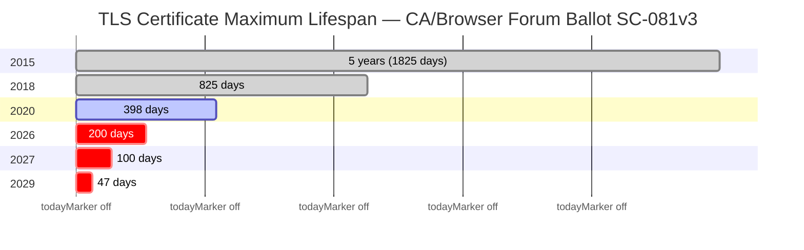

<p align="center">
  
</p>


# certctl — Self-Hosted Certificate Lifecycle Platform

[](LICENSE)
[](https://goreportcard.com/report/github.com/shankar0123/certctl)
[](https://github.com/shankar0123/certctl/releases)
[](https://github.com/shankar0123/certctl/stargazers)

TLS certificate lifespans are shrinking fast. The CA/Browser Forum passed [Ballot SC-081v3](https://cabforum.org/2025/04/11/ballot-sc081v3-introduce-schedule-of-reducing-validity-and-data-reuse-periods/) unanimously in April 2025, setting a phased reduction: **200 days** by March 2026, **100 days** by March 2027, and **47 days** by March 2029. Organizations managing dozens or hundreds of certificates can no longer rely on spreadsheets, calendar reminders, or manual renewal workflows. The math doesn't work — at 47-day lifespans, a team managing 100 certificates is processing 7+ renewals per week, every week, forever.

certctl is a self-hosted platform that automates the entire certificate lifecycle — from issuance through renewal to deployment — with zero human intervention. It works with any certificate authority, deploys to any server, and keeps private keys on your infrastructure where they belong. It's free, self-hosted, and covers the same lifecycle that enterprise platforms charge $100K+/year for.



> **Actively maintained — shipping weekly.** Found something? [Open a GitHub issue](https://github.com/shankar0123/certctl/issues) — issues get triaged same-day. CI runs the full test suite with race detection, static analysis, and vulnerability scanning on every commit.

**Ready to try it?** Jump to the [Quick Start](#quick-start) — you'll have a running dashboard in under 5 minutes.

## Documentation

| Guide | Description |
|-------|-------------|
| [Why certctl?](docs/why-certctl.md) | How certctl compares to ACME clients, agent-based SaaS, and enterprise platforms |
| [Concepts](docs/concepts.md) | TLS certificates explained from scratch — for beginners who know nothing about certs |
| [Quick Start](docs/quickstart.md) | 5-minute setup — dashboard, API, CLI, discovery, stakeholder demo flow |
| [Docker Compose Environments](deploy/ENVIRONMENTS.md) | Service-by-service walkthrough of all 4 compose files, env var reference |
| [Deployment Examples](docs/examples.md) | 5 turnkey scenarios (ACME+NGINX, wildcard DNS-01, private CA, step-ca, multi-issuer) with migration guides |
| [Advanced Demo](docs/demo-advanced.md) | Issue a certificate end-to-end with technical deep-dives |
| [Architecture](docs/architecture.md) | System design, data flow diagrams, security model |
| [Feature Inventory](docs/features.md) | Complete reference of all capabilities, API endpoints, and configuration |
| [Connector Reference](docs/connectors.md) | Configuration for all issuer, target, and notifier connectors |
| [MCP Server](docs/mcp.md) | AI integration via Model Context Protocol — setup, available tools, examples |
| [OpenAPI 3.1 Spec](docs/openapi.md) | API reference guide with endpoint overview ([raw spec](api/openapi.yaml)) |
| [Compliance Mapping](docs/compliance.md) | SOC 2 Type II, PCI-DSS 4.0, NIST SP 800-57 alignment guides |
| [Migrate from certbot](docs/migrate-from-certbot.md) | Step-by-step migration from certbot cron jobs to certctl |
| [Migrate from acme.sh](docs/migrate-from-acmesh.md) | Migration guide for acme.sh users, DNS hook compatibility |
| [certctl for cert-manager users](docs/certctl-for-cert-manager-users.md) | How certctl complements cert-manager for mixed infrastructure |
| [Test Environment](docs/test-env.md) | Docker Compose test environment with real CA backends |
| [Testing Guide](docs/testing-guide.md) | Comprehensive test procedures, smoke tests, and release sign-off checklist |

## Supported Integrations

### Certificate Issuers

| Issuer | Type | Notes |
|--------|------|-------|
| Local CA (self-signed + sub-CA) | `GenericCA` | Sub-CA mode chains to enterprise root (ADCS, etc.) |
| ACME v2 (Let's Encrypt, ZeroSSL, etc.) | `ACME` | HTTP-01, DNS-01, DNS-PERSIST-01 challenges. EAB auto-fetch from ZeroSSL. Profile selection (`tlsserver`, `shortlived`). |
| step-ca (Smallstep) | `StepCA` | JWK provisioner auth, issuance + renewal + revocation |
| OpenSSL / Custom CA | `OpenSSL` | Shell script adapter — any CA with a CLI |
| HashiCorp Vault PKI | `VaultPKI` | Token auth, synchronous issuance, CRL/OCSP delegated to Vault |
| DigiCert CertCentral | `DigiCert` | Async order model, OV/EV support, PEM bundle parsing |
| Sectigo SCM | `Sectigo` | 3-header auth, DV/OV/EV, collect-not-ready graceful handling |
| Google Cloud CAS | `GoogleCAS` | OAuth2 service account, synchronous issuance, CA pool selection |
| AWS ACM Private CA | `AWSACMPCA` | Synchronous issuance, configurable signing algorithm/template ARN |
| Entrust Certificate Services | `Entrust` | mTLS client certificate auth, synchronous/approval-pending issuance |
| GlobalSign Atlas HVCA | `GlobalSign` | mTLS + API key/secret dual auth, serial-based tracking |
| EJBCA (Keyfactor) | `EJBCA` | Dual auth (mTLS or OAuth2), self-hosted open-source CA |

**Note:** ADCS integration is handled via the Local CA's sub-CA mode — certctl operates as a subordinate CA with its signing certificate issued by ADCS. Any CA with a shell-accessible signing interface can be integrated via the OpenSSL/Custom CA connector.

### Deployment Targets

| Target | Type | Notes |
|--------|------|-------|
| NGINX | `NGINX` | File write, config validation, reload |
| Apache httpd | `Apache` | Separate cert/chain/key files, configtest, graceful reload |
| HAProxy | `HAProxy` | Combined PEM file, validate, reload |
| Traefik | `Traefik` | File provider deployment, auto-reload via filesystem watch |
| Caddy | `Caddy` | Dual-mode: admin API hot-reload or file-based |
| Envoy | `Envoy` | File-based with optional SDS JSON config |
| Postfix | `Postfix` | Mail server TLS, pairs with S/MIME support |
| Dovecot | `Dovecot` | Mail server TLS, pairs with S/MIME support |
| Microsoft IIS | `IIS` | Local PowerShell or remote WinRM, PEM→PFX, SNI support |
| F5 BIG-IP | `F5` | iControl REST via proxy agent, transaction-based atomic updates |
| SSH (Agentless) | `SSH` | SFTP cert/key deployment to any Linux/Unix server |
| Windows Certificate Store | `WinCertStore` | PowerShell Import-PfxCertificate, configurable store/location |
| Java Keystore | `JavaKeystore` | PEM→PKCS#12→keytool pipeline, JKS and PKCS12 formats |
| Kubernetes Secrets | `KubernetesSecrets` | `kubernetes.io/tls` Secrets, in-cluster or kubeconfig auth |

### Enrollment Protocols

| Protocol | Standard | Use Case |
|----------|----------|----------|
| **EST (production-grade)** | RFC 7030 + RFC 9266 channel binding | Native EST server hardened for enterprise WiFi/802.1X, IoT bootstrap, and corporate device enrollment (post-2026-04-29 hardening master bundle). All six RFC 7030 endpoints — `cacerts` / `simpleenroll` / `simplereenroll` / `csrattrs` (profile-driven) / `serverkeygen` (CMS EnvelopedData wire format). Multi-profile dispatch (`/.well-known/est/<pathID>/`). Per-profile auth modes: mTLS sibling route at `/.well-known/est-mtls/<pathID>/`, HTTP Basic enrollment-password (constant-time compare + per-source-IP failed-auth limiter), RFC 9266 `tls-exporter` channel binding (TLS 1.3, opt-in per profile). Per-(CN, sourceIP) sliding-window rate limit. EST-source-scoped bulk revoke (`POST /api/v1/est/certificates/bulk-revoke`, M-008 admin-gated). Tabbed admin GUI at `/est` (Profiles / Recent Activity / Trust Bundle). `SIGHUP`-equivalent trust-bundle reload. libest reference-client interop tested in CI (`deploy/test/libest/Dockerfile` + `deploy/test/est_e2e_test.go`). 13 typed audit-action codes (`est_simple_enroll_success`/`_failed`, `est_auth_failed_basic`/`_mtls`/`_channel_binding`, `est_rate_limited`, `est_csr_policy_violation`, `est_bulk_revoke`, `est_trust_anchor_reloaded`, etc.). CLI + 6 MCP tools. See [`docs/est.md`](docs/est.md) for the operator guide — WiFi/802.1X + FreeRADIUS recipe, IoT bootstrap, troubleshooting matrix per audit-action code. |
| SCEP (Simple Certificate Enrollment Protocol) | RFC 8894 | MDM platforms (Jamf, Intune), network devices, ChromeOS. Full RFC 8894 wire format: EnvelopedData decryption, signerInfo POPO verification, CertRep PKIMessage builder; PKCSReq + RenewalReq + GetCertInitial messageType dispatch; multi-profile dispatch (`/scep/<pathID>`); per-profile RA cert + key. Lightweight raw-CSR clients keep working via the legacy MVP fall-through path. |
| **Microsoft Intune SCEP fleet (drop-in NDES replacement)** | RFC 8894 + Intune Connector signed-challenge dispatcher | Per-profile Intune dispatcher validates the Connector's signed challenge against an operator-supplied trust anchor; binds device claim to CSR (set-equality on CN + SAN-DNS/RFC822/UPN); replay cache + per-device rate limit; `SIGHUP`-reloadable trust pool; admin GUI **SCEP Administration** page at `/scep` (Profiles tab with per-profile RA cert expiry + mTLS status, Intune Monitoring tab with per-status counters + reload, Recent Activity tab with full SCEP audit log filter). See [`docs/scep-intune.md`](docs/scep-intune.md) for the migration playbook + Microsoft support statement. |
| ACME v2 | RFC 8555 | Public CA automated issuance (Let's Encrypt, ZeroSSL) |
| ACME ARI (Renewal Information) | RFC 9773 | CA-directed renewal timing — the CA tells you when to renew |

### Standards & Revocation

| Capability | Standard | Notes |
|------------|----------|-------|
| DER-encoded X.509 CRL | RFC 5280 | Per-issuer, signed by issuing CA, 24h validity. Pre-generated by the scheduler (`CERTCTL_CRL_GENERATION_INTERVAL`, default 1h) and cached in `crl_cache` so HTTP fetches do not rebuild per request. |
| Embedded OCSP responder | RFC 6960 | GET + POST forms (`POST /.well-known/pki/ocsp/{issuer_id}` per §A.1.1). Signed by a per-issuer dedicated OCSP responder cert (RFC 6960 §2.6) carrying `id-pkix-ocsp-nocheck` (§4.2.2.2.1) — the CA private key is never used directly for OCSP signing. Responder cert auto-rotates within 7d of expiry. |
| S/MIME certificates | RFC 8551 | Email protection EKU, adaptive KeyUsage flags |
| Certificate export | — | PEM (JSON/file) and PKCS#12 formats |
| ACME DNS-PERSIST-01 | IETF draft | Standing validation record, no per-renewal DNS updates |

### Notifiers

| Notifier | Type |
|----------|------|
| Email (SMTP) | `Email` |
| Webhooks | `Webhook` |
| Slack | `Slack` |
| Microsoft Teams | `Teams` |
| PagerDuty | `PagerDuty` |
| OpsGenie | `OpsGenie` |

All connectors are pluggable — build your own by implementing the [connector interface](docs/connectors.md).

### Screenshots

<table>
<tr>
<td><a href="docs/screenshots/v2-dashboard.png"></a><br><b>Dashboard</b><br><sub>Stats, expiration heatmap, renewal trends, issuance rate</sub></td>
<td><a href="docs/screenshots/v2-certificates.png"></a><br><b>Certificates</b><br><sub>Inventory with bulk ops, status filters, owner/team columns</sub></td>
</tr>
<tr>
<td><a href="docs/screenshots/v2-issuers.png"></a><br><b>Issuers</b><br><sub>Catalog with 10 CA types, GUI config, test connection</sub></td>
<td><a href="docs/screenshots/v2-jobs.png"></a><br><b>Jobs</b><br><sub>Issuance, renewal, deployment queue with approval workflow</sub></td>
</tr>
</table>

**[See all screenshots →](docs/screenshots/)**

## Why certctl

Certificate lifecycle tooling falls into two camps: enterprise platforms (Venafi, Keyfactor) that cost six figures and take months to deploy, or single-purpose tools (certbot, cert-manager) that handle one slice of the problem. certctl fills the gap — full lifecycle automation, self-hosted, free, CA-agnostic, and target-agnostic. If you're running certbot cron jobs, manually renewing certs, or stitching together scripts across mixed infrastructure, certctl replaces all of that.

Built for **platform engineering and DevOps teams** managing 10–500+ certificates, **security and compliance teams** who need audit trails and policy enforcement for SOC 2, PCI-DSS 4.0, or NIST SP 800-57 ([compliance mapping included](docs/compliance.md)), and **small teams without enterprise budgets** who need Venafi-grade automation for a 50-server environment. For a detailed comparison, see [Why certctl?](docs/why-certctl.md)

**Architecture.** Go 1.25 control plane with handler→service→repository layering, PostgreSQL 16 backend (21 tables), and a pull-only deployment model — the server never initiates outbound connections. Agents poll for work. For network appliances and agentless servers, a proxy agent in the same network zone handles deployment via the target's API (WinRM, iControl REST, SSH/SFTP). Background scheduler runs 7 loops: renewal with ARI integration (1h), job processing (30s), agent health (2m), notifications (1m), short-lived cert expiry (30s), network scanning (6h), certificate digest (24h). See [Architecture Guide](docs/architecture.md) for full system diagrams.

**Security-first.** Agents generate ECDSA P-256 keys locally — private keys never touch the control plane. API key auth enforced by default with SHA-256 hashing and constant-time comparison. CORS deny-by-default. Shell injection prevention on all connector scripts. SSRF protection (reserved IP filtering) on the network scanner. Atomic idempotency guards on scheduler loops. Issuer and target credentials encrypted at rest with AES-256-GCM. Every API call recorded to an immutable audit trail with actor attribution, body hash, and latency tracking. CI runs race detection, 11 linters, and vulnerability scanning on every commit.

**Key design decisions.** TEXT primary keys — human-readable prefixed IDs (`mc-api-prod`, `t-platform`, `o-alice`) so you can identify resources at a glance in logs and queries. Idempotent migrations (`IF NOT EXISTS`, `ON CONFLICT DO NOTHING`) safe for repeated execution. Dynamic configuration via GUI with AES-256-GCM encrypted credential storage and env var backward compatibility. Handlers define their own service interfaces for clean dependency inversion.

## What It Does

**Automated lifecycle.** Certificates renew and deploy themselves. The scheduler monitors expiration, issues through your CA, and deploys to targets — zero human intervention. ACME ARI (RFC 9773) lets the CA direct renewal timing. Ready for 47-day (SC-081v3) and 6-day (Let's Encrypt shortlived) certificate lifetimes.

**Operational dashboard.** 26-page GUI covers the entire lifecycle: certificate inventory with bulk ops, deployment timeline with rollback, discovery triage, network scan management, agent fleet health, short-lived credential countdown, approval workflows, and observability metrics. Configure issuers and targets from the dashboard — no env var editing, no server restarts.

**Private keys stay on your servers.** Agents generate ECDSA P-256 keys locally, submit only the CSR. The control plane never touches private keys. After deployment, agents probe the live TLS endpoint and compare SHA-256 fingerprints to confirm the right certificate is actually being served.

**Discovery.** Agents scan filesystems for existing PEM/DER certificates. The network scanner probes TLS endpoints across CIDR ranges without agents. Cloud discovery finds certificates in AWS Secrets Manager, Azure Key Vault, and GCP Secret Manager. Continuous TLS health monitoring tracks endpoint status (healthy/degraded/down/cert_mismatch) with configurable thresholds and historical probe data. All discovery modes feed into a unified triage workflow — claim, dismiss, or import what you find.

**Policy engine.** Certificate profiles constrain key types, max TTL, and EKUs — with crypto policy enforcement that validates every CSR against profile rules before it reaches the issuer. MaxTTL caps are enforced per issuer connector. Approval workflows pause jobs for human review. Ownership tracking routes notifications to the right team. Agent groups match devices by OS, architecture, IP CIDR, and version.

**Enrollment protocols.** EST server (RFC 7030) for device and WiFi enrollment. SCEP server (RFC 8894) for MDM platforms and network devices — full wire format (EnvelopedData decrypt + signerInfo POPO verify + CertRep PKIMessage builder), tested against ChromeOS-shape requests; multi-profile dispatch (`/scep/<pathID>`); RenewalReq + GetCertInitial messageType support; lightweight raw-CSR fallback for legacy clients. See [docs/legacy-est-scep.md](docs/legacy-est-scep.md) for the operator + device-integration guide. S/MIME issuance with email protection EKU.

**Revocation.** Single and bulk revocation (by profile, owner, agent, or issuer). RFC 5280 reason codes. Production-grade revocation status surface for relying parties: DER-encoded X.509 CRL per issuer, scheduler-pre-generated and cached so HTTP fetches do not rebuild per request; embedded OCSP responder serving both GET and POST forms (RFC 6960 §A.1.1) with responses signed by a per-issuer dedicated OCSP responder cert (RFC 6960 §2.6, `id-pkix-ocsp-nocheck` per §4.2.2.2.1) — the CA private key is never used directly for OCSP signing. Both endpoints live unauthenticated under `/.well-known/pki/` per RFC 8615. Short-lived certs (TTL < 1 hour) are exempt — expiry is sufficient revocation. See [docs/crl-ocsp.md](docs/crl-ocsp.md) for the relying-party integration guide.

**Audit and observability.** Immutable append-only audit trail records every lifecycle action, every API call, and every approval decision. Prometheus metrics endpoint. Scheduled certificate digest emails. Continuous endpoint health monitoring with state machine transitions and real-time alerts.

**Notifications.** Slack, Teams, PagerDuty, OpsGenie, SMTP, webhooks. Routed by certificate owner. Daily digest emails with stats and expiring certs.

**Multiple interfaces.** REST API (111 routes), CLI (12 commands), MCP server (80 tools for Claude, Cursor, Windsurf), Helm chart, web dashboard. Certificate export in PEM and PKCS#12.

**First-run onboarding.** Wizard guides you through connecting a CA, deploying an agent, and issuing your first certificate. Or start with the pre-populated demo — 32 certificates, 10 issuers, 180 days of history.

For the complete capability breakdown, see the [Feature Inventory](docs/features.md).

## Quick Start

### Docker Compose (Recommended)

```bash
git clone https://github.com/shankar0123/certctl.git
cd certctl
docker compose -f deploy/docker-compose.yml up -d --build
```

Wait ~30 seconds, then open **https://localhost:8443** in your browser. (The shipped `docker-compose.yml` self-signs a cert via the `certctl-tls-init` init container on first boot — accept the browser warning for the demo, or feed the generated `ca.crt` to your client.) The onboarding wizard walks you through connecting a CA, deploying an agent, and issuing your first certificate.

**Want a pre-populated demo instead?** Add the demo override to see 32 certificates across 10 issuers, 8 agents, and 180 days of realistic history:

```bash
docker compose -f deploy/docker-compose.yml -f deploy/docker-compose.demo.yml up -d --build
```

The `deploy/` directory has four compose files: `docker-compose.yml` (base platform), `docker-compose.demo.yml` (demo data overlay), `docker-compose.dev.yml` (PgAdmin + debug logging), and `docker-compose.test.yml` (standalone integration tests with real CA backends). See the [Docker Compose Environments Guide](deploy/ENVIRONMENTS.md) for a service-by-service walkthrough, or the [Quick Start](docs/quickstart.md#docker-compose-environments) for a summary.

```bash
curl --cacert $(docker compose -f deploy/docker-compose.yml exec -T certctl-server cat /etc/certctl/tls/ca.crt) https://localhost:8443/health
# {"status":"healthy"}
```

The control plane is HTTPS-only (TLS 1.3, no plaintext listener). See [`docs/tls.md`](docs/tls.md) for cert provisioning patterns and [`docs/upgrade-to-tls.md`](docs/upgrade-to-tls.md) if you're upgrading from a pre-v2.2 release.

### Agent Install (One-Liner)

```bash
curl -sSL https://raw.githubusercontent.com/shankar0123/certctl/master/install-agent.sh | bash
```

Detects your OS and architecture, downloads the binary, configures systemd (Linux) or launchd (macOS), and starts the agent. See [install-agent.sh](install-agent.sh) for details.

### Helm Chart (Kubernetes)

```bash
helm install certctl deploy/helm/certctl/ \
  --set server.apiKey=your-api-key \
  --set postgres.password=your-db-password
```

Production-ready chart with Server Deployment, PostgreSQL StatefulSet, Agent DaemonSet, health probes, security contexts (non-root, read-only rootfs), and optional Ingress. See [values.yaml](deploy/helm/certctl/values.yaml) for all configuration options.

### Docker Pull

```bash
docker pull shankar0123.docker.scarf.sh/certctl-server
docker pull shankar0123.docker.scarf.sh/certctl-agent
```

## Verifying this release

Every `v*` tag publishes signed, attested release artefacts. Binaries
(`certctl-agent`, `certctl-server`, `certctl-cli`, `certctl-mcp-server` for
`linux|darwin × amd64|arm64`) ship alongside a `checksums.txt`, per-binary
SPDX-JSON SBOMs, Cosign signatures, and SLSA Level 3 provenance. Container
images on `ghcr.io/shankar0123/certctl-{server,agent}` are built with
`docker/build-push-action` `provenance: mode=max` + `sbom: true` and are
additionally signed with Cosign at the image digest.

All signatures use Cosign keyless OIDC; the signing identity is the
release workflow running on a signed tag.

**1. Verify SHA-256 checksums:**

```bash
sha256sum -c checksums.txt
```

**2. Verify the Cosign signature on `checksums.txt`:**

```bash
cosign verify-blob \
  --bundle checksums.txt.sigstore.json \
  --certificate-identity-regexp '^https://github\.com/shankar0123/certctl/\.github/workflows/release\.yml@refs/tags/' \
  --certificate-oidc-issuer 'https://token.actions.githubusercontent.com' \
  checksums.txt
```

Every individual binary ships with its own `.sigstore.json` bundle
(unified Sigstore bundle containing signature, certificate chain, and
Rekor inclusion proof). Swap `checksums.txt` for any binary name and
point `--bundle` at the matching `<binary>.sigstore.json` to verify it
directly.

**3. Verify SLSA Level 3 provenance on a binary:**

```bash
slsa-verifier verify-artifact \
  --provenance-path multiple.intoto.jsonl \
  --source-uri github.com/shankar0123/certctl \
  --source-tag v2.1.0 \
  certctl-agent-linux-amd64
```

**4. Verify a container image signature and its SBOM / provenance attestations:**

```bash
IMAGE=ghcr.io/shankar0123/certctl-server:v2.1.0

cosign verify \
  --certificate-identity-regexp '^https://github\.com/shankar0123/certctl/\.github/workflows/release\.yml@refs/tags/' \
  --certificate-oidc-issuer 'https://token.actions.githubusercontent.com' \
  "$IMAGE"

# SBOM attestation (SPDX-JSON, emitted by docker/build-push-action)
cosign verify-attestation --type spdxjson \
  --certificate-identity-regexp '^https://github\.com/shankar0123/certctl/' \
  --certificate-oidc-issuer 'https://token.actions.githubusercontent.com' \
  "$IMAGE"

# SLSA provenance attestation (docker/build-push-action `provenance: mode=max`)
cosign verify-attestation --type slsaprovenance \
  --certificate-identity-regexp '^https://github\.com/shankar0123/certctl/' \
  --certificate-oidc-issuer 'https://token.actions.githubusercontent.com' \
  "$IMAGE"
```

## Examples

Pick the scenario closest to your setup and have it running in 2 minutes.

| Example | Scenario |
|---------|----------|
| [`examples/acme-nginx/`](examples/acme-nginx/) | Let's Encrypt + NGINX, HTTP-01 challenges |
| [`examples/acme-wildcard-dns01/`](examples/acme-wildcard-dns01/) | Wildcard certs via DNS-01 (Cloudflare hook included) |
| [`examples/private-ca-traefik/`](examples/private-ca-traefik/) | Local CA (self-signed or sub-CA) + Traefik file provider |
| [`examples/step-ca-haproxy/`](examples/step-ca-haproxy/) | Smallstep step-ca + HAProxy combined PEM |
| [`examples/multi-issuer/`](examples/multi-issuer/) | ACME for public + Local CA for internal, one dashboard |

Each directory contains a `docker-compose.yml` and a `README.md` explaining the scenario, prerequisites, and customization.

## CLI

```bash
# Install
go install github.com/shankar0123/certctl/cmd/cli@latest

# Configure
export CERTCTL_SERVER_URL=https://localhost:8443
export CERTCTL_API_KEY=your-api-key
export CERTCTL_SERVER_CA_BUNDLE_PATH=/path/to/ca.crt   # or --ca-bundle on the CLI; --insecure for dev self-signed

# Usage
certctl-cli certs list                    # List all certificates
certctl-cli certs renew mc-api-prod       # Trigger renewal
certctl-cli certs revoke mc-api-prod --reason keyCompromise
certctl-cli agents list                   # List registered agents
certctl-cli jobs list                     # List jobs
certctl-cli status                        # Server health + summary stats
certctl-cli import certs.pem              # Bulk import from PEM file
certctl-cli certs list --format json      # JSON output (default: table)
```

## MCP Server (AI Integration)

certctl ships a standalone MCP (Model Context Protocol) server that exposes all 80 API endpoints as tools for AI assistants — Claude, Cursor, Windsurf, OpenClaw, VS Code Copilot, and any MCP-compatible client.

```bash
# Install and run
go install github.com/shankar0123/certctl/cmd/mcp-server@latest
export CERTCTL_SERVER_URL=https://localhost:8443
export CERTCTL_API_KEY=your-api-key
export CERTCTL_SERVER_CA_BUNDLE_PATH=/path/to/ca.crt   # required for self-signed bootstrap
mcp-server
```

The MCP server is env-vars-only — there are no CLI flags for TLS. If you must bypass verification for local development against a self-signed cert, set `CERTCTL_SERVER_TLS_INSECURE_SKIP_VERIFY=true`. Never set that in production.

**Claude Desktop** (`claude_desktop_config.json`):
```json
{
  "mcpServers": {
    "certctl": {
      "command": "mcp-server",
      "env": {
        "CERTCTL_SERVER_URL": "https://localhost:8443",
        "CERTCTL_API_KEY": "your-api-key",
        "CERTCTL_SERVER_CA_BUNDLE_PATH": "/path/to/ca.crt"
      }
    }
  }
}
```

## Development

```bash
make build              # Build server + agent binaries
make test               # Run tests
make lint               # golangci-lint (11 linters)
govulncheck ./...       # Vulnerability scan
make docker-up          # Start Docker Compose stack
```

CI runs on every push: `go vet`, `go test -race`, `golangci-lint`, `govulncheck`, and per-layer coverage thresholds (service 55%, handler 60%, domain 40%, middleware 30%). Frontend CI runs TypeScript type checking, Vitest tests, and Vite production build. 1,668 Go test functions with 625+ subtests, plus frontend test suite.

## Roadmap

### V1 (v1.0.0) — Shipped
Core lifecycle management — Local CA + ACME v2 issuers, NGINX target connector, agent-side key generation, API auth + rate limiting, React dashboard, CI pipeline with coverage gates, Docker images on GHCR.

### V2: Operational Maturity — Shipped
30+ milestones shipping enterprise-grade features for free. Sub-CA mode, ACME DNS-01/DNS-PERSIST-01/EAB/ARI (RFC 9773)/profile selection, step-ca, Vault PKI, DigiCert CertCentral, Sectigo SCM, Google CAS, AWS ACM PCA, Entrust, GlobalSign, EJBCA, OpenSSL/Custom CA issuers. NGINX, Apache, HAProxy, Traefik, Caddy, Envoy, Postfix, Dovecot, IIS (WinRM), F5 BIG-IP, SSH, Windows Certificate Store, Java Keystore, Kubernetes Secrets targets. EST server (RFC 7030) and SCEP server (RFC 8894) enrollment protocols. RFC 5280 revocation with DER CRL + embedded OCSP responder. Certificate profiles, ownership tracking, team assignment, agent groups, interactive approval workflows. Filesystem, network, and cloud secret manager (AWS SM, Azure KV, GCP SM) certificate discovery with triage GUI. Dynamic issuer/target configuration via GUI with AES-256-GCM encrypted storage. First-run onboarding wizard. Post-deployment TLS verification. Certificate export (PEM/PKCS#12). S/MIME support. Prometheus metrics. Scheduled certificate digest emails. Slack, Teams, PagerDuty, OpsGenie, SMTP notifications. MCP server (80 tools), CLI (12 commands), Helm chart. Compliance mapping (SOC 2, PCI-DSS 4.0, NIST SP 800-57). 5 turnkey deployment examples. Agent install script. Migration guides from certbot, acme.sh, and cert-manager. See the [Feature Inventory](docs/features.md) for details.

### V3: certctl Pro
Enterprise capabilities for larger deployments are available in the commercial tier.

### V4+: Cloud & Scale
Kubernetes cert-manager external issuer, cloud infrastructure targets, extended CA support, and platform-scale features.

## License

Certctl is licensed under the [Business Source License 1.1](LICENSE). The source code is publicly available and free to use, modify, and self-host. The one restriction: you may not use certctl's certificate management functionality as part of a commercial offering to third parties, whether hosted, managed, embedded, bundled, or integrated.

For licensing inquiries: certctl@proton.me

## Dependencies

Backend dependency footprint is auditable on demand:

```
go list -m all | wc -l   # total module count (direct + transitive)
go mod why <path>        # explain why a particular module is pulled in
govulncheck ./...        # vulnerability scan (CI runs this on every commit)
```

The release-time SBOM is published as a syft-produced cyclonedx file alongside each release artifact in `.github/workflows/release.yml`.

---

If certctl solves a problem you have, [star the repo](https://github.com/shankar0123/certctl) to help others find it. Questions, bugs, or feature requests — [open an issue](https://github.com/shankar0123/certctl/issues).
