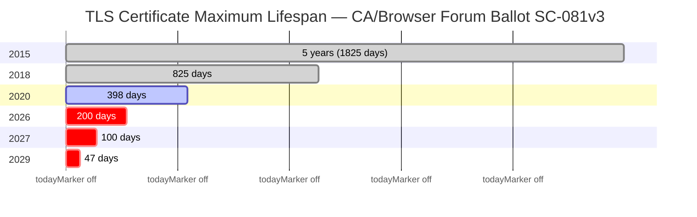

<p align="center">
  
</p>


# certctl — Self-Hosted Certificate Lifecycle Platform

[](LICENSE)
[](https://goreportcard.com/report/github.com/shankar0123/certctl)
[](https://github.com/shankar0123/certctl/releases)
[](https://github.com/shankar0123/certctl/stargazers)

TLS certificate lifespans are shrinking fast. The CA/Browser Forum passed [Ballot SC-081v3](https://cabforum.org/2025/04/11/ballot-sc081v3-introduce-schedule-of-reducing-validity-and-data-reuse-periods/) unanimously in April 2025, setting a phased reduction: **200 days** by March 2026, **100 days** by March 2027, and **47 days** by March 2029. Organizations managing dozens or hundreds of certificates can no longer rely on spreadsheets, calendar reminders, or manual renewal workflows. The math doesn't work — at 47-day lifespans, a team managing 100 certificates is processing 7+ renewals per week, every week, forever.

certctl is a self-hosted platform that automates the entire certificate lifecycle — from issuance through renewal to deployment — with zero human intervention. It works with any certificate authority, deploys to any server, and keeps private keys on your infrastructure where they belong. It's free, self-hosted, and covers the same lifecycle that enterprise platforms charge $100K+/year for.



> **Actively maintained — shipping weekly.** Found something? [Open a GitHub issue](https://github.com/shankar0123/certctl/issues) — issues get triaged same-day. CI runs 1,554+ tests with race detection, static analysis, and vulnerability scanning on every commit.

## Why certctl Exists

Certificate lifecycle tooling today falls into two camps: expensive enterprise platforms (Venafi, Keyfactor, Sectigo) that cost six figures and take months to deploy, or single-purpose tools (cert-manager, certbot) that handle one slice of the problem. If you run a mixed infrastructure — some NGINX, some Apache, a few HAProxy nodes, IIS on Windows, maybe an F5 — and you need to manage certificates from multiple CAs, there's nothing self-hosted that covers the full lifecycle without vendor lock-in.

certctl fills that gap. It's **CA-agnostic** — plug in any certificate authority: Let's Encrypt via ACME, Smallstep step-ca, HashiCorp Vault PKI, DigiCert CertCentral, your enterprise ADCS via sub-CA mode, or any custom CA through a shell script adapter. Run multiple issuers simultaneously for different certificate types.

It's **target-agnostic**. Agents deploy certificates to NGINX, Apache, HAProxy, Traefik, Caddy, Envoy, Postfix, Dovecot, and IIS (local PowerShell or remote WinRM) — all using the same pluggable connector model. The control plane never initiates outbound connections — agents poll for work, which means certctl works behind firewalls, across network zones, and in air-gapped environments.

For a detailed comparison with CertKit, KeyTalk, and enterprise platforms, see [Why certctl?](docs/why-certctl.md)

## Who Is This For

**Platform engineering and DevOps teams** managing 10–500+ certificates across mixed infrastructure who need automated renewal, deployment, and a single dashboard for visibility. If you're currently running certbot cron jobs, manually renewing certs, or stitching together scripts — certctl replaces all of that.

**Security and compliance teams** who need an immutable audit trail, certificate ownership tracking, policy enforcement, and evidence for SOC 2, PCI-DSS 4.0, or NIST SP 800-57 audits.

**Small teams without enterprise budgets** who need the lifecycle automation that Venafi and Keyfactor provide but can't justify six-figure licensing for a 50-server environment.

## What It Does

- **Certificates renew and deploy themselves.** The scheduler monitors expiration, creates renewal jobs, issues certificates through your CA, and deploys them to target servers — all without human intervention. ACME ARI (RFC 9702) lets your CA tell certctl exactly when to renew.

- **You see everything in one place.** A 25-page operational dashboard shows every certificate across every server: status, ownership, expiration timeline, deployment history with TLS verification, discovery triage, and real-time agent fleet health. Bulk operations (renew, revoke, reassign) work across selections.

- **Private keys never leave your servers.** Agents generate ECDSA P-256 keys locally and submit only the CSR. The control plane never touches private keys. Post-deployment TLS verification confirms the right certificate is actually being served.

- **Discover what you don't know about.** Agents scan filesystems for existing PEM/DER certificates. The network scanner probes TLS endpoints across CIDR ranges without requiring agents. Both feed into a triage workflow where you claim, dismiss, or import discovered certificates.

- **Everything is auditable.** Immutable append-only audit trail records every lifecycle action, every API call, and every approval decision. Certificate digest emails deliver daily briefings. Prometheus metrics endpoint for Grafana dashboards.

- **Multiple interfaces for different workflows.** REST API (97 endpoints) for automation, CLI for scripting, MCP server for AI assistants (Claude, Cursor, Windsurf), EST server (RFC 7030) for device enrollment, Helm chart for Kubernetes, and the web dashboard for day-to-day operations.

For the full capability breakdown — revocation infrastructure (CRL + OCSP), policy engine, certificate profiles, S/MIME support, approval workflows, and more — see the [Feature Inventory](docs/features.md).

## Supported Integrations

### Certificate Issuers
| Issuer | Status | Type |
|--------|--------|------|
| Local CA (self-signed + sub-CA) | Implemented | `GenericCA` |
| ACME v2 (Let's Encrypt, Sectigo) | Implemented (HTTP-01 + DNS-01 + DNS-PERSIST-01) | `ACME` |
| ACME EAB (ZeroSSL, Google Trust) | Implemented (auto-fetch EAB from ZeroSSL) | `ACME` |
| step-ca | Implemented | `StepCA` |
| OpenSSL / Custom CA | Implemented | `OpenSSL` |
| Vault PKI | Beta | `VaultPKI` |
| DigiCert CertCentral | Beta | `DigiCert` |
| Sectigo SCM | Beta | `Sectigo` |

**Vault PKI, DigiCert, and Sectigo connectors are in beta.** If you hit any bugs or unexpected behavior, please [open a GitHub issue](https://github.com/shankar0123/certctl/issues) -- we're actively testing these and want to hear from real users.

**Note:** ADCS integration is handled via the Local CA's sub-CA mode — certctl operates as a subordinate CA with its signing certificate issued by ADCS. Any CA with a shell-accessible signing interface can be integrated today via the OpenSSL/Custom CA connector.

### Deployment Targets
| Target | Status | Type |
|--------|--------|------|
| NGINX | Implemented | `NGINX` |
| Apache httpd | Implemented | `Apache` |
| HAProxy | Implemented | `HAProxy` |
| Traefik | Implemented | `Traefik` |
| Caddy | Implemented | `Caddy` |
| Envoy | Implemented | `Envoy` |
| Postfix | Implemented | `Postfix` |
| Dovecot | Implemented | `Dovecot` |
| Microsoft IIS | Implemented (local + WinRM) | `IIS` |
| F5 BIG-IP | Interface only | `F5` |

### Notifiers
| Notifier | Status | Type |
|----------|--------|------|
| Email (SMTP) | Implemented | `Email` |
| Webhooks | Implemented | `Webhook` |
| Slack | Implemented | `Slack` |
| Microsoft Teams | Implemented | `Teams` |
| PagerDuty | Implemented | `PagerDuty` |
| OpsGenie | Implemented | `OpsGenie` |

All connectors are pluggable — build your own by implementing the [connector interface](docs/connectors.md).

### Screenshots

<table>
<tr>
<td><a href="docs/screenshots/v2-dashboard.png"></a><br><b>Dashboard</b><br><sub>Stats, expiration heatmap, renewal trends</sub></td>
<td><a href="docs/screenshots/v2-certificates.png"></a><br><b>Certificates</b><br><sub>Inventory with status, owner, team filters</sub></td>
<td><a href="docs/screenshots/v2-agents.png"></a><br><b>Agents</b><br><sub>Fleet health, OS/arch, IP, version</sub></td>
</tr>
<tr>
<td><a href="docs/screenshots/v2-fleet.png"></a><br><b>Fleet Overview</b><br><sub>OS distribution, status breakdown</sub></td>
<td><a href="docs/screenshots/v2-jobs.png"></a><br><b>Jobs</b><br><sub>Issuance, renewal, deployment queue</sub></td>
<td><a href="docs/screenshots/v2-notifications.png"></a><br><b>Notifications</b><br><sub>Expiration warnings, renewal results</sub></td>
</tr>
<tr>
<td><a href="docs/screenshots/v2-policies.png"></a><br><b>Policies</b><br><sub>Ownership, lifetime, renewal rules</sub></td>
<td><a href="docs/screenshots/v2-profiles.png"></a><br><b>Profiles</b><br><sub>Key types, max TTL, crypto constraints</sub></td>
<td><a href="docs/screenshots/v2-issuers.png"></a><br><b>Issuers</b><br><sub>Local CA, ACME, step-ca, Vault PKI, DigiCert</sub></td>
</tr>
<tr>
<td><a href="docs/screenshots/v2-targets.png"></a><br><b>Targets</b><br><sub>NGINX, Apache, HAProxy, Traefik, Caddy, IIS deployment</sub></td>
<td><a href="docs/screenshots/v2-owners.png"></a><br><b>Owners</b><br><sub>Cert ownership with team assignment</sub></td>
<td><a href="docs/screenshots/v2-teams.png"></a><br><b>Teams</b><br><sub>Org grouping for notification routing</sub></td>
</tr>
<tr>
<td><a href="docs/screenshots/v2-agent-groups.png"></a><br><b>Agent Groups</b><br><sub>Dynamic grouping by OS, arch, CIDR</sub></td>
<td><a href="docs/screenshots/v2-audit-trail.png"></a><br><b>Audit Trail</b><br><sub>Immutable log, CSV/JSON export</sub></td>
<td><a href="docs/screenshots/v2-short-lived.png"></a><br><b>Short-Lived Creds</b><br><sub>Ephemeral certs with live TTL countdown</sub></td>
</tr>
</table>

## Quick Start

### Docker Compose (Recommended)

```bash
git clone https://github.com/shankar0123/certctl.git
cd certctl
docker compose -f deploy/docker-compose.yml up -d --build
```

Wait ~30 seconds, then open **http://localhost:8443** in your browser.

The dashboard comes pre-loaded with 32 demo certificates across 7 issuers, 8 agents, 180 days of job history, discovery scan data, and network scan targets — a realistic snapshot of a certificate inventory that looks like it's been running for months.

```bash
curl http://localhost:8443/health
# {"status":"healthy"}

curl -s http://localhost:8443/api/v1/certificates | jq '.total'
# 32
```

### Agent Install (One-Liner)

```bash
curl -sSL https://raw.githubusercontent.com/shankar0123/certctl/master/install-agent.sh | bash
```

Detects your OS and architecture, downloads the binary, configures systemd (Linux) or launchd (macOS), and starts the agent. See [install-agent.sh](install-agent.sh) for details.

### Docker Pull

```bash
docker pull shankar0123.docker.scarf.sh/certctl-server
docker pull shankar0123.docker.scarf.sh/certctl-agent
```

## Examples

Pick the scenario closest to your setup and have it running in 2 minutes.

| Example | Scenario |
|---------|----------|
| [`examples/acme-nginx/`](examples/acme-nginx/) | Let's Encrypt + NGINX, HTTP-01 challenges |
| [`examples/acme-wildcard-dns01/`](examples/acme-wildcard-dns01/) | Wildcard certs via DNS-01 (Cloudflare hook included) |
| [`examples/private-ca-traefik/`](examples/private-ca-traefik/) | Local CA (self-signed or sub-CA) + Traefik file provider |
| [`examples/step-ca-haproxy/`](examples/step-ca-haproxy/) | Smallstep step-ca + HAProxy combined PEM |
| [`examples/multi-issuer/`](examples/multi-issuer/) | ACME for public + Local CA for internal, one dashboard |

Each directory contains a `docker-compose.yml` and a `README.md` explaining the scenario, prerequisites, and customization.

## Architecture

**Control plane** (Go 1.25 net/http) → **PostgreSQL 16** (21 tables, TEXT primary keys) → **Agents** (key generation, CSR submission, cert deployment). For Windows servers without a local agent, a proxy agent in the same network zone handles deployment via WinRM. Background scheduler runs 7 loops: renewal checks (1h), job processing (30s), agent health (2m), notifications (1m), short-lived cert expiry (30s), network scanning (6h), certificate digest (24h). See [Architecture Guide](docs/architecture.md) for full system diagrams and data flow.

### Key Design Decisions

- **Private keys isolated from the control plane.** Agents generate ECDSA P-256 keys locally and submit CSRs (public key only). The server signs the CSR and returns the certificate — private keys never touch the control plane. Server-side keygen is available via `CERTCTL_KEYGEN_MODE=server` for demo/development only.
- **TEXT primary keys, not UUIDs.** IDs are human-readable prefixed strings (`mc-api-prod`, `t-platform`, `o-alice`) so you can identify resource types at a glance in logs and queries.
- **Handler → Service → Repository layering.** Handlers define their own service interfaces for clean dependency inversion. No global service singletons.
- **Idempotent migrations.** All schema uses `IF NOT EXISTS` and seed data uses `ON CONFLICT (id) DO NOTHING`, safe for repeated execution.

## Documentation

| Guide | Description |
|-------|-------------|
| [Why certctl?](docs/why-certctl.md) | How certctl compares to ACME clients, agent-based SaaS, and enterprise platforms |
| [Concepts](docs/concepts.md) | TLS certificates explained from scratch — for beginners who know nothing about certs |
| [Quick Start](docs/quickstart.md) | 5-minute setup — dashboard, API, CLI, discovery, stakeholder demo flow |
| [Deployment Examples](docs/examples.md) | 5 turnkey scenarios (ACME+NGINX, wildcard DNS-01, private CA, step-ca, multi-issuer) with migration guides |
| [Advanced Demo](docs/demo-advanced.md) | Issue a certificate end-to-end with technical deep-dives |
| [Architecture](docs/architecture.md) | System design, data flow diagrams, security model |
| [Feature Inventory](docs/features.md) | Complete reference of all V2 capabilities, API endpoints, and configuration |
| [Connector Reference](docs/connectors.md) | Configuration for all 7 issuers, 10 targets, and 5 notifier connectors |
| [Compliance Mapping](docs/compliance.md) | SOC 2 Type II, PCI-DSS 4.0, NIST SP 800-57 alignment guides |
| [OpenAPI 3.1 Spec](api/openapi.yaml) | 97 operations, full request/response schemas |

## CLI

```bash
# Install
go install github.com/shankar0123/certctl/cmd/cli@latest

# Configure
export CERTCTL_SERVER_URL=http://localhost:8443
export CERTCTL_API_KEY=your-api-key

# Usage
certctl-cli certs list                    # List all certificates
certctl-cli certs renew mc-api-prod       # Trigger renewal
certctl-cli certs revoke mc-api-prod --reason keyCompromise
certctl-cli agents list                   # List registered agents
certctl-cli jobs list                     # List jobs
certctl-cli status                        # Server health + summary stats
certctl-cli import certs.pem              # Bulk import from PEM file
certctl-cli certs list --format json      # JSON output (default: table)
```

## MCP Server (AI Integration)

certctl ships a standalone MCP (Model Context Protocol) server that exposes all API endpoints as tools for AI assistants — Claude, Cursor, Windsurf, OpenClaw, VS Code Copilot, and any MCP-compatible client.

```bash
# Install and run
go install github.com/shankar0123/certctl/cmd/mcp-server@latest
export CERTCTL_SERVER_URL=http://localhost:8443
export CERTCTL_API_KEY=your-api-key
mcp-server
```

**Claude Desktop** (`claude_desktop_config.json`):
```json
{
  "mcpServers": {
    "certctl": {
      "command": "mcp-server",
      "env": {
        "CERTCTL_SERVER_URL": "http://localhost:8443",
        "CERTCTL_API_KEY": "your-api-key"
      }
    }
  }
}
```

## Security

certctl is designed with a security-first architecture. Agents generate ECDSA P-256 keys locally — private keys never touch the control plane. API key auth is enforced by default with SHA-256 hashing and constant-time comparison. CORS is deny-by-default. All connector scripts are validated against shell injection. The network scanner filters reserved IP ranges (SSRF protection). Scheduler loops use atomic idempotency guards. Every API call is recorded to an immutable audit trail with actor attribution, SHA-256 body hash, and latency tracking. See the [Architecture Guide](docs/architecture.md) for the full security model.

## Development

```bash
make build              # Build server + agent binaries
make test               # Run tests
make lint               # golangci-lint (11 linters)
govulncheck ./...       # Vulnerability scan
make docker-up          # Start Docker Compose stack
```

CI runs on every push: `go vet`, `go test -race`, `golangci-lint`, `govulncheck`, and per-layer coverage thresholds (service 55%, handler 60%, domain 40%, middleware 30%). Frontend CI runs TypeScript type checking, Vitest tests, and Vite production build.

## Roadmap

### V1 (v1.0.0) — Shipped
Core lifecycle management — Local CA + ACME v2 issuers, NGINX target connector, agent-side key generation, API auth + rate limiting, React dashboard, CI pipeline with coverage gates, Docker images on GHCR.

### V2: Operational Maturity — Shipped
30+ milestones, 1,554+ tests. Sub-CA mode, ACME DNS-01/DNS-PERSIST-01, step-ca, Vault PKI, DigiCert CertCentral, OpenSSL/Custom CA issuers. NGINX, Apache, HAProxy, Traefik, Caddy, Envoy, Postfix, Dovecot, IIS targets. RFC 5280 revocation with CRL + OCSP. Certificate profiles, ownership tracking, approval workflows. Filesystem and network certificate discovery. Prometheus metrics, dashboard charts, agent fleet overview. EST server (RFC 7030), ACME ARI (RFC 9702), certificate export, S/MIME support, Helm chart, MCP server, CLI, scheduled digest emails. Slack, Teams, PagerDuty, OpsGenie, SMTP notifications. Compliance mapping (SOC 2, PCI-DSS 4.0, NIST SP 800-57). See the [Feature Inventory](docs/features.md) for details.

**Coming in v2.1.0:** Dynamic issuer and target configuration via GUI (no env var restarts), first-run onboarding wizard.

### V3: certctl Pro
Team access controls and identity provider integration (OIDC/SSO). Role-based access control with profile-gating. Event-driven architecture (NATS) with real-time operational views. Advanced search DSL, compliance and risk scoring, bulk fleet operations.

### V4+: Cloud, Scale & Passive Discovery
Passive network discovery (TLS listener), Kubernetes integration (cert-manager external issuer, Secrets target), cloud infrastructure targets (AWS ALB/ACM, Azure Key Vault), extended CA support (Google CAS, EJBCA, Sectigo), and platform-scale features (Terraform provider, multi-tenancy, HSM support).

## License

Certctl is licensed under the [Business Source License 1.1](LICENSE). The source code is publicly available and free to use, modify, and self-host. The one restriction: you may not offer certctl as a managed/hosted certificate management service to third parties. The BSL 1.1 license converts automatically to Apache 2.0 on March 1, 2033, providing perpetual freedom.

For licensing inquiries: certctl@proton.me

---

If certctl solves a problem you have, [star the repo](https://github.com/shankar0123/certctl) to help others find it. Questions, bugs, or feature requests — [open an issue](https://github.com/shankar0123/certctl/issues).
