# Architecture Guide

## Contents

1. [Overview](#overview)
2. [System Components](#system-components)
   - [Control Plane (Server)](#control-plane-server)
   - [Agents](#agents)
   - [Web Dashboard](#web-dashboard)
   - [PostgreSQL Database](#postgresql-database)
3. [Data Flow: Certificate Lifecycle](#data-flow-certificate-lifecycle)
   - [Create Managed Certificate](#1-create-managed-certificate)
   - [Certificate Issuance](#2-certificate-issuance)
   - [Deploy Certificate to Target](#3-deploy-certificate-to-target)
   - [Revoke a Certificate](#35-revoke-a-certificate)
   - [Automatic Renewal](#4-automatic-renewal)
4. [Connector Architecture](#connector-architecture)
   - [IssuerConnectorAdapter (Dependency Inversion)](#issuerconnectoradapter-dependency-inversion)
   - [Issuer Connector](#issuer-connector)
   - [Target Connector](#target-connector)
   - [Notifier Connector](#notifier-connector)
   - [EST Server (RFC 7030)](#est-server-rfc-7030)
5. [Security Model](#security-model)
   - [Private Key Management](#private-key-management)
   - [Authentication](#authentication)
   - [Audit Trail](#audit-trail)
   - [API Audit Log](#api-audit-log)
   - [Logging](#logging)
6. [API Design](#api-design)
7. [MCP Server](#mcp-server)
8. [CLI Tool](#cli-tool)
9. [Deployment Topologies](#deployment-topologies)
   - [Docker Compose (Development / Small Deployments)](#docker-compose-development--small-deployments)
   - [Production (Kubernetes)](#production-kubernetes)
10. [Discovery Data Flow (M18b + M21)](#discovery-data-flow-m18b--m21)
11. [Testing Strategy](#testing-strategy)
12. [What's Next](#whats-next)

## Overview

Certctl is a certificate management platform with a **decoupled control-plane and agent architecture**. The control plane orchestrates certificate issuance and renewal, while agents deployed across your infrastructure handle key generation, certificate deployment, and local validation — private keys never leave the infrastructure they were generated on.

New to certificates? Read the [Concepts Guide](concepts.md) first.

### Design Principles

1. **Private Key Isolation** — Agents generate ECDSA P-256 keys locally and submit CSRs only. Private keys never touch the control plane. Server-side keygen available via `CERTCTL_KEYGEN_MODE=server` for demo only.
2. **Pull-Only Deployment** — The server never initiates outbound connections to agents or targets. Agents poll for work and receive only jobs assigned to their targets (routed via `agent_id` on jobs or through target→agent relationships). For network appliances and agentless targets, a proxy agent in the same network zone executes deployments via the target's API. This keeps the control plane firewalled off and limits credential scope to the proxy agent's zone.
3. **Sub-CA Capable** — The Local CA can operate as a subordinate CA under an enterprise root (e.g., ADCS). Load a pre-signed CA cert+key from disk and all issued certs chain to the enterprise trust hierarchy. Self-signed mode remains the default for development/demos.
4. **GUI as Primary Interface** — The web dashboard is the operational control plane, not a secondary viewer. Every backend feature ships with its corresponding GUI surface.
5. **Decoupled Operations** — Agents operate autonomously; the control plane coordinates but doesn't block agent function
6. **Audit-First** — Complete traceability of all issuance, deployment, and rotation events
7. **Connector Architecture** — Pluggable issuers, targets, and notifiers for extensibility
8. **Self-Hosted** — No cloud lock-in; run with Docker Compose, Kubernetes, or bare metal

## System Components

```mermaid
flowchart TB
    subgraph "Control Plane"
        API["REST API\n(Go net/http, :8443)"]
        SVC["Service Layer"]
        REPO["Repository Layer\n(database/sql + lib/pq)"]
        SCHED["Background Scheduler\n8 always-on + 4 optional loops"]
        DASH["Web Dashboard\n(React SPA)"]
    end

    subgraph "Data Store"
        PG[("PostgreSQL 16\nTEXT primary keys")]
    end

    subgraph "Agent Fleet"
        A1["Agent: nginx-prod\n(heartbeat + work poll)"]
        A2["Agent: f5-prod"]
        A3["Agent: iis-prod"]
    end

    subgraph "Issuer Backends"
        CA1["Local CA\n(crypto/x509, sub-CA)"]
        CA2["ACME\n(HTTP-01 + DNS-01 + DNS-PERSIST-01)\n(EAB, ZeroSSL auto-EAB)"]
        CA3["step-ca\n(/sign API)"]
        CA4["OpenSSL / Custom CA\n(script-based)"]
        CA6["Vault PKI\n(token auth, /sign API)"]
        CA7["DigiCert CertCentral\n(async order model)"]
        CA8["Sectigo SCM\n(async order model)"]
        CA9["Google CAS\n(OAuth2, sync)"]
        CA10["AWS ACM PCA\n(sync issuance)"]
        CA11["Entrust\n(mTLS, sync/async)"]
        CA12["GlobalSign Atlas\n(mTLS + API key)"]
        CA13["EJBCA\n(mTLS or OAuth2)"]
    end

    subgraph "Target Systems"
        T1["NGINX\n(file write + reload)"]
        T4["Apache httpd\n(file write + reload)"]
        T5["HAProxy\n(combined PEM + reload)"]
        T6["Traefik\n(file provider)"]
        T7["Caddy\n(admin API / file)"]
        T8["Envoy\n(file-based SDS)"]
        T9["Postfix/Dovecot\n(file + service reload)"]
        T2["F5 BIG-IP\n(proxy agent + iControl REST)"]
        T3["IIS\n(WinRM + local)"]
        T10["SSH\n(SFTP + reload)"]
        T11["WinCertStore\n(PowerShell import)"]
        T12["Java Keystore\n(keytool pipeline)"]
        T13["Kubernetes Secrets\n(K8s API)"]
    end

    DASH --> API
    API --> SVC
    SVC --> REPO
    REPO --> PG
    SCHED --> SVC
    SVC -->|"Issue/Renew"| CA1 & CA2 & CA3 & CA4 & CA6 & CA7 & CA8 & CA9 & CA10

    A1 & A2 & A3 -->|"CSR + Heartbeat"| API
    API -->|"Cert + Chain\n(NO private key)"| A1 & A2 & A3

    A1 -->|"Deploy"| T1
    A2 -->|"Deploy"| T2
    A3 -->|"Deploy"| T3
```

### Control Plane (Server)

The control plane is a Go HTTP server backed by PostgreSQL. It manages state (certificates, agents, targets, issuers, policies), orchestrates issuance by coordinating with CAs through issuer connectors, tracks jobs for certificate issuance/renewal/deployment workflows, maintains an immutable audit trail, and dispatches work via a background scheduler.

The server exposes a REST API under `/api/v1/` and optionally serves the web dashboard as static files from the `web/` directory.

**Key internals**: The server uses Go 1.25's `net/http` stdlib routing (no external router framework), structured logging via `slog`, and a handler → service → repository layered architecture. Handlers define their own service interfaces for clean dependency inversion.

### Agents

Lightweight Go processes that run on or near your infrastructure. Agents generate ECDSA P-256 private keys locally, create CSRs, and submit them to the control plane for signing — private keys never leave agent infrastructure. Agents also handle certificate deployment to target systems (NGINX, Apache httpd, HAProxy, Traefik, Caddy, Envoy, Postfix, Dovecot, IIS, F5 BIG-IP, SSH, Windows Certificate Store, Java Keystore, Kubernetes Secrets) and report job status. They communicate with the control plane via HTTP and authenticate with API keys.

The agent runs two background loops: a heartbeat (every 60 seconds) to signal it's alive, and a work poll (every 30 seconds) to check for actionable jobs via `GET /api/v1/agents/{id}/work`. Jobs may be `AwaitingCSR` (agent needs to generate key + submit CSR) or `Deployment` (agent needs to deploy a certificate). Private keys are stored in `CERTCTL_KEY_DIR` (default `/var/lib/certctl/keys`) with 0600 permissions.

**Agent metadata (M10):** Agents report OS, architecture, IP address, hostname, and version via heartbeat using `runtime.GOOS`, `runtime.GOARCH`, and `net` stdlib. This metadata is stored on the `agents` table and displayed in the GUI (agent list shows OS/Arch column, detail page shows full system info).

**Agent groups (M11b):** Dynamic device grouping allows organizing agents by metadata criteria. Agent groups can match by OS, architecture, IP CIDR, and version. Groups support both dynamic matching (agents automatically join when criteria match) and manual membership (explicit include/exclude). Renewal policies can be scoped to agent groups via the `agent_group_id` foreign key. The GUI provides full CRUD management for agent groups with visual match criteria badges.

**Agent soft-retirement (I-004):** `DELETE /api/v1/agents/{id}` is a soft-delete surface — the row is never removed. Retirement stamps `agents.retired_at` (TIMESTAMPTZ) and `agents.retired_reason` (TEXT) and flips the operational status to `Offline`. Default listings (`GET /api/v1/agents`, the dashboard stats counter, and the stale-offline sweeper) filter retired rows out via `AgentRepository.ListActive`; retired rows are surfaced only through the opt-in `GET /api/v1/agents/retired` view. The endpoint follows a preflight → block → escape-hatch contract:

- **Clean retire** (no active dependencies) — `200 OK` with `RetireAgentResponse` (`cascade=false`, zero counts).
- **Blocked by active dependencies** — `409 Conflict` with `BlockedByDependenciesResponse`. The three counts (`active_targets`, `active_certificates`, `pending_jobs`) tell the operator exactly which rows would be orphaned. The schema diverges from `ErrorResponse` because downstream dashboards parse the stable three-key shape.
- **Force cascade** — `DELETE /api/v1/agents/{id}?force=true&reason=...`. `reason` is required (400 otherwise). Transactionally soft-retires downstream `deployment_targets`, cancels pending jobs, and soft-retires the agent, emitting an `agent_retirement_cascaded` audit event with actor + reason + per-bucket counts.
- **Idempotent re-retire** — a retire attempt against an already-retired agent returns `204 No Content` with an empty body (no second audit event, no response shape — callers that POST again on a retry get a clean no-op).
- **Sentinel refusal** — the four sentinel agent IDs (`server-scanner`, `cloud-aws-sm`, `cloud-azure-kv`, `cloud-gcp-sm`) back non-agent discovery subsystems (the network scanner and the three cloud secret-manager sources). They are refused unconditionally — even with `force=true` — via `ErrAgentIsSentinel` → `403 Forbidden`. The ID list lives in `internal/domain/connector.go` (`SentinelAgentIDs`) so handler, repository, and scheduler code can filter them without importing `service`.

Retired agents receive `410 Gone` on subsequent heartbeats (`service.ErrAgentRetired`). `cmd/agent` treats 410 as a terminal signal and exits cleanly so retired agents stop phoning home. Migration `000015` flipped `deployment_targets.agent_id` from `ON DELETE CASCADE` to `ON DELETE RESTRICT`, making the old hard-delete path a schema error and forcing all retirement through this contract.

**Registration is by-design pull-only (C-1 closure, cat-b-6177f36636fb).** Agents register themselves at first heartbeat via `install-agent.sh` + `cmd/agent/main.go` — never via the GUI. The `web/src/api/client.ts::registerAgent` client function is intentionally orphan in the dashboard for this reason. It's preserved in `client.ts` (rather than deleted) so future features that want to drive registration from the GUI — for example, a one-click "register proxy agent" panel for network-appliance topologies where the agent runs in a different network zone from the device it manages — can reach the endpoint without a `client.ts` edit. Operators looking to scale agent enrollment use `install-agent.sh` against a config-management system (Ansible, Salt, Puppet) or a baked-in cloud-init script, not the dashboard.

### Web Dashboard

The web dashboard is the primary operational interface for certctl. It is built with Vite + React + TypeScript and uses TanStack Query for server state management (caching, background refetching, optimistic updates).

**Current views** (24 pages): certificate inventory (list with multi-select bulk operations + "New Certificate" creation modal + detail with deployment status timeline, inline policy/profile editor, version history, deploy, revoke, archive, and trigger renewal actions), agent fleet (list + detail with system info + OS/architecture grouping with charts), job queue (list + detail with verification section, timeline, audit events; approve/reject for AwaitingApproval jobs), notification inbox (threshold alert grouping, mark-as-read), audit trail (time range, actor, action filters + CSV/JSON export), policy management (rules with enable/disable toggle + delete + violations), issuers (catalog with 10 type cards + 3-step create wizard + detail with test connection), targets (list with 3-step configuration wizard + detail with deployment history), owners (list with team resolution + delete), teams (list with delete), agent groups (list with dynamic match criteria badges + enable/disable + delete), certificate profiles (list with crypto constraints), short-lived credentials dashboard (TTL countdown, profile filtering, auto-refresh), discovered certificates triage (claim/dismiss unmanaged certs discovered by agents or network scans), network scan targets management (CRUD + Scan Now button), summary dashboard with charts (expiration heatmap, renewal success rate, status distribution, issuance rate), digest preview and send, observability (health, metrics, Prometheus config), and login page.

The dashboard includes an **ErrorBoundary component** for graceful error recovery — if a view crashes, the boundary catches the error and displays a user-friendly message instead of breaking the entire dashboard. It also includes a **demo mode** that activates when the API is unreachable — it renders realistic mock data for screenshots and offline presentations.

**Tech decisions**:
- Vite for fast builds and HMR during development
- TanStack Query over manual fetch/useEffect for automatic cache invalidation and refetching
- Light content area with branded dark teal sidebar, Inter + JetBrains Mono typography
- SSE/WebSocket planned for real-time job status updates

**Backend ↔ frontend round-trip rule (B-1 closure):** every backend CRUD operation must have at least one GUI consumer in `web/src/pages/`. Shipping a handler + repository method + OpenAPI operation + `client.ts` fetcher with no page that calls it leaves operators forced to `psql` directly — defeats the "every backend feature ships with its GUI surface" invariant and creates a destructive workflow when the missing path is `update*` (operators delete-and-recreate, losing FK history and audit-trail continuity). The CI guardrail in `.github/workflows/ci.yml` (`Forbidden orphan-CRUD client function regression guard (B-1)`) enforces this for the eight previously-orphan functions (`updateOwner`/`updateTeam`/`updateAgentGroup`/`updateIssuer`/`updateProfile` + `createRenewalPolicy`/`updateRenewalPolicy`/`deleteRenewalPolicy`); apply the same rule when adding any new write endpoint. If a fetcher is needed in `client.ts` before its consumer page exists, leave a TODO referencing this rule and ship them in the same commit.

**TS ↔ Go type contract rule (D-1 + D-2 closure):** every TypeScript interface in `web/src/api/types.ts` must field-match the Go-side `internal/domain/*.go` struct's JSON-emitted shape exactly. Phantom fields (declared on TS, never emitted by Go) silently render `'—'` and lull consumers into thinking a value will arrive that never does; missing fields (emitted by Go, absent from TS) force `(x as any).X` escapes that lose type-checking. Both failure modes are blocked by the CI guardrail in `.github/workflows/ci.yml` (`Forbidden StatusBadge dead-key + TS phantom-field regression guard (D-1 + D-2)`) which awk-windows each interface and grep-fails the build on phantom-field reintroduction — currently covers Certificate (D-1), Agent / Issuer / Notification (D-2). Apply the same rule when adding any new on-wire type: the Go-side json tag is the contract, the TS interface adapts to it, and a literal-construction Vitest in `web/src/api/types.test.ts` pins the post-add shape. Stricter side wins: when in doubt, the side that actually emits the field is the contract; never propose adding a phantom on Go to match a TS over-declaration.

### PostgreSQL Database

All state is stored in PostgreSQL 16. The schema uses TEXT primary keys (not UUIDs) with human-readable prefixed IDs like `mc-api-prod`, `t-platform`, `o-alice`.

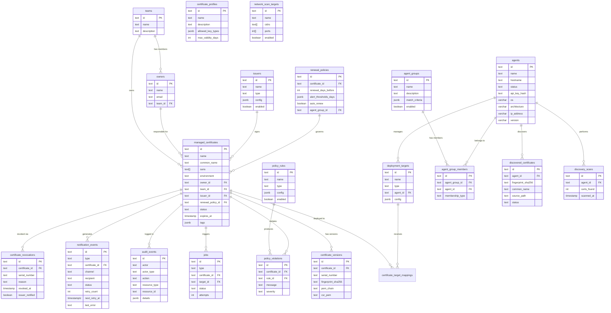

The ER diagram above documents **database shape**, not REST-API wire shape. Several columns are intentionally server-internal and never serialized to clients:

- `agents.api_key_hash` — SHA-256 of the agent's plaintext API key, populated by `service.RegisterAgent` (`hashAPIKey(apiKey)` at `internal/service/agent.go`) and consumed by `repository.AgentRepository::GetByAPIKey` for the auth-lookup. **Not** exposed via the REST API, **not** echoed via CLI / MCP / agent registration response, **never** logged. Enforced by `internal/domain/connector.go::Agent.MarshalJSON` (G-2 audit closure, `cat-s5-apikey_leak`); the OpenAPI Agent schema explicitly excludes the field, the frontend `Agent` interface omits it, and a CI grep guardrail at `.github/workflows/ci.yml` blocks reintroduction.
- `issuers.config` / `deployment_targets.config` — plaintext jsonb shadow of the AES-GCM-encrypted on-disk blob; the encrypted form lives on `EncryptedConfig []byte` (Go-only field tagged `json:"-"`).

Migrations are idempotent (`IF NOT EXISTS` on all CREATE statements, `ON CONFLICT (id) DO NOTHING` on all seed data) so they're safe to run multiple times. Pre-U-3 (`cat-u-seed_initdb_schema_drift`, GitHub #10) the deploy compose stack mounted both a hand-curated subset of `migrations/*.up.sql` and `seed.sql` into postgres `/docker-entrypoint-initdb.d/` so initdb applied them on first boot, *and* the server re-applied the same files via `RunMigrations` on every start. The dual source of truth was the bug: every time a migration shipped that the seed depended on (e.g., 000013 added `policy_rules.severity`), the mount list had to be updated by hand, and missing the update crashed initdb on first boot. Post-U-3 the server is the single source of truth: postgres comes up with an empty schema, `RunMigrations` applies the entire ladder, then `RunSeed` lands the baseline seed (and `RunDemoSeed` lands the demo overlay when `CERTCTL_DEMO_SEED=true`). Helm has used this pattern since day one (postgres-init `emptyDir`); the docker-compose deploy now matches.

## Data Flow: Certificate Lifecycle

### 1. Create Managed Certificate

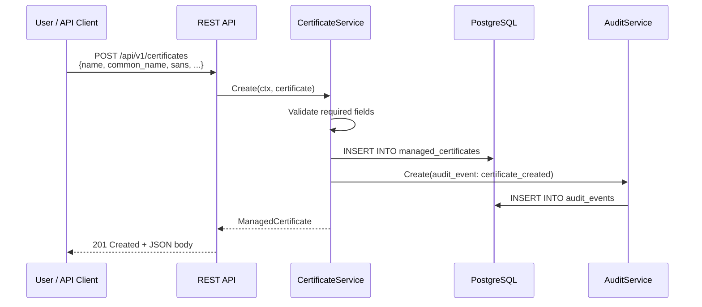

### 2. Certificate Issuance

#### Agent-Side Key Generation (Default)

In the default `agent` keygen mode (`CERTCTL_KEYGEN_MODE=agent`), the control plane never touches private keys. When a renewal or issuance job is created, it enters `AwaitingCSR` state. The agent picks it up, generates an ECDSA P-256 key pair locally, and submits only the CSR (public key).

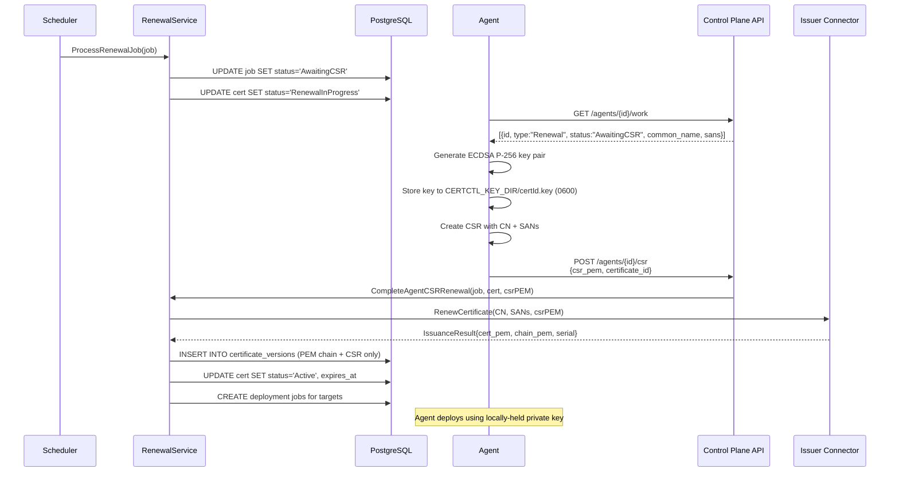

**Profile enforcement (M11c):** Crypto policy enforcement is wired into all four issuance paths: renewal (server-side and agent CSR), agent fallback CSR signing, EST enrollment (RFC 7030), and SCEP enrollment (RFC 8894). At each path, the service layer resolves the certificate's profile and calls `ValidateCSRAgainstProfile()` to check the CSR key algorithm and minimum key size against the profile's `allowed_key_algorithms` rules. A CSR with a disallowed key type or insufficient key size is rejected before reaching the issuer connector.

**MaxTTL enforcement:** When a profile specifies `max_ttl_seconds`, the value is forwarded through the service-layer `IssuerConnector` interface to the connector layer via `MaxTTLSeconds` on `IssuanceRequest` and `RenewalRequest`. Each issuer connector enforces the cap according to its capabilities: the Local CA caps `NotAfter` directly, Vault overrides its TTL string, step-ca caps `NotAfter` with zero-value handling, and OpenSSL logs an advisory warning (script-based signing can't enforce server-side). For CAs that control validity themselves (ACME, DigiCert, Sectigo, Google CAS, AWS ACM PCA), MaxTTLSeconds passes through but the CA makes the final decision.

**Key metadata persistence:** Certificate versions record `key_algorithm` and `key_size` extracted from the CSR during issuance. This metadata enables post-hoc auditing — operators can verify that all issued certificates comply with the key requirements in effect at the time of issuance.

#### Server-Side Key Generation (Demo Only)

Set `CERTCTL_KEYGEN_MODE=server` for development/demo with Local CA. The control plane generates RSA-2048 keys server-side. A log warning is emitted at startup.

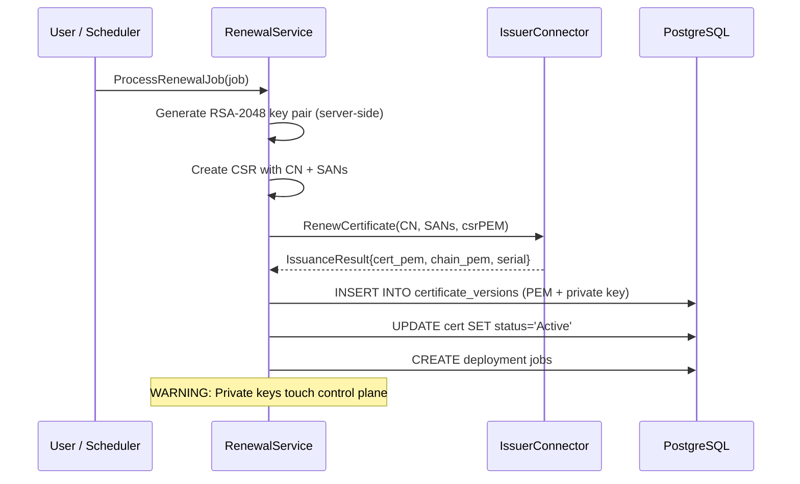

### 3. Deploy Certificate to Target

The agent deploys certificates using target connectors. Each connector knows how to push certificates to a specific system:

- **NGINX**: Writes cert/chain/key files to disk, validates config with `nginx -t`, reloads with `nginx -s reload` or `systemctl reload nginx`
- **Apache httpd**: Writes separate cert/chain/key files, validates with `apachectl configtest`, graceful reload
- **HAProxy**: Builds a combined PEM file (cert + chain + key), optionally validates config, reloads via systemctl or signal
- **F5 BIG-IP**: A proxy agent in the same network zone calls the iControl REST API to upload certificate/key files, install crypto objects, and update the SSL client profile within an atomic transaction. The server assigns the work; the proxy agent executes it.
- **IIS** (implemented, dual-mode): (1) Agent-local (recommended) — a Windows agent on the IIS box runs PowerShell `Import-PfxCertificate` + `Set-WebBinding` directly with PFX conversion and SHA-1 thumbprint computation. (2) Proxy agent WinRM — for agentless IIS targets, a nearby Windows agent reaches the IIS box via WinRM.

The agent handles both the certificate (public) and the private key (read from local key store at `CERTCTL_KEY_DIR`). The control plane never sees the private key and never initiates outbound connections to agents or targets (pull-only model).

### 3.5 Revoke a Certificate

When a certificate needs immediate revocation (key compromise, decommission, etc.), the control plane executes a 7-step process:

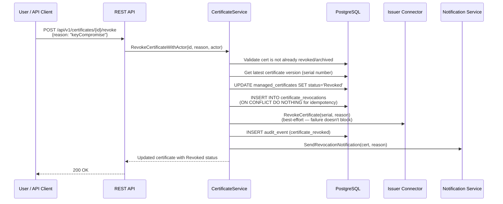

The revocation is recorded in the `certificate_revocations` table (separate from the certificate status update) for CRL generation. The DER-encoded CRL at `GET /.well-known/pki/crl/{issuer_id}` (RFC 5280 §5, RFC 8615) is generated on-demand by querying this table and signing with the issuing CA's key. The OCSP responder at `GET /.well-known/pki/ocsp/{issuer_id}/{serial}` (RFC 6960) checks both the certificate status and the revocations table to return signed good/revoked/unknown responses. Both endpoints are served unauthenticated — relying parties (TLS clients, hardware appliances, browsers) must be able to reach them without a certctl API key — and carry the IANA-registered media types `application/pkix-crl` and `application/ocsp-response` respectively.

Short-lived certificates (those with profile TTL < 1 hour) return "good" from OCSP and are excluded from CRL — their rapid expiry is treated as sufficient revocation.

#### Bulk Revocation

For compliance events requiring fleet-wide revocation (key compromise, CA distrust, mass decommission), certctl supports bulk revocation by filter criteria. The `POST /api/v1/certificates/bulk-revoke` endpoint accepts filter parameters (profile_id, owner_id, agent_id, issuer_id) and creates individual revocation jobs for each matching certificate. Bulk revocation reuses the same 7-step single-cert flow for each certificate — no new issuer notification or audit mechanics. The operation is idempotent: revoking an already-revoked certificate is a no-op. Partial failures are tolerated — if one certificate fails to revoke (e.g., issuer unavailable), the operation continues for remaining certs and returns a summary. A single `bulk_revocation_initiated` audit event logs the operation with filter criteria, operator actor, and summary (total requested, succeeded, failed counts). Audit events for individual certificate revocations record the operator identity separately. The GUI bulk revoke button on the certificates list filters by visible selections and displays an affected-cert count modal before confirmation.

### 4. Automatic Renewal

The control plane runs a scheduler with 8 always-on loops plus up to 4 optional loops (enabled by configuration). `internal/scheduler/scheduler.go:262-265` is the authoritative count.

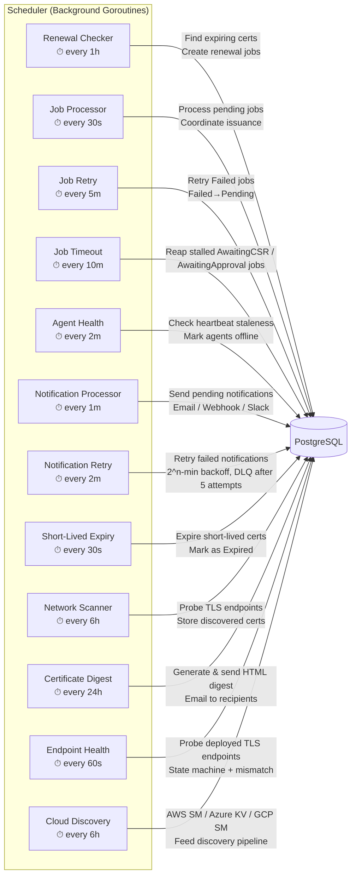

| Loop | Interval | Always-on? | Purpose |
|------|----------|------------|---------|
| Renewal checker | 1 hour | Yes | Finds certificates approaching expiry (threshold-based or ARI-directed), creates renewal jobs |
| Job processor | 30 seconds | Yes | Processes pending jobs (issuance, renewal, deployment) |
| Job retry | 5 minutes (`CERTCTL_SCHEDULER_RETRY_INTERVAL`) | Yes | Transitions `Failed` jobs back to `Pending` for re-dispatch (I-001) |
| Job timeout | 10 minutes (`CERTCTL_JOB_TIMEOUT_INTERVAL`) | Yes | Reaps `AwaitingCSR` jobs older than 24h and `AwaitingApproval` jobs older than 7d to `Failed`, feeding the retry loop (I-003) |
| Agent health check | 2 minutes | Yes | Marks agents as offline if heartbeat is stale |
| Notification processor | 1 minute | Yes | Sends pending notifications via configured channels |
| Notification retry | 2 minutes (`CERTCTL_NOTIFICATION_RETRY_INTERVAL`) | Yes | Re-dispatches `Failed` notifications whose `next_retry_at` has elapsed; exponential backoff (2^n minutes, capped at 1h), 5-attempt budget, terminal `dead` status after exhaustion (I-005) |
| Short-lived expiry | 30 seconds | Yes | Marks expired short-lived certificates (profile TTL < 1 hour) |
| Network scanner | 6 hours | Opt-in (`CERTCTL_NETWORK_SCAN_ENABLED`) | Probes TLS endpoints on configured CIDR ranges, stores discovered certs (M21). CIDR size validated at API level — max /20 (4096 IPs) per range. |
| Certificate digest | 24 hours (`CERTCTL_DIGEST_INTERVAL`) | Opt-in (digest service) | Generates HTML email with certificate stats, expiration timeline, job health, agent count. Does NOT run on startup — waits for first scheduled tick. Falls back to certificate owner emails if no explicit recipients configured. |
| Endpoint health | 60 seconds (`CERTCTL_HEALTH_CHECK_INTERVAL`) | Opt-in (health check service) | Probes deployed TLS endpoints, drives the healthy/degraded/down/cert_mismatch state machine (M48) |
| Cloud discovery | 6 hours | Opt-in (at least one cloud source configured) | Walks AWS Secrets Manager / Azure Key Vault / GCP Secret Manager, feeds discovery pipeline (M50) |

Each loop uses `sync/atomic.Bool` idempotency guards to prevent concurrent tick execution — if a loop iteration is still running when the next tick fires, the tick is skipped with a warning log. Most loops (including short-lived expiry, job retry, job timeout, and notification retry) run immediately on startup before entering their ticker interval, ensuring no gap between scheduler start and first execution. The certificate digest loop is the exception — it does NOT run on startup, only on scheduled ticks. Graceful shutdown uses `sync.WaitGroup` with `WaitForCompletion()` to drain all in-flight work before process exit.

Each operation has a context timeout to prevent indefinite hangs if external services become unresponsive.

When the renewal checker finds a certificate within its renewal window, it performs two tasks: threshold-based alerting and renewal job creation.

**Threshold-Based Expiration Alerting**: Each renewal policy defines configurable alert thresholds (default: 30, 14, 7, 0 days before expiry). For each certificate approaching expiry, the scheduler checks which thresholds have been crossed and sends deduplicated notifications. A certificate that crosses the 14-day threshold only gets one 14-day alert, even though the renewal checker runs every hour. Deduplication is tracked via threshold tags embedded in the notification message and queried with the `MessageLike` filter. Certificates are also transitioned to `Expiring` status when they enter the alert window and `Expired` when they hit 0 days.

**Renewal Job Creation**: If the certificate's issuer has a registered connector, the scheduler creates a renewal job. The job processor picks it up, coordinates with the issuer, and triggers deployment. All steps are logged in the audit trail and generate notifications.

## Connector Architecture

Certctl uses connector interfaces for extensibility. Each connector type has a standard interface that implementations must satisfy.

```mermaid
flowchart TB
    subgraph "Issuer Connectors"
        direction TB
        II["IssuerConnector Interface\nIssueCertificate() | RenewCertificate()\nRevokeCertificate() | GetOrderStatus()"]
        II --> LC["Local CA"]
        II --> ACME["ACME v2"]
        II --> SCA["step-ca"]
        II --> OC["OpenSSL / Custom CA"]
        II --> VP["Vault PKI"]
        II --> DC["DigiCert CertCentral"]
        II --> SG["Sectigo SCM"]
        II --> GC["Google CAS"]
        II --> AP2["AWS ACM PCA"]
        II --> EN["Entrust"]
        II --> GS["GlobalSign Atlas"]
        II --> EJ["EJBCA"]
    end

    subgraph "Target Connectors"
        direction TB
        TI["TargetConnector Interface\nDeployCertificate()\nValidateDeployment()"]
        TI --> NG["NGINX"]
        TI --> AP["Apache httpd"]
        TI --> HP["HAProxy"]
        TI --> TF["Traefik"]
        TI --> CD["Caddy"]
        TI --> EV["Envoy"]
        TI --> PO["Postfix/Dovecot"]
        TI --> IIS["IIS"]
        TI --> F5["F5 BIG-IP"]
        TI --> SSH["SSH"]
        TI --> WCS["WinCertStore"]
        TI --> JKS["Java Keystore"]
        TI --> K8S["K8s Secrets"]
    end

    subgraph "Notifier Connectors"
        direction TB
        NI["NotifierConnector Interface\nSendAlert() | SendEvent()"]
        NI --> EM["Email (SMTP)"]
        NI --> WH["Webhook (HTTP)"]
        NI --> SL["Slack"]
        NI --> TM["Microsoft Teams"]
        NI --> PD["PagerDuty"]
        NI --> OG["OpsGenie"]
    end
```

### IssuerConnectorAdapter (Dependency Inversion)

The service layer defines its own `IssuerConnector` interface (`internal/service/renewal.go`) while the connector layer has its own `issuer.Connector` interface (`internal/connector/issuer/interface.go`). The `IssuerConnectorAdapter` (`internal/service/issuer_adapter.go`) bridges the two, translating between their request/response types. This maintains clean dependency inversion — the service package never imports the connector package directly.

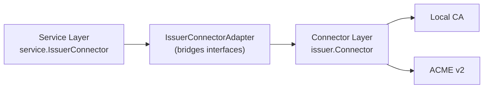

Registration happens in `cmd/server/main.go`:
```go
localCA := local.New(nil, logger)
issuerRegistry := map[string]service.IssuerConnector{
    "iss-local": service.NewIssuerConnectorAdapter(localCA),
}
```

### Issuer Connector

Handles certificate issuance from CAs.

```go
type Connector interface {
    ValidateConfig(ctx context.Context, config json.RawMessage) error
    IssueCertificate(ctx context.Context, request IssuanceRequest) (*IssuanceResult, error)
    RenewCertificate(ctx context.Context, request RenewalRequest) (*IssuanceResult, error)
    RevokeCertificate(ctx context.Context, request RevocationRequest) error
    GetOrderStatus(ctx context.Context, orderID string) (*OrderStatus, error)
    GenerateCRL(ctx context.Context, revokedCerts []RevokedCertEntry) ([]byte, error)
    SignOCSPResponse(ctx context.Context, req OCSPSignRequest) ([]byte, error)
    GetCACertPEM(ctx context.Context) (string, error)
}
```

Built-in issuers (live count: `ls -d internal/connector/issuer/*/ | wc -l`): **Local CA** (self-signed or sub-CA mode using `crypto/x509`), **ACME v2** (HTTP-01, DNS-01, and DNS-PERSIST-01 challenges, compatible with Let's Encrypt, ZeroSSL, Sectigo, Google Trust Services, and any ACME-compliant CA), **step-ca** (Smallstep private CA via native /sign API with JWK provisioner auth), **OpenSSL/Custom CA** (script-based signing delegating to user-provided shell scripts), **Vault PKI** (HashiCorp Vault's PKI secrets engine via /sign API with token auth), **DigiCert** (commercial CA via CertCentral REST API with async order processing), **Sectigo SCM** (async order model with 3-header auth), **Google CAS** (Cloud Certificate Authority Service with OAuth2 service account auth), **AWS ACM Private CA** (synchronous issuance via ACM PCA API), **Entrust** (mTLS client cert auth, sync/approval-pending), **GlobalSign Atlas HVCA** (mTLS + API key/secret dual auth), and **EJBCA** (Keyfactor open-source self-hosted CA, dual auth: mTLS or OAuth2). The ACME connector uses `golang.org/x/crypto/acme`, generates an ECDSA P-256 account key, handles account registration with ToS acceptance and optional External Account Binding (EAB) for CAs that require it (ZeroSSL, Google Trust Services, SSL.com), order creation, challenge solving (HTTP-01 via built-in server, DNS-01 via script-based hooks, DNS-PERSIST-01 via standing TXT records with auto-fallback to DNS-01), order finalization, and DER-to-PEM chain conversion. For ZeroSSL, EAB credentials are auto-fetched from ZeroSSL's public API when the directory URL is detected as ZeroSSL and no EAB credentials are provided — zero-friction onboarding with no dashboard visit required.

**ACME Renewal Information (ARI, RFC 9773):** The ACME connector supports CA-directed renewal timing via the `GetRenewalInfo()` method. Instead of using fixed thresholds (e.g., renew 30 days before expiry), the CA tells certctl when to renew by providing a `suggestedWindow` with start and end times. This is useful for distributing renewal load during maintenance windows and coordinating mass-revocation scenarios. Enable with `CERTCTL_ACME_ARI_ENABLED=true`. Cert ID is computed as `base64url(SHA-256(DER cert))` per RFC 9773. If the CA doesn't support ARI (404 from the ARI endpoint), certctl automatically falls back to threshold-based renewal — no operator intervention required. Errors from the CA are logged as warnings.

The interface also includes `GetCACertPEM(ctx)` for CA chain distribution (used by the EST server's `/cacerts` endpoint).

### Target Connector

Deploys certificates to infrastructure. The `DeploymentRequest` includes `KeyPEM` because agents generate and hold private keys locally — the key is passed from the agent's local key store into the target connector, never from the control plane.

```go
type Connector interface {
    ValidateConfig(ctx context.Context, config json.RawMessage) error
    DeployCertificate(ctx context.Context, request DeploymentRequest) (*DeploymentResult, error)
    ValidateDeployment(ctx context.Context, request ValidationRequest) (*ValidationResult, error)
}
```

The `DeploymentRequest` struct carries the full material needed by the target system: the signed certificate, the CA chain, the agent-generated private key, target-specific configuration, and arbitrary metadata. The key field is populated by the agent from its local key store (`CERTCTL_KEY_DIR`) — it never originates from the control plane.

Built-in targets (14 connector types): **NGINX** (writes cert/chain/key files, validates with `nginx -t`, reloads), **Apache httpd** (writes cert/chain/key files, validates with `apachectl configtest`, graceful reload), **HAProxy** (combined PEM file with cert+chain+key, validates config, reloads via systemctl/signal), **Traefik** (file provider — writes cert/key to watched directory, Traefik auto-reloads), **Caddy** (dual-mode: admin API hot-reload or file-based), **Envoy** (file-based with optional SDS JSON config), **F5 BIG-IP** (proxy agent + iControl REST, transaction-based atomic SSL profile updates), **IIS** (dual-mode: agent-local PowerShell + proxy agent WinRM for agentless targets), **Postfix/Dovecot** (file write + service reload), **SSH** (agentless deployment via SSH/SFTP), **Windows Certificate Store** (PowerShell-based cert import, dual-mode local/WinRM), **Java Keystore** (PEM → PKCS#12 → keytool pipeline, JKS and PKCS12 formats), **Kubernetes Secrets** (deploys as `kubernetes.io/tls` Secrets via injectable K8sClient interface, in-cluster or kubeconfig auth).

After deployment, agents can perform **post-deployment TLS verification**: the agent probes the live TLS endpoint using `crypto/tls.DialWithDialer` and compares the SHA-256 fingerprint of the served certificate against what was deployed. Results are reported via `POST /api/v1/jobs/{id}/verify` and stored on the job record. Verification is best-effort — failures don't block or rollback deployments.

The SSH connector enables agentless deployment to any Linux/Unix server via SSH/SFTP, using the proxy agent pattern. The Kubernetes Secrets connector deploys certificates as `kubernetes.io/tls` Secrets via an injectable K8sClient interface supporting both in-cluster and out-of-cluster auth.

### Notifier Connector

Sends alerts about certificate lifecycle events.

```go
type Connector interface {
    ValidateConfig(ctx context.Context, config json.RawMessage) error
    SendAlert(ctx context.Context, alert Alert) error
    SendEvent(ctx context.Context, event Event) error
}
```

Built-in notifiers: **Email** (SMTP), **Webhook** (HTTP POST), **Slack** (incoming webhook), **Microsoft Teams** (MessageCard), **PagerDuty** (Events API v2), and **OpsGenie** (Alert API v2). Each is enabled by setting its configuration environment variable.

See the [Connector Development Guide](connectors.md) for details on building custom connectors.

### Notification Retry & Dead-Letter Queue

A transient notifier failure (SMTP timeout, 5xx webhook response, Slack rate-limit) must not silently drop a critical alert. Migration `000016_notification_retry` adds three columns to `notification_events` — `retry_count INTEGER NOT NULL DEFAULT 0`, `next_retry_at TIMESTAMPTZ` (nullable — only meaningful while a row is in `failed` state), and `last_error TEXT` (the most recent transient error, preserved for operator triage) — together with a partial index `idx_notification_events_retry_sweep ON notification_events(next_retry_at) WHERE status = 'failed' AND next_retry_at IS NOT NULL` so the retry hot path scales with the retry-eligible slice rather than the full notification history.

The scheduler's notification-retry loop (see the scheduler section above) calls `NotificationService.RetryFailedNotifications(ctx)` every `CERTCTL_NOTIFICATION_RETRY_INTERVAL` (default `2m`). Each tick pulls up to 1000 rows via `notifRepo.ListRetryEligible(ctx, now, maxAttempts, sweepLimit)` — a partial-index-driven query that filters on `status='failed' AND next_retry_at <= now() AND retry_count < 5` — and redispatches them through the same notifier registry used by `ProcessPendingNotifications`. A successful redispatch transitions the row directly to `sent` without incrementing `retry_count`, so the audit trail preserves "delivered on attempt N". A failed redispatch re-arms `next_retry_at` using exponential backoff — `wait = min(2^retry_count minutes, 1h)` — bumps `retry_count`, and stamps `last_error`. When `retry_count >= 4` (the fifth attempt has just failed) the row is promoted to the terminal `dead` status via `notifRepo.MarkAsDead`, which clears `next_retry_at` so the partial retry-sweep index stops matching and the row cannot be re-entered into the retry rotation without operator action.

`NotificationService.RequeueNotification(ctx, id)` is the operator-driven escape hatch from `dead`. It atomically resets `retry_count → 0`, `next_retry_at → NULL`, `last_error → NULL`, and `status → pending`, handing the row back to `ProcessPendingNotifications` on the next 1m tick. This is the correct response to "the notifier outage is resolved, redeliver the queue"; it is not a retry, which is why the retry counter is reset rather than incremented.

The dead-letter depth is surfaced in two places. First, `DashboardSummary.NotificationsDead` is populated by `StatsService.GetDashboardSummary` via `notifRepo.CountByStatus(ctx, "dead")`. The injection uses a `SetNotifRepo` setter pattern (mirroring `CertificateService.SetTargetRepo`) rather than a new positional argument to `NewStatsService`, which keeps all nine existing `NewStatsService` call sites (main.go plus eight digest tests and stats_test.go) signature-stable — when the notification repository has not been wired in, `NotificationsDead` falls through to zero. Second, the `/api/v1/metrics/prometheus` endpoint emits `certctl_notification_dead_total` as a counter (operator alert thresholds per the I-005 spec: `> 0` warning, `> 10` critical) using the same `DashboardSummary` snapshot so the dashboard card and the Prometheus counter cannot skew. The web dashboard exposes a two-tab toolbar on `/notifications` — "All" (the pre-I-005 inbox) and "Dead letter" (threads `?status=dead` into the list query, surfaces `Retry N/5` and the truncated `last_error` with a full-text tooltip per row, and binds a Requeue button to `POST /api/v1/notifications/{id}/requeue`).

### EST Server (RFC 7030)

The EST (Enrollment over Secure Transport) server provides an industry-standard enrollment interface for devices that need certificates without using the REST API. It runs under `/.well-known/est/` per RFC 7030 and supports four operations: CA certificate distribution (`/cacerts`), initial enrollment (`/simpleenroll`), re-enrollment (`/simplereenroll`), and CSR attributes (`/csrattrs`).

**Architecture:** EST is a handler-level protocol that delegates certificate issuance to an existing `IssuerConnector`. This means EST is not a new issuer — it's a new *interface* to the existing issuance infrastructure. The `ESTService` bridges the `ESTHandler` to whichever issuer connector is configured via `CERTCTL_EST_ISSUER_ID`.

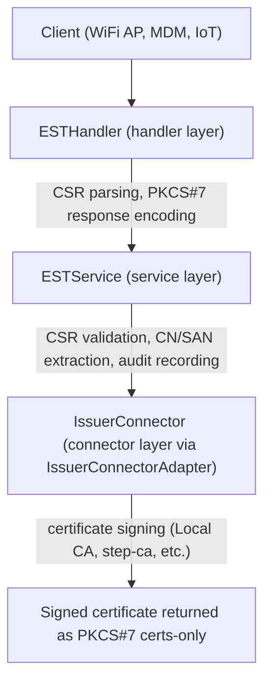

**Wire format:** EST uses PKCS#7 (RFC 2315) certs-only degenerate SignedData for certificate responses and base64-encoded DER for CSR requests. The handler includes a hand-rolled ASN.1 PKCS#7 builder — no external PKCS#7 dependency. The CSR reader accepts both base64-encoded DER (standard EST wire format) and PEM-encoded PKCS#10 (convenience for debugging).

**Interface:** The `ESTHandler` defines an `ESTService` interface (dependency inversion, same pattern as all other handlers):

```go
type ESTService interface {
    GetCACerts(ctx context.Context) (string, error)
    SimpleEnroll(ctx context.Context, csrPEM string) (*domain.ESTEnrollResult, error)
    SimpleReEnroll(ctx context.Context, csrPEM string) (*domain.ESTEnrollResult, error)
    GetCSRAttrs(ctx context.Context) ([]byte, error)
}
```

**Issuer connector extension:** EST required adding `GetCACertPEM(ctx) (string, error)` to the issuer connector interface so the `/cacerts` endpoint can serve the CA chain. The Local CA returns its CA certificate PEM; Vault PKI fetches via `GET /v1/{mount}/ca/pem`; Google CAS fetches via API; AWS ACM PCA retrieves via `GetCertificateAuthorityCertificate`. ACME, step-ca, OpenSSL, DigiCert, and Sectigo connectors return errors (they don't expose a static CA chain — their chains are per-issuance).

**Authentication:** EST endpoints are served unauthenticated at the HTTP layer under `/.well-known/est/*` — no Bearer token required. Per RFC 7030 §3.2.3 EST authentication is deployment-specific, and per §4.1.1 `/cacerts` is explicitly anonymous. certctl enforces authentication via CSR signature verification inside `ESTService.SimpleEnroll`/`SimpleReEnroll` plus profile policy gates (allowed key algorithms, minimum key size, permitted SANs, permitted EKUs, MaxTTL). The HTTP dispatch is implemented in `cmd/server/main.go:buildFinalHandler`, which routes `/.well-known/est/*` through `noAuthHandler` (RequestID + structuredLogger + Recovery only). The EST RFC 7030 hardening master bundle (Phases 1–11, post-2026-04-29) layers per-profile mTLS sibling routes, HTTP Basic enrollment-password auth, RFC 9266 channel binding, and per-(CN, sourceIP) sliding-window rate limits on top of this baseline — see [`EST Server (RFC 7030) — Production Deployment`](#est-server-rfc-7030--production-deployment) below for the production topology.

**Audit:** Every EST enrollment is recorded in the audit trail with `protocol: "EST"`, the CN, SANs, issuer ID, serial number, and optional profile ID. The hardening bundle adds typed audit-action codes per failure dimension (`est_simple_enroll_success` / `_failed`, `est_auth_failed_basic` / `_mtls` / `_channel_binding`, `est_rate_limited`, `est_csr_policy_violation`, `est_bulk_revoke`, `est_trust_anchor_reloaded`, etc.) so operators can filter the GUI Recent Activity tab on the exact reason — see `internal/service/est_audit_actions.go` for the constants.

### EST Server (RFC 7030) — Production Deployment

The EST hardening master bundle (Phases 1–11, post-2026-04-29) makes the EST server production-grade for enterprise WiFi/802.1X, IoT bootstrap, and Microsoft-fleet enrollment without a behind-the-proxy auth layer. The `EST Server (RFC 7030)` section above describes the V2-baseline single-profile server; the production topology layers in:

- **Multi-profile dispatch** via `CERTCTL_EST_PROFILES=corp,iot,wifi`. Each profile gets its own `/.well-known/est/<pathID>/` endpoint group, isolated issuer binding, optional `CertificateProfile`, and independent auth + trust anchor.
- **mTLS sibling route** at `/.well-known/est-mtls/<pathID>/` (opt-in via `_MTLS_ENABLED=true`). Required for the standard route's HTTP Basic to coexist with the renewal-on-existing-cert flow. Per-handler re-verify enforces "cert chains to THIS profile's bundle" so cross-profile bleed is blocked even when both profiles share a TLS listener union pool (`cmd/server/tls.go::buildServerTLSConfigWithMTLS`).
- **HTTP Basic enrollment-password** on the standard route (opt-in via `_ALLOWED_AUTH_MODES=basic` + `_ENROLLMENT_PASSWORD`). Constant-time comparison; per-source-IP failed-auth limiter (10 attempts / 1h / 50k tracked IPs) caps brute-force from a single source.
- **RFC 9266 `tls-exporter` channel binding** (opt-in via `_CHANNEL_BINDING_REQUIRED=true`, gated on `_MTLS_ENABLED=true`). Defends against TLS-bridging MITM where an attacker funnels the device's CSR through their own TLS session.
- **Per-(CN, sourceIP) sliding-window rate limit** via `_RATE_LIMIT_PER_PRINCIPAL_24H` (default 0 = disabled; production = 3). Mirrors the SCEP/Intune per-device limit pattern.
- **Server-side keygen** per RFC 7030 §4.4 (opt-in via `_SERVERKEYGEN_ENABLED=true`). CMS EnvelopedData wraps the server-generated private key encrypted to the device's CSR pubkey via AES-256-CBC; plaintext key zeroized after marshal (mirrors the SCEP/Intune `keymem.marshalPrivateKeyAndZeroize` discipline).
- **Per-profile observability** via the `/api/v1/admin/est/profiles` and `POST /api/v1/admin/est/reload-trust` endpoints (M-008 admin-gated). The GUI surface lives at `/est` with three tabs (Profiles / Recent Activity / Trust Bundle) — counter cells per failure dimension, trust-anchor expiry countdowns, SIGHUP-equivalent reload modal.
- **EST-source-scoped bulk revoke** at `POST /api/v1/est/certificates/bulk-revoke` (M-008 admin-gated). The handler pins `Source=EST` so the operator's bulk-revoke only affects EST-issued certs even if the criteria match SCEP/API/Agent-issued certs too. Provenance is tracked via `ManagedCertificate.Source` (migration `000023_managed_certificates_source.up.sql`).

```mermaid
flowchart LR
    subgraph "EST clients"
        Laptop["Laptop / supplicant\n(host enrollment)"]
        IoT["IoT device\n(bootstrap)"]
        Sup["WiFi supplicant\n(user enrollment)"]
    end
    subgraph "EST endpoints (per profile)"
        Std["/.well-known/est/&lt;pathID&gt;/\n(HTTP Basic OR anonymous)"]
        MTLS["/.well-known/est-mtls/&lt;pathID&gt;/\n(client cert required;\ntrust → _MTLS_CLIENT_CA_TRUST_BUNDLE_PATH)"]
    end
    subgraph "Per-profile gates (in order)"
        Auth["Auth\n(_ALLOWED_AUTH_MODES)"]
        CB["RFC 9266 channel binding\n(_CHANNEL_BINDING_REQUIRED)"]
        RL["Sliding-window rate limit\n(_RATE_LIMIT_PER_PRINCIPAL_24H)"]
        Pol["CSR policy gate\n(profile.AllowedKeyAlgorithms / EKUs / SANs / MaxTTL / MustStaple)"]
    end
    subgraph "Issuance"
        Iss["IssuerConnector\n(per profile _ISSUER_ID)"]
    end
    Laptop --> MTLS
    IoT --> Std
    Sup --> MTLS
    Std --> Auth --> RL --> Pol --> Iss
    MTLS --> Auth --> CB --> RL --> Pol --> Iss
    Iss --> Audit["audit log\n(typed est_* action codes)"]
    Iss --> Counter["estCounterTab\n(per-profile sync/atomic)"]
    Audit --> GUI["/est admin tabs\n(Profiles / Recent Activity / Trust Bundle)"]
    Counter --> GUI
    GUI -. "SIGHUP-equivalent" .-> Reload["/api/v1/admin/est/reload-trust\n(M-008 admin-gated)"]
```

Trust-anchor reload semantics: a bad SIGHUP (parse error, expired cert) keeps the OLD pool in place. The operator hits the GUI Reload modal, sees the typed error, corrects the file, retries — the EST endpoint never goes down during a half-rotation. Implemented via the shared `internal/trustanchor.Holder` primitive that the SCEP/Intune dispatcher also uses; per-handler `Get()` returns a snapshot at request-start so an in-flight request that crosses a SIGHUP uses the OLD pool.

**libest interop tested in CI.** The libest sidecar at `deploy/test/libest/Dockerfile` builds Cisco's reference RFC 7030 client (v3.2.0-2) and the integration suite at `deploy/test/est_e2e_test.go` exercises every documented flow end-to-end via `docker exec` against the live certctl server. See [`docs/est.md::Appendix A`](est.md#appendix-a-libest-reference-client) for the operator-side reproducer.

The full operator guide (multi-profile config, WiFi/802.1X + FreeRADIUS recipe, IoT bootstrap recipe, troubleshooting matrix per typed audit-action) is at [`docs/est.md`](est.md).

### SCEP Server (RFC 8894)

The SCEP (Simple Certificate Enrollment Protocol) server provides certificate enrollment for MDM platforms and network devices. It runs at `/scep` with operation-based dispatch via query parameters per RFC 8894.

**Architecture:** SCEP follows the exact same layering as EST — a handler-level protocol that delegates certificate issuance to an existing `IssuerConnector`. The `SCEPService` bridges the `SCEPHandler` to whichever issuer connector is configured via `CERTCTL_SCEP_ISSUER_ID`.

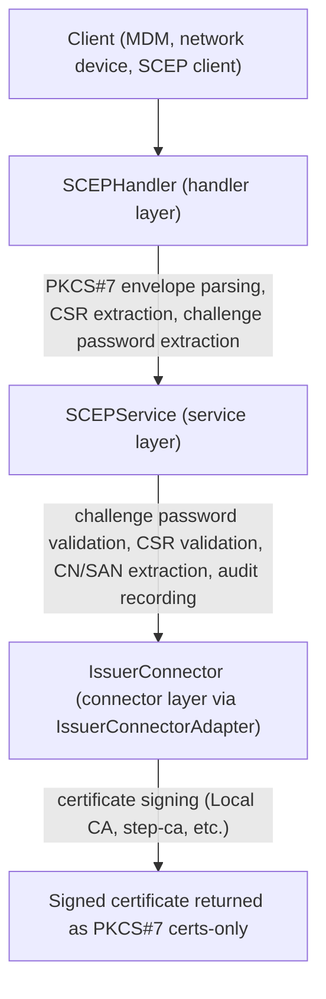

**Wire format:** Two paths, tried in order. The new RFC 8894 path (post-2026-04-29) parses the full PKIMessage shape: ContentInfo → SignedData → SignerInfo (POPO over auth-attrs verified via `internal/pkcs7/signedinfo.go::SignerInfo.VerifySignature` with the canonical SET-OF Attribute re-serialisation per RFC 5652 §5.4) → EnvelopedData (decrypted via `internal/pkcs7/envelopeddata.go::EnvelopedData.Decrypt` with RSA PKCS#1v1.5 keyTrans + AES-CBC content + constant-time PKCS#7 unpad to close the padding-oracle leak) → inner PKCS#10 CSR. Auth-attrs (messageType, transactionID, senderNonce) flow through to the service layer via `domain.SCEPRequestEnvelope`. The handler dispatches on messageType: PKCSReq (19) → initial enrollment; RenewalReq (17) → re-enrollment with chain validation; GetCertInitial (20) → polling stub returns FAILURE+badCertID. Responses are full CertRep PKIMessages (`internal/pkcs7/certrep.go::BuildCertRepPKIMessage`) signed by the per-profile RA cert/key with the issued cert chain encrypted to the device's transient signing cert (RFC 8894 §3.3.2). On parse failure the handler falls through to the legacy MVP path: base64-encoded PKCS#7 and raw CSR submissions are still accepted; responses use the legacy PKCS#7 certs-only shape via the shared `internal/pkcs7` package. The MVP fall-through is non-negotiable — backward compat with lightweight SCEP clients that don't speak full RFC 8894. Single certs are returned as raw DER for `GetCACert`, chains as PKCS#7.

**Authentication:** SCEP endpoints at `/scep` and `/scep/*` are served unauthenticated at the HTTP layer — no Bearer token required — per RFC 8894 §3.2, which defines authentication via the `challengePassword` attribute (OID 1.2.840.113549.1.9.7) embedded in the PKCS#10 CSR rather than an HTTP credential. The HTTP dispatch is implemented in `cmd/server/main.go:buildFinalHandler`, which routes `/scep` and `/scep/*` through `noAuthHandler` (RequestID + structuredLogger + Recovery only). The `challengePassword` is mandatory: `preflightSCEPChallengePassword` at startup refuses to boot the control plane when `CERTCTL_SCEP_ENABLED=true` is set without `CERTCTL_SCEP_CHALLENGE_PASSWORD`, closing CWE-306 (missing authentication for a critical function). `SCEPService.PKCSReq` enforces the same invariant defense-in-depth — an empty `s.challengePassword` rejects every enrollment — and the password comparison uses `crypto/subtle.ConstantTimeCompare` to prevent response-time side-channel leakage. The startup log line `SCEP server enabled` emits a `challenge_password_set` boolean for operator visibility.

**Interface:** The `SCEPHandler` defines an `SCEPService` interface (dependency inversion). The legacy `PKCSReq` method backs the MVP fall-through path; the three `*WithEnvelope` variants back the RFC 8894 PKIMessage path:

```go
type SCEPService interface {
    GetCACaps(ctx context.Context) string
    GetCACert(ctx context.Context) (string, error)
    // MVP path — raw CSR + transactionID synthesised from CSR's CN.
    PKCSReq(ctx context.Context, csrPEM, challengePassword, transactionID string) (*domain.SCEPEnrollResult, error)
    // RFC 8894 path — envelope carries the parsed authenticated attributes
    // (messageType, transactionID, senderNonce, signerCert). Returns
    // *SCEPResponseEnvelope (not error + result) because RFC 8894 §3.3
    // mandates a CertRep PKIMessage on every response, even failures.
    PKCSReqWithEnvelope(ctx context.Context, csrPEM, challengePassword string, env *domain.SCEPRequestEnvelope) *domain.SCEPResponseEnvelope
    RenewalReqWithEnvelope(ctx context.Context, csrPEM, challengePassword string, env *domain.SCEPRequestEnvelope) *domain.SCEPResponseEnvelope
    GetCertInitialWithEnvelope(ctx context.Context, env *domain.SCEPRequestEnvelope) *domain.SCEPResponseEnvelope
}
```

**Capabilities advertised:** `POSTPKIOperation` + `SHA-256` + `SHA-512` + `AES` + `SCEPStandard` + `Renewal`. ChromeOS specifically looks for `POSTPKIOperation` (non-base64 POST), `AES` (the now-implemented CBC content encryption), `SCEPStandard` (RFC 8894 conformance), and `Renewal` (RenewalReq messageType-17 dispatch).

**Multi-profile dispatch:** A single certctl instance can expose multiple SCEP endpoints from `CERTCTL_SCEP_PROFILES=corp,iot,server` + per-profile `CERTCTL_SCEP_PROFILE_<NAME>_*` env vars, each with its own issuer + RA pair + challenge password. The router exposes `/scep` (legacy, single-profile flat-env case) + `/scep/<pathID>` per non-empty profile. Per-profile preflight validates each RA pair independently; failures log the offending PathID. See [`legacy-est-scep.md`](legacy-est-scep.md#multi-profile-dispatch-scep-path-id) for the operator config recipe.

**Must-staple per profile:** When `CertificateProfile.MustStaple = true`, the local issuer adds the RFC 7633 `id-pe-tlsfeature` extension (OID `1.3.6.1.5.5.7.1.24`, non-critical, value `SEQUENCE OF INTEGER {5}`) to issued certs so browsers + modern TLS libraries fail-closed on missing OCSP stapling responses.

**Shared PKCS#7 package:** Both EST and SCEP handlers share a common `internal/pkcs7` package for building PKCS#7 certs-only responses and PEM-to-DER chain conversion, eliminating code duplication between the two enrollment protocols.

**Audit:** Every SCEP enrollment is recorded in the audit trail with `protocol: "SCEP"`, the CN, SANs, issuer ID, serial number, transaction ID, and optional profile ID.

## Security Model

### Private Key Management

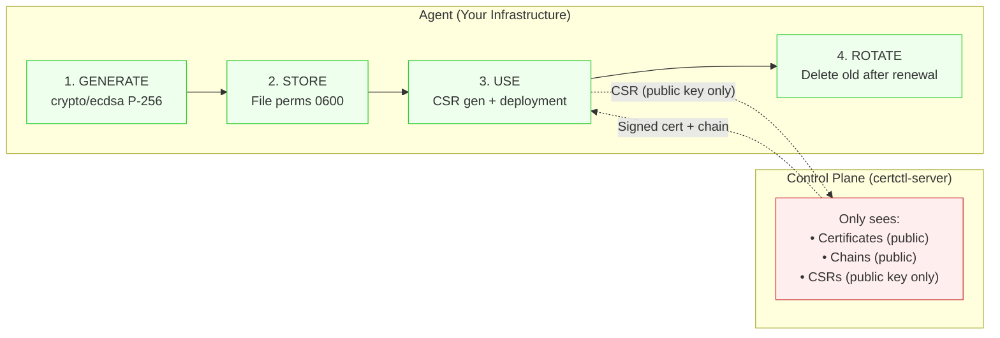

**Agent keygen mode (default, `CERTCTL_KEYGEN_MODE=agent`):** Private keys follow a strict lifecycle on agents:

1. **Generated on the agent** — ECDSA P-256, never sent to the control plane
2. **Stored on the agent** — `CERTCTL_KEY_DIR` with file permissions 0600
3. **Used by the agent** — for deployment to targets (via `DeploymentRequest.KeyPEM`)
4. **Rotated by the agent** — old keys overwritten after successful renewal

The control plane only handles public material: certificates, chains, and CSRs.

**Server keygen mode (`CERTCTL_KEYGEN_MODE=server`, demo only):** The control plane generates RSA-2048 keys server-side within `processRenewalServerKeygen`. Private keys are stored in `certificate_versions.csr_pem`. A log warning is emitted at startup. Use only for Local CA development/demo.

### Microsoft Intune Connector trust anchor (per-profile, opt-in)

When the SCEP server is sitting behind a Microsoft Intune Certificate
Connector — i.e. certctl is acting as a drop-in NDES replacement —
each per-profile dispatcher carries its own **trust anchor pool**:
the public certs the operator extracted from the Connector's
installation. Every Intune-flavored enrollment goes through:

```mermaid
flowchart TD
    TAH["Per-profile TrustAnchorHolder<br/>(RWMutex pool, SIGHUP-reloadable)"]
    Device[device]
    Handler[handler]
    Dispatch["SCEPService.dispatchIntuneChallenge"]
    Validate["intune.ValidateChallenge<br/>(sig + iat/exp + audience)"]
    Match["claim.DeviceMatchesCSR<br/>(set-equality)"]
    Replay["intune.ReplayCache.CheckAndInsert"]
    Rate["intune.PerDeviceRateLimiter.Allow"]
    Compliance["(V3-Pro) ComplianceCheck hook"]
    Process["processEnrollment → IssuerConnector"]
    Device -->|SCEP PKIMessage| Handler
    Handler --> Dispatch
    TAH -.->|Get()| Dispatch
    Dispatch --> Validate
    Dispatch --> Match
    Dispatch --> Replay
    Dispatch --> Rate
    Dispatch --> Compliance
    Dispatch --> Process
```

The trust anchor file is mode-0600 on disk; certctl loads it at
startup via `intune.LoadTrustAnchor` (refuses to boot on empty
bundle / parse error / past-`NotAfter` cert) and reloads atomically
on `SIGHUP` (mirrors the server TLS-cert hot-reload pattern). A bad
reload keeps the OLD pool in place — operators get a recoverable
failure window rather than a service-down. The admin GUI's
**Intune Monitoring** tab inside the SCEP Administration page (`/scep`)
and the parallel admin endpoints
(`GET /api/v1/admin/scep/profiles` for the always-present per-profile
overview that drives the Profiles tab,
`GET /api/v1/admin/scep/intune/stats` for the Intune deep dive,
`POST /api/v1/admin/scep/intune/reload-trust` for the SIGHUP-equivalent)
are all M-008 admin-gated; non-admin Bearer callers get HTTP 403
because the trust-anchor expiries + RA cert expiries + mTLS bundle
paths are sensitive operational metadata.

See [`scep-intune.md`](scep-intune.md) for the full migration playbook
+ Microsoft support statement.

### CA Signing Abstraction

The local issuer's CA private key is wrapped behind the `signer.Signer` interface in `internal/crypto/signer/`. Every CA-signing call site — leaf certificate issuance (`x509.CreateCertificate`), CRL generation (`x509.CreateRevocationList`), and OCSP response signing (`ocsp.CreateResponse`) — accesses the key through this interface rather than touching `crypto.Signer` directly. The interface embeds the stdlib `crypto.Signer` and adds a single `Algorithm() Algorithm` method so call sites can pick the matching `x509.SignatureAlgorithm` without reflecting on the concrete key type.

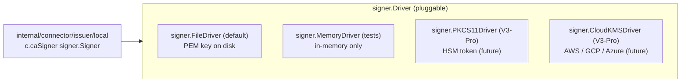

Today only `FileDriver` (production) and `MemoryDriver` (tests) ship. The interface exists so PKCS#11/HSM and cloud-KMS drivers can land in follow-on packages (`internal/crypto/signer/pkcs11`, etc.) without modifying any call site or any other driver. The L-014 file-on-disk threat-model carve-out documented at the top of `internal/connector/issuer/local/local.go` applies to `FileDriver`-backed signers; alternative drivers that keep the key inside an HSM token or cloud KMS close the disk-exposure leg of the threat model entirely.

Behavior equivalence between the wrapped Signer and the raw `crypto.Signer` is pinned by `internal/crypto/signer/equivalence_test.go`: RSA signing is byte-strict equal (PKCS#1 v1.5 is deterministic), ECDSA signing is structurally equal (TBSCertificate / TBSRevocationList byte-equal; signature value differs because ECDSA uses random `k`).

### Authentication

- **API clients → Server**: API key in `Authorization: Bearer` header, or `none` for demo mode. Applies to every path under `/api/v1/*`.
- **Agent → Server**: API key registered at agent creation, included in all requests
- **Server → Issuers**: ACME account key, or connector-specific credentials
- **Agent → Targets**: API tokens, WinRM credentials (stored locally on agent or proxy agent — never on server). Credential scope is limited to the agent's network zone.
- **Standards-based enrollment and PKI distribution endpoints**: `/.well-known/est/*` (RFC 7030), `/scep` and `/scep/*` (RFC 8894), and `/.well-known/pki/crl/{issuer_id}` + `/.well-known/pki/ocsp/{issuer_id}/{serial}` (RFC 5280 §5 / RFC 6960 / RFC 8615) are served unauthenticated at the HTTP layer. These protocols carry their own authentication semantics — CSR signature + profile policy for EST (§3.2.3 says EST auth is deployment-specific; §4.1.1 makes `/cacerts` explicitly anonymous), `challengePassword` in CSR attributes for SCEP (§3.2), and relying-party accessibility for CRL/OCSP — and cannot present certctl Bearer tokens. The dispatch is implemented in `cmd/server/main.go:buildFinalHandler`, which routes these prefixes through `noAuthHandler` (RequestID + structuredLogger + Recovery only, no auth or rate-limit middleware). CWE-306 is closed for SCEP by `preflightSCEPChallengePassword`, which refuses to start the server when SCEP is enabled without `CERTCTL_SCEP_CHALLENGE_PASSWORD`. The 27-subtest regression harness `cmd/server/finalhandler_test.go` pins this dispatch surface (EST 4-endpoint, SCEP exact + trailing-slash + query-string, PKI CRL+OCSP, health probes, `/api/v1/*` authenticated, `/assets/*` file server, SPA fallback).

### Audit Trail

Every action is recorded as an immutable audit event:

```json
{
  "id": "audit-001",
  "actor": "o-alice",
  "actor_type": "User",
  "action": "certificate_created",
  "resource_type": "certificate",
  "resource_id": "mc-api-prod",
  "details": {"environment": "production"},
  "timestamp": "2026-03-14T10:30:00Z"
}
```

Audit events cannot be modified or deleted. They support filtering by actor, action, resource type, resource ID, and time range. All audit operations are logged via structured `slog` logging; if an audit event fails to persist, the error is logged immediately to ensure no gaps in the audit trail go unnoticed.

### API Audit Log

In addition to application-level audit events, certctl records every HTTP API call via middleware. The audit middleware captures method, URL path (excluding query parameters — see security note below), actor (extracted from auth context), SHA-256 request body hash (truncated to 16 characters), response status code, and request latency. Health and readiness probes are excluded to avoid noise.

**Security: Query Parameter Exclusion** — The audit middleware intentionally records `r.URL.Path` only (not `r.URL.String()` or `r.RequestURI`). Query strings may contain cursor tokens, API keys passed as params, or other sensitive filter values. Since the audit trail is append-only with no deletion capability, any sensitive data recorded would persist permanently.

Audit recording is async (via goroutine) so it never blocks the HTTP response. If audit persistence fails, the error is logged immediately — the API call still succeeds. The middleware sits after the auth middleware in the stack so the actor identity is available from context.

### Input Validation and SSRF Protection

All shell-facing inputs (connector scripts, domain names, ACME tokens) are validated through `internal/validation/command.go` before reaching shell execution. `ValidateShellCommand()` denies all shell metacharacters. `ValidateDomainName()` enforces RFC 1123. `ValidateACMEToken()` restricts to base64url characters. The network scanner filters reserved IP ranges (loopback, link-local including cloud metadata 169.254.169.254, multicast, broadcast) to prevent SSRF, while preserving RFC 1918 private ranges for legitimate internal scanning.

### Request Body Size Limits

All incoming HTTP request bodies are capped by `http.MaxBytesReader` middleware (default 1MB, configurable via `CERTCTL_MAX_BODY_SIZE`). Requests exceeding the limit receive a 413 Request Entity Too Large response. The middleware is positioned before authentication in the chain so oversized payloads are rejected early, before any auth processing or database work occurs. Requests without bodies (GET, HEAD, nil body) skip the limit check.

### Config Encryption at Rest

Dynamic issuer and target configurations (rows with `source='database'`) contain credentials — ACME EAB HMACs, Vault tokens, DigiCert/Sectigo API keys, SSH private keys, WinRM passwords, F5 BIG-IP passwords, and similar. These are sealed at rest in PostgreSQL via `internal/crypto/encryption.go` using AES-256-GCM with a key derived from the operator passphrase `CERTCTL_CONFIG_ENCRYPTION_KEY` through PBKDF2-SHA256 (100,000 rounds, 32-byte output).

**v2 wire format (current, M-8 remediation, CWE-916 / CWE-329):**

```
magic(0x02) || salt(16) || nonce(12) || ciphertext+tag
```

Every call to `EncryptIfKeySet` draws 16 fresh bytes from `crypto/rand` as the PBKDF2 salt, so the derived AES-256 key is distinct per ciphertext and per re-encryption. The salt is stored alongside the ciphertext; decryption reads the magic byte, splits out the salt, re-derives the key, and verifies the AEAD tag.

**v1 legacy format (read-only):**

```
nonce(12) || ciphertext+tag
```

Pre-M-8 blobs were sealed with a package-level fixed salt `"certctl-config-encryption-v1"`. `DecryptIfKeySet` preserves the v1 read path unchanged — a blob whose first byte is not `0x02`, or whose v2 AEAD verification fails (including the 1/256 case where a v1 nonce happens to begin with `0x02`), falls through to a v1 attempt against the legacy fixed salt. v1 blobs are never written by the post-M-8 code path; they re-seal as v2 naturally on the next UPDATE through the normal service CRUD flow. No operator migration ceremony is required.

**Fail-closed behavior (C-2 sentinel, CWE-311):** both `EncryptIfKeySet` and `DecryptIfKeySet` return `ErrEncryptionKeyRequired` when invoked with an empty passphrase. The server refuses to start if any `source='database'` rows already exist without `CERTCTL_CONFIG_ENCRYPTION_KEY` set.

**Low-level primitives preserved byte-identical.** `Encrypt`, `Decrypt`, and `DeriveKey` are kept bit-stable so v1 fixtures on disk remain decryptable unchanged and so callers outside the config-encryption path (none today, but the symbols are exported) do not see a breaking change. The new per-ciphertext salt path is reached via the helper `deriveKeyWithSalt(passphrase, salt)`.

**Passphrase plumbing.** Services (`IssuerService`, `TargetService`, `IssuerRegistry`) hold the operator passphrase as a raw `string` and delegate PBKDF2 to the crypto package per ciphertext. This replaces the pre-M-8 design that pre-derived a single `[]byte` key at service construction and reused it for every row, which was the direct consequence of the fixed-salt KDF.

**Coverage gate.** CI enforces `internal/crypto/...` coverage ≥ 85% (observed 86.7%) — the encryption primitives are a security-critical gate, and the v2 format plus v1 fallback plus C-2 sentinel paths all need exhaustive coverage to avoid silent regressions.

### CORS

CORS uses a **deny-by-default** posture: when `CERTCTL_CORS_ORIGINS` is empty, no CORS headers are set and only same-origin requests can read responses. Operators must explicitly configure allowed origins. This prevents accidental exposure of the API to cross-origin requests in production.

### Middleware Chain Order

The HTTP middleware stack processes requests in the following order (see `cmd/server/main.go`):

1. **RequestID** - assigns unique request ID for correlation
2. **Logging** - structured slog middleware with request ID propagation
3. **Recovery** - panic recovery (catches panics in downstream middleware/handlers)
4. **BodyLimit** - request body size cap via `http.MaxBytesReader`
5. **RateLimiter** - token bucket rate limiting (optional, when enabled)
6. **CORS** - cross-origin request handling (deny-by-default)
7. **Auth** - API key validation (or none in development; JWT/OIDC via authenticating gateway, see below — not in-process)
8. **AuditLog** - records every API call to the audit trail (requires auth context for actor)

### Authenticating-gateway pattern (JWT, OIDC, mTLS)

certctl's in-process authentication surface is intentionally narrow: `api-key` for production deployments and `none` for development. There is no in-process JWT, OIDC, mTLS, or SAML middleware. (`CERTCTL_AUTH_TYPE=jwt` was accepted pre-G-1 but silently routed through the api-key bearer middleware — a security finding masquerading as a config option, removed at the v2.x boundary; see [`upgrade-to-v2-jwt-removal.md`](upgrade-to-v2-jwt-removal.md) if you previously set it.)

For deployments that need JWT/OIDC/mTLS, the standard pattern is to put an authenticating gateway in front of certctl and configure `CERTCTL_AUTH_TYPE=none` on the upstream certctl process. The gateway terminates the federated identity protocol, validates tokens / certificates / SAML assertions, and proxies the authenticated request to certctl as a same-origin call on a private network. This separation gives operators the full breadth of the modern identity ecosystem (oauth2-proxy, Envoy `ext_authz`, Traefik `ForwardAuth`, Pomerium, Authelia, Caddy `forward_auth`, Apache `mod_auth_openidc`, nginx `auth_request`) without certctl itself having to track signing-key rotation, claim mapping, audience validation, and the rest of the JWT/OIDC surface area. Operators wanting per-request actor attribution past the gateway boundary forward the gateway-resolved identity (e.g., `X-Auth-Request-User` from oauth2-proxy) and run a small authorization layer at the gateway that enforces the bearer-key contract certctl actually uses.

### Concurrency Safety

The background scheduler uses `sync/atomic.Bool` idempotency guards on every loop (8 always-on plus up to 4 optional) — if a tick fires while the previous iteration is still running, it skips. A `sync.WaitGroup` tracks all in-flight goroutines. `WaitForCompletion(timeout)` blocks during shutdown until all work finishes or the timeout expires, preventing state corruption from mid-flight database operations during process exit.

### Logging

All logging throughout the service layer uses Go's `log/slog` package for structured, queryable logs. This replaces ad-hoc `fmt.Printf` statements with consistent key-value logging that includes request context, operation names, and error details. Agents also implement exponential backoff on network failures to gracefully handle temporary connectivity issues with the control plane.

## API Design

All endpoints are under `/api/v1/` and follow consistent patterns:

- **List**: `GET /api/v1/{resources}` — returns `{data: [...], total, page, per_page}`
- **Get**: `GET /api/v1/{resources}/{id}` — returns the resource
- **Create**: `POST /api/v1/{resources}` — returns the created resource with `201`
- **Update**: `PUT /api/v1/{resources}/{id}` — returns the updated resource
- **Delete**: `DELETE /api/v1/{resources}/{id}` — returns `204` (soft delete/archive)
- **Actions**: `POST /api/v1/{resources}/{id}/{action}` — returns `202` for async operations

Resources: certificates, issuers, targets, agents, jobs, policies, profiles, teams, owners, agent-groups, audit, notifications, discovered-certificates, discovery-scans, network-scan-targets, stats, metrics.

The full API is documented in an OpenAPI 3.1 specification at `api/openapi.yaml`. The router-vs-spec parity is pinned by the `TestRouter_OpenAPIParity` regression test (Bundle D / M-027), which AST-walks `internal/api/router/router.go` for every `r.Register` AND direct `r.mux.Handle` registration and asserts the set matches the spec's `paths:` block exactly. Live counts:

```
grep -cE 'r\.Register\("[A-Z]' internal/api/router/router.go    # r.Register sites
grep -cE 'r\.mux\.Handle\("[A-Z]' internal/api/router/router.go # r.mux.Handle sites (auth-exempt: health/ready/auth-info/version)
grep -cE '^\s+operationId:' api/openapi.yaml                   # documented operations
```

See the [OpenAPI Guide](openapi.md) for usage with Swagger UI and SDK generation.

Jobs support additional action endpoints: `POST /api/v1/jobs/{id}/cancel`, `POST /api/v1/jobs/{id}/approve`, `POST /api/v1/jobs/{id}/reject`.

**Bulk Operations:** `POST /api/v1/certificates/bulk-revoke` — Bulk revocation by filter criteria (profile_id, owner_id, agent_id, issuer_id). Creates individual revocation jobs for matching certificates, with partial-failure tolerance and a summary audit event.

**Enhanced Query Features (M20):** Certificate list endpoints support additional query capabilities beyond basic pagination:

- **Sorting**: `?sort=notAfter` (ascending) or `?sort=-createdAt` (descending). Whitelist: notAfter, expiresAt, createdAt, updatedAt, commonName, name, status, environment.
- **Time-range filters**: `?expires_before=`, `?expires_after=`, `?created_after=`, `?updated_after=` (RFC 3339 format).
- **Cursor pagination**: `?cursor=<token>&page_size=100` for efficient keyset pagination alongside traditional page-based.
- **Sparse fields**: `?fields=id,common_name,status` to reduce response payload.
- **Additional filters**: `?agent_id=`, `?profile_id=` (in addition to existing status, environment, owner_id, team_id, issuer_id).
- **Deployments**: `GET /api/v1/certificates/{id}/deployments` returns deployment targets for a certificate.

Certificate revocation: `POST /api/v1/certificates/{id}/revoke` with optional `{"reason": "keyCompromise"}`. Supports RFC 5280 reason codes (unspecified, keyCompromise, caCompromise, affiliationChanged, superseded, cessationOfOperation, certificateHold, privilegeWithdrawn). Returns the updated certificate status. Best-effort issuer notification — the revocation succeeds even if the issuer connector is unavailable. The DER-encoded X.509 CRL signed by the issuing CA is served unauthenticated at `GET /.well-known/pki/crl/{issuer_id}` (RFC 5280 §5 + RFC 8615, `Content-Type: application/pkix-crl`); the CRL is pre-generated by the scheduler-driven `crlGenerationLoop` and persisted in the `crl_cache` table (migration 000019) so HTTP fetches do not rebuild per request. The embedded OCSP responder serves signed responses unauthenticated at both `GET /.well-known/pki/ocsp/{issuer_id}/{serial}` and `POST /.well-known/pki/ocsp/{issuer_id}` (RFC 6960 §A.1.1, `Content-Type: application/ocsp-response`); responses are signed by a per-issuer dedicated OCSP responder cert (RFC 6960 §2.6, migration 000020) carrying the `id-pkix-ocsp-nocheck` extension (RFC 6960 §4.2.2.2.1) — the CA private key is never used directly for OCSP signing, which keeps it cold for the future PKCS#11/HSM driver path. The responder cert auto-rotates within `CERTCTL_OCSP_RESPONDER_ROTATION_GRACE` (default 7d) of expiry. Both endpoints are accessible to relying parties with no certctl API credentials, as RFC-compliant PKI consumers expect. Short-lived certificates (profile TTL < 1 hour) are exempt from CRL/OCSP — expiry is sufficient revocation. See [`crl-ocsp.md`](crl-ocsp.md) for the operator + relying-party guide (endpoint URLs, configuration knobs, responder cert lifecycle, cert-manager / Firefox / OpenSSL / Intune integration recipes, troubleshooting).

Certificate export (M27): `GET /api/v1/certificates/{id}/export/pem` returns PEM-encoded certificate and chain, and `POST /api/v1/certificates/{id}/export/pkcs12` returns a PKCS#12 bundle (binary). Private keys are never exported — they remain on agents. All exports are audited with actor, timestamp, and format.

Health checks live outside the API prefix: `GET /health` and `GET /ready`.

## MCP Server

certctl includes an MCP (Model Context Protocol) server as a separate binary (`cmd/mcp-server/`) that enables AI assistants to interact with the certificate platform. The MCP server uses the official MCP Go SDK (`modelcontextprotocol/go-sdk`) with stdio transport for integration with Claude, Cursor, and other MCP-compatible tools.

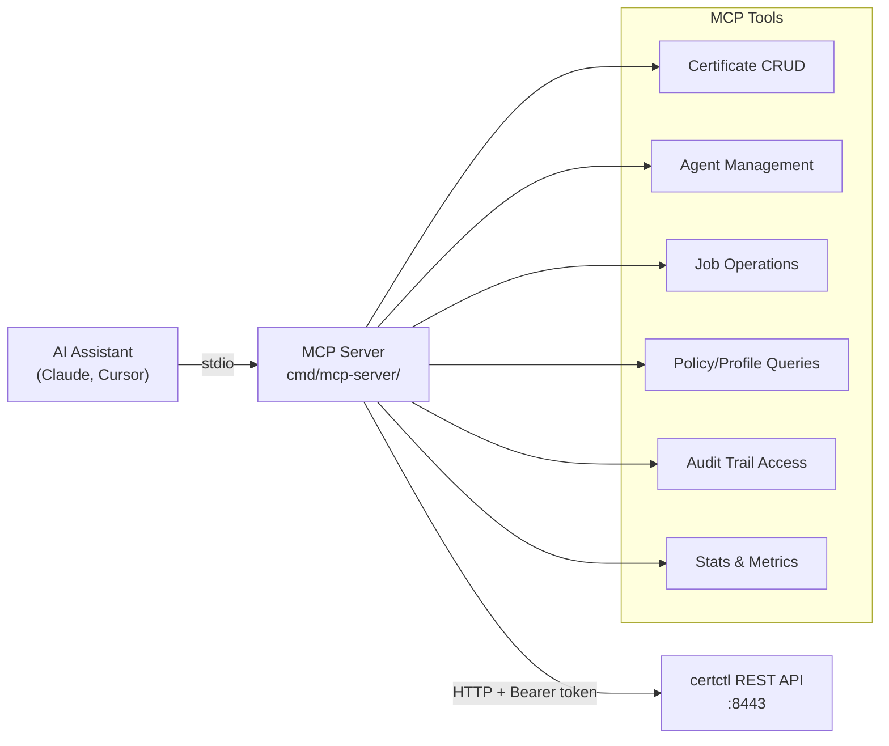

The MCP server is a stateless HTTP proxy — every MCP tool call translates to an HTTP request to the certctl REST API. It adds no new state, no new dependencies, and no new attack surface beyond what the API already exposes. Configuration is minimal: `CERTCTL_SERVER_URL` and `CERTCTL_API_KEY` environment variables.

The tools are organized across 16 resource domains with typed input structs and `jsonschema` struct tags for automatic LLM-friendly schema generation. Binary response support handles DER CRL and OCSP endpoints.

## CLI Tool

certctl ships with a command-line tool (`certctl-cli`, built from `cmd/cli/main.go`) that wraps the REST API for terminal workflows. The CLI uses Go's standard library only (`flag` + `text/tabwriter`) — no Cobra or other framework dependencies.

12 subcommands organized by resource: `certs list`, `certs get`, `certs renew`, `certs revoke`, `agents list`, `agents get`, `jobs list`, `jobs get`, `jobs cancel`, `import` (bulk PEM import), `status` (health + summary stats), and `version`. Output is available in table (default) or JSON format via `--format`. Connection is configured via `CERTCTL_SERVER_URL` and `CERTCTL_API_KEY` environment variables or CLI flags.

The bulk import command (`certctl-cli import <file.pem>`) parses multi-certificate PEM files and creates certificate records via the API — useful for bootstrapping certctl with existing certificate inventory.

## Deployment Topologies

### Docker Compose (Development / Small Deployments)

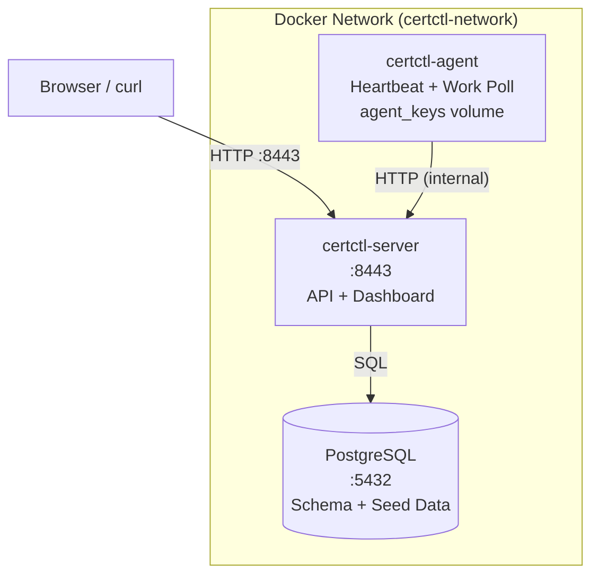

**Credentials & Configuration:**
Database and API credentials are managed via environment variables defined in a `.env` file. Copy `deploy/.env.example` to `deploy/.env` for local development and customize credentials for production. The agent key directory (`CERTCTL_KEY_DIR`) is persisted as a named Docker volume (`agent_keys`) at `/var/lib/certctl/keys` for reliable key storage across container restarts.

### Production (Kubernetes with Helm)

A production-ready Helm chart is available under `deploy/helm/certctl/` with full support for multi-replica deployments, persistent PostgreSQL, agent DaemonSet, optional Ingress, and security best practices.

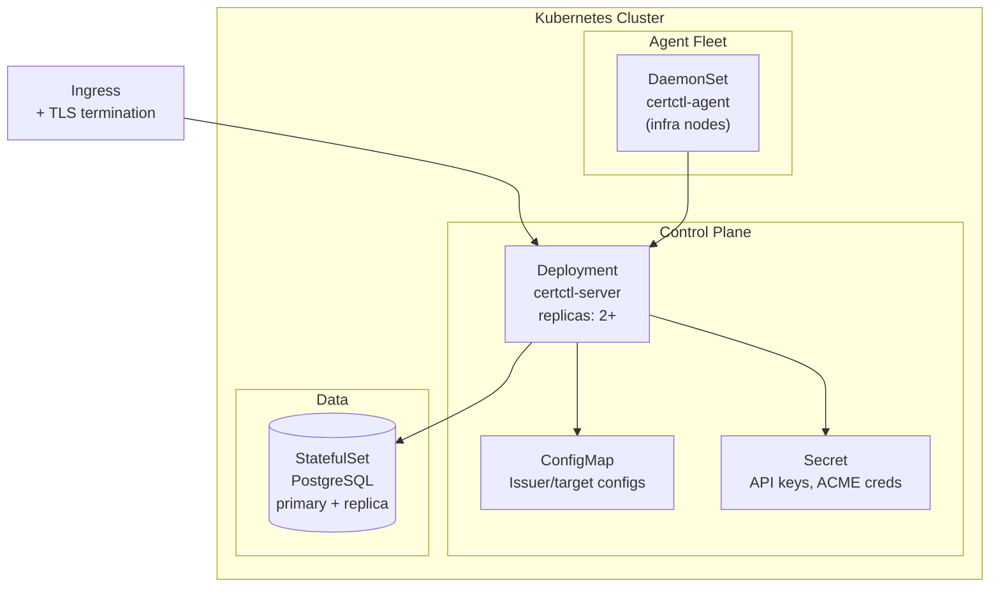

**Helm Installation:**

```bash
# Add the chart (if published) or install from local directory
helm install certctl deploy/helm/certctl/ \
  --set server.auth.apiKey="your-secure-key" \
  --set postgresql.auth.password="your-db-password" \
  --set ingress.enabled=true \
  --set ingress.hosts[0].host="certctl.example.com"
```

The Helm chart includes: server Deployment with configurable replicas, liveness/readiness probes, security context (non-root, read-only rootfs), PostgreSQL StatefulSet with persistent volumes, optional Ingress with TLS, ServiceAccount with configurable RBAC, and agent DaemonSet running one agent per node. All certctl configuration options are exposed in `values.yaml` — issuers, targets, notifiers, scheduler intervals, discovery settings, and SMTP for digest emails.

See `deploy/helm/certctl/values.yaml` for the full configuration reference and `deploy/helm/certctl/Chart.yaml` for version and appVersion details.

For production, you would also add an ingress controller, TLS termination for the certctl API itself, and external PostgreSQL (RDS, Cloud SQL, etc.).

## Discovery Data Flow (M18b + M21 + M50)

Certificate discovery enables operators to build a complete inventory of existing certificates before managing them with certctl. There are three discovery modes that feed into the same pipeline:

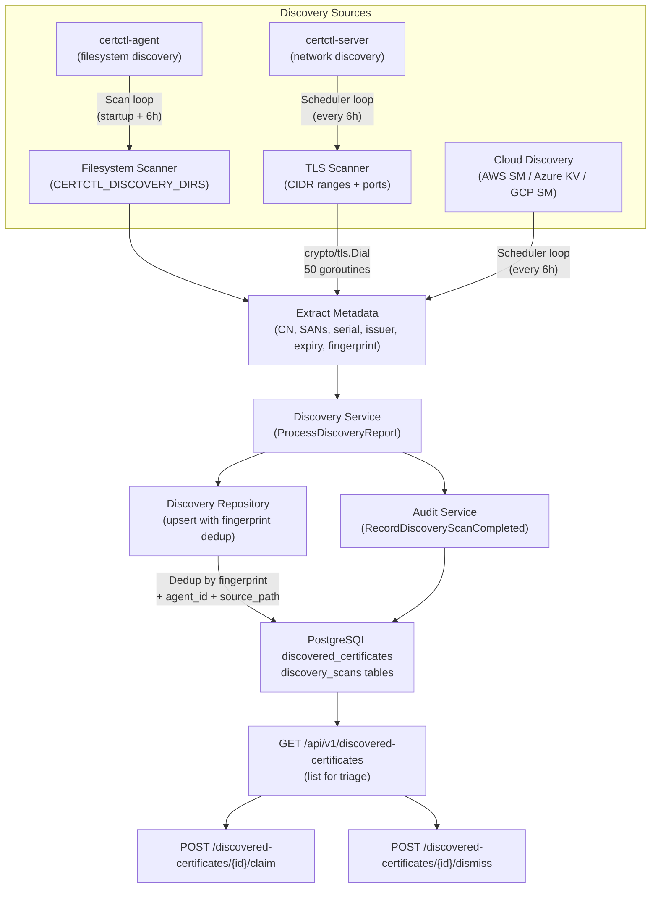

**Filesystem Discovery (M18b):**

1. **Agent-side discovery** — Agent scans `CERTCTL_DISCOVERY_DIRS` on startup and every 6 hours, walking directories recursively and parsing PEM/DER files
2. **Metadata extraction** — For each certificate found, extract: common name, SANs, serial number, issuer DN, subject DN, expiration date, key algorithm, key size, is_ca flag, SHA-256 fingerprint (used as dedup key)
3. **Server submission** — Agent POSTs scan results as `DiscoveryReport` to `POST /api/v1/agents/{id}/discoveries`
4. **Deduplication** — Server uses fingerprint + agent ID + filesystem path as unique key; prevents duplicate records of the same cert on the same agent

**Network Discovery (M21):**

1. **Target configuration** — Operator creates network scan targets via `POST /api/v1/network-scan-targets` with CIDR ranges, ports, and scan interval
2. **CIDR expansion** — Ranges expanded to individual IPs with /20 safety cap (4096 IPs max)
3. **TLS probing** — Server uses `crypto/tls.DialWithDialer` with `InsecureSkipVerify=true` to connect to each endpoint; 50 concurrent goroutines with configurable timeout
4. **Certificate extraction** — Full X.509 metadata extracted from TLS handshake peer certificates
5. **Sentinel agent** — Results submitted using `server-scanner` as virtual agent ID, with `source_path` set to `ip:port` and `source_format` set to `network`
6. **Same pipeline** — Feeds into the same `DiscoveryService.ProcessDiscoveryReport()` as filesystem discovery — same dedup, same audit trail, same triage workflow

**Cloud Secret Manager Discovery (M50):**

1. **Pluggable sources** — Each cloud provider implements the `DiscoverySource` interface (Name, Type, Discover, ValidateConfig). Three built-in sources: AWS Secrets Manager, Azure Key Vault, GCP Secret Manager
2. **CloudDiscoveryService orchestrator** — Iterates registered sources, calls `Discover()` on each, feeds reports into `ProcessDiscoveryReport()`. Errors from one source don't prevent other sources from running
3. **Scheduler integration** — opt-in cloud discovery scheduler loop (6h default; see `docs/architecture.md` 12-loop topology), runs immediately on startup, `atomic.Bool` idempotency guard
4. **Sentinel agents** — Each source uses its own sentinel agent ID (`cloud-aws-sm`, `cloud-azure-kv`, `cloud-gcp-sm`) for dedup and triage filtering
5. **Source path format** — `aws-sm://{region}/{secret}`, `azure-kv://{cert-name}/{version}`, `gcp-sm://{project}/{secret}`
6. **No new schema** — Reuses existing `discovered_certificates` and `discovery_scans` tables. Sentinel agent IDs leverage existing `(fingerprint_sha256, agent_id, source_path)` dedup constraint

**Common triage workflow (all sources):**

1. **Storage** — Records stored in `discovered_certificates` table with status = "Unmanaged"
2. **Audit** — `discovery_scan_completed` event logged with agent ID, cert count, scan timestamp
3. **Operator triage** — Operator queries `GET /api/v1/discovered-certificates?status=Unmanaged` to see new findings
4. **Claim or dismiss** — For each unmanaged cert, operator either:
   - **Claims it** via `POST /discovered-certificates/{id}/claim` — links to existing managed cert or creates new enrollment
   - **Dismisses it** via `POST /discovered-certificates/{id}/dismiss` — removes from triage, marked as "Dismissed"
9. **Status tracking** — `discovery_cert_claimed` and `discovery_cert_dismissed` events audit the operator's decision
10. **Summary** — `GET /api/v1/discovery-summary` returns count of Unmanaged, Managed, and Dismissed certs (useful for compliance reporting)

This data flow is pull-based and non-blocking. Agents discover at their own pace; the server stores results for later review. There's no pressure to claim or dismiss; operators can leave certificates in "Unmanaged" status indefinitely.

## Continuous TLS Health Monitoring (M48)

Beyond one-time discovery, certctl continuously monitors TLS endpoints for certificate health using a shared TLS probing package and a state-machine-driven health check service. Endpoints transition between states (Healthy → Degraded → Down) based on consecutive failures, and `cert_mismatch` status alerts when a deployed certificate is unexpectedly replaced.

**Architecture:** Probing is extracted into a shared `internal/tlsprobe/` package used by both the network scanner (M21) and the health monitor. The `HealthCheckService` manages 8 API endpoints for CRUD operations and state transitions. A dedicated opt-in endpoint health scheduler loop runs every 60 seconds (configurable via `CERTCTL_HEALTH_CHECK_INTERVAL`). Individual health check targets have their own check intervals (default 300 seconds) — the scheduler queries only endpoints due for check via `ListDueForCheck()`. Results are stored with historical tracking for 30 days (configurable via `CERTCTL_HEALTH_CHECK_HISTORY_RETENTION`). State transitions trigger notifications (critical for down endpoints, warning for degraded, high for cert_mismatch).

**State Machine:** Healthy → Degraded (configurable threshold, default 2 consecutive failures) → Down (default 5 failures). The `cert_mismatch` status is special — it fires whenever the observed certificate fingerprint differs from the expected (deployed) fingerprint, catching silent rollbacks and unauthorized cert replacements. Recovery from degraded/down transitions back to healthy and resets the failure counter.

**API:** 8 endpoints for list (with filters: status, certificate_id, network_scan_target_id, enabled), get, create, update, delete, history (with limit param), acknowledge (incident marking), and summary (aggregate status counts).

**Auto-Create:** When a deployment job completes with successful verification (M25), the system automatically creates a health check with the deployed certificate's fingerprint as the expected value. Network scan targets can also opt-in to auto-create health checks for discovered endpoints.

**Configuration:**

| Env Var | Default | Description |
|---|---|---|
| `CERTCTL_HEALTH_CHECK_ENABLED` | `false` | Enable/disable the feature |
| `CERTCTL_HEALTH_CHECK_INTERVAL` | `60s` | Scheduler tick interval |
| `CERTCTL_HEALTH_CHECK_DEFAULT_INTERVAL` | `300s` | Default per-endpoint check interval (5 min) |
| `CERTCTL_HEALTH_CHECK_DEFAULT_TIMEOUT` | `5000ms` | TLS connection timeout per probe |
| `CERTCTL_HEALTH_CHECK_MAX_CONCURRENT` | `20` | Max concurrent TLS probes |
| `CERTCTL_HEALTH_CHECK_HISTORY_RETENTION` | `30 days` | Purge probe history older than this |
| `CERTCTL_HEALTH_CHECK_AUTO_CREATE` | `true` | Auto-create checks from deployments |

## Testing Strategy

certctl is extensively tested across eight layers with CI-enforced coverage gates that act as regression floors. The goal is high-confidence regression prevention at the service and handler layers (where the most complex business logic lives), combined with integration tests that exercise the full request path from HTTP to database.

**Service layer unit tests** (`internal/service/*_test.go`) — Mock-based tests across all service files covering certificate CRUD, revocation (all RFC 5280 reason codes, OCSP/CRL generation, bulk revocation by filter with partial-failure tolerance), agent lifecycle, job state machine, policy evaluation, renewal/issuance flow (both keygen modes), notification deduplication, team/owner/agent group CRUD, issuer service CRUD with connection testing, and the issuer connector adapter. Mock repositories are simple structs with function fields — no heavy mocking frameworks.

**Handler layer tests** (`internal/api/handler/*_test.go`) — Every handler file has a corresponding test file using Go's `httptest` package: certificates (including revocation, bulk revocation by profile/owner/agent/issuer, DER CRL, OCSP), agents, jobs (including approve/reject), notifications, policies, profiles, issuers, targets, agent groups, teams, owners, discovery, network scan, verification, export, EST, digest, stats, and metrics. Tests cover the happy path, input validation, error propagation, method-not-allowed, pagination, and bulk operation partial-failure scenarios.

**Integration tests** (`internal/integration/`) — Three test files exercising the full stack from HTTP request through router, handler, service, and repository layers. `lifecycle_test.go` covers the complete certificate lifecycle (team/owner creation through deployment and status reporting). `negative_test.go` covers error paths, endpoint validation, and revocation scenarios. `e2e_test.go` exercises cross-milestone features end-to-end (agent metadata, profiles, issuer registry, GUI operations, stats, revocation, notifications, enhanced query API).

**Go integration tests** (`deploy/test/integration_test.go`) — Runs against the live Docker Compose test environment with real CA backends (Local CA, Pebble ACME, step-ca). Covers health checks, agent heartbeat, issuance, renewal, revocation, CRL/OCSP, EST enrollment, S/MIME, discovery, network scanning, and deployment verification using `crypto/x509` for cert parsing and `crypto/tls` for live TLS verification.

**Frontend tests** (`web/src/api/`) — Vitest tests covering the full API client (all endpoint functions with fetch mocking), stats/metrics endpoints, utility functions, and auth flows. Test environment uses jsdom with `@testing-library/jest-dom` matchers.

**Connector tests** (`internal/connector/`) — Issuer connectors (Local CA self-signed/sub-CA modes, ACME DNS-01/DNS-PERSIST-01, step-ca, OpenSSL, Vault PKI, DigiCert, Sectigo, Google CAS, AWS ACM PCA — all with httptest mock servers or injectable interface mocks). Target connectors (NGINX, Apache, HAProxy, Traefik, Caddy, Envoy, IIS with mock PowerShell executor, F5 BIG-IP with mock iControl client, Postfix/Dovecot, SSH with mock SSH client, Windows Certificate Store with mock PowerShell executor, Java Keystore with mock command executor, Kubernetes Secrets with mock K8s client, shared certutil package). Notifier connectors (Slack, Teams, PagerDuty, OpsGenie).

**Scheduler tests** (`internal/scheduler/scheduler_test.go`) — Idempotency guards (`sync/atomic.Bool`), `WaitForCompletion` success and timeout paths, and multi-loop concurrency safety.

**Fuzz tests** (`internal/validation/`, `internal/domain/`) — Go native fuzz tests for command validation (`ValidateShellCommand`, `ValidateDomainName`, `ValidateACMEToken`) and revocation domain parsing.

**CI pipeline** (`.github/workflows/ci.yml`) — Two parallel jobs. Go: build, vet, `go test -race`, `golangci-lint` (11 linters), `govulncheck`, test with coverage, per-layer coverage threshold enforcement (service 55%, handler 60%, domain 40%, middleware 30%). Frontend: TypeScript type check, Vitest, Vite production build.

For detailed test procedures, smoke tests, and the release sign-off checklist, see the [Testing Guide](testing-guide.md). For setting up the Docker Compose test environment with real CA backends, see [Test Environment](test-env.md).

## What's Next

- [Quick Start](quickstart.md) — Get certctl running locally
- [Advanced Demo](demo-advanced.md) — Issue a certificate end-to-end
- [Connector Guide](connectors.md) — Build custom connectors
- [Compliance Mapping](compliance.md) — SOC 2, PCI-DSS 4.0, and NIST SP 800-57 alignment
- [MCP Server Guide](mcp.md) — AI-native access to the API
- [OpenAPI Spec](openapi.md) — Full API reference and SDK generation
- [Testing Guide](testing-guide.md) — Test procedures and release sign-off
- [Test Environment](test-env.md) — Docker Compose test environment setup
