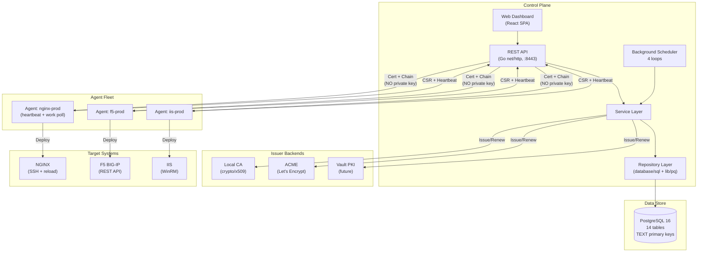
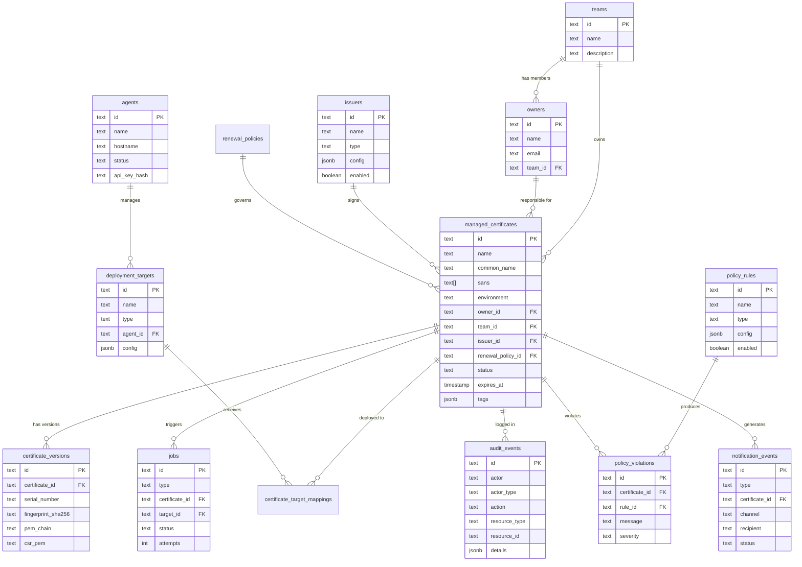
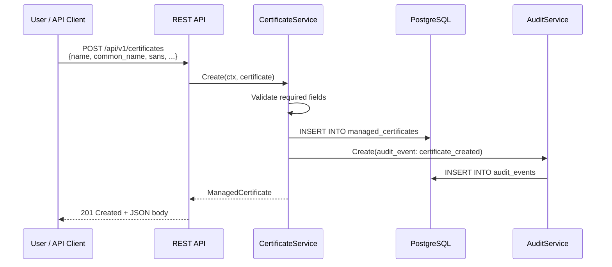
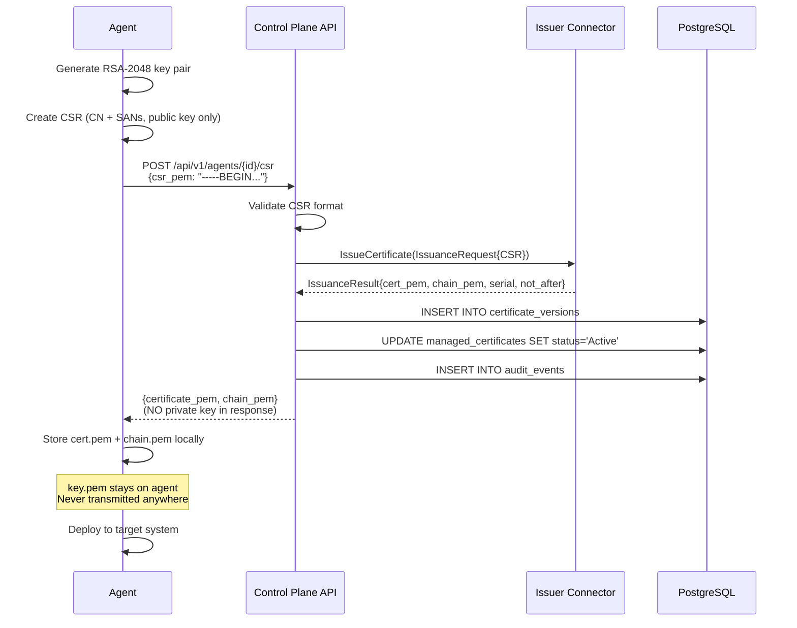
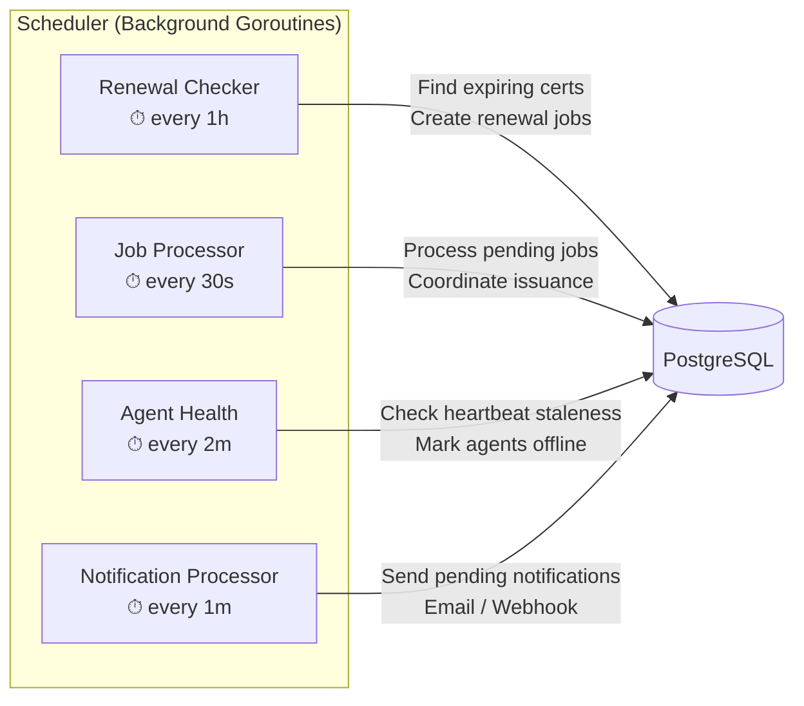
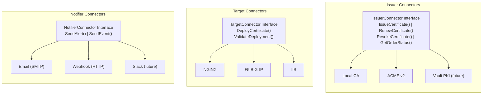
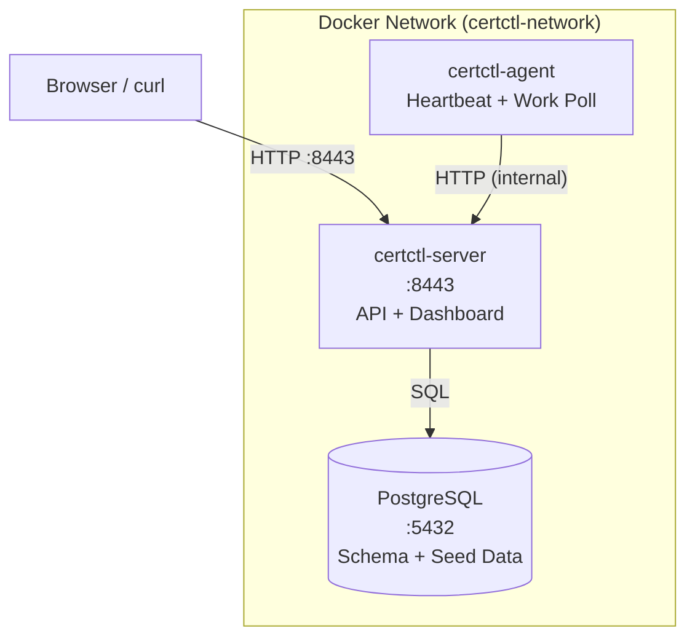
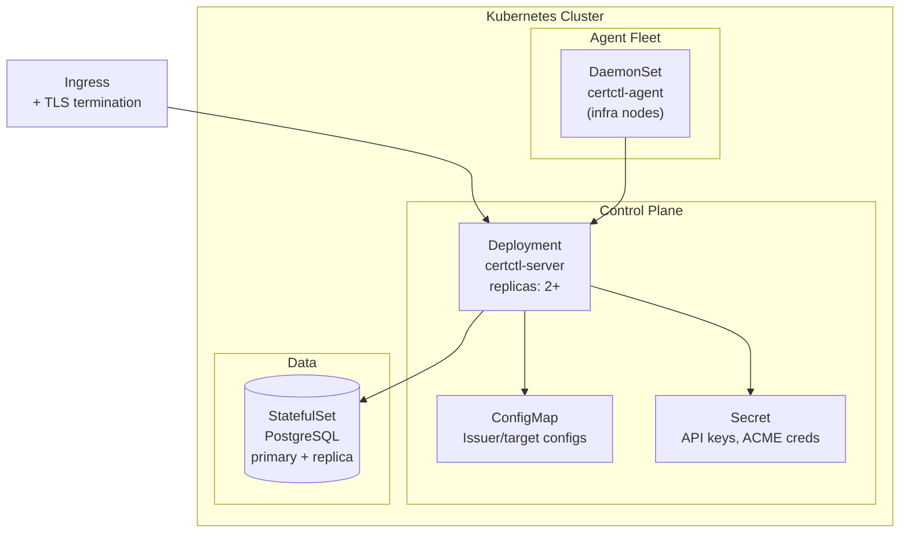

# Architecture Guide

## Overview

Certctl is a certificate management platform with a **decoupled control-plane and agent architecture**. The control plane orchestrates certificate issuance and renewal, while agents deployed across your infrastructure handle key generation, certificate deployment, and local validation — private keys never leave the infrastructure they were generated on.

New to certificates? Read the [Concepts Guide](concepts.md) first.

### Design Principles

1. **Zero Private Key Exposure** — Private keys are generated and managed only on agents, never sent to the control plane
2. **Decoupled Operations** — Agents operate autonomously; the control plane coordinates but doesn't block agent function
3. **Audit-First** — Complete traceability of all issuance, deployment, and rotation events
4. **Connector Architecture** — Pluggable issuers, targets, and notifiers for extensibility
5. **Self-Hosted** — No cloud lock-in; run with Docker Compose, Kubernetes, or bare metal

## System Components



### Control Plane (Server)

The control plane is a Go HTTP server backed by PostgreSQL. It manages state (certificates, agents, targets, issuers, policies), orchestrates issuance by coordinating with CAs through issuer connectors, tracks jobs for certificate issuance/renewal/deployment workflows, maintains an immutable audit trail, and dispatches work via a background scheduler.

The server exposes a REST API under `/api/v1/` and optionally serves the web dashboard as static files from the `web/` directory.

**Key internals**: The server uses Go 1.22's `net/http` stdlib routing (no external router framework), structured logging via `slog`, and a handler → service → repository layered architecture. Handlers define their own service interfaces for clean dependency inversion.

### Agents

Lightweight Go processes that run on or near your infrastructure. An agent generates private keys locally, creates CSRs, receives signed certificates from the control plane, deploys them to target systems, and reports status back. Agents communicate with the control plane via HTTP and authenticate with API keys.

The agent runs two background loops: a heartbeat (every 60 seconds) to signal it's alive, and a work poll (every 30 seconds) to check for pending jobs.

### Web Dashboard

A single-page React application served as a static HTML file (`web/index.html`). It communicates with the REST API and provides a visual interface for certificate inventory, agent status, job monitoring, audit trail, policy management, and notifications.

The dashboard includes a **demo mode** that activates when the API is unreachable — it renders realistic mock data for screenshots and offline presentations.

### PostgreSQL Database

All state is stored in PostgreSQL 16. The schema uses TEXT primary keys (not UUIDs) with human-readable prefixed IDs like `mc-api-prod`, `t-platform`, `o-alice`.



Migrations are idempotent (`IF NOT EXISTS` on all CREATE statements, `ON CONFLICT (id) DO NOTHING` on all seed data) so they're safe to run multiple times — important for Docker Compose where both initdb and the server may run the same SQL.

## Data Flow: Certificate Lifecycle

### 1. Create Managed Certificate



### 2. Agent Requests Certificate (CSR → Issuance)



### 3. Deploy Certificate to Target

The agent deploys certificates using target connectors. Each connector knows how to push certificates to a specific system:

- **NGINX**: Writes cert/chain files to disk, validates config with `nginx -t`, reloads with `nginx -s reload` or `systemctl reload nginx`
- **F5 BIG-IP**: Calls the F5 REST API to upload certificate and update virtual server bindings
- **IIS**: Uses WinRM to import the certificate into the Windows certificate store and bind it to an IIS site

The agent handles both the certificate (public) and the private key (local only). The control plane never sees the private key.

### 4. Automatic Renewal

The control plane runs a scheduler with four background loops:



| Loop | Interval | Purpose |
|------|----------|---------|
| Renewal checker | 1 hour | Finds certificates approaching expiry, creates renewal jobs |
| Job processor | 30 seconds | Processes pending jobs (issuance, renewal, deployment) |
| Agent health check | 2 minutes | Marks agents as offline if heartbeat is stale |
| Notification processor | 1 minute | Sends pending notifications via configured channels |

When the renewal checker finds a certificate within its renewal window (e.g., 30 days before expiry), it creates a renewal job. The job processor picks it up, coordinates with the issuer, and triggers deployment. All steps are logged in the audit trail and generate notifications.

## Connector Architecture

Certctl uses connector interfaces for extensibility. Each connector type has a standard interface that implementations must satisfy.



### Issuer Connector

Handles certificate issuance from CAs.

```go
type Connector interface {
    ValidateConfig(ctx context.Context, config json.RawMessage) error
    IssueCertificate(ctx context.Context, request IssuanceRequest) (*IssuanceResult, error)
    RenewCertificate(ctx context.Context, request RenewalRequest) (*IssuanceResult, error)
    RevokeCertificate(ctx context.Context, request RevocationRequest) error
    GetOrderStatus(ctx context.Context, orderID string) (*OrderStatus, error)
}
```

Built-in issuers: **Local CA** (self-signed, for development/demos) and **ACME** (Let's Encrypt, Sectigo, etc., in progress).

### Target Connector

Deploys certificates to infrastructure. Note: the interface does NOT include private keys — agents handle keys locally.

```go
type Connector interface {
    ValidateConfig(ctx context.Context, config json.RawMessage) error
    DeployCertificate(ctx context.Context, request DeploymentRequest) (*DeploymentResult, error)
    ValidateDeployment(ctx context.Context, request ValidationRequest) (*ValidationResult, error)
}
```

Built-in targets: **NGINX**, **F5 BIG-IP**, **IIS**.

### Notifier Connector

Sends alerts about certificate lifecycle events.

```go
type Connector interface {
    ValidateConfig(ctx context.Context, config json.RawMessage) error
    SendAlert(ctx context.Context, alert Alert) error
    SendEvent(ctx context.Context, event Event) error
}
```

Built-in notifiers: **Email** (SMTP) and **Webhook** (HTTP POST).

See the [Connector Development Guide](connectors.md) for details on building custom connectors.

## Security Model

### Private Key Management


Private keys follow a strict lifecycle:

1. **Generated on the agent** — never sent to the control plane
2. **Stored on the agent** — file permissions 0600, owned by the agent process user
3. **Used by the agent** — for deployment to targets and CSR generation
4. **Rotated by the agent** — old keys deleted after successful renewal

The control plane only ever handles public material: certificates, chains, and CSRs. This is a deliberate architectural decision — even if the control plane database is compromised, no private keys are exposed.

### Authentication

- **API clients → Server**: API key in `Authorization: Bearer` header, or `none` for demo mode
- **Agent → Server**: API key registered at agent creation, included in all requests
- **Server → Issuers**: ACME account key, or connector-specific credentials
- **Agent → Targets**: SSH keys, API tokens, WinRM credentials (stored locally on agent)

### Audit Trail

Every action is recorded as an immutable audit event:

```json
{
  "id": "audit-001",
  "actor": "o-alice",
  "actor_type": "User",
  "action": "certificate_created",
  "resource_type": "certificate",
  "resource_id": "mc-api-prod",
  "details": {"environment": "production"},
  "timestamp": "2026-03-14T10:30:00Z"
}
```

Audit events cannot be modified or deleted. They support filtering by actor, action, resource type, resource ID, and time range.

## API Design

All endpoints are under `/api/v1/` and follow consistent patterns:

- **List**: `GET /api/v1/{resources}` — returns `{data: [...], total, page, per_page}`
- **Get**: `GET /api/v1/{resources}/{id}` — returns the resource
- **Create**: `POST /api/v1/{resources}` — returns the created resource with `201`
- **Update**: `PUT /api/v1/{resources}/{id}` — returns the updated resource
- **Delete**: `DELETE /api/v1/{resources}/{id}` — returns `204` (soft delete/archive)
- **Actions**: `POST /api/v1/{resources}/{id}/{action}` — returns `202` for async operations

Resources: certificates, issuers, targets, agents, jobs, policies, teams, owners, audit, notifications.

Health checks live outside the API prefix: `GET /health` and `GET /ready`.

## Deployment Topologies

### Docker Compose (Development / Small Deployments)



### Production (Kubernetes)



For production, you would also add an ingress controller, TLS termination for the certctl API itself, and external PostgreSQL (RDS, Cloud SQL, etc.).

## What's Next

- [Quick Start](quickstart.md) — Get certctl running locally
- [Advanced Demo](demo-advanced.md) — Issue a certificate end-to-end
- [Connector Guide](connectors.md) — Build custom connectors
