# Architecture Guide

## Overview

Certctl is a certificate management platform with a **decoupled control-plane and agent architecture**. The control plane orchestrates certificate issuance and renewal, while agents deployed across your infrastructure handle key generation, certificate deployment, and local validation — private keys never leave the infrastructure they were generated on.

New to certificates? Read the [Concepts Guide](concepts.md) first.

### Design Principles

1. **Private Key Isolation** — Agents generate ECDSA P-256 keys locally and submit CSRs only. Private keys never touch the control plane. Server-side keygen available via `CERTCTL_KEYGEN_MODE=server` for demo only.
2. **Pull-Only Deployment** — The server never initiates outbound connections to agents or targets. Agents poll for work. For network appliances and agentless targets, a proxy agent in the same network zone executes deployments via the target's API. This keeps the control plane firewalled off and limits credential scope to the proxy agent's zone.
3. **Sub-CA Capable** — The Local CA can operate as a subordinate CA under an enterprise root (e.g., ADCS). Load a pre-signed CA cert+key from disk and all issued certs chain to the enterprise trust hierarchy. Self-signed mode remains the default for development/demos.
4. **GUI as Primary Interface** — The web dashboard is the operational control plane, not a secondary viewer. Every backend feature ships with its corresponding GUI surface.
5. **Decoupled Operations** — Agents operate autonomously; the control plane coordinates but doesn't block agent function
6. **Audit-First** — Complete traceability of all issuance, deployment, and rotation events
7. **Connector Architecture** — Pluggable issuers, targets, and notifiers for extensibility
8. **Self-Hosted** — No cloud lock-in; run with Docker Compose, Kubernetes, or bare metal

## System Components

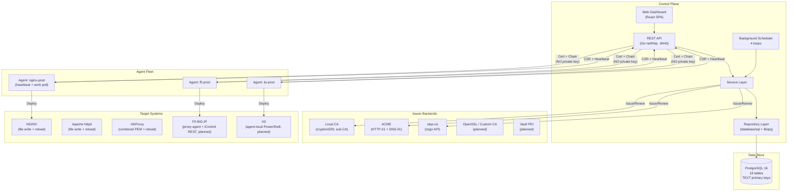

### Control Plane (Server)

The control plane is a Go HTTP server backed by PostgreSQL. It manages state (certificates, agents, targets, issuers, policies), orchestrates issuance by coordinating with CAs through issuer connectors, tracks jobs for certificate issuance/renewal/deployment workflows, maintains an immutable audit trail, and dispatches work via a background scheduler.

The server exposes a REST API under `/api/v1/` and optionally serves the web dashboard as static files from the `web/` directory.

**Key internals**: The server uses Go 1.22's `net/http` stdlib routing (no external router framework), structured logging via `slog`, and a handler → service → repository layered architecture. Handlers define their own service interfaces for clean dependency inversion.

### Agents

Lightweight Go processes that run on or near your infrastructure. Agents generate ECDSA P-256 private keys locally, create CSRs, and submit them to the control plane for signing — private keys never leave agent infrastructure. Agents also handle certificate deployment to target systems (NGINX, Apache httpd, HAProxy fully implemented; F5 BIG-IP, IIS interface only with V2 implementations planned) and report job status. They communicate with the control plane via HTTP and authenticate with API keys.

The agent runs two background loops: a heartbeat (every 60 seconds) to signal it's alive, and a work poll (every 30 seconds) to check for actionable jobs via `GET /api/v1/agents/{id}/work`. Jobs may be `AwaitingCSR` (agent needs to generate key + submit CSR) or `Deployment` (agent needs to deploy a certificate). Private keys are stored in `CERTCTL_KEY_DIR` (default `/var/lib/certctl/keys`) with 0600 permissions.

**Agent metadata (M10):** Agents report OS, architecture, IP address, hostname, and version via heartbeat using `runtime.GOOS`, `runtime.GOARCH`, and `net` stdlib. This metadata is stored on the `agents` table and displayed in the GUI (agent list shows OS/Arch column, detail page shows full system info).

**Agent groups (M11b):** Dynamic device grouping allows organizing agents by metadata criteria. Agent groups can match by OS, architecture, IP CIDR, and version. Groups support both dynamic matching (agents automatically join when criteria match) and manual membership (explicit include/exclude). Renewal policies can be scoped to agent groups via the `agent_group_id` foreign key. The GUI provides full CRUD management for agent groups with visual match criteria badges.

### Web Dashboard

The web dashboard is the primary operational interface for certctl. It is built with Vite + React + TypeScript and uses TanStack Query for server state management (caching, background refetching, optimistic updates).

**Current views (16 pages)**: certificate inventory (list with "New Certificate" creation modal + detail with version history, deploy, archive, and trigger renewal actions), agent fleet (list + detail with system info), job queue (status, retry, cancel, approve/reject), notification inbox (threshold alert grouping, mark-as-read), audit trail (time range and actor/action filters), policy management (rules with enable/disable toggle + delete + violations), issuers (list with test connection + delete), targets (list with delete), owners (list with team resolution + delete), teams (list with delete), agent groups (list with dynamic match criteria badges + enable/disable + delete), certificate profiles (list with crypto constraints), summary dashboard, and login page.

The dashboard includes an **ErrorBoundary component** for graceful error recovery — if a view crashes, the boundary catches the error and displays a user-friendly message instead of breaking the entire dashboard. It also includes a **demo mode** that activates when the API is unreachable — it renders realistic mock data for screenshots and offline presentations.

**Tech decisions**:
- Vite for fast builds and HMR during development
- TanStack Query over manual fetch/useEffect for automatic cache invalidation and refetching
- Dark theme default (ops teams live in dark mode)
- SSE/WebSocket planned for real-time job status updates

### PostgreSQL Database

All state is stored in PostgreSQL 16. The schema uses TEXT primary keys (not UUIDs) with human-readable prefixed IDs like `mc-api-prod`, `t-platform`, `o-alice`.

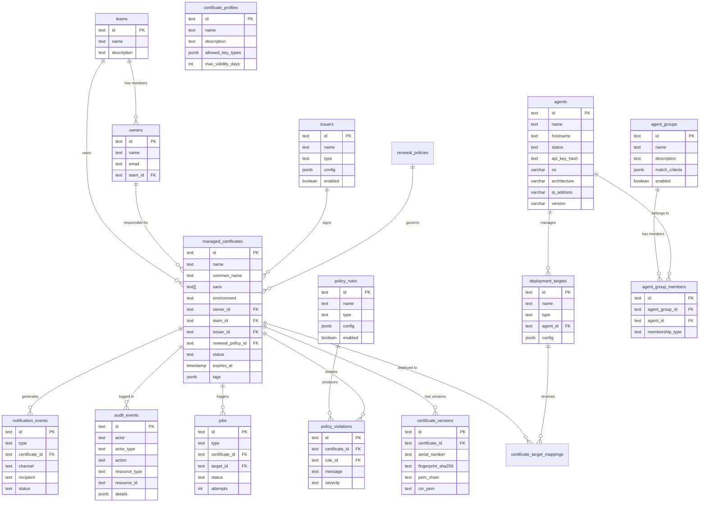

Migrations are idempotent (`IF NOT EXISTS` on all CREATE statements, `ON CONFLICT (id) DO NOTHING` on all seed data) so they're safe to run multiple times — important for Docker Compose where both initdb and the server may run the same SQL.

## Data Flow: Certificate Lifecycle

### 1. Create Managed Certificate

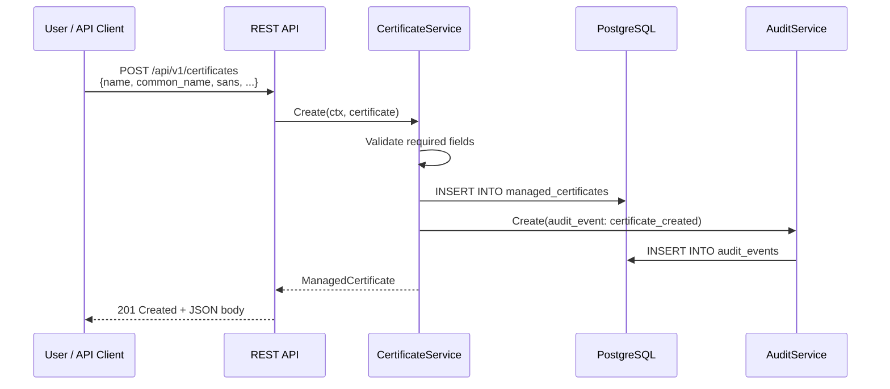

### 2. Certificate Issuance

#### Agent-Side Key Generation (Default)

In the default `agent` keygen mode (`CERTCTL_KEYGEN_MODE=agent`), the control plane never touches private keys. When a renewal or issuance job is created, it enters `AwaitingCSR` state. The agent picks it up, generates an ECDSA P-256 key pair locally, and submits only the CSR (public key).

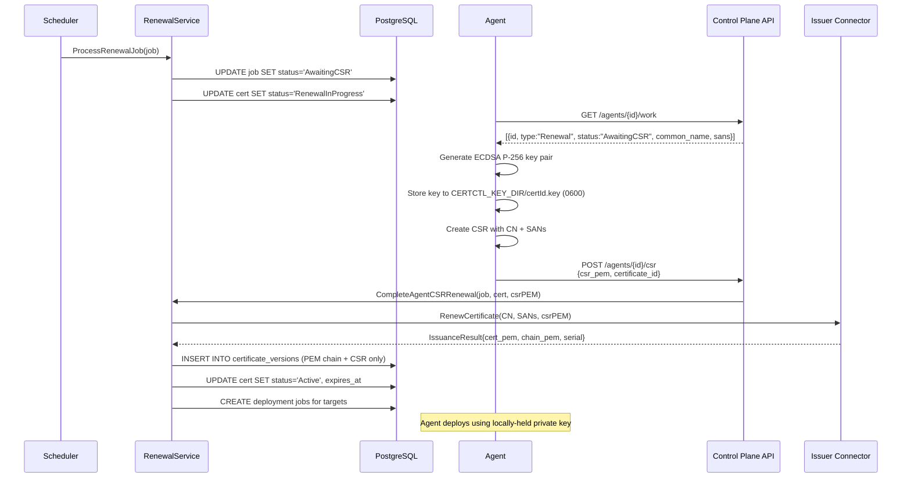

#### Server-Side Key Generation (Demo Only)

Set `CERTCTL_KEYGEN_MODE=server` for development/demo with Local CA. The control plane generates RSA-2048 keys server-side. A log warning is emitted at startup.

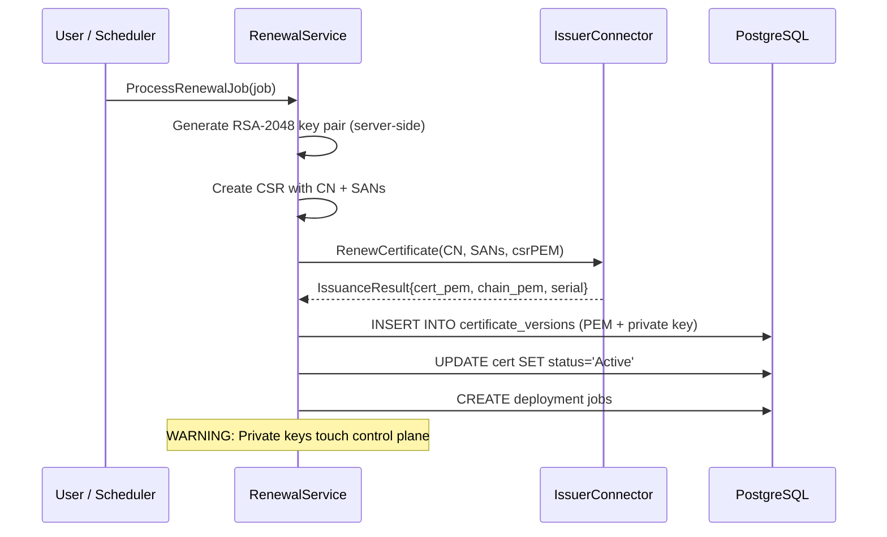

### 3. Deploy Certificate to Target

The agent deploys certificates using target connectors. Each connector knows how to push certificates to a specific system:

- **NGINX**: Writes cert/chain/key files to disk, validates config with `nginx -t`, reloads with `nginx -s reload` or `systemctl reload nginx`
- **Apache httpd**: Writes separate cert/chain/key files, validates with `apachectl configtest`, graceful reload
- **HAProxy**: Builds a combined PEM file (cert + chain + key), optionally validates config, reloads via systemctl or signal
- **F5 BIG-IP** (planned): A proxy agent in the same network zone calls the iControl REST API to upload certificate and update SSL profile bindings. The server assigns the work; the proxy agent executes it.
- **IIS** (planned, dual-mode): (1) Agent-local (recommended) — a Windows agent on the IIS box runs PowerShell `Import-PfxCertificate` + `Set-WebBinding` directly. (2) Proxy agent WinRM — for agentless IIS targets, a nearby Windows agent reaches the IIS box via WinRM.

The agent handles both the certificate (public) and the private key (read from local key store at `CERTCTL_KEY_DIR`). The control plane never sees the private key and never initiates outbound connections to agents or targets (pull-only model).

### 4. Automatic Renewal

The control plane runs a scheduler with four background loops:

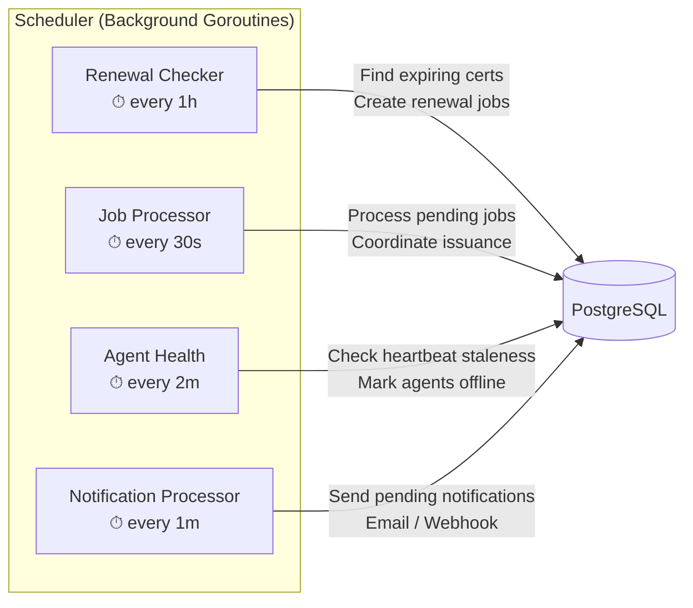

| Loop | Interval | Timeout | Purpose |
|------|----------|---------|---------|
| Renewal checker | 1 hour | 5 minutes | Finds certificates approaching expiry, creates renewal jobs |
| Job processor | 30 seconds | 2 minutes | Processes pending jobs (issuance, renewal, deployment) |
| Agent health check | 2 minutes | 1 minute | Marks agents as offline if heartbeat is stale |
| Notification processor | 1 minute | 1 minute | Sends pending notifications via configured channels |

Each operation has a context timeout to prevent indefinite hangs if external services become unresponsive.

When the renewal checker finds a certificate within its renewal window, it performs two tasks: threshold-based alerting and renewal job creation.

**Threshold-Based Expiration Alerting**: Each renewal policy defines configurable alert thresholds (default: 30, 14, 7, 0 days before expiry). For each certificate approaching expiry, the scheduler checks which thresholds have been crossed and sends deduplicated notifications. A certificate that crosses the 14-day threshold only gets one 14-day alert, even though the renewal checker runs every hour. Deduplication is tracked via threshold tags embedded in the notification message and queried with the `MessageLike` filter. Certificates are also transitioned to `Expiring` status when they enter the alert window and `Expired` when they hit 0 days.

**Renewal Job Creation**: If the certificate's issuer has a registered connector, the scheduler creates a renewal job. The job processor picks it up, coordinates with the issuer, and triggers deployment. All steps are logged in the audit trail and generate notifications.

## Connector Architecture

Certctl uses connector interfaces for extensibility. Each connector type has a standard interface that implementations must satisfy.

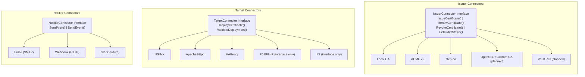

### IssuerConnectorAdapter (Dependency Inversion)

The service layer defines its own `IssuerConnector` interface (`internal/service/renewal.go`) while the connector layer has its own `issuer.Connector` interface (`internal/connector/issuer/interface.go`). The `IssuerConnectorAdapter` (`internal/service/issuer_adapter.go`) bridges the two, translating between their request/response types. This maintains clean dependency inversion — the service package never imports the connector package directly.

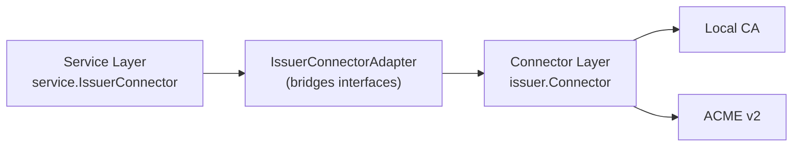

Registration happens in `cmd/server/main.go`:
```go
localCA := local.New(nil, logger)
issuerRegistry := map[string]service.IssuerConnector{
    "iss-local": service.NewIssuerConnectorAdapter(localCA),
}
```

### Issuer Connector

Handles certificate issuance from CAs.

```go
type Connector interface {
    ValidateConfig(ctx context.Context, config json.RawMessage) error
    IssueCertificate(ctx context.Context, request IssuanceRequest) (*IssuanceResult, error)
    RenewCertificate(ctx context.Context, request RenewalRequest) (*IssuanceResult, error)
    RevokeCertificate(ctx context.Context, request RevocationRequest) error
    GetOrderStatus(ctx context.Context, orderID string) (*OrderStatus, error)
}
```

Built-in issuers: **Local CA** (self-signed or sub-CA mode using `crypto/x509`), **ACME v2** (HTTP-01 and DNS-01 challenges, compatible with Let's Encrypt, Sectigo, and any ACME-compliant CA), and **step-ca** (Smallstep private CA via native /sign API with JWK provisioner auth). The ACME connector uses `golang.org/x/crypto/acme`, generates an ECDSA P-256 account key, handles account registration with ToS acceptance, order creation, challenge solving (HTTP-01 via built-in server, DNS-01 via script-based hooks), order finalization, and DER-to-PEM chain conversion.

### Target Connector

Deploys certificates to infrastructure. The `DeploymentRequest` includes `KeyPEM` because agents generate and hold private keys locally — the key is passed from the agent's local key store into the target connector, never from the control plane.

```go
type Connector interface {
    ValidateConfig(ctx context.Context, config json.RawMessage) error
    DeployCertificate(ctx context.Context, request DeploymentRequest) (*DeploymentResult, error)
    ValidateDeployment(ctx context.Context, request ValidationRequest) (*ValidationResult, error)
}
```

The `DeploymentRequest` struct carries the full material needed by the target system: the signed certificate, the CA chain, the agent-generated private key, target-specific configuration, and arbitrary metadata. The key field is populated by the agent from its local key store (`CERTCTL_KEY_DIR`) — it never originates from the control plane.

Built-in targets: **NGINX** (writes cert/chain/key files, validates with `nginx -t`, reloads), **Apache httpd** (writes cert/chain/key files, validates with `apachectl configtest`, graceful reload), **HAProxy** (combined PEM file with cert+chain+key, validates config, reloads via systemctl/signal), **F5 BIG-IP** (interface only — proxy agent + iControl REST, planned V2), **IIS** (interface only — dual-mode: agent-local PowerShell primary + proxy agent WinRM for agentless targets, planned V2).

**Planned (V3):** Kubernetes cert-manager external issuer, Kubernetes Secrets, AWS ALB/CloudFront, AWS IAM Roles Anywhere, Azure Key Vault, Azure Managed Identity, Palo Alto, FortiGate, Citrix ADC.

### Notifier Connector

Sends alerts about certificate lifecycle events.

```go
type Connector interface {
    ValidateConfig(ctx context.Context, config json.RawMessage) error
    SendAlert(ctx context.Context, alert Alert) error
    SendEvent(ctx context.Context, event Event) error
}
```

Built-in notifiers: **Email** (SMTP) and **Webhook** (HTTP POST).

See the [Connector Development Guide](connectors.md) for details on building custom connectors.

## Security Model

### Private Key Management

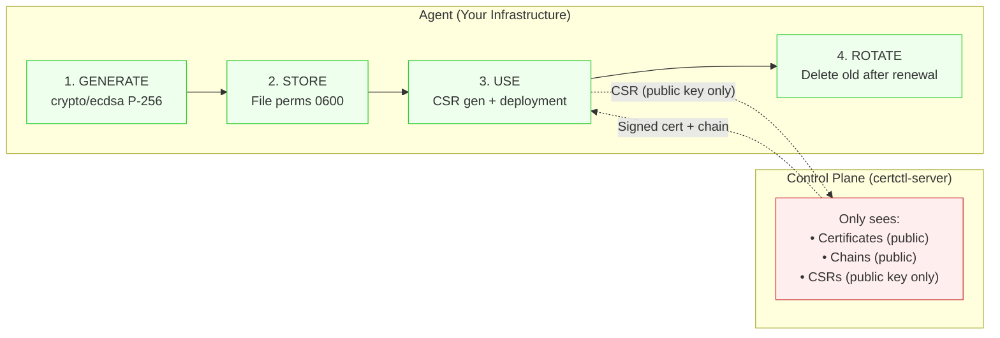

**Agent keygen mode (default, `CERTCTL_KEYGEN_MODE=agent`):** Private keys follow a strict lifecycle on agents:

1. **Generated on the agent** — ECDSA P-256, never sent to the control plane
2. **Stored on the agent** — `CERTCTL_KEY_DIR` with file permissions 0600
3. **Used by the agent** — for deployment to targets (via `DeploymentRequest.KeyPEM`)
4. **Rotated by the agent** — old keys overwritten after successful renewal

The control plane only handles public material: certificates, chains, and CSRs.

**Server keygen mode (`CERTCTL_KEYGEN_MODE=server`, demo only):** The control plane generates RSA-2048 keys server-side within `processRenewalServerKeygen`. Private keys are stored in `certificate_versions.csr_pem`. A log warning is emitted at startup. Use only for Local CA development/demo.

### Authentication

- **API clients → Server**: API key in `Authorization: Bearer` header, or `none` for demo mode
- **Agent → Server**: API key registered at agent creation, included in all requests
- **Server → Issuers**: ACME account key, or connector-specific credentials
- **Agent → Targets**: API tokens, WinRM credentials (stored locally on agent or proxy agent — never on server). Credential scope is limited to the agent's network zone.

### Audit Trail

Every action is recorded as an immutable audit event:

```json
{
  "id": "audit-001",
  "actor": "o-alice",
  "actor_type": "User",
  "action": "certificate_created",
  "resource_type": "certificate",
  "resource_id": "mc-api-prod",
  "details": {"environment": "production"},
  "timestamp": "2026-03-14T10:30:00Z"
}
```

Audit events cannot be modified or deleted. They support filtering by actor, action, resource type, resource ID, and time range. All audit operations are logged via structured `slog` logging; if an audit event fails to persist, the error is logged immediately to ensure no gaps in the audit trail go unnoticed.

### Logging

All logging throughout the service layer uses Go's `log/slog` package for structured, queryable logs. This replaces ad-hoc `fmt.Printf` statements with consistent key-value logging that includes request context, operation names, and error details. Agents also implement exponential backoff on network failures to gracefully handle temporary connectivity issues with the control plane.

## API Design

All endpoints are under `/api/v1/` and follow consistent patterns:

- **List**: `GET /api/v1/{resources}` — returns `{data: [...], total, page, per_page}`
- **Get**: `GET /api/v1/{resources}/{id}` — returns the resource
- **Create**: `POST /api/v1/{resources}` — returns the created resource with `201`
- **Update**: `PUT /api/v1/{resources}/{id}` — returns the updated resource
- **Delete**: `DELETE /api/v1/{resources}/{id}` — returns `204` (soft delete/archive)
- **Actions**: `POST /api/v1/{resources}/{id}/{action}` — returns `202` for async operations

Resources: certificates, issuers, targets, agents, jobs, policies, profiles, teams, owners, agent-groups, audit, notifications.

Jobs support additional action endpoints: `POST /api/v1/jobs/{id}/cancel`, `POST /api/v1/jobs/{id}/approve`, `POST /api/v1/jobs/{id}/reject`.

Certificate revocation: `POST /api/v1/certificates/{id}/revoke` with optional `{"reason": "keyCompromise"}`. Supports RFC 5280 reason codes (unspecified, keyCompromise, caCompromise, affiliationChanged, superseded, cessationOfOperation, certificateHold, privilegeWithdrawn). Returns the updated certificate status. Best-effort issuer notification — the revocation succeeds even if the issuer connector is unavailable. A JSON-formatted CRL is available at `GET /api/v1/crl` (DER-encoded X.509 CRL planned for M15b).

Health checks live outside the API prefix: `GET /health` and `GET /ready`.

## Deployment Topologies

### Docker Compose (Development / Small Deployments)

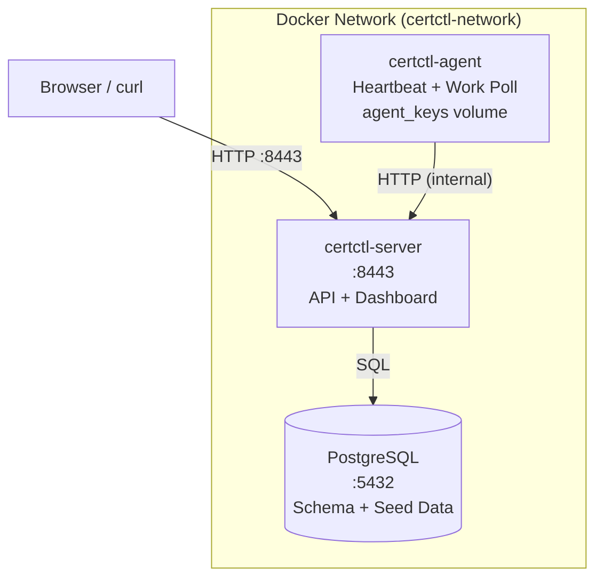

**Credentials & Configuration:**
Database and API credentials are managed via environment variables defined in a `.env` file. Copy `deploy/.env.example` to `deploy/.env` for local development and customize credentials for production. The agent key directory (`CERTCTL_KEY_DIR`) is persisted as a named Docker volume (`agent_keys`) at `/var/lib/certctl/keys` for reliable key storage across container restarts.

### Production (Kubernetes)

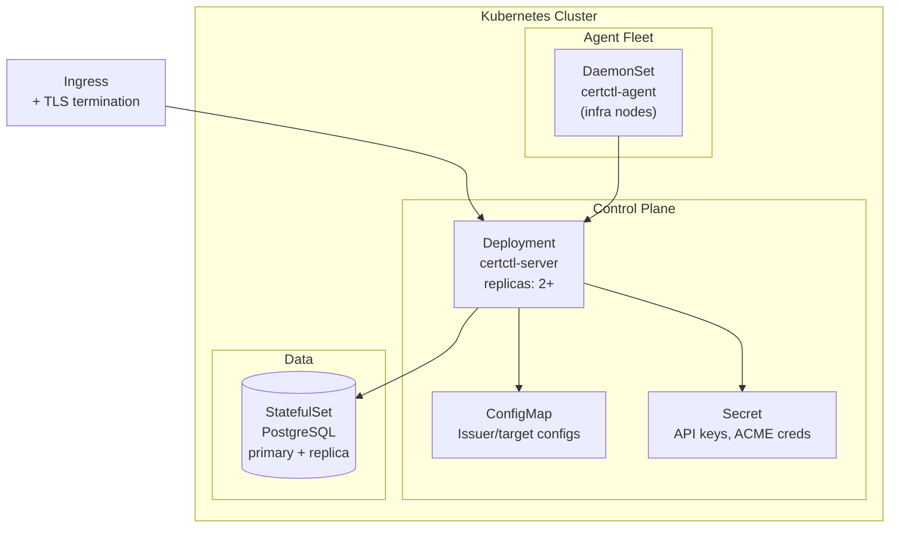

For production, you would also add an ingress controller, TLS termination for the certctl API itself, and external PostgreSQL (RDS, Cloud SQL, etc.).

## Testing Strategy

certctl uses a layered testing approach aligned with the handler → service → repository architecture, with 600+ tests across five layers (service, handler, integration, connector, and frontend). The goal is high-confidence regression prevention at the service and handler layers, where the most complex business logic lives, combined with integration tests that exercise the full request path from HTTP to database.

**Service layer unit tests** (`internal/service/*_test.go`) — 207 test functions across 15 files with mock repositories. These test all business logic in isolation: certificate CRUD with validation, certificate revocation (success, already-revoked, archived, invalid reason, all RFC 5280 reason codes, issuer notification, notification service integration), agent lifecycle (registration, heartbeat, CSR submission with both keygen modes), job state machine (creation, processing, cancellation, retry logic), policy evaluation (all 5 rule types, violation creation), renewal and issuance flow (server-side and agent-side keygen paths), notification deduplication (threshold tag matching, channel routing), team/owner/agent group CRUD with pagination and audit recording, issuer service CRUD with connection testing, and the issuer connector adapter (type translation between connector and service layers including revocation). Mock repositories are simple structs with function fields, avoiding heavy mocking frameworks — this keeps tests readable and avoids coupling to mock library APIs.

**Handler layer tests** (`internal/api/handler/*_test.go`) — 226 test functions across 11 files using Go's `httptest` package. Every handler file has a corresponding test file: certificates (36 tests including revocation and CRL), agents (28 tests), jobs (21 tests including approve/reject), notifications (11 tests), policies (19 tests), profiles (18 tests), issuers (17 tests), targets (17 tests), agent groups (12 tests), teams (26 tests), and owners (21 tests). Each test file follows the same pattern: a mock service struct with function fields, `httptest.NewRecorder` for capturing responses, and a shared `contextWithRequestID()` helper. Tests cover the happy path, input validation (missing fields, invalid JSON, empty IDs, name length limits), error propagation from the service layer, method-not-allowed responses, and pagination parameters.

**Integration tests** (`internal/integration/`) — Two test files exercising the full stack from HTTP request through router, handler, service, and postgres repository layers. `lifecycle_test.go` has 11 subtests covering the complete certificate lifecycle: team/owner creation, certificate creation, issuer verification, renewal trigger, job verification, agent registration, CSR submission, deployment, and status reporting. `negative_test.go` has 14 subtests covering error paths, 19 M11b endpoint tests, and 4 revocation endpoint tests: nonexistent resource lookups (404s), invalid request bodies (malformed JSON, missing required fields), invalid CSR submission, heartbeat for nonexistent agents, wrong HTTP methods on list endpoints, empty list responses, renewal on nonexistent certificates, expired certificate lifecycle, team/owner/agent group CRUD validation, revocation success, already-revoked rejection, not-found revocation, and CRL retrieval. Both use a shared `setupTestServer()` that builds a fully-wired server with real postgres repositories and the Local CA issuer connector.

**Frontend tests** (`web/src/api/client.test.ts`, `web/src/api/utils.test.ts`) — 53 Vitest tests covering the API client and utility functions. The API client tests mock `globalThis.fetch` and verify all endpoint functions (certificates, agents, jobs, policies, issuers, targets, notifications, audit, health) send correct HTTP methods, URLs, headers, and request bodies. They also test API key management (store/retrieve/clear), auth header propagation, 401 event dispatching, and error handling (server messages, error fields, status text fallback). The utility tests use `vi.useFakeTimers()` for deterministic date testing and cover `formatDate`, `formatDateTime`, `timeAgo`, `daysUntil`, and `expiryColor`. The test environment uses jsdom with `@testing-library/jest-dom` matchers.

**CI pipeline** (`.github/workflows/ci.yml`) — Two parallel jobs: Go (build, vet, test with coverage, coverage threshold enforcement) and Frontend (TypeScript type check, Vitest test suite, Vite production build). The Go job runs all tests with `-coverprofile`, then enforces coverage thresholds: service layer must be at least 30% (current: ~35%) and handler layer must be at least 50% (current: ~63%). These thresholds act as regression floors — they can only go up. The service layer threshold is deliberately lower because much of the service code depends on postgres repositories and external connectors that require real infrastructure to test meaningfully. Connector tests are included via `./internal/connector/issuer/...` and `./internal/connector/target/...` (covers Local CA, ACME, step-ca, NGINX, Apache, and HAProxy packages with unit tests for certificate signing logic, DNS solver, issuer validation, and deployment flows). The Frontend job runs `npx vitest run` between the TypeScript check and production build steps.

**Connector tests** (`internal/connector/`) — 23 test functions covering issuer and target connectors. The Local CA connector has tests for self-signed and sub-CA modes (RSA, ECDSA, config validation, non-CA cert rejection). The ACME DNS solver has 6 tests for script-based DNS-01 challenges. The step-ca connector has tests with a mock HTTP server for issuance, renewal, revocation, and error paths. The NGINX target connector has 13 tests covering config validation, certificate deployment (file writing, permissions, validate/reload commands), and deployment validation. Apache httpd and HAProxy connectors each have 3 tests covering config validation, deployment, and validation flows.

**What's not tested and why:** Postgres repository implementations (`internal/repository/postgres/`) require a real database and are tested only through integration tests, not unit tests. Target connectors for F5 BIG-IP and IIS are interface stubs (implementation planned for a future release). Scheduler loops are time-dependent and tested manually during development. The ACME connector requires a real ACME server (tested manually against Let's Encrypt staging). These are all candidates for future expansion as the test infrastructure matures.

## What's Next

- [Quick Start](quickstart.md) — Get certctl running locally
- [Advanced Demo](demo-advanced.md) — Issue a certificate end-to-end
- [Connector Guide](connectors.md) — Build custom connectors
