# Architecture Guide

## Contents

1. [Overview](#overview)
2. [System Components](#system-components)
   - [Control Plane (Server)](#control-plane-server)
   - [Agents](#agents)
   - [Web Dashboard](#web-dashboard)
   - [PostgreSQL Database](#postgresql-database)
3. [Data Flow: Certificate Lifecycle](#data-flow-certificate-lifecycle)
   - [Create Managed Certificate](#1-create-managed-certificate)
   - [Certificate Issuance](#2-certificate-issuance)
   - [Deploy Certificate to Target](#3-deploy-certificate-to-target)
   - [Revoke a Certificate](#35-revoke-a-certificate)
   - [Automatic Renewal](#4-automatic-renewal)
4. [Connector Architecture](#connector-architecture)
   - [IssuerConnectorAdapter (Dependency Inversion)](#issuerconnectoradapter-dependency-inversion)
   - [Issuer Connector](#issuer-connector)
   - [Target Connector](#target-connector)
   - [Notifier Connector](#notifier-connector)
   - [EST Server (RFC 7030)](#est-server-rfc-7030)
5. [Security Model](#security-model)
   - [Private Key Management](#private-key-management)
   - [Authentication](#authentication)
   - [Audit Trail](#audit-trail)
   - [API Audit Log](#api-audit-log)
   - [Logging](#logging)
6. [API Design](#api-design)
7. [MCP Server](#mcp-server)
8. [CLI Tool](#cli-tool)
9. [Deployment Topologies](#deployment-topologies)
   - [Docker Compose (Development / Small Deployments)](#docker-compose-development--small-deployments)
   - [Production (Kubernetes)](#production-kubernetes)
10. [Discovery Data Flow (M18b + M21)](#discovery-data-flow-m18b--m21)
11. [Testing Strategy](#testing-strategy)
12. [What's Next](#whats-next)

## Overview

Certctl is a certificate management platform with a **decoupled control-plane and agent architecture**. The control plane orchestrates certificate issuance and renewal, while agents deployed across your infrastructure handle key generation, certificate deployment, and local validation — private keys never leave the infrastructure they were generated on.

New to certificates? Read the [Concepts Guide](concepts.md) first.

### Design Principles

1. **Private Key Isolation** — Agents generate ECDSA P-256 keys locally and submit CSRs only. Private keys never touch the control plane. Server-side keygen available via `CERTCTL_KEYGEN_MODE=server` for demo only.
2. **Pull-Only Deployment** — The server never initiates outbound connections to agents or targets. Agents poll for work and receive only jobs assigned to their targets (routed via `agent_id` on jobs or through target→agent relationships). For network appliances and agentless targets, a proxy agent in the same network zone executes deployments via the target's API. This keeps the control plane firewalled off and limits credential scope to the proxy agent's zone.
3. **Sub-CA Capable** — The Local CA can operate as a subordinate CA under an enterprise root (e.g., ADCS). Load a pre-signed CA cert+key from disk and all issued certs chain to the enterprise trust hierarchy. Self-signed mode remains the default for development/demos.
4. **GUI as Primary Interface** — The web dashboard is the operational control plane, not a secondary viewer. Every backend feature ships with its corresponding GUI surface.
5. **Decoupled Operations** — Agents operate autonomously; the control plane coordinates but doesn't block agent function
6. **Audit-First** — Complete traceability of all issuance, deployment, and rotation events
7. **Connector Architecture** — Pluggable issuers, targets, and notifiers for extensibility
8. **Self-Hosted** — No cloud lock-in; run with Docker Compose, Kubernetes, or bare metal

## System Components

```mermaid
flowchart TB
    subgraph "Control Plane"
        API["REST API\n(Go net/http, :8443)"]
        SVC["Service Layer"]
        REPO["Repository Layer\n(database/sql + lib/pq)"]
        SCHED["Background Scheduler\n7 loops"]
        DASH["Web Dashboard\n(React SPA)"]
    end

    subgraph "Data Store"
        PG[("PostgreSQL 16\n21 tables\nTEXT primary keys")]
    end

    subgraph "Agent Fleet"
        A1["Agent: nginx-prod\n(heartbeat + work poll)"]
        A2["Agent: f5-prod"]
        A3["Agent: iis-prod"]
    end

    subgraph "Issuer Backends"
        CA1["Local CA\n(crypto/x509, sub-CA)"]
        CA2["ACME\n(HTTP-01 + DNS-01 + DNS-PERSIST-01)\n(EAB, ZeroSSL auto-EAB)"]
        CA3["step-ca\n(/sign API)"]
        CA4["OpenSSL / Custom CA\n(script-based)"]
        CA6["Vault PKI\n(token auth, /sign API)"]
        CA7["DigiCert CertCentral\n(async order model)"]
        CA8["Sectigo SCM\n(async order model)"]
        CA9["Google CAS\n(OAuth2, sync)"]
        CA10["AWS ACM PCA\n(sync issuance)"]
    end

    subgraph "Target Systems"
        T1["NGINX\n(file write + reload)"]
        T4["Apache httpd\n(file write + reload)"]
        T5["HAProxy\n(combined PEM + reload)"]
        T6["Traefik\n(file provider)"]
        T7["Caddy\n(admin API / file)"]
        T8["Envoy\n(file-based SDS)"]
        T9["Postfix/Dovecot\n(file + service reload)"]
        T2["F5 BIG-IP\n(proxy agent + iControl REST)"]
        T3["IIS\n(WinRM + local)"]
        T10["SSH\n(SFTP + reload)"]
        T11["WinCertStore\n(PowerShell import)"]
        T12["Java Keystore\n(keytool pipeline)"]
        T13["Kubernetes Secrets\n(K8s API)"]
    end

    DASH --> API
    API --> SVC
    SVC --> REPO
    REPO --> PG
    SCHED --> SVC
    SVC -->|"Issue/Renew"| CA1 & CA2 & CA3 & CA4 & CA6 & CA7 & CA8 & CA9 & CA10

    A1 & A2 & A3 -->|"CSR + Heartbeat"| API
    API -->|"Cert + Chain\n(NO private key)"| A1 & A2 & A3

    A1 -->|"Deploy"| T1
    A2 -->|"Deploy"| T2
    A3 -->|"Deploy"| T3
```

### Control Plane (Server)

The control plane is a Go HTTP server backed by PostgreSQL. It manages state (certificates, agents, targets, issuers, policies), orchestrates issuance by coordinating with CAs through issuer connectors, tracks jobs for certificate issuance/renewal/deployment workflows, maintains an immutable audit trail, and dispatches work via a background scheduler.

The server exposes a REST API under `/api/v1/` and optionally serves the web dashboard as static files from the `web/` directory.

**Key internals**: The server uses Go 1.25's `net/http` stdlib routing (no external router framework), structured logging via `slog`, and a handler → service → repository layered architecture. Handlers define their own service interfaces for clean dependency inversion.

### Agents

Lightweight Go processes that run on or near your infrastructure. Agents generate ECDSA P-256 private keys locally, create CSRs, and submit them to the control plane for signing — private keys never leave agent infrastructure. Agents also handle certificate deployment to target systems (NGINX, Apache httpd, HAProxy, Traefik, Caddy, Envoy, Postfix, Dovecot, IIS, F5 BIG-IP, SSH, Windows Certificate Store, Java Keystore, Kubernetes Secrets) and report job status. They communicate with the control plane via HTTP and authenticate with API keys.

The agent runs two background loops: a heartbeat (every 60 seconds) to signal it's alive, and a work poll (every 30 seconds) to check for actionable jobs via `GET /api/v1/agents/{id}/work`. Jobs may be `AwaitingCSR` (agent needs to generate key + submit CSR) or `Deployment` (agent needs to deploy a certificate). Private keys are stored in `CERTCTL_KEY_DIR` (default `/var/lib/certctl/keys`) with 0600 permissions.

**Agent metadata (M10):** Agents report OS, architecture, IP address, hostname, and version via heartbeat using `runtime.GOOS`, `runtime.GOARCH`, and `net` stdlib. This metadata is stored on the `agents` table and displayed in the GUI (agent list shows OS/Arch column, detail page shows full system info).

**Agent groups (M11b):** Dynamic device grouping allows organizing agents by metadata criteria. Agent groups can match by OS, architecture, IP CIDR, and version. Groups support both dynamic matching (agents automatically join when criteria match) and manual membership (explicit include/exclude). Renewal policies can be scoped to agent groups via the `agent_group_id` foreign key. The GUI provides full CRUD management for agent groups with visual match criteria badges.

### Web Dashboard

The web dashboard is the primary operational interface for certctl. It is built with Vite + React + TypeScript and uses TanStack Query for server state management (caching, background refetching, optimistic updates).

**Current views** (24 pages): certificate inventory (list with multi-select bulk operations + "New Certificate" creation modal + detail with deployment status timeline, inline policy/profile editor, version history, deploy, revoke, archive, and trigger renewal actions), agent fleet (list + detail with system info + OS/architecture grouping with charts), job queue (list + detail with verification section, timeline, audit events; approve/reject for AwaitingApproval jobs), notification inbox (threshold alert grouping, mark-as-read), audit trail (time range, actor, action filters + CSV/JSON export), policy management (rules with enable/disable toggle + delete + violations), issuers (catalog with 10 type cards + 3-step create wizard + detail with test connection), targets (list with 3-step configuration wizard + detail with deployment history), owners (list with team resolution + delete), teams (list with delete), agent groups (list with dynamic match criteria badges + enable/disable + delete), certificate profiles (list with crypto constraints), short-lived credentials dashboard (TTL countdown, profile filtering, auto-refresh), discovered certificates triage (claim/dismiss unmanaged certs discovered by agents or network scans), network scan targets management (CRUD + Scan Now button), summary dashboard with charts (expiration heatmap, renewal success rate, status distribution, issuance rate), digest preview and send, observability (health, metrics, Prometheus config), and login page.

The dashboard includes an **ErrorBoundary component** for graceful error recovery — if a view crashes, the boundary catches the error and displays a user-friendly message instead of breaking the entire dashboard. It also includes a **demo mode** that activates when the API is unreachable — it renders realistic mock data for screenshots and offline presentations.

**Tech decisions**:
- Vite for fast builds and HMR during development
- TanStack Query over manual fetch/useEffect for automatic cache invalidation and refetching
- Light content area with branded dark teal sidebar, Inter + JetBrains Mono typography
- SSE/WebSocket planned for real-time job status updates

### PostgreSQL Database

All state is stored in PostgreSQL 16. The schema uses TEXT primary keys (not UUIDs) with human-readable prefixed IDs like `mc-api-prod`, `t-platform`, `o-alice`.

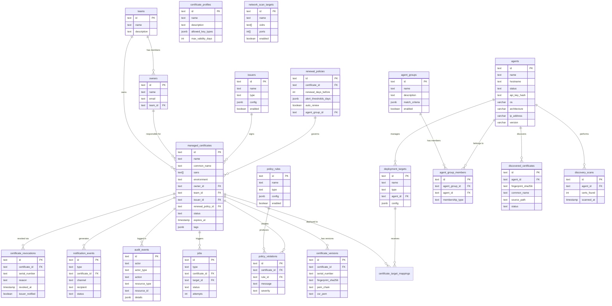

Migrations are idempotent (`IF NOT EXISTS` on all CREATE statements, `ON CONFLICT (id) DO NOTHING` on all seed data) so they're safe to run multiple times — important for Docker Compose where both initdb and the server may run the same SQL.

## Data Flow: Certificate Lifecycle

### 1. Create Managed Certificate

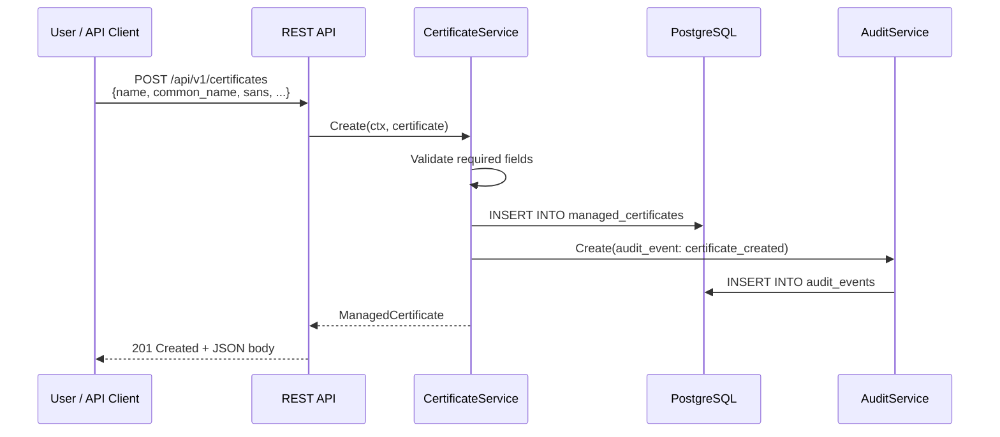

### 2. Certificate Issuance

#### Agent-Side Key Generation (Default)

In the default `agent` keygen mode (`CERTCTL_KEYGEN_MODE=agent`), the control plane never touches private keys. When a renewal or issuance job is created, it enters `AwaitingCSR` state. The agent picks it up, generates an ECDSA P-256 key pair locally, and submits only the CSR (public key).

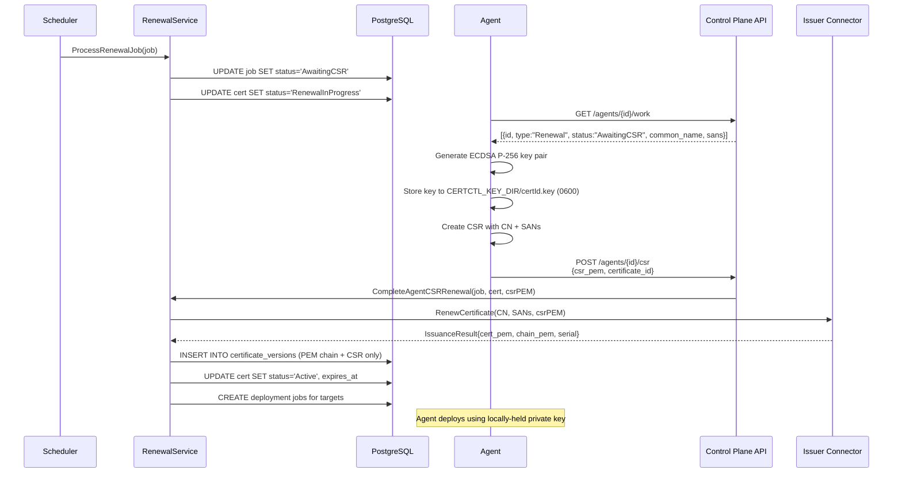

**Profile enforcement:** If the certificate is assigned to a profile (`certificate_profile_id`), the profile's `allowed_key_algorithms` and `max_validity_days` constraints are checked during CSR validation. A CSR with a disallowed key type or a validity period exceeding the profile maximum is rejected before reaching the issuer connector.

#### Server-Side Key Generation (Demo Only)

Set `CERTCTL_KEYGEN_MODE=server` for development/demo with Local CA. The control plane generates RSA-2048 keys server-side. A log warning is emitted at startup.

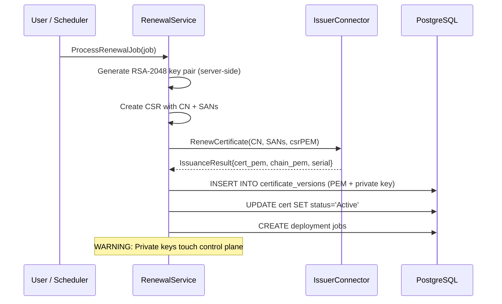

### 3. Deploy Certificate to Target

The agent deploys certificates using target connectors. Each connector knows how to push certificates to a specific system:

- **NGINX**: Writes cert/chain/key files to disk, validates config with `nginx -t`, reloads with `nginx -s reload` or `systemctl reload nginx`
- **Apache httpd**: Writes separate cert/chain/key files, validates with `apachectl configtest`, graceful reload
- **HAProxy**: Builds a combined PEM file (cert + chain + key), optionally validates config, reloads via systemctl or signal
- **F5 BIG-IP**: A proxy agent in the same network zone calls the iControl REST API to upload certificate/key files, install crypto objects, and update the SSL client profile within an atomic transaction. The server assigns the work; the proxy agent executes it.
- **IIS** (implemented, dual-mode): (1) Agent-local (recommended) — a Windows agent on the IIS box runs PowerShell `Import-PfxCertificate` + `Set-WebBinding` directly with PFX conversion and SHA-1 thumbprint computation. (2) Proxy agent WinRM — for agentless IIS targets, a nearby Windows agent reaches the IIS box via WinRM.

The agent handles both the certificate (public) and the private key (read from local key store at `CERTCTL_KEY_DIR`). The control plane never sees the private key and never initiates outbound connections to agents or targets (pull-only model).

### 3.5 Revoke a Certificate

When a certificate needs immediate revocation (key compromise, decommission, etc.), the control plane executes a 7-step process:

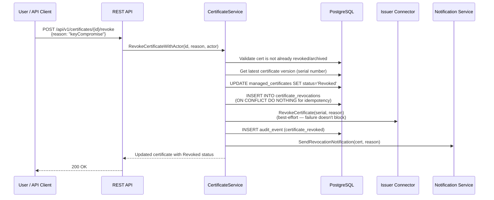

The revocation is recorded in the `certificate_revocations` table (separate from the certificate status update) for CRL generation. The DER-encoded CRL at `GET /api/v1/crl/{issuer_id}` is generated on-demand by querying this table and signing with the issuing CA's key. The OCSP responder at `GET /api/v1/ocsp/{issuer_id}/{serial}` checks both the certificate status and the revocations table to return signed good/revoked/unknown responses.

Short-lived certificates (those with profile TTL < 1 hour) return "good" from OCSP and are excluded from CRL — their rapid expiry is treated as sufficient revocation.

### 4. Automatic Renewal

The control plane runs a scheduler with seven background loops:

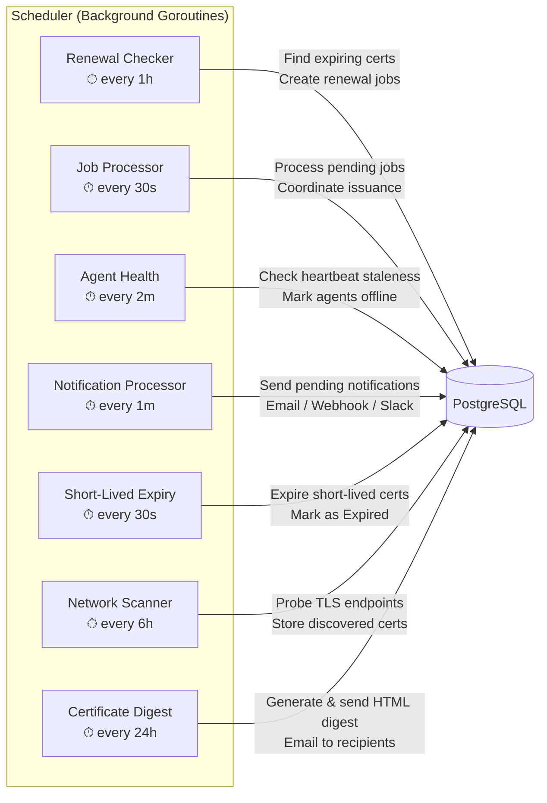

| Loop | Interval | Timeout | Purpose |
|------|----------|---------|---------|
| Renewal checker | 1 hour | 5 minutes | Finds certificates approaching expiry, creates renewal jobs |
| Job processor | 30 seconds | 2 minutes | Processes pending jobs (issuance, renewal, deployment) |
| Agent health check | 2 minutes | 1 minute | Marks agents as offline if heartbeat is stale |
| Notification processor | 1 minute | 1 minute | Sends pending notifications via configured channels |
| Short-lived expiry | 30 seconds | 30 seconds | Marks expired short-lived certificates (profile TTL < 1 hour) |
| Network scanner | 6 hours | 30 minutes | Probes TLS endpoints on configured CIDR ranges, stores discovered certs (M21, opt-in via `CERTCTL_NETWORK_SCAN_ENABLED`). CIDR size validated at API level — max /20 (4096 IPs) per range. |
| Certificate digest | 24 hours | 5 minutes | Generates HTML email with certificate stats, expiration timeline, job health, agent count. Does NOT run on startup — waits for first scheduled tick. Configurable interval and recipients via `CERTCTL_DIGEST_INTERVAL` and `CERTCTL_DIGEST_RECIPIENTS`. Falls back to certificate owner emails if no explicit recipients configured. |

Each loop uses `sync/atomic.Bool` idempotency guards to prevent concurrent tick execution — if a loop iteration is still running when the next tick fires, the tick is skipped with a warning log. All loops (including short-lived expiry check) run immediately on startup before entering their ticker interval, ensuring no gap between scheduler start and first execution. The certificate digest loop is the exception — it does NOT run on startup, only on scheduled ticks. Graceful shutdown uses `sync.WaitGroup` with `WaitForCompletion()` to drain all in-flight work before process exit.

Each operation has a context timeout to prevent indefinite hangs if external services become unresponsive.

When the renewal checker finds a certificate within its renewal window, it performs two tasks: threshold-based alerting and renewal job creation.

**Threshold-Based Expiration Alerting**: Each renewal policy defines configurable alert thresholds (default: 30, 14, 7, 0 days before expiry). For each certificate approaching expiry, the scheduler checks which thresholds have been crossed and sends deduplicated notifications. A certificate that crosses the 14-day threshold only gets one 14-day alert, even though the renewal checker runs every hour. Deduplication is tracked via threshold tags embedded in the notification message and queried with the `MessageLike` filter. Certificates are also transitioned to `Expiring` status when they enter the alert window and `Expired` when they hit 0 days.

**Renewal Job Creation**: If the certificate's issuer has a registered connector, the scheduler creates a renewal job. The job processor picks it up, coordinates with the issuer, and triggers deployment. All steps are logged in the audit trail and generate notifications.

## Connector Architecture

Certctl uses connector interfaces for extensibility. Each connector type has a standard interface that implementations must satisfy.

```mermaid
flowchart TB
    subgraph "Issuer Connectors"
        direction TB
        II["IssuerConnector Interface\nIssueCertificate() | RenewCertificate()\nRevokeCertificate() | GetOrderStatus()"]
        II --> LC["Local CA"]
        II --> ACME["ACME v2"]
        II --> SCA["step-ca"]
        II --> OC["OpenSSL / Custom CA"]
        II --> VP["Vault PKI"]
        II --> DC["DigiCert CertCentral"]
        II --> SG["Sectigo SCM"]
        II --> GC["Google CAS"]
        II --> AP2["AWS ACM PCA"]
    end

    subgraph "Target Connectors"
        direction TB
        TI["TargetConnector Interface\nDeployCertificate()\nValidateDeployment()"]
        TI --> NG["NGINX"]
        TI --> AP["Apache httpd"]
        TI --> HP["HAProxy"]
        TI --> TF["Traefik"]
        TI --> CD["Caddy"]
        TI --> EV["Envoy"]
        TI --> PO["Postfix/Dovecot"]
        TI --> IIS["IIS"]
        TI --> F5["F5 BIG-IP"]
        TI --> SSH["SSH"]
        TI --> WCS["WinCertStore"]
        TI --> JKS["Java Keystore"]
        TI --> K8S["K8s Secrets"]
    end

    subgraph "Notifier Connectors"
        direction TB
        NI["NotifierConnector Interface\nSendAlert() | SendEvent()"]
        NI --> EM["Email (SMTP)"]
        NI --> WH["Webhook (HTTP)"]
        NI --> SL["Slack"]
        NI --> TM["Microsoft Teams"]
        NI --> PD["PagerDuty"]
        NI --> OG["OpsGenie"]
    end
```

### IssuerConnectorAdapter (Dependency Inversion)

The service layer defines its own `IssuerConnector` interface (`internal/service/renewal.go`) while the connector layer has its own `issuer.Connector` interface (`internal/connector/issuer/interface.go`). The `IssuerConnectorAdapter` (`internal/service/issuer_adapter.go`) bridges the two, translating between their request/response types. This maintains clean dependency inversion — the service package never imports the connector package directly.

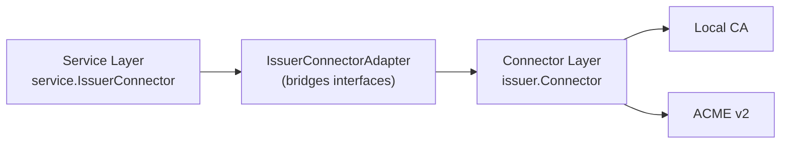

Registration happens in `cmd/server/main.go`:
```go
localCA := local.New(nil, logger)
issuerRegistry := map[string]service.IssuerConnector{
    "iss-local": service.NewIssuerConnectorAdapter(localCA),
}
```

### Issuer Connector

Handles certificate issuance from CAs.

```go
type Connector interface {
    ValidateConfig(ctx context.Context, config json.RawMessage) error
    IssueCertificate(ctx context.Context, request IssuanceRequest) (*IssuanceResult, error)
    RenewCertificate(ctx context.Context, request RenewalRequest) (*IssuanceResult, error)
    RevokeCertificate(ctx context.Context, request RevocationRequest) error
    GetOrderStatus(ctx context.Context, orderID string) (*OrderStatus, error)
    GenerateCRL(ctx context.Context, revokedCerts []RevokedCertEntry) ([]byte, error)
    SignOCSPResponse(ctx context.Context, req OCSPSignRequest) ([]byte, error)
    GetCACertPEM(ctx context.Context) (string, error)
}
```

Built-in issuers (9 connectors): **Local CA** (self-signed or sub-CA mode using `crypto/x509`), **ACME v2** (HTTP-01, DNS-01, and DNS-PERSIST-01 challenges, compatible with Let's Encrypt, ZeroSSL, Sectigo, Google Trust Services, and any ACME-compliant CA), **step-ca** (Smallstep private CA via native /sign API with JWK provisioner auth), **OpenSSL/Custom CA** (script-based signing delegating to user-provided shell scripts), **Vault PKI** (HashiCorp Vault's PKI secrets engine via /sign API with token auth), **DigiCert** (commercial CA via CertCentral REST API with async order processing), **Sectigo SCM** (async order model with 3-header auth), **Google CAS** (Cloud Certificate Authority Service with OAuth2 service account auth), and **AWS ACM Private CA** (synchronous issuance via ACM PCA API). The ACME connector uses `golang.org/x/crypto/acme`, generates an ECDSA P-256 account key, handles account registration with ToS acceptance and optional External Account Binding (EAB) for CAs that require it (ZeroSSL, Google Trust Services, SSL.com), order creation, challenge solving (HTTP-01 via built-in server, DNS-01 via script-based hooks, DNS-PERSIST-01 via standing TXT records with auto-fallback to DNS-01), order finalization, and DER-to-PEM chain conversion. For ZeroSSL, EAB credentials are auto-fetched from ZeroSSL's public API when the directory URL is detected as ZeroSSL and no EAB credentials are provided — zero-friction onboarding with no dashboard visit required.

**ACME Renewal Information (ARI, RFC 9773):** The ACME connector supports CA-directed renewal timing via the `GetRenewalInfo()` method. Instead of using fixed thresholds (e.g., renew 30 days before expiry), the CA tells certctl when to renew by providing a `suggestedWindow` with start and end times. This is useful for distributing renewal load during maintenance windows and coordinating mass-revocation scenarios. Enable with `CERTCTL_ACME_ARI_ENABLED=true`. Cert ID is computed as `base64url(SHA-256(DER cert))` per RFC 9773. If the CA doesn't support ARI (404 from the ARI endpoint), certctl automatically falls back to threshold-based renewal — no operator intervention required. Errors from the CA are logged as warnings.

The interface also includes `GetCACertPEM(ctx)` for CA chain distribution (used by the EST server's `/cacerts` endpoint).

### Target Connector

Deploys certificates to infrastructure. The `DeploymentRequest` includes `KeyPEM` because agents generate and hold private keys locally — the key is passed from the agent's local key store into the target connector, never from the control plane.

```go
type Connector interface {
    ValidateConfig(ctx context.Context, config json.RawMessage) error
    DeployCertificate(ctx context.Context, request DeploymentRequest) (*DeploymentResult, error)
    ValidateDeployment(ctx context.Context, request ValidationRequest) (*ValidationResult, error)
}
```

The `DeploymentRequest` struct carries the full material needed by the target system: the signed certificate, the CA chain, the agent-generated private key, target-specific configuration, and arbitrary metadata. The key field is populated by the agent from its local key store (`CERTCTL_KEY_DIR`) — it never originates from the control plane.

Built-in targets (14 connector types): **NGINX** (writes cert/chain/key files, validates with `nginx -t`, reloads), **Apache httpd** (writes cert/chain/key files, validates with `apachectl configtest`, graceful reload), **HAProxy** (combined PEM file with cert+chain+key, validates config, reloads via systemctl/signal), **Traefik** (file provider — writes cert/key to watched directory, Traefik auto-reloads), **Caddy** (dual-mode: admin API hot-reload or file-based), **Envoy** (file-based with optional SDS JSON config), **F5 BIG-IP** (proxy agent + iControl REST, transaction-based atomic SSL profile updates), **IIS** (dual-mode: agent-local PowerShell + proxy agent WinRM for agentless targets), **Postfix/Dovecot** (file write + service reload), **SSH** (agentless deployment via SSH/SFTP), **Windows Certificate Store** (PowerShell-based cert import, dual-mode local/WinRM), **Java Keystore** (PEM → PKCS#12 → keytool pipeline, JKS and PKCS12 formats), **Kubernetes Secrets** (deploys as `kubernetes.io/tls` Secrets via injectable K8sClient interface, in-cluster or kubeconfig auth).

After deployment, agents can perform **post-deployment TLS verification**: the agent probes the live TLS endpoint using `crypto/tls.DialWithDialer` and compares the SHA-256 fingerprint of the served certificate against what was deployed. Results are reported via `POST /api/v1/jobs/{id}/verify` and stored on the job record. Verification is best-effort — failures don't block or rollback deployments.

The SSH connector enables agentless deployment to any Linux/Unix server via SSH/SFTP, using the proxy agent pattern. The Kubernetes Secrets connector deploys certificates as `kubernetes.io/tls` Secrets via an injectable K8sClient interface supporting both in-cluster and out-of-cluster auth.

### Notifier Connector

Sends alerts about certificate lifecycle events.

```go
type Connector interface {
    ValidateConfig(ctx context.Context, config json.RawMessage) error
    SendAlert(ctx context.Context, alert Alert) error
    SendEvent(ctx context.Context, event Event) error
}
```

Built-in notifiers: **Email** (SMTP), **Webhook** (HTTP POST), **Slack** (incoming webhook), **Microsoft Teams** (MessageCard), **PagerDuty** (Events API v2), and **OpsGenie** (Alert API v2). Each is enabled by setting its configuration environment variable.

See the [Connector Development Guide](connectors.md) for details on building custom connectors.

### EST Server (RFC 7030)

The EST (Enrollment over Secure Transport) server provides an industry-standard enrollment interface for devices that need certificates without using the REST API. It runs under `/.well-known/est/` per RFC 7030 and supports four operations: CA certificate distribution (`/cacerts`), initial enrollment (`/simpleenroll`), re-enrollment (`/simplereenroll`), and CSR attributes (`/csrattrs`).

**Architecture:** EST is a handler-level protocol that delegates certificate issuance to an existing `IssuerConnector`. This means EST is not a new issuer — it's a new *interface* to the existing issuance infrastructure. The `ESTService` bridges the `ESTHandler` to whichever issuer connector is configured via `CERTCTL_EST_ISSUER_ID`.

```
Client (WiFi AP, MDM, IoT)
    │
    ▼
ESTHandler (handler layer)
    │  CSR parsing, PKCS#7 response encoding
    ▼
ESTService (service layer)
    │  CSR validation, CN/SAN extraction, audit recording
    ▼
IssuerConnector (connector layer via IssuerConnectorAdapter)
    │  Certificate signing (Local CA, step-ca, etc.)
    ▼
Signed certificate returned as PKCS#7 certs-only
```

**Wire format:** EST uses PKCS#7 (RFC 2315) certs-only degenerate SignedData for certificate responses and base64-encoded DER for CSR requests. The handler includes a hand-rolled ASN.1 PKCS#7 builder — no external PKCS#7 dependency. The CSR reader accepts both base64-encoded DER (standard EST wire format) and PEM-encoded PKCS#10 (convenience for debugging).

**Interface:** The `ESTHandler` defines an `ESTService` interface (dependency inversion, same pattern as all other handlers):

```go
type ESTService interface {
    GetCACerts(ctx context.Context) (string, error)
    SimpleEnroll(ctx context.Context, csrPEM string) (*domain.ESTEnrollResult, error)
    SimpleReEnroll(ctx context.Context, csrPEM string) (*domain.ESTEnrollResult, error)
    GetCSRAttrs(ctx context.Context) ([]byte, error)
}
```

**Issuer connector extension:** EST required adding `GetCACertPEM(ctx) (string, error)` to the issuer connector interface so the `/cacerts` endpoint can serve the CA chain. The Local CA returns its CA certificate PEM; Vault PKI fetches via `GET /v1/{mount}/ca/pem`; Google CAS fetches via API; AWS ACM PCA retrieves via `GetCertificateAuthorityCertificate`. ACME, step-ca, OpenSSL, DigiCert, and Sectigo connectors return errors (they don't expose a static CA chain — their chains are per-issuance).

**Audit:** Every EST enrollment is recorded in the audit trail with `protocol: "EST"`, the CN, SANs, issuer ID, serial number, and optional profile ID.

## Security Model

### Private Key Management

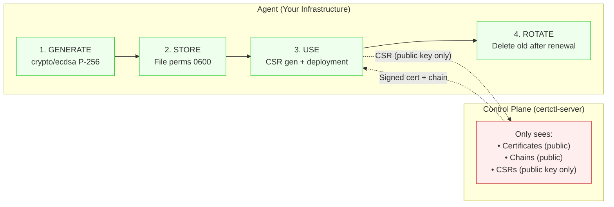

**Agent keygen mode (default, `CERTCTL_KEYGEN_MODE=agent`):** Private keys follow a strict lifecycle on agents:

1. **Generated on the agent** — ECDSA P-256, never sent to the control plane
2. **Stored on the agent** — `CERTCTL_KEY_DIR` with file permissions 0600
3. **Used by the agent** — for deployment to targets (via `DeploymentRequest.KeyPEM`)
4. **Rotated by the agent** — old keys overwritten after successful renewal

The control plane only handles public material: certificates, chains, and CSRs.

**Server keygen mode (`CERTCTL_KEYGEN_MODE=server`, demo only):** The control plane generates RSA-2048 keys server-side within `processRenewalServerKeygen`. Private keys are stored in `certificate_versions.csr_pem`. A log warning is emitted at startup. Use only for Local CA development/demo.

### Authentication

- **API clients → Server**: API key in `Authorization: Bearer` header, or `none` for demo mode
- **Agent → Server**: API key registered at agent creation, included in all requests
- **Server → Issuers**: ACME account key, or connector-specific credentials
- **Agent → Targets**: API tokens, WinRM credentials (stored locally on agent or proxy agent — never on server). Credential scope is limited to the agent's network zone.

### Audit Trail

Every action is recorded as an immutable audit event:

```json
{
  "id": "audit-001",
  "actor": "o-alice",
  "actor_type": "User",
  "action": "certificate_created",
  "resource_type": "certificate",
  "resource_id": "mc-api-prod",
  "details": {"environment": "production"},
  "timestamp": "2026-03-14T10:30:00Z"
}
```

Audit events cannot be modified or deleted. They support filtering by actor, action, resource type, resource ID, and time range. All audit operations are logged via structured `slog` logging; if an audit event fails to persist, the error is logged immediately to ensure no gaps in the audit trail go unnoticed.

### API Audit Log

In addition to application-level audit events, certctl records every HTTP API call via middleware. The audit middleware captures method, URL path (excluding query parameters — see security note below), actor (extracted from auth context), SHA-256 request body hash (truncated to 16 characters), response status code, and request latency. Health and readiness probes are excluded to avoid noise.

**Security: Query Parameter Exclusion** — The audit middleware intentionally records `r.URL.Path` only (not `r.URL.String()` or `r.RequestURI`). Query strings may contain cursor tokens, API keys passed as params, or other sensitive filter values. Since the audit trail is append-only with no deletion capability, any sensitive data recorded would persist permanently.

Audit recording is async (via goroutine) so it never blocks the HTTP response. If audit persistence fails, the error is logged immediately — the API call still succeeds. The middleware sits after the auth middleware in the stack so the actor identity is available from context.

### Input Validation and SSRF Protection

All shell-facing inputs (connector scripts, domain names, ACME tokens) are validated through `internal/validation/command.go` before reaching shell execution. `ValidateShellCommand()` denies all shell metacharacters. `ValidateDomainName()` enforces RFC 1123. `ValidateACMEToken()` restricts to base64url characters. The network scanner filters reserved IP ranges (loopback, link-local including cloud metadata 169.254.169.254, multicast, broadcast) to prevent SSRF, while preserving RFC 1918 private ranges for legitimate internal scanning.

### Request Body Size Limits

All incoming HTTP request bodies are capped by `http.MaxBytesReader` middleware (default 1MB, configurable via `CERTCTL_MAX_BODY_SIZE`). Requests exceeding the limit receive a 413 Request Entity Too Large response. The middleware is positioned before authentication in the chain so oversized payloads are rejected early, before any auth processing or database work occurs. Requests without bodies (GET, HEAD, nil body) skip the limit check.

### CORS

CORS uses a **deny-by-default** posture: when `CERTCTL_CORS_ORIGINS` is empty, no CORS headers are set and only same-origin requests can read responses. Operators must explicitly configure allowed origins. This prevents accidental exposure of the API to cross-origin requests in production.

### Middleware Chain Order

The HTTP middleware stack processes requests in the following order (see `cmd/server/main.go`):

1. **RequestID** - assigns unique request ID for correlation
2. **Logging** - structured slog middleware with request ID propagation
3. **Recovery** - panic recovery (catches panics in downstream middleware/handlers)
4. **BodyLimit** - request body size cap via `http.MaxBytesReader`
5. **RateLimiter** - token bucket rate limiting (optional, when enabled)
6. **CORS** - cross-origin request handling (deny-by-default)
7. **Auth** - API key or JWT validation
8. **AuditLog** - records every API call to the audit trail (requires auth context for actor)

### Concurrency Safety

The background scheduler uses `sync/atomic.Bool` idempotency guards on all 7 loops — if a tick fires while the previous iteration is still running, it skips. A `sync.WaitGroup` tracks all in-flight goroutines. `WaitForCompletion(timeout)` blocks during shutdown until all work finishes or the timeout expires, preventing state corruption from mid-flight database operations during process exit.

### Logging

All logging throughout the service layer uses Go's `log/slog` package for structured, queryable logs. This replaces ad-hoc `fmt.Printf` statements with consistent key-value logging that includes request context, operation names, and error details. Agents also implement exponential backoff on network failures to gracefully handle temporary connectivity issues with the control plane.

## API Design

All endpoints are under `/api/v1/` and follow consistent patterns:

- **List**: `GET /api/v1/{resources}` — returns `{data: [...], total, page, per_page}`
- **Get**: `GET /api/v1/{resources}/{id}` — returns the resource
- **Create**: `POST /api/v1/{resources}` — returns the created resource with `201`
- **Update**: `PUT /api/v1/{resources}/{id}` — returns the updated resource
- **Delete**: `DELETE /api/v1/{resources}/{id}` — returns `204` (soft delete/archive)
- **Actions**: `POST /api/v1/{resources}/{id}/{action}` — returns `202` for async operations

Resources: certificates, issuers, targets, agents, jobs, policies, profiles, teams, owners, agent-groups, audit, notifications, discovered-certificates, discovery-scans, network-scan-targets, stats, metrics.

The full API is documented in an OpenAPI 3.1 specification at `api/openapi.yaml` with 97 operations across `/api/v1/` and `/.well-known/est/` (includes auth, 7 discovery endpoints, 6 network scan endpoints, Prometheus metrics, 4 EST enrollment endpoints, 2 digest endpoints, 2 verification endpoints, 2 export endpoints), all request/response schemas, and pagination conventions. The server also registers `/health` and `/ready` outside the OpenAPI spec, bringing the total route count to 107. See the [OpenAPI Guide](openapi.md) for usage with Swagger UI and SDK generation.

Jobs support additional action endpoints: `POST /api/v1/jobs/{id}/cancel`, `POST /api/v1/jobs/{id}/approve`, `POST /api/v1/jobs/{id}/reject`.

**Enhanced Query Features (M20):** Certificate list endpoints support additional query capabilities beyond basic pagination:

- **Sorting**: `?sort=notAfter` (ascending) or `?sort=-createdAt` (descending). Whitelist: notAfter, expiresAt, createdAt, updatedAt, commonName, name, status, environment.
- **Time-range filters**: `?expires_before=`, `?expires_after=`, `?created_after=`, `?updated_after=` (RFC 3339 format).
- **Cursor pagination**: `?cursor=<token>&page_size=100` for efficient keyset pagination alongside traditional page-based.
- **Sparse fields**: `?fields=id,common_name,status` to reduce response payload.
- **Additional filters**: `?agent_id=`, `?profile_id=` (in addition to existing status, environment, owner_id, team_id, issuer_id).
- **Deployments**: `GET /api/v1/certificates/{id}/deployments` returns deployment targets for a certificate.

Certificate revocation: `POST /api/v1/certificates/{id}/revoke` with optional `{"reason": "keyCompromise"}`. Supports RFC 5280 reason codes (unspecified, keyCompromise, caCompromise, affiliationChanged, superseded, cessationOfOperation, certificateHold, privilegeWithdrawn). Returns the updated certificate status. Best-effort issuer notification — the revocation succeeds even if the issuer connector is unavailable. A JSON-formatted CRL is available at `GET /api/v1/crl`, and a DER-encoded X.509 CRL signed by the issuing CA at `GET /api/v1/crl/{issuer_id}`. An embedded OCSP responder serves signed responses at `GET /api/v1/ocsp/{issuer_id}/{serial}`. Short-lived certificates (profile TTL < 1 hour) are exempt from CRL/OCSP — expiry is sufficient revocation.

Certificate export (M27): `GET /api/v1/certificates/{id}/export/pem` returns PEM-encoded certificate and chain, and `POST /api/v1/certificates/{id}/export/pkcs12` returns a PKCS#12 bundle (binary). Private keys are never exported — they remain on agents. All exports are audited with actor, timestamp, and format.

Health checks live outside the API prefix: `GET /health` and `GET /ready`.

## MCP Server

certctl includes an MCP (Model Context Protocol) server as a separate binary (`cmd/mcp-server/`) that enables AI assistants to interact with the certificate platform. The MCP server uses the official MCP Go SDK (`modelcontextprotocol/go-sdk`) with stdio transport for integration with Claude, Cursor, and other MCP-compatible tools.

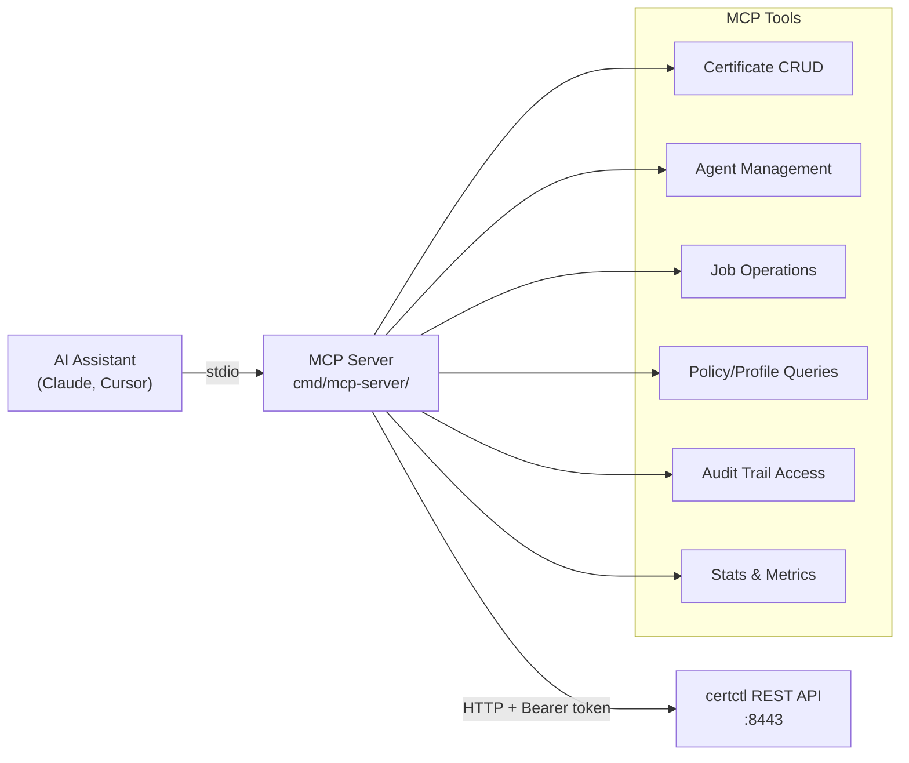

The MCP server is a stateless HTTP proxy — every MCP tool call translates to an HTTP request to the certctl REST API. It adds no new state, no new dependencies, and no new attack surface beyond what the API already exposes. Configuration is minimal: `CERTCTL_SERVER_URL` and `CERTCTL_API_KEY` environment variables.

The tools are organized across 16 resource domains with typed input structs and `jsonschema` struct tags for automatic LLM-friendly schema generation. Binary response support handles DER CRL and OCSP endpoints.

## CLI Tool

certctl ships with a command-line tool (`certctl-cli`, built from `cmd/cli/main.go`) that wraps the REST API for terminal workflows. The CLI uses Go's standard library only (`flag` + `text/tabwriter`) — no Cobra or other framework dependencies.

12 subcommands organized by resource: `certs list`, `certs get`, `certs renew`, `certs revoke`, `agents list`, `agents get`, `jobs list`, `jobs get`, `jobs cancel`, `import` (bulk PEM import), `status` (health + summary stats), and `version`. Output is available in table (default) or JSON format via `--format`. Connection is configured via `CERTCTL_SERVER_URL` and `CERTCTL_API_KEY` environment variables or CLI flags.

The bulk import command (`certctl-cli import <file.pem>`) parses multi-certificate PEM files and creates certificate records via the API — useful for bootstrapping certctl with existing certificate inventory.

## Deployment Topologies

### Docker Compose (Development / Small Deployments)

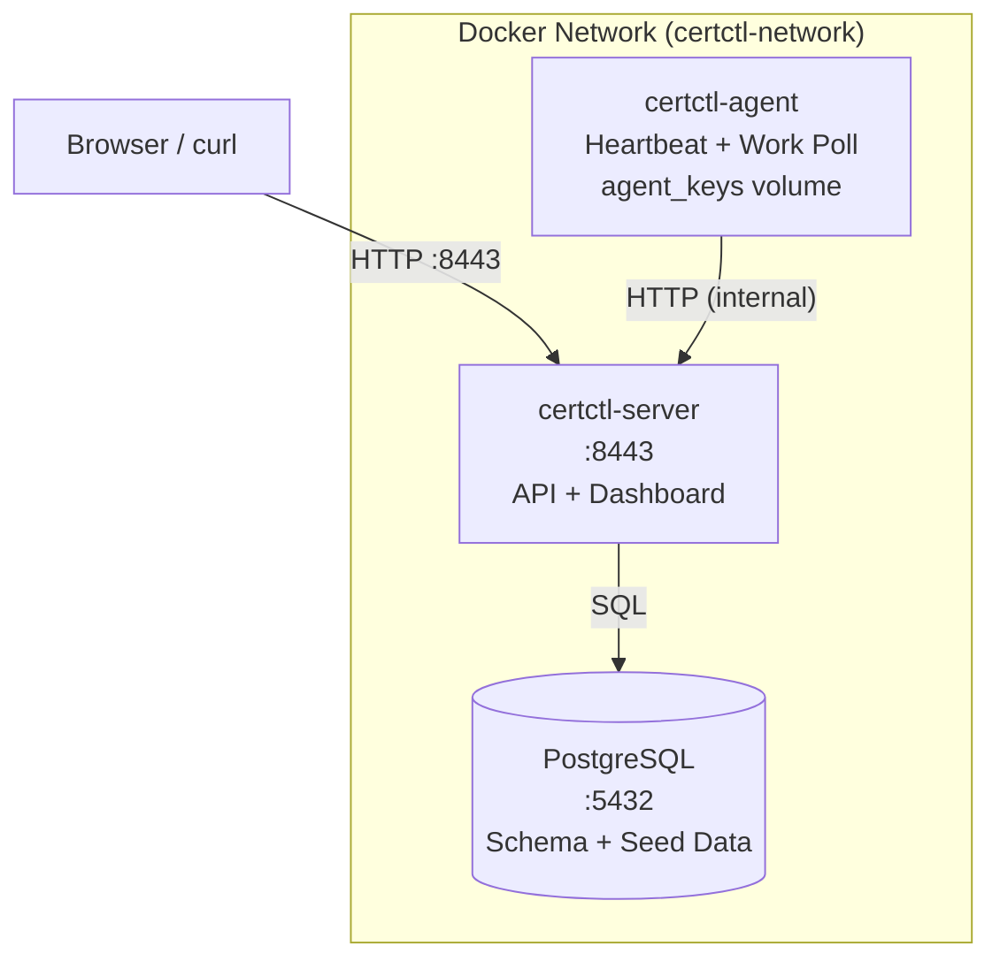

**Credentials & Configuration:**
Database and API credentials are managed via environment variables defined in a `.env` file. Copy `deploy/.env.example` to `deploy/.env` for local development and customize credentials for production. The agent key directory (`CERTCTL_KEY_DIR`) is persisted as a named Docker volume (`agent_keys`) at `/var/lib/certctl/keys` for reliable key storage across container restarts.

### Production (Kubernetes with Helm)

A production-ready Helm chart is available under `deploy/helm/certctl/` with full support for multi-replica deployments, persistent PostgreSQL, agent DaemonSet, optional Ingress, and security best practices.

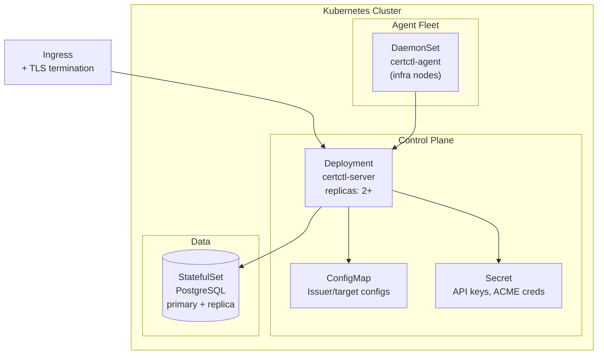

**Helm Installation:**

```bash
# Add the chart (if published) or install from local directory
helm install certctl deploy/helm/certctl/ \
  --set server.auth.apiKey="your-secure-key" \
  --set postgresql.auth.password="your-db-password" \
  --set ingress.enabled=true \
  --set ingress.hosts[0].host="certctl.example.com"
```

The Helm chart includes: server Deployment with configurable replicas, liveness/readiness probes, security context (non-root, read-only rootfs), PostgreSQL StatefulSet with persistent volumes, optional Ingress with TLS, ServiceAccount with configurable RBAC, and agent DaemonSet running one agent per node. All certctl configuration options are exposed in `values.yaml` — issuers, targets, notifiers, scheduler intervals, discovery settings, and SMTP for digest emails.

See `deploy/helm/certctl/values.yaml` for the full configuration reference and `deploy/helm/certctl/Chart.yaml` for version and appVersion details.

For production, you would also add an ingress controller, TLS termination for the certctl API itself, and external PostgreSQL (RDS, Cloud SQL, etc.).

## Discovery Data Flow (M18b + M21)

Certificate discovery enables operators to build a complete inventory of existing certificates before managing them with certctl. There are two discovery modes that feed into the same pipeline:

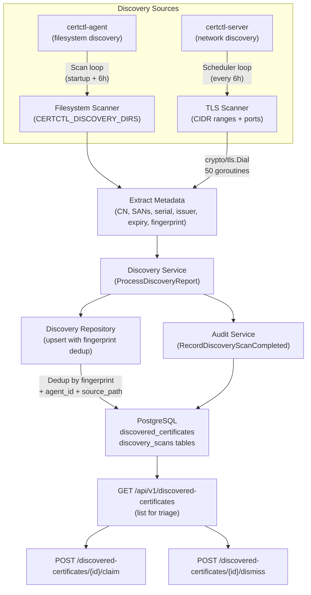

**Filesystem Discovery (M18b):**

1. **Agent-side discovery** — Agent scans `CERTCTL_DISCOVERY_DIRS` on startup and every 6 hours, walking directories recursively and parsing PEM/DER files
2. **Metadata extraction** — For each certificate found, extract: common name, SANs, serial number, issuer DN, subject DN, expiration date, key algorithm, key size, is_ca flag, SHA-256 fingerprint (used as dedup key)
3. **Server submission** — Agent POSTs scan results as `DiscoveryReport` to `POST /api/v1/agents/{id}/discoveries`
4. **Deduplication** — Server uses fingerprint + agent ID + filesystem path as unique key; prevents duplicate records of the same cert on the same agent

**Network Discovery (M21):**

1. **Target configuration** — Operator creates network scan targets via `POST /api/v1/network-scan-targets` with CIDR ranges, ports, and scan interval
2. **CIDR expansion** — Ranges expanded to individual IPs with /20 safety cap (4096 IPs max)
3. **TLS probing** — Server uses `crypto/tls.DialWithDialer` with `InsecureSkipVerify=true` to connect to each endpoint; 50 concurrent goroutines with configurable timeout
4. **Certificate extraction** — Full X.509 metadata extracted from TLS handshake peer certificates
5. **Sentinel agent** — Results submitted using `server-scanner` as virtual agent ID, with `source_path` set to `ip:port` and `source_format` set to `network`
6. **Same pipeline** — Feeds into the same `DiscoveryService.ProcessDiscoveryReport()` as filesystem discovery — same dedup, same audit trail, same triage workflow

**Common triage workflow (both sources):**

1. **Storage** — Records stored in `discovered_certificates` table with status = "Unmanaged"
2. **Audit** — `discovery_scan_completed` event logged with agent ID, cert count, scan timestamp
3. **Operator triage** — Operator queries `GET /api/v1/discovered-certificates?status=Unmanaged` to see new findings
4. **Claim or dismiss** — For each unmanaged cert, operator either:
   - **Claims it** via `POST /discovered-certificates/{id}/claim` — links to existing managed cert or creates new enrollment
   - **Dismisses it** via `POST /discovered-certificates/{id}/dismiss` — removes from triage, marked as "Dismissed"
9. **Status tracking** — `discovery_cert_claimed` and `discovery_cert_dismissed` events audit the operator's decision
10. **Summary** — `GET /api/v1/discovery-summary` returns count of Unmanaged, Managed, and Dismissed certs (useful for compliance reporting)

This data flow is pull-based and non-blocking. Agents discover at their own pace; the server stores results for later review. There's no pressure to claim or dismiss; operators can leave certificates in "Unmanaged" status indefinitely.

## Testing Strategy

certctl is extensively tested across eight layers with CI-enforced coverage gates that act as regression floors. The goal is high-confidence regression prevention at the service and handler layers (where the most complex business logic lives), combined with integration tests that exercise the full request path from HTTP to database.

**Service layer unit tests** (`internal/service/*_test.go`) — Mock-based tests across all service files covering certificate CRUD, revocation (all RFC 5280 reason codes, OCSP/CRL generation), agent lifecycle, job state machine, policy evaluation, renewal/issuance flow (both keygen modes), notification deduplication, team/owner/agent group CRUD, issuer service CRUD with connection testing, and the issuer connector adapter. Mock repositories are simple structs with function fields — no heavy mocking frameworks.

**Handler layer tests** (`internal/api/handler/*_test.go`) — Every handler file has a corresponding test file using Go's `httptest` package: certificates (including revocation, DER CRL, OCSP), agents, jobs (including approve/reject), notifications, policies, profiles, issuers, targets, agent groups, teams, owners, discovery, network scan, verification, export, EST, digest, stats, and metrics. Tests cover the happy path, input validation, error propagation, method-not-allowed, and pagination.

**Integration tests** (`internal/integration/`) — Three test files exercising the full stack from HTTP request through router, handler, service, and repository layers. `lifecycle_test.go` covers the complete certificate lifecycle (team/owner creation through deployment and status reporting). `negative_test.go` covers error paths, endpoint validation, and revocation scenarios. `e2e_test.go` exercises cross-milestone features end-to-end (agent metadata, profiles, issuer registry, GUI operations, stats, revocation, notifications, enhanced query API).

**Go integration tests** (`deploy/test/integration_test.go`) — Runs against the live Docker Compose test environment with real CA backends (Local CA, Pebble ACME, step-ca). Covers health checks, agent heartbeat, issuance, renewal, revocation, CRL/OCSP, EST enrollment, S/MIME, discovery, network scanning, and deployment verification using `crypto/x509` for cert parsing and `crypto/tls` for live TLS verification.

**Frontend tests** (`web/src/api/`) — Vitest tests covering the full API client (all endpoint functions with fetch mocking), stats/metrics endpoints, utility functions, and auth flows. Test environment uses jsdom with `@testing-library/jest-dom` matchers.

**Connector tests** (`internal/connector/`) — Issuer connectors (Local CA self-signed/sub-CA modes, ACME DNS-01/DNS-PERSIST-01, step-ca, OpenSSL, Vault PKI, DigiCert, Sectigo, Google CAS, AWS ACM PCA — all with httptest mock servers or injectable interface mocks). Target connectors (NGINX, Apache, HAProxy, Traefik, Caddy, Envoy, IIS with mock PowerShell executor, F5 BIG-IP with mock iControl client, Postfix/Dovecot, SSH with mock SSH client, Windows Certificate Store with mock PowerShell executor, Java Keystore with mock command executor, Kubernetes Secrets with mock K8s client, shared certutil package). Notifier connectors (Slack, Teams, PagerDuty, OpsGenie).

**Scheduler tests** (`internal/scheduler/scheduler_test.go`) — Idempotency guards (`sync/atomic.Bool`), `WaitForCompletion` success and timeout paths, and multi-loop concurrency safety.

**Fuzz tests** (`internal/validation/`, `internal/domain/`) — Go native fuzz tests for command validation (`ValidateShellCommand`, `ValidateDomainName`, `ValidateACMEToken`) and revocation domain parsing.

**CI pipeline** (`.github/workflows/ci.yml`) — Two parallel jobs. Go: build, vet, `go test -race`, `golangci-lint` (11 linters), `govulncheck`, test with coverage, per-layer coverage threshold enforcement (service 55%, handler 60%, domain 40%, middleware 30%). Frontend: TypeScript type check, Vitest, Vite production build.

For detailed test procedures, smoke tests, and the release sign-off checklist, see the [Testing Guide](testing-guide.md). For setting up the Docker Compose test environment with real CA backends, see [Test Environment](test-env.md).

## What's Next

- [Quick Start](quickstart.md) — Get certctl running locally
- [Advanced Demo](demo-advanced.md) — Issue a certificate end-to-end
- [Connector Guide](connectors.md) — Build custom connectors
- [Compliance Mapping](compliance.md) — SOC 2, PCI-DSS 4.0, and NIST SP 800-57 alignment
- [MCP Server Guide](mcp.md) — AI-native access to the API
- [OpenAPI Spec](openapi.md) — Full API reference and SDK generation
- [Testing Guide](testing-guide.md) — Test procedures and release sign-off
- [Test Environment](test-env.md) — Docker Compose test environment setup
