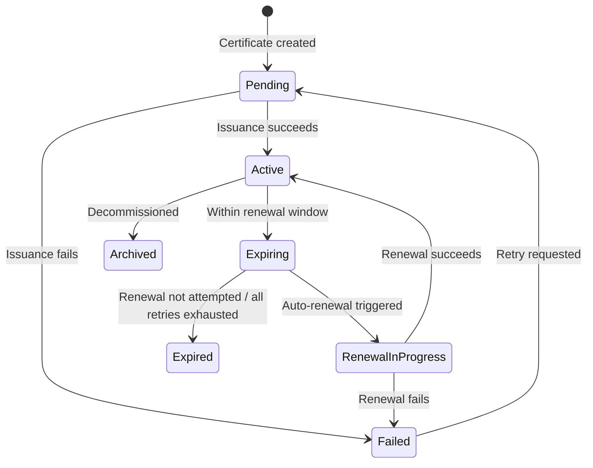

# Understanding Certificates: A Beginner's Guide

If you've never worked with TLS certificates before, this guide will get you up to speed. By the end, you'll understand what certificates are, why they matter, and why managing them at scale is hard enough to need a tool like certctl.

## What Is a TLS Certificate?

When you visit `https://yourbank.com`, your browser checks a digital document called a **TLS certificate** before sending any data. That certificate proves two things: (1) you're really talking to yourbank.com and not an imposter, and (2) everything sent between you and the server is encrypted.

A TLS certificate is just a file — a small chunk of structured data that contains a **public key**, the **domain name** it belongs to, who **issued** it (the Certificate Authority), and when it **expires**. It's signed by a trusted third party so that browsers and clients can verify it's legitimate.

Think of it like a notarized ID badge for a website. The badge says "I am api.example.com," the notary (Certificate Authority) vouches for it, and anyone can check the notary's signature to confirm the badge is real.

## Why Do Certificates Expire?

Every certificate has an expiration date, typically 90 days for Let's Encrypt or up to 1 year for commercial CAs. This isn't a bug — it's a security feature. Short lifetimes limit the damage if a private key is compromised, and they force organizations to prove they still control their domains.

The problem? When you have 5 certificates, tracking expiry dates is trivial. When you have 500 certificates spread across NGINX servers, F5 load balancers, and IIS boxes in three environments, it becomes a ticking time bomb. One missed renewal means a production outage — your site goes down, your API returns errors, and your customers see scary browser warnings.

**This is the core problem certctl solves**: automated tracking, renewal, and deployment of certificates across your entire infrastructure.

## The Cast of Characters

### Certificate Authority (CA)

A CA is the trusted third party that signs your certificates. When a CA signs a cert, they're saying "we've verified that whoever asked for this certificate actually controls this domain." Browsers ship with a built-in list of CAs they trust.

Common CAs include Let's Encrypt (free, automated), DigiCert, Sectigo, and your organization's internal/private CA. Each issues certificates through different protocols and APIs.

### ACME Protocol

ACME (Automatic Certificate Management Environment) is the protocol Let's Encrypt created for automated certificate issuance. Instead of filling out forms and waiting for emails, ACME lets software request, validate, and receive certificates programmatically. The server proves domain ownership by responding to challenges — placing a specific file on the web server (HTTP-01) or creating a DNS record (DNS-01).

certctl speaks ACME natively, so it can request certificates from Let's Encrypt or any ACME-compatible CA without manual intervention.

### Private Key

Every certificate has a corresponding private key. The certificate is public — anyone can see it. The private key is secret — it's what allows your server to decrypt traffic. If someone gets your private key, they can impersonate your server.

**This is why certctl's architecture is built around a critical rule: private keys never leave the server they were generated on.** The control plane orchestrates certificate issuance and tracks state, but it never sees or stores private keys. Keys are generated locally by agents running on your infrastructure.

### Subject Alternative Names (SANs)

A single certificate can cover multiple domain names. The primary domain is the Common Name (CN), and additional domains are listed as Subject Alternative Names. For example, one cert might cover `example.com`, `www.example.com`, and `api.example.com`. This reduces the number of certificates you need to manage.

### Certificate Chain

When a CA signs your certificate, the CA itself has a certificate, which was signed by a higher-level CA, all the way up to a **root CA** that browsers trust directly. This chain of trust — your cert, signed by an intermediate CA, signed by a root CA — is called the certificate chain. Servers need to present the full chain so clients can verify the entire trust path.

## How certctl Works

certctl has three main components that work together:

### The Control Plane (Server)

This is the brain. It's a REST API server backed by PostgreSQL that tracks every certificate in your organization: what domain it covers, when it expires, who owns it, which servers it's deployed to, and its full audit history. It runs a scheduler that automatically checks for expiring certificates and triggers renewal jobs.

The control plane never touches private keys. It coordinates the certificate lifecycle — "this cert needs renewal," "deploy this cert to these targets" — but the actual cryptographic operations happen elsewhere.

### Agents

Agents are lightweight processes that run on or near your infrastructure. They do the actual work: generating private keys, creating Certificate Signing Requests (CSRs), receiving signed certificates, and deploying them to servers. An agent might run on the same machine as your NGINX server, or on a management host that has SSH access to your web servers.

The flow looks like this:

1. The scheduler on the control plane decides a certificate needs renewal
2. The control plane creates a renewal job
3. An agent picks up the job, generates a new private key locally, and sends a CSR (which contains only the public key) to the control plane
4. The control plane submits the CSR to the CA and receives the signed certificate
5. The control plane sends the signed certificate (public material only) back to the agent
6. The agent deploys the certificate and private key to the target server
7. The agent reports success back to the control plane

At no point does the private key leave the agent. This is a fundamental security property.

### Deployment Targets

Targets are the systems where certificates actually get installed — NGINX web servers, F5 BIG-IP load balancers, Microsoft IIS servers. Each target type has a **connector** that knows how to deploy certificates to that specific system (e.g., writing files and reloading NGINX config, calling the F5 REST API, running PowerShell commands on IIS via WinRM).

## The Certificate Lifecycle

Every managed certificate in certctl goes through these states:

- **Pending**: Certificate record created, awaiting initial issuance
- **Active**: Certificate is valid and deployed, everything is healthy
- **Expiring**: Certificate is within the renewal window (e.g., 30 days before expiry) — renewal will be triggered automatically
- **Expired**: Certificate passed its expiration date without successful renewal — this is a problem
- **Failed**: Something went wrong during issuance or renewal — needs investigation
- **RenewalInProgress**: A renewal job is currently running
- **Archived**: Certificate was decommissioned and soft-deleted

## Why Not Just Use Certbot?

Certbot is great for a single server. It runs on one machine, gets one certificate, and installs it locally. But it doesn't solve the organizational problem: who owns which certificates? When do they expire across the fleet? Which servers need updating? Did the deployment succeed everywhere? Who changed what, and when?

certctl is for organizations that need visibility, automation, and accountability across their certificate infrastructure. It's the difference between a spreadsheet and a database — both store data, but one scales.

## Key Concepts in certctl

### Teams and Owners

Every certificate belongs to a **team** and has an **owner**. This answers the question "whose problem is it when this cert expires?" In a large organization, the platform team might own infrastructure certs while the payments team owns payment gateway certs.

### Policies

Policies are guardrails. You can enforce rules like "production certificates must use specific issuers," "all certificates must have an owner," or "certificate lifetime cannot exceed 90 days." When a certificate violates a policy, certctl flags it with a policy violation so you can take action.

### Jobs

Every action in certctl — issuing a certificate, renewing one, deploying to a target — is tracked as a **job**. Jobs have states (Pending, Running, Completed, Failed, Cancelled), retry logic, and a full audit trail. If a deployment fails, you can see exactly what happened and when.

### Audit Trail

Every action is logged: who did it, what changed, when, and why. This is essential for compliance (SOC 2, PCI-DSS, ISO 27001) and for debugging. You can trace a certificate's entire history from creation through every renewal and deployment.

### Notifications

certctl can alert you when certificates are expiring, when renewals fail, when deployments succeed, or when policy violations are detected. Notifications go out via email or webhooks, with Slack support planned.

## What's Next

Now that you understand the concepts, head to the [Quick Start Guide](quickstart.md) to get certctl running locally in under 5 minutes. You'll see a pre-loaded dashboard with demo certificates, explore the API, and understand how everything fits together.

For a deeper look at the system design, see the [Architecture Guide](architecture.md).
