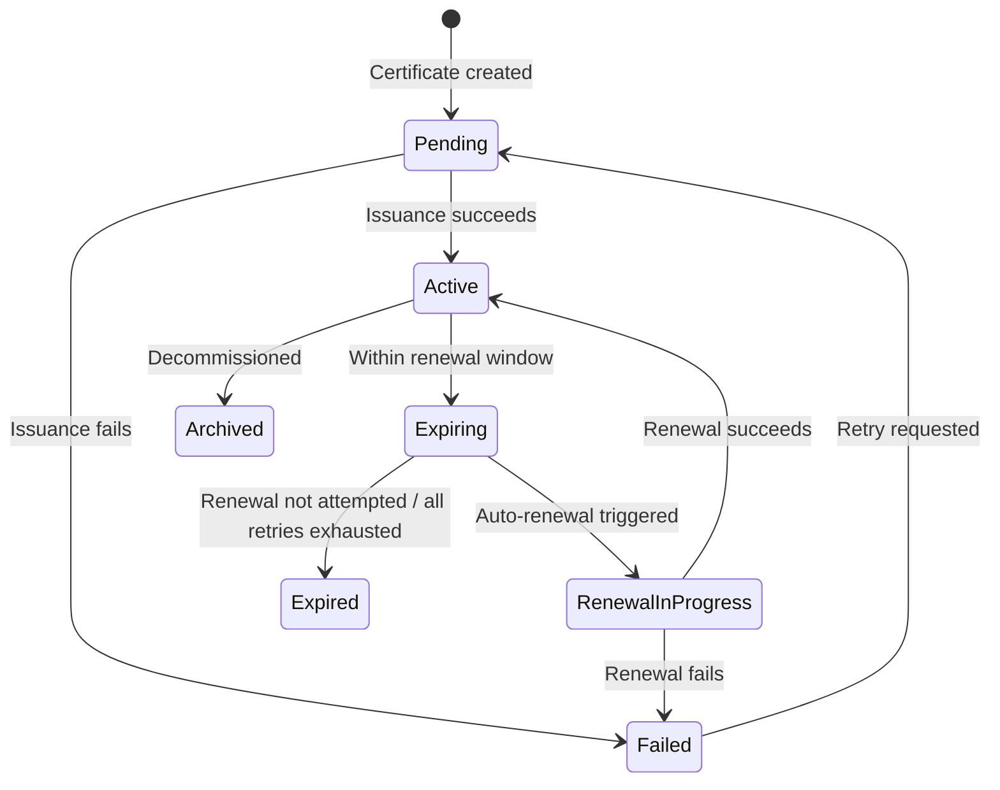

# Understanding Certificates: A Beginner's Guide

If you've never worked with TLS certificates before, this guide will get you up to speed. By the end, you'll understand what certificates are, why they matter, and why the industry's move toward shorter certificate lifespans — down to 47 days by 2029 — makes automated lifecycle management essential.

## What Is a TLS Certificate?

When you visit `https://yourbank.com`, your browser checks a digital document called a **TLS certificate** before sending any data. That certificate proves two things: (1) you're really talking to yourbank.com and not an imposter, and (2) everything sent between you and the server is encrypted.

A TLS certificate is just a file — a small chunk of structured data that contains a **public key**, the **domain name** it belongs to, who **issued** it (the Certificate Authority), and when it **expires**. It's signed by a trusted third party so that browsers and clients can verify it's legitimate.

Think of it like a notarized ID badge for a website. The badge says "I am api.example.com," the notary (Certificate Authority) vouches for it, and anyone can check the notary's signature to confirm the badge is real.

## Why Do Certificates Expire?

Every certificate has an expiration date. This isn't a bug — it's a security feature. Short lifetimes limit the damage if a private key is compromised, and they force organizations to prove they still control their domains.

Certificate lifespans have been shrinking steadily. A decade ago, certificates lasted up to 5 years. Then the CA/Browser Forum — the industry body that sets certificate rules — reduced the maximum to 3 years, then 2 years, then 398 days. In April 2025, they passed Ballot SC-081v3 with zero opposition (25 CAs in favor, 5 abstentions, all 4 browser vendors in favor), setting a phased reduction to **200 days** (March 2026), **100 days** (March 2027), and **47 days** (March 2029). Let's Encrypt already issues 90-day certificates by default.

The trend is clear: shorter lifespans, more frequent renewals, and zero tolerance for manual processes.

When you have 5 certificates, tracking expiry dates is trivial. When you have 500 certificates spread across NGINX servers, Apache instances, HAProxy load balancers, F5 appliances, and IIS boxes in three environments — and each certificate needs renewal every 47 days — manual management becomes impossible. One missed renewal means a production outage: your site goes down, your API returns errors, and your customers see browser warnings.

**This is the core problem certctl solves**: end-to-end automation of the certificate lifecycle — issuance, renewal, and deployment — across your entire infrastructure, with no human intervention required.

## The Cast of Characters

### Certificate Authority (CA)

A CA is the trusted third party that signs your certificates. When a CA signs a cert, they're saying "we've verified that whoever asked for this certificate actually controls this domain." Browsers ship with a built-in list of CAs they trust.

Common CAs include Let's Encrypt (free, automated), DigiCert, Sectigo, and your organization's internal/private CA. Each issues certificates through different protocols and APIs.

certctl includes a built-in **Local CA** that can operate in two modes: self-signed (default, for development and demos) or as a **subordinate CA** under an enterprise root like Active Directory Certificate Services (ADCS). In sub-CA mode, you load a CA certificate and key signed by your enterprise root, and all certificates certctl issues automatically chain to the enterprise trust hierarchy — no manual trust configuration needed on clients that already trust your enterprise root. certctl also integrates with **step-ca** (Smallstep's private CA) via its native /sign API, providing a lightweight alternative to ACME for internal PKI.

### ACME Protocol

ACME (Automatic Certificate Management Environment) is the protocol Let's Encrypt created for automated certificate issuance. Instead of filling out forms and waiting for emails, ACME lets software request, validate, and receive certificates programmatically. The server proves domain ownership by responding to challenges — placing a specific file on the web server (HTTP-01) or creating a DNS record (DNS-01).

certctl speaks ACME natively with both HTTP-01 and DNS-01 challenges, so it can request certificates — including wildcard certificates — from Let's Encrypt or any ACME-compatible CA without manual intervention. HTTP-01 uses a built-in temporary HTTP server for domain validation; DNS-01 uses pluggable script-based hooks to create TXT records with any DNS provider (Cloudflare, Route53, Azure DNS, etc.).

### Private Key

Every certificate has a corresponding private key. The certificate is public — anyone can see it. The private key is secret — it's what allows your server to decrypt traffic. If someone gets your private key, they can impersonate your server.

**This is why certctl's architecture is built around a critical rule: private keys never leave the server they were generated on.** The control plane orchestrates certificate issuance and tracks state, but it never sees or stores private keys. Keys are generated locally by agents running on your infrastructure.

### Subject Alternative Names (SANs)

A single certificate can cover multiple domain names. The primary domain is the Common Name (CN), and additional domains are listed as Subject Alternative Names. For example, one cert might cover `example.com`, `www.example.com`, and `api.example.com`. This reduces the number of certificates you need to manage.

### Certificate Chain

When a CA signs your certificate, the CA itself has a certificate, which was signed by a higher-level CA, all the way up to a **root CA** that browsers trust directly. This chain of trust — your cert, signed by an intermediate CA, signed by a root CA — is called the certificate chain. Servers need to present the full chain so clients can verify the entire trust path.

## How certctl Works

certctl has three main components that work together:

### The Control Plane (Server)

This is the brain. It's a REST API server backed by PostgreSQL that tracks every certificate in your organization: what domain it covers, when it expires, who owns it, which servers it's deployed to, and its full audit history. It runs a scheduler that automatically checks for expiring certificates and triggers renewal jobs.

The control plane never touches private keys. It coordinates the certificate lifecycle — "this cert needs renewal," "deploy this cert to these targets" — but the actual cryptographic operations happen elsewhere.

### Agents

Agents are lightweight processes that run on or near your infrastructure. They do the actual work: generating private keys, creating Certificate Signing Requests (CSRs), receiving signed certificates, and deploying them to target systems. An agent typically runs on the same machine as the target (e.g., your NGINX or IIS server), deploying certificates locally. For network appliances where you can't install an agent, a proxy agent in the same network zone handles deployment via the appliance's API.

The flow looks like this:

1. The scheduler on the control plane decides a certificate needs renewal
2. The control plane creates a renewal job
3. An agent picks up the job, generates a new private key locally, and sends a CSR (which contains only the public key) to the control plane
4. The control plane submits the CSR to the CA and receives the signed certificate
5. The control plane sends the signed certificate (public material only) back to the agent
6. The agent deploys the certificate and private key to the target server
7. The agent reports success back to the control plane

At no point does the private key leave the agent. This is a fundamental security property.

Agents also report **metadata** about themselves — their operating system, CPU architecture, IP address, hostname, and version — with every heartbeat. This gives ops teams fleet-wide visibility (e.g., "how many agents are running on ARM?", "which agents are still on v1.0.0?") and powers **agent groups** — dynamic device grouping where policies can be scoped to specific agent criteria like OS type, architecture, or network subnet.

### Deployment Targets

Targets are the systems where certificates actually get installed — NGINX web servers, Apache httpd servers, HAProxy load balancers, F5 BIG-IP appliances, Microsoft IIS servers. Each target type has a **connector** that knows how to deploy certificates to that specific system (e.g., writing files and reloading NGINX or Apache config, building a combined PEM for HAProxy).

For targets where an agent runs directly on the machine (NGINX, Apache, HAProxy, IIS), the agent deploys certificates locally — no remote access needed. For network appliances where you can't install an agent (F5 BIG-IP, Palo Alto, etc.), a **proxy agent** in the same network zone picks up the deployment job and calls the appliance's API. The server never initiates outbound connections to any target.

## The Certificate Lifecycle

Every managed certificate in certctl goes through these states:

- **Pending**: Certificate record created, awaiting initial issuance
- **Active**: Certificate is valid and deployed, everything is healthy
- **Expiring**: Certificate is within the renewal window (e.g., 30 days before expiry) — renewal will be triggered automatically
- **Expired**: Certificate passed its expiration date without successful renewal — this is a problem
- **Failed**: Something went wrong during issuance or renewal — needs investigation
- **RenewalInProgress**: A renewal job is currently running
- **Archived**: Certificate was decommissioned and soft-deleted

## Why Not Just Use Certbot?

Certbot is great for a single server. It runs on one machine, gets one certificate, and installs it locally. But it doesn't solve the organizational problem: who owns which certificates? When do they expire across the fleet? Which servers need updating? Did the deployment succeed everywhere? Who changed what, and when?

certctl is for organizations that need visibility, automation, and accountability across their certificate infrastructure. It's the difference between a spreadsheet and a database — both store data, but one scales.

## Key Concepts in certctl

### Teams and Owners

Every certificate belongs to a **team** and has an **owner**. This answers the question "whose problem is it when this cert expires?" In a large organization, the platform team might own infrastructure certs while the payments team owns payment gateway certs. Notifications are routed to the owner's email address automatically.

### Agent Groups

Agent groups let you organize agents by criteria — OS, architecture, IP subnet, or version — for dynamic policy scoping. For example, you can create a group matching all Linux agents and scope a renewal policy to that group. Groups can use dynamic matching criteria (agents automatically join when they match) or manual membership (explicitly include/exclude specific agents). Agent groups are managed via the GUI and API.

### Interactive Renewal Approval

For policies with `auto_renew` disabled, renewal jobs enter an **AwaitingApproval** state instead of processing immediately. An operator must explicitly approve or reject the renewal via the API or GUI. Approved jobs transition to Pending and are picked up by the scheduler. Rejected jobs are cancelled with an optional reason. This is useful for high-value certificates where you want human oversight before renewal.

### Policies

Policies are guardrails. You can enforce rules like "production certificates must use specific issuers," "all certificates must have an owner," or "certificate lifetime cannot exceed 90 days." When a certificate violates a policy, certctl flags it with a policy violation so you can take action.

### Jobs

Every action in certctl — issuing a certificate, renewing one, deploying to a target — is tracked as a **job**. Jobs have states (Pending, AwaitingCSR, AwaitingApproval, Running, Completed, Failed, Cancelled), retry logic, and a full audit trail. AwaitingCSR means the job is waiting for an agent to generate a key and submit a CSR. AwaitingApproval means the job requires human approval before proceeding (used with non-auto-renew policies). If a deployment fails, you can see exactly what happened and when.

### Audit Trail

Every action is logged: who did it, what changed, when, and why. This is essential for compliance (SOC 2, PCI-DSS, ISO 27001) and for debugging. You can trace a certificate's entire history from creation through every renewal and deployment.

### Notifications

certctl can alert you when certificates are expiring, when renewals fail, when deployments succeed, or when policy violations are detected. Notifications go out via email or webhooks, with Slack support planned.

## What's Next

Now that you understand the concepts, head to the [Quick Start Guide](quickstart.md) to get certctl running locally in under 5 minutes. You'll see a pre-loaded dashboard with demo certificates, explore the API, and understand how everything fits together.

For a deeper look at the system design, see the [Architecture Guide](architecture.md).
