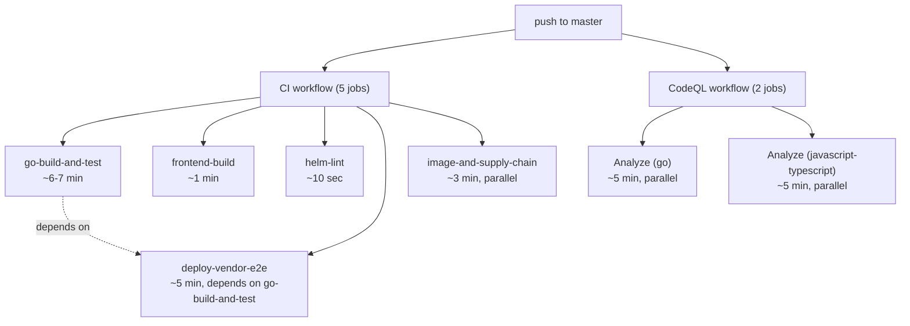

# CI Pipeline — Operator Guide

> Last reviewed: 2026-05-05

> Authoritative guide to certctl's CI pipeline shape.
> Per the ci-pipeline-cleanup spec, Phase 12.

## Trigger model

Three triggers, each with its own scope. Don't mix.

| Trigger | Workflow | Scope | Wall-clock target |
|---|---|---|---|
| Push to master, PR to master | `.github/workflows/ci.yml` + `.github/workflows/codeql.yml` | Blocking — every check earns its keep | <10 min |
| Daily 06:00 UTC + `workflow_dispatch` | `.github/workflows/security-deep-scan.yml` | Slow scans (gosec, osv, trivy, ZAP, schemathesis, nuclei, testssl, semgrep, mutation, `-race -count=10`); best-effort, never blocks | 60 min budget |
| Tag push (`v*`) | `.github/workflows/release.yml` | Cross-platform binaries, ghcr.io push, SLSA provenance, GitHub release | n/a |

This guide covers the **on-push pipeline** only.

## On-push pipeline (7 status checks)



End-to-end wall-clock: dominated by `go-build-and-test` + `deploy-vendor-e2e` chain (~12 min) running in parallel with CodeQL (~5 min). Target ~10 min.

## Per-job deep-dive

### `go-build-and-test` (Ubuntu, ~6-7 min)

Runs the Go build/test suite + 18 of 20 regression guards.

Steps:
1. `actions/checkout@v4`
2. `actions/setup-go@v5` (Go 1.25.9)
3. `go build ./cmd/...` (server, agent, mcp-server, cli)
4. **gofmt drift** — `gofmt -l .` must be empty (Makefile::verify parity)
5. **go mod tidy drift** — `go mod tidy && git diff --exit-code go.mod go.sum`
6. `go vet ./...`
7. Install + run **golangci-lint** v2.11.4 (`--timeout 5m`)
8. Install + run **govulncheck** (hard gate)
9. Install + run **staticcheck** (hard gate; `continue-on-error: false`)
10. **Race Detection** — `go test -race -count=1 ./internal/...` (9-package list, 5min timeout)
11. **Go Test with Coverage** — full coverage profile to `coverage.out`
12. **Check Coverage Thresholds** — `bash scripts/check-coverage-thresholds.sh` (reads `.github/coverage-thresholds.yml`)
13. **Upload Coverage Report** — artifact (`go-coverage`, 30-day retention)
14. **Coverage PR comment** — posts/updates per-PR coverage table (PR builds only)
15. **Regression guards** — loop runs all `scripts/ci-guards/*.sh` (18 of 20 guards)

Local equivalent: `make verify` covers steps 4, 6, 7, 11 (with `-short`).

### `frontend-build` (Ubuntu, ~1 min)

Vitest tests + tsc check + vite build + 2 of 20 regression guards (already covered by the ci-guards loop in `go-build-and-test`).

Steps:
1. `actions/checkout@v4`
2. `actions/setup-node@v4` (Node 22)
3. `npm ci`
4. `npx tsc --noEmit`
5. `npx vitest run`
6. `npx vite build`
7. **Regression guards** — same `scripts/ci-guards/*.sh` loop as `go-build-and-test` (catches frontend-side guards: S-1, P-1, T-1, L-015, L-019, M-009, G-3)

### `helm-lint` (Ubuntu, ~10 sec)

Helm chart validation in 3 modes + inverse fail-loud test:
1. `helm lint` with existingSecret
2. `helm template` (existingSecret mode)
3. `helm template` (cert-manager mode)
4. `helm template` (no TLS source — MUST fail per fail-loud guard)

### `deploy-vendor-e2e` (Ubuntu, ~5 min, depends on `go-build-and-test`)

Single-job collapse of the prior 12-job matrix (per ci-pipeline-cleanup Phase 5 / frozen decision 0.4 — revises Bundle II decision 0.9).

Steps:
1. `actions/checkout@v5`
2. `actions/setup-go@v5` (Go 1.25.9, cache: true)
3. **Build f5-mock-icontrol sidecar** — only sidecar without published image
4. **Bring up all vendor sidecars** — `docker compose --profile deploy-e2e up -d` (11 sidecars)
5. **Run all vendor-edge e2e** — `go test -tags integration -race -count=1 -run 'VendorEdge_'`; output captured to `test-output.log`
6. **Skip-count enforcement** — `bash scripts/ci-guards/vendor-e2e-skip-check.sh test-output.log` (catches sidecar boot failures via skip-count vs allowlist)
7. **Tear down sidecars** — `docker compose down -v` (always runs)

The `deploy-vendor-e2e-windows` matrix was deleted entirely (per ci-pipeline-cleanup Phase 6 / frozen decision 0.5 — revises Bundle II decision 0.4). IIS + WinCertStore validation moved to [`docs/connector-iis.md::Operator validation playbook`](connector-iis.md#operator-validation-playbook-windows-host).

### `image-and-supply-chain` (Ubuntu, ~3 min, parallel)

Three checks bundled (per ci-pipeline-cleanup Phases 7-9 / frozen decision 0.8):
1. **Digest validity** — `bash scripts/ci-guards/digest-validity.sh`. Resolves every `@sha256:<digest>` ref in `deploy/**/*.{yml,Dockerfile*}` against its registry. Closes the H-001 lying-field gap.
2. **Docker build smoke** — builds all 4 Dockerfiles (`Dockerfile`, `Dockerfile.agent`, `deploy/test/f5-mock-icontrol/Dockerfile`, `deploy/test/libest/Dockerfile`).
3. **OpenAPI ↔ handler operationId parity** — `bash scripts/ci-guards/openapi-handler-parity.sh`. Every router route must have a matching `operationId` in `api/openapi.yaml` or be documented in `api/openapi-handler-exceptions.yaml`.

### CodeQL (Ubuntu × 2 languages, ~5 min)

`.github/workflows/codeql.yml` — interprocedural taint tracking. Two matrix jobs: `go` and `javascript-typescript`. Triggers on push, PR, and weekly Sunday cron.

## The 20 regression guards

Located at `scripts/ci-guards/<id>.sh`. Each script is callable locally:

```bash
bash scripts/ci-guards/G-3-env-docs-drift.sh
```

Or run all of them:

```bash
for g in scripts/ci-guards/*.sh; do
  echo "=== $(basename "$g") ==="
  bash "$g" || echo "  FAILED"
done
```

| ID | Catches |
|---|---|
| `G-1-jwt-auth-literal` | JWT silent auth downgrade reappearing |
| `L-001-insecure-skip-verify` | Bare `InsecureSkipVerify: true` without `//nolint:gosec` |
| `H-001-bare-from` | Bare Dockerfile `FROM` without `@sha256:` digest pin |
| `M-012-no-root-user` | Dockerfile missing terminal `USER <non-root>` |
| `H-009-readme-jwt` | README re-introducing JWT-as-supported claim |
| `G-2-api-key-hash-json` | `api_key_hash` in JSON-emitting surface |
| `U-2-plaintext-healthcheck` | Plaintext `http://` in HEALTHCHECK |
| `U-3-migration-mount` | Migration file mounted into postgres initdb |
| `D-1-D-2-statusbadge-phantom` | Dead StatusBadge keys + 8 TS phantom fields across 4 interfaces |
| `L-1-bulk-action-loop` | Client-side `for ... await` bulk action loops |
| `B-1-orphan-crud` | 8 update/create/delete fns lose page consumers |
| `S-2-strings-contains-err` | `strings.Contains(err.Error(), ...)` brittle dispatch |
| `G-3-env-docs-drift` | `CERTCTL_*` env var defined OR documented but not both |
| `test-naming-convention` | `func TestXxx` lowercase first letter (Go silently skips) |
| `S-1-hardcoded-source-counts` | Hardcoded "N issuer connectors" prose |
| `P-1-documented-orphan-fns` | 16 read-fn names removed from client.ts exports |
| `T-1-frontend-page-coverage` | New page in `web/src/pages/` without sibling `.test.tsx` |
| `bundle-8-L-015-target-blank-rel-noopener` | `target="_blank"` without `rel="noopener noreferrer"` |
| `bundle-8-L-019-dangerously-set-inner-html` | `dangerouslySetInnerHTML` outside `safeHtml.ts` |
| `bundle-8-M-009-bare-usemutation` | Bare `useMutation()` outside the `useTrackedMutation` wrapper |

Plus three additional scripts for non-guard operator workflows:
- `scripts/ci-guards/vendor-e2e-skip-check.sh` — vendor-e2e skip-count enforcement (used by `deploy-vendor-e2e` job)
- `scripts/ci-guards/digest-validity.sh` — used by `image-and-supply-chain` job
- `scripts/ci-guards/openapi-handler-parity.sh` — used by `image-and-supply-chain` job
- `scripts/ci-guards/coverage-pr-comment.sh` — used by `go-build-and-test` job
- `scripts/check-coverage-thresholds.sh` — used by `go-build-and-test` job

## Coverage thresholds

Manifest at `.github/coverage-thresholds.yml`. Each entry has `floor:` (integer percentage) + `why:` (load-bearing context). Lowering a floor REQUIRES corresponding code-side test work — never lower the gate to make CI green.

To add a new gated package: add an entry to the YAML; no script changes needed.

## Make targets — three-tier convention

| Target | When | What |
|---|---|---|
| `make verify` | **Required pre-commit** | gofmt + vet + golangci-lint + go test -short |
| `make verify-deploy` | Optional pre-push | digest-validity + OpenAPI parity + Docker build smoke (server + agent only — fast subset) |
| `make verify-docs` | **Required pre-tag** | QA-doc Part-count + seed-count drift checks |

## Adding a new check

| Check type | Where it goes | Auto-picked-up by CI? |
|---|---|---|
| Regression guard (grep / shape pattern) | New `scripts/ci-guards/<id>.sh` script | Yes — loop step iterates `*.sh` |
| Coverage threshold (per-package) | New entry in `.github/coverage-thresholds.yml` | Yes — bash loop reads YAML |
| OpenAPI route exception | New entry in `api/openapi-handler-exceptions.yaml` | Yes — parity script reads YAML |
| Vendor-e2e expected skip | New line in `scripts/ci-guards/vendor-e2e-skip-allowlist.txt` | Yes — skip-check script reads file |
| New CI job | Edit `.github/workflows/ci.yml` directly | n/a (job definition is the source) |

## Troubleshooting

| CI step fails | Likely cause | Fix |
|---|---|---|
| `gofmt drift` | source needs `gofmt -w` | `make fmt` locally + commit |
| `go mod tidy drift` | imported a package without committing go.mod | `go mod tidy` + commit |
| `Run staticcheck` | new SA1019 deprecated-API site | migrate the API OR add `//lint:ignore SA1019 <reason>` |
| `Check Coverage Thresholds` | per-package coverage dropped below floor | add tests; do NOT lower the floor |
| `Regression guards` (any `<id>.sh`) | the audit-finding the guard pinned reappeared | read the guard's head-comment block for the closure rationale + fix the regression |
| `Skip-count enforcement` | a vendor sidecar failed to start | check docker logs; fix sidecar; OR if a new Windows-only test was added, add to `scripts/ci-guards/vendor-e2e-skip-allowlist.txt` |
| `Digest validity` | a `@sha256` digest doesn't resolve | re-resolve from registry, replace in compose / Dockerfile |
| `OpenAPI ↔ handler parity` | new router route without operationId | add to `api/openapi.yaml` (preferred) OR `api/openapi-handler-exceptions.yaml` |
| `Docker build smoke` | Dockerfile syntax error or COPY path drift | fix the Dockerfile |
| `CodeQL Analyze` | interprocedural dataflow finding | review the SARIF in Security → Code scanning tab |

## Status check accounting

**Current (post-cleanup):** 7 status checks per push.
- 1 × `Go Build & Test`
- 1 × `Frontend Build`
- 1 × `Helm Chart Validation`
- 1 × `deploy-vendor-e2e`
- 1 × `image-and-supply-chain`
- 2 × `CodeQL Analyze (<lang>)` (go + javascript-typescript)

**Pre-cleanup (HEAD `1de61e91`):** 19 status checks. The 12-vendor matrix + 2-vendor Windows matrix collapsed to 1 + 0 respectively; the 3 Go/Frontend/Helm jobs unchanged; 2 CodeQL unchanged; 1 new `image-and-supply-chain` added.

## Required GitHub branch protection list

When updating the `master` branch protection rule (Settings → Branches), the "Require status checks to pass" list should be exactly:

```
Go Build & Test
Frontend Build
Helm Chart Validation
deploy-vendor-e2e
image-and-supply-chain
Analyze (go)
Analyze (javascript-typescript)
```

Old-name checks (`deploy-vendor-e2e (<vendor>)` × 12, `deploy-vendor-e2e-windows (<vendor>)` × 2) won't appear on new PRs after the workflow change. Operator removes them from the required list.
