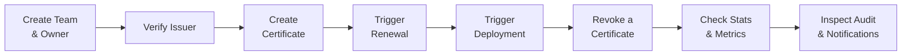
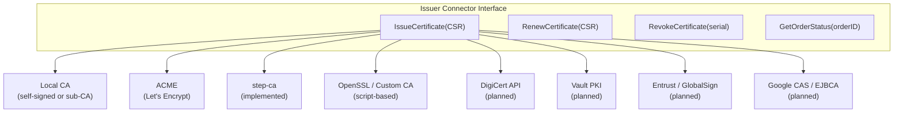
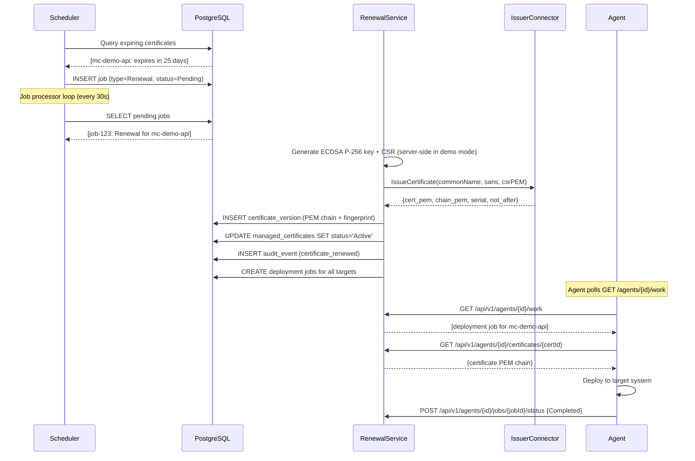
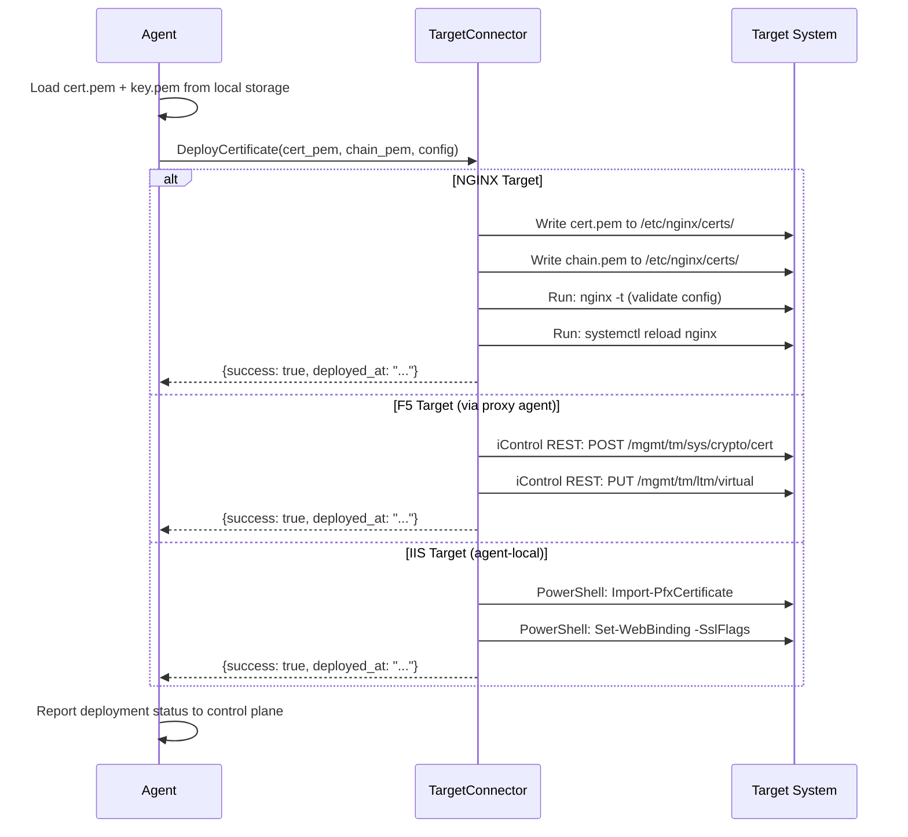
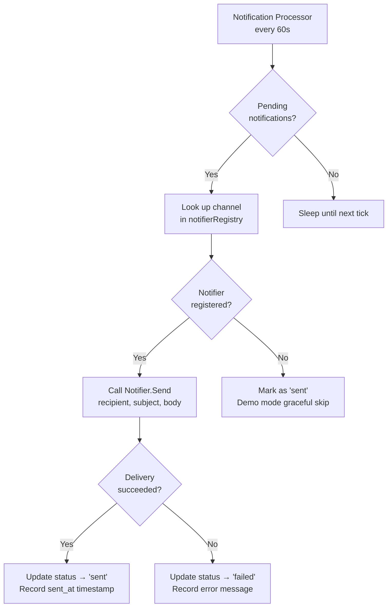
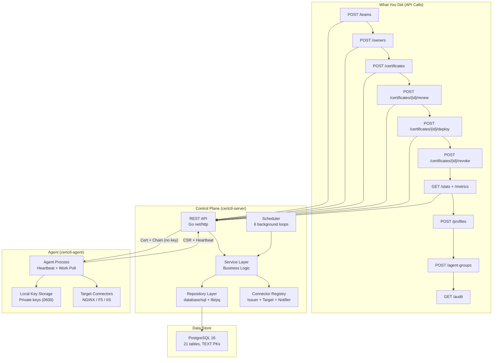

# Advanced Demo: Certificate Lifecycle End-to-End

This demo goes beyond browsing pre-loaded data. You'll create a team, register an owner, set up an issuer, create a certificate, trigger renewal, and watch everything appear in the dashboard in real time. Each step includes a technical explanation of what's happening inside certctl and why the system is designed that way.

**Time**: 15-20 minutes
**Prerequisites**: certctl running via Docker Compose (see [Quick Start](quickstart.md))

## Setup

Make sure certctl is running:

```bash
docker compose -f deploy/docker-compose.yml up -d --build
# Wait for healthy status
docker compose -f deploy/docker-compose.yml ps
```

Open **http://localhost:8443** in your browser alongside your terminal. You'll watch changes appear in the dashboard as you make API calls.

Set up a base variable for convenience:

```bash
API="http://localhost:8443"
```

## How the pieces fit together

Before we start, here's the high-level flow of what we're about to do:



Each step corresponds to a real operation that certctl would perform in production. The difference here is that we're driving each step manually via curl instead of letting the scheduler and agents handle it automatically.

---

## Alternative Issuers Reference

certctl ships with multiple issuer connectors. The demo uses the Local CA, but here's how to set up others:

### Sub-CA Mode (Local CA chained to enterprise root)

For enterprises with ADCS, root CAs, or intermediate CAs:

```bash
# Place your CA certificate and key on the server
export CERTCTL_CA_CERT_PATH="/etc/certctl/ca-cert.pem"
export CERTCTL_CA_KEY_PATH="/etc/certctl/ca-key.pem"

# Restart the server. The Local CA connector loads the cert+key from disk
# All issued certificates now chain to your enterprise root
docker compose -f deploy/docker-compose.yml restart server
```

The CA key can be RSA, ECDSA, or PKCS#8 format. The connector validates that the certificate has `IsCA=true` and `KeyUsageCertSign`.

### ACME with DNS-01 Challenges (Wildcard Certificates)

For Let's Encrypt or other ACME providers with wildcard support:

```bash
# Configure ACME DNS-01 with a DNS provider script
export CERTCTL_ACME_CHALLENGE_TYPE="dns-01"
export CERTCTL_ACME_DNS_PRESENT_SCRIPT="/usr/local/bin/dns-present.sh"
export CERTCTL_ACME_DNS_CLEANUP_SCRIPT="/usr/local/bin/dns-cleanup.sh"
export CERTCTL_ACME_DNS_PROPAGATION_WAIT="10"  # seconds to wait for DNS propagation

# Example dns-present.sh for Cloudflare:
# #!/bin/bash
# RECORD_NAME=$1
# RECORD_VALUE=$2
# curl -X POST "https://api.cloudflare.com/client/v4/zones/ZONE_ID/dns_records" \
#   -H "Authorization: Bearer $CLOUDFLARE_API_TOKEN" \
#   -d "{\"type\":\"TXT\",\"name\":\"$RECORD_NAME\",\"content\":\"$RECORD_VALUE\"}"
```

Then issue wildcard certificates:
```bash
curl -s -X POST $API/api/v1/certificates \
  -H "Content-Type: application/json" \
  -d '{
    "id": "mc-wildcard-api",
    "name": "Wildcard API Certificate",
    "common_name": "*.api.example.com",
    "sans": ["*.api.example.com", "api.example.com"],
    "issuer_id": "iss-acme",
    "renewal_policy_id": "rp-default",
    "status": "Pending"
  }' | jq .
```

### step-ca (Smallstep Private CA)

For organizations running step-ca as their private CA:

```bash
# Configure step-ca connector
export CERTCTL_STEPCA_URL="https://ca.internal.example.com"
export CERTCTL_STEPCA_FINGERPRINT="your-ca-fingerprint"  # From `step ca bootstrap`
export CERTCTL_STEPCA_PROVISIONER="certctl-admin"  # Name of the JWK provisioner
export CERTCTL_STEPCA_PROVISIONER_JWK="/etc/certctl/provisioner.json"  # Path to JWK private key
```

Then use step-ca as the issuer:
```bash
curl -s -X POST $API/api/v1/certificates \
  -H "Content-Type: application/json" \
  -d '{
    "id": "mc-stepca-cert",
    "name": "Certificate from step-ca",
    "common_name": "service.internal.example.com",
    "issuer_id": "iss-stepca",
    "renewal_policy_id": "rp-default",
    "status": "Pending"
  }' | jq .
```

### OpenSSL / Custom CA (Script-based)

For custom signing workflows via shell scripts:

```bash
# Configure OpenSSL connector with user-provided scripts
export CERTCTL_OPENSSL_SIGN_SCRIPT="/usr/local/bin/custom-sign.sh"
export CERTCTL_OPENSSL_REVOKE_SCRIPT="/usr/local/bin/custom-revoke.sh"
export CERTCTL_OPENSSL_CRL_SCRIPT="/usr/local/bin/custom-crl.sh"
export CERTCTL_OPENSSL_TIMEOUT_SECONDS="30"

# Example custom-sign.sh:
# #!/bin/bash
# CSR_PEM=$1
# VALIDITY_DAYS=$2
# # Do something custom with the CSR and return signed certificate
# openssl ca -in <(echo "$CSR_PEM") -days $VALIDITY_DAYS -out /tmp/signed.pem
# cat /tmp/signed.pem
```

---

## Part 1: Build the Organization Structure

### Create a new team

```bash
curl -s -X POST $API/api/v1/teams \
  -H "Content-Type: application/json" \
  -d '{
    "id": "t-demo",
    "name": "Demo Team",
    "description": "Team created during advanced demo walkthrough"
  }' | jq .
```

**How it works:** This `POST` hits the `/api/v1/teams` endpoint, which routes through Go 1.22's `net/http` pattern-based mux to the `TeamsHandler.CreateTeam` method. The handler deserializes the JSON body into a `domain.Team` struct, calls the `TeamService.Create()` method, which delegates to the `TeamRepository.Create()` postgres implementation — executing an `INSERT INTO teams (id, name, description, created_at, updated_at) VALUES (...)`. The server returns the full team object with server-generated timestamps.

**Why teams exist:** Certificate ownership is a core design decision. In organizations with hundreds of certificates, outages happen when nobody knows who's responsible for a specific cert. Teams create accountability boundaries — when a cert expires, certctl knows exactly which team to alert. This maps to how enterprises actually operate: the platform team owns infrastructure certs, the payments team owns PCI-scoped certs, etc.

### Register an owner

```bash
curl -s -X POST $API/api/v1/owners \
  -H "Content-Type: application/json" \
  -d '{
    "id": "o-demo-user",
    "name": "Demo User",
    "email": "demo@example.com",
    "team_id": "t-demo"
  }' | jq .
```

**How it works:** Same handler → service → repository flow. The owner is inserted into the `owners` table with a foreign key reference to the team via `team_id`. The `team_id` field isn't enforced at the database FK level in V1 (to keep migrations simple), but the service layer validates the reference.

**Why owners matter:** Owners are the individual humans accountable for certificates. When certctl sends an expiration warning notification, it needs a recipient. The owner's email becomes the notification target. This also feeds the audit trail — every action is attributed to an actor, and owners provide the human identity layer.

Verify both exist:

```bash
curl -s $API/api/v1/teams/t-demo | jq .
curl -s $API/api/v1/owners/o-demo-user | jq .
```

**How it works:** These `GET` requests use path parameters (`/api/v1/teams/{id}`) which Go 1.22's router extracts via `r.PathValue("id")`. The handler calls `service.Get(ctx, id)` which issues `SELECT * FROM teams WHERE id = $1`. If the row doesn't exist, the repository returns `nil` and the handler responds with HTTP 404.

---

## Part 2: Verify the Issuer

The demo ships with a Local CA issuer (`iss-local`) that can sign certificates immediately — no external CA needed. Let's verify it's available:

```bash
curl -s $API/api/v1/issuers/iss-local | jq .
```

You should see:
```json
{
  "id": "iss-local",
  "name": "Local Dev CA",
  "type": "local",
  "enabled": true
}
```

**How it works:** The issuer record was inserted during database seeding (`migrations/seed_demo.sql`). The `type` field (`local`) maps to a connector implementation. When the server starts, it registers connector instances in an `issuerRegistry` map keyed by issuer ID. When a certificate needs issuance, the service layer looks up the issuer ID in this registry to find the right connector.

**How the Local CA works internally:** The Local CA connector (`internal/connector/issuer/local/local.go`) generates a self-signed root CA certificate on first use using Go's `crypto/x509` package. The CA key pair lives in memory only — it's regenerated each time the server restarts, which means all certificates it issued become untrusted on restart (acceptable for dev/demo). When it receives an `IssuanceRequest` containing a CSR (Certificate Signing Request), it:

1. Parses the CSR using `x509.ParseCertificateRequest()`
2. Generates a random serial number via `crypto/rand`
3. Creates an `x509.Certificate` template with the CN, SANs, validity period, key usage extensions (Digital Signature, Key Encipherment), and extended key usage (TLS Server Auth)
4. Signs it with the CA's private key using `x509.CreateCertificate()`
5. Returns the PEM-encoded certificate and chain

The result is a structurally valid X.509 certificate — browsers won't trust it (no root CA in their trust store), but it exercises the exact same code paths that a production ACME or Vault issuer would.

**Why pluggable issuers:** Different organizations use different CAs. Some use Let's Encrypt (ACME protocol), some use step-ca or internal PKI (Vault), some use commercial CAs (DigiCert, Entrust, GlobalSign), and some have custom OpenSSL-based workflows. For enterprises with ADCS, certctl can operate as a sub-CA — all issued certs chain to the enterprise root. The connector interface means certctl doesn't care — it calls `IssueCertificate()` and gets back a signed cert regardless of the backend. V1 ships with Local CA (self-signed or sub-CA), ACME (HTTP-01 + DNS-01 for wildcards), and step-ca (Smallstep private CA via native /sign API). OpenSSL/Custom CA is planned for V2; DigiCert, Vault PKI, Entrust, GlobalSign, Google CAS, and EJBCA are planned for V3.



---

## Part 3: Create a Managed Certificate

Now the main event. Let's create a certificate for a fictional internal API:

```bash
curl -s -X POST $API/api/v1/certificates \
  -H "Content-Type: application/json" \
  -d '{
    "id": "mc-demo-api",
    "name": "Demo API Certificate",
    "common_name": "demo-api.internal.example.com",
    "sans": ["demo-api.internal.example.com", "demo-api-v2.internal.example.com"],
    "environment": "staging",
    "owner_id": "o-demo-user",
    "team_id": "t-demo",
    "issuer_id": "iss-local",
    "renewal_policy_id": "rp-default",
    "status": "Pending",
    "tags": {
      "service": "demo-api",
      "created_by": "advanced-demo",
      "tier": "internal"
    }
  }' | jq .
```

**How it works:** The `CertificatesHandler.CreateCertificate` handler deserializes the JSON into a `domain.ManagedCertificate` struct and calls `CertificateService.Create()`. The service layer:

1. Validates required fields (`common_name`, `issuer_id`, `renewal_policy_id`)
2. Stores `sans` as a PostgreSQL `TEXT[]` array and `tags` as a `JSONB` column
3. Inserts into the `managed_certificates` table
4. Logs an audit event via `AuditService.Create()` — recording the actor, action (`certificate_created`), resource type, and resource ID
5. Returns the full certificate record with `created_at` and `updated_at` timestamps

**Why each field matters:**

| Field | Purpose |
|-------|---------|
| `id` | Human-readable TEXT primary key (not UUID). Prefixed with `mc-` by convention so you can identify resource types at a glance in logs and queries. |
| `common_name` | The primary domain this certificate covers. Maps to the CN field in the X.509 certificate. |
| `sans` | Subject Alternative Names — additional domains covered by the same certificate. Modern browsers actually check SANs, not CN, for domain validation. |
| `environment` | Organizational tag (`production`, `staging`, `development`). Used for dashboard filtering and policy enforcement (e.g., "staging certs can only use the Local CA"). |
| `issuer_id` | Links to the issuer connector that will sign this certificate. Determines which CA backend is used. |
| `renewal_policy_id` | Links to a `renewal_policies` row that defines: how many days before expiry to renew (`renewal_window_days`), whether auto-renewal is enabled (`auto_renew`), max retries, and retry interval. The default policy (`rp-default`) renews 30 days before expiry. |
| `status` | Set to `Pending` because the certificate hasn't been issued yet. The scheduler will pick it up, or you can trigger renewal manually. |
| `tags` | Arbitrary key-value metadata stored as JSONB. Useful for filtering, reporting, and integration with external systems (e.g., `"pci": "true"` for compliance scoping). |

**Check the dashboard now.** Click "Certificates" in the sidebar. You'll see your new "Demo API Certificate" with status "Pending" alongside the pre-loaded demo certificates. Click on it to see the full details.

### Verify via API

```bash
curl -s $API/api/v1/certificates/mc-demo-api | jq '{id, name, common_name, status, environment, owner_id, team_id}'
```

---

## Part 4: Trigger Certificate Renewal

In production, the scheduler automatically triggers renewal when certificates approach expiry. The scheduler's renewal loop runs every hour, queries `SELECT * FROM managed_certificates WHERE status IN ('Active', 'Expiring') AND expires_at < NOW() + interval '30 days'`, and creates renewal jobs for each match. For this demo, we'll trigger it manually:

```bash
curl -s -X POST $API/api/v1/certificates/mc-demo-api/renew | jq .
```

Expected response:
```json
{
  "status": "renewal_triggered"
}
```

**How it works:** The `TriggerRenewal` handler extracts the certificate ID from the URL path, calls `CertificateService.TriggerRenewal(ctx, id)`, which:

1. Fetches the certificate from the database to verify it exists
2. Creates a new `Job` record in the `jobs` table with `type: "Renewal"`, `status: "Pending"`, `certificate_id: "mc-demo-api"`, and `scheduled_at: now()`
3. The response returns `202 Accepted` immediately — the actual renewal happens asynchronously

The `202 Accepted` status code is deliberate. Certificate issuance can take seconds (Local CA) to minutes (ACME DNS challenges). The API doesn't block the caller — it creates a job and returns. The job processor loop (runs every 30 seconds) picks up pending jobs and executes them.

**What happens during renewal (V1 flow with Local CA):**



**Keygen mode note:** By default, certctl uses agent-side key generation (`CERTCTL_KEYGEN_MODE=agent`) where agents generate ECDSA P-256 keys locally and submit CSRs to the control plane — private keys never leave agent infrastructure. The Docker Compose demo stack uses server-side keygen mode (`CERTCTL_KEYGEN_MODE=server`) for simplicity, where the control plane generates keys within `RenewalService.ProcessRenewalJob`. In production, always use agent keygen mode.

Check the jobs list:

```bash
curl -s "$API/api/v1/jobs" | jq '.data[] | select(.certificate_id == "mc-demo-api") | {id, type, status, certificate_id}'
```

**Check the dashboard.** Go to the "Jobs" view — you'll see the renewal job for your certificate.

---

## Part 5: Deploy the Certificate

Trigger deployment to see the deployment workflow:

```bash
curl -s -X POST $API/api/v1/certificates/mc-demo-api/deploy | jq .
```

Expected response:
```json
{
  "status": "deployment_triggered"
}
```

**How it works:** The `TriggerDeployment` handler optionally accepts a `target_id` in the request body. If no target is specified, it creates deployment jobs for all targets mapped to this certificate (via the `certificate_target_mappings` table). Each deployment job is independent — if NGINX succeeds but F5 fails, the NGINX deployment isn't rolled back.

The handler:
1. Looks up the certificate
2. Finds all deployment targets for this certificate (or uses the specific `target_id` if provided)
3. Creates a `Job` record for each target with `type: "Deployment"`, `target_id`, and `certificate_id`
4. Returns `202 Accepted`

**What the agent does during deployment:**



The `DeploymentRequest` struct includes a `KeyPEM` field, but this field is populated by the agent from its local key store (`CERTCTL_KEY_DIR`), never from the control plane. The control plane only sends the signed certificate and CA chain (public material). The agent combines the locally-generated private key with the certificate from the control plane to create the full deployment payload. This is the architectural boundary that ensures zero private key exposure — the control plane API never transmits private keys, and the agent's key store is the sole source of key material for target deployment.

Check for deployment jobs:

```bash
curl -s "$API/api/v1/jobs" | jq '.data[] | select(.certificate_id == "mc-demo-api")'
```

### Agent Work Polling & Status Reporting

In production, agents poll for work and report results. You can simulate this manually:

```bash
# Poll for pending deployment work (as an agent)
curl -s "$API/api/v1/agents/agent-nginx-prod/work" | jq .
```

This returns pending deployment jobs assigned to the agent. The agent would then fetch the certificate, deploy it, and report back:

```bash
# Report job completion (replace JOB_ID with an actual job ID from the work response)
curl -s -X POST "$API/api/v1/agents/agent-nginx-prod/jobs/JOB_ID/status" \
  -H "Content-Type: application/json" \
  -d '{
    "status": "Completed",
    "error": ""
  }' | jq .
```

**How it works:** The `GET /api/v1/agents/{id}/work` endpoint returns all pending deployment jobs. The agent processes each one, then calls `POST /api/v1/agents/{id}/jobs/{job_id}/status` with either `"Completed"` or `"Failed"` (with an error message). The control plane updates the job record and logs an audit event.

---

## Part 6: View the Audit Trail (Immutable API Audit Log)

Every API call and state change is recorded in an immutable, append-only audit trail. Check the recent audit events:

```bash
# List recent audit events
curl -s $API/api/v1/audit | jq '.data[0:10]'

# Filter by action (e.g., all certificate creations)
curl -s "$API/api/v1/audit?action=certificate_created" | jq '.data[] | {actor, action, resource_id, timestamp}'

# Filter by resource (e.g., all actions on mc-demo-api)
curl -s "$API/api/v1/audit?resource_id=mc-demo-api" | jq '.data[] | {actor, action, timestamp}'

# Filter by actor (e.g., all actions by a specific owner)
curl -s "$API/api/v1/audit?actor=o-demo-user" | jq '.data[] | {action, resource_type, timestamp}'

# Time-range filter (e.g., last hour)
curl -s "$API/api/v1/audit?created_after=2026-03-24T09:00:00Z" | jq '.data | length'

# Export audit trail (CSV format via GUI)
# Available on the Audit page with applied filters
```

**How it works:** The `audit_events` table is append-only — there is no `UPDATE` or `DELETE` in the `AuditRepository` interface. Every API call (including this audit query) is recorded by the API audit middleware with:

| Field | Source | Example |
|-------|--------|---------|
| `actor` | The authenticated user extracted from auth context | `"o-demo-user"`, `"system"`, `"agent-prod-01"`, `"anonymous"` |
| `actor_type` | Category of the actor | `"User"`, `"System"`, `"Agent"` |
| `action` | What happened | `"certificate_created"`, `"renewal_triggered"`, `"deployment_completed"`, `"api_call"` |
| `resource_type` | What was affected | `"certificate"`, `"team"`, `"agent"`, `"audit"` |
| `resource_id` | Specific resource | `"mc-demo-api"` |
| `details` | Arbitrary JSON context | `{"environment": "staging", "issuer": "iss-local", "body_hash": "abc123..." }` |
| `timestamp` | When it happened (server clock) | `"2026-03-14T10:30:00Z"` |

The audit middleware (M19) records every HTTP request: method, path, status code, actor, request body SHA-256 hash, and latency. This creates a complete API audit trail without blocking responses (logging happens asynchronously).

**Why immutable audit:** Compliance frameworks (SOC 2 Type II, PCI-DSS, ISO 27001) require tamper-evident audit logs. By making the repository interface append-only and recording API calls, even a compromised API server can't retroactively delete or modify audit records. In a production deployment, you'd also stream these to an external SIEM (Splunk, Datadog) for additional protection.

**Check the dashboard.** The "Audit" view shows the full timeline of all actions across the system with filtering and CSV/JSON export.

---

## Part 7: Check Notifications

Certctl sends notifications for certificate lifecycle events. Check what notifications were generated:

```bash
curl -s $API/api/v1/notifications | jq '.data[0:5]'
```

**How it works:** The `NotificationService` generates notification records in the `notification_events` table whenever significant events occur — expiration warnings at configurable thresholds (30, 14, 7, 0 days by default), renewal success/failure, deployment results, and policy violations. Each notification has a `channel` (Email, Webhook, Slack, Teams, PagerDuty, OpsGenie) and a `recipient`.

**Threshold-Based Alerting:** Each renewal policy defines configurable alert thresholds via the `alert_thresholds_days` field (e.g., `[30, 14, 7, 0]` for the standard policy, `[14, 7, 3, 0]` for the urgent policy). The scheduler checks which thresholds each certificate has crossed and sends one notification per threshold, deduplicated so the same alert is never sent twice. Certificates are automatically transitioned to `Expiring` status when entering the alert window and `Expired` when they hit 0 days.

The notification processor loop runs every 60 seconds and processes pending notifications:



**Why graceful notifier fallback:** In demo mode, no SMTP server or webhook endpoint is configured. Rather than spamming error logs with "notifier not found" every 60 seconds (which was the original behavior — we fixed this), the service marks notifications as "sent" when no notifier is registered for the channel. This keeps the notification records visible in the dashboard without requiring external infrastructure.

### Configuring Notifier Connectors

In production, enable notifiers by setting environment variables:

**Slack:**
```bash
export CERTCTL_SLACK_WEBHOOK_URL="https://hooks.slack.com/services/YOUR/WEBHOOK/URL"
export CERTCTL_SLACK_CHANNEL="cert-alerts"  # Optional, overrides channel in webhook
export CERTCTL_SLACK_USERNAME="CertCTL"     # Optional, defaults to "CertCTL"
```

**Microsoft Teams:**
```bash
export CERTCTL_TEAMS_WEBHOOK_URL="https://outlook.webhook.office.com/webhookb2/..."
```

**PagerDuty:**
```bash
export CERTCTL_PAGERDUTY_ROUTING_KEY="your-routing-key"
export CERTCTL_PAGERDUTY_SEVERITY="warning"  # Or: critical, error, info
```

**OpsGenie:**
```bash
export CERTCTL_OPSGENIE_API_KEY="your-api-key"
export CERTCTL_OPSGENIE_PRIORITY="P3"  # Or: P1, P2, P4, P5
```

When certificates expire, renewal fails, or policies are violated, certctl sends notifications via the configured channels. Each notifier connector implements the `Notifier` interface: `Send(ctx context.Context, recipient, subject, body string) error`. The notification processor handles retries and failure recording.

---

## Part 8: Create a Second Certificate and Compare

Let's create another certificate in production to see how the dashboard handles multiple environments:

```bash
curl -s -X POST $API/api/v1/certificates \
  -H "Content-Type: application/json" \
  -d '{
    "id": "mc-demo-payments",
    "name": "Demo Payments Gateway",
    "common_name": "payments.example.com",
    "sans": ["payments.example.com", "checkout.example.com"],
    "environment": "production",
    "owner_id": "o-demo-user",
    "team_id": "t-demo",
    "issuer_id": "iss-local",
    "renewal_policy_id": "rp-default",
    "status": "Active",
    "expires_at": "2026-04-01T00:00:00Z",
    "tags": {
      "service": "payments",
      "pci": "true",
      "tier": "critical"
    }
  }' | jq .
```

**How it works:** This certificate is created with status `Active` and an explicit `expires_at` 18 days from now. The scheduler's renewal checker will flag this certificate when it runs because `expires_at - now() < 30 days` (the default renewal window in `rp-default`). It would transition the status to `Expiring`, send deduplicated threshold alerts at 30 and 14 days (since both thresholds have been crossed), and create a renewal job.

**Why `environment` matters:** The environment field isn't just metadata — it feeds the policy engine. A policy rule with type `AllowedEnvironments` can restrict which environments are valid. If someone tries to create a certificate with `environment: "yolo"`, the policy engine flags a violation. In a mature deployment, you'd enforce policies strictly: production certificates must use a trusted CA (not Local CA), staging certificates can use Let's Encrypt staging, and development certificates can use the Local CA.

**Why `pci: true` in tags:** Tags are free-form, but they enable powerful filtering and compliance scoping. A security team could query `GET /api/v1/certificates?tags.pci=true` (not implemented yet, but the JSONB column supports it) to find all PCI-scoped certificates and verify they meet compliance requirements.

**Refresh the dashboard** — you'll see the new payment gateway certificate. Try filtering by environment or status to see how both certificates appear alongside the demo data.

---

## Part 8.5: Revoke a Certificate

Let's revoke the payments gateway certificate — simulating a key compromise scenario:

```bash
curl -s -X POST $API/api/v1/certificates/mc-demo-payments/revoke \
  -H "Content-Type: application/json" \
  -d '{"reason": "keyCompromise"}' | jq .
```

**How it works:** The `RevokeCertificateWithActor` service method executes a 7-step process:

1. Validates the certificate is eligible (not already revoked, not archived)
2. Retrieves the latest certificate version to get the serial number
3. Updates the certificate status to "Revoked" with a timestamp and reason
4. Records the revocation in the `certificate_revocations` table (idempotent via ON CONFLICT)
5. Notifies the issuing CA (best-effort — revocation succeeds even if the CA is unreachable)
6. Creates an audit trail entry
7. Sends revocation notifications via configured channels

Check the CRL (Certificate Revocation List):

```bash
# JSON-formatted CRL
curl -s $API/api/v1/crl | jq .

# DER-encoded X.509 CRL for the local CA (binary — pipe to openssl for inspection)
curl -s $API/api/v1/crl/iss-local -o /tmp/crl.der
openssl crl -inform DER -in /tmp/crl.der -text -noout
```

Check OCSP status:

```bash
# Replace SERIAL with the actual serial number from the certificate version
curl -s $API/api/v1/ocsp/iss-local/SERIAL | jq .
```

**Why RFC 5280 reason codes:** The reason code isn't just metadata — it tells clients *why* the certificate was revoked. A `keyCompromise` revocation means the private key was exposed and the certificate should be distrusted immediately. A `superseded` revocation means a newer certificate replaced it — less urgent. CRLs and OCSP responses include the reason code so client software can make informed trust decisions.

**Check the dashboard.** Click the payments certificate — you'll see a revocation banner with the reason code and timestamp.

---

## Part 9: Policy Violations

Let's see what happens when a certificate doesn't meet policy requirements. Check existing policy rules:

```bash
curl -s $API/api/v1/policies | jq '.data[] | {id, name, type, enabled}'
```

**How it works:** Policy rules are stored in the `policy_rules` table with a `type` field that determines the enforcement logic and a `config` JSONB column with rule-specific parameters. The demo ships with four rules:

| Rule | Type | What it enforces |
|------|------|-----------------|
| `pr-require-owner` | `RequiredMetadata` | Every certificate must have an `owner_id` |
| `pr-allowed-environments` | `AllowedEnvironments` | Only `production`, `staging`, `development` are valid |
| `pr-max-certificate-lifetime` | `RenewalLeadTime` | Certificates can't exceed a maximum lifetime |
| `pr-min-renewal-window` | `RenewalLeadTime` | Certificates must be renewed at least N days before expiry |

When a certificate is created or updated, the policy service evaluates it against all enabled rules. Violations are recorded in the `policy_violations` table with a severity (`Warning`, `Error`, `Critical`) and a human-readable message.

Check existing violations:

```bash
curl -s "$API/api/v1/policies/pr-max-certificate-lifetime/violations" | jq .
```

**How it works:** This hits `GET /api/v1/policies/{id}/violations`, which queries `SELECT * FROM policy_violations WHERE rule_id = $1`. Each violation references the offending certificate and the rule it violated, creating a traceable link between the policy definition and the specific non-compliance.

**In the dashboard**, click "Policies" in the sidebar to see all active rules and which certificates are violating them.

---

## Part 9.5: Dashboard Stats and Metrics

certctl exposes operational metrics so you can monitor the health of your certificate infrastructure:

```bash
# Dashboard summary — total certs, expiring, expired, active
curl -s $API/api/v1/stats/summary | jq .

# Certificates grouped by status
curl -s $API/api/v1/stats/certificates-by-status | jq .

# Expiration timeline — how many certs expire in the next 90 days
curl -s "$API/api/v1/stats/expiration-timeline?days=90" | jq .

# Job trends — completed vs failed jobs over 30 days
curl -s "$API/api/v1/stats/job-trends?days=30" | jq .

# Issuance rate — new certificates per day over 30 days
curl -s "$API/api/v1/stats/issuance-rate?days=30" | jq .

# System metrics — gauges, counters, uptime (JSON)
curl -s $API/api/v1/metrics | jq .

# System metrics — Prometheus exposition format (for Prometheus/Grafana/Datadog scraping)
curl -s $API/api/v1/metrics/prometheus
```

**How it works:** The `StatsService` computes aggregations in Go from existing repository List methods — no additional SQL queries or materialized views. This keeps the database schema simple while providing real-time dashboard data. The JSON metrics endpoint returns gauges (cert totals by status, agent counts, pending jobs), counters (completed/failed jobs), and server uptime. The Prometheus endpoint (`/api/v1/metrics/prometheus`) exposes the same data in Prometheus exposition format (`text/plain; version=0.0.4`) with `certctl_` prefixed metric names — ready for scraping by Prometheus, Grafana Agent, Datadog Agent, or Victoria Metrics.

**In the dashboard**, these stats power four interactive charts: an expiration heatmap, renewal success rate trends, certificate status distribution, and issuance rate. The agent fleet overview page uses agent metadata to group by OS, architecture, and version.

---

## Part 10: Certificate Profiles

Profiles define the cryptographic constraints for a class of certificates. Let's explore the demo profiles:

```bash
# List all profiles
curl -s $API/api/v1/profiles | jq '.data[] | {id, name, allowed_key_algorithms, max_validity_days}'
```

Create a new profile for high-security certificates:

```bash
curl -s -X POST $API/api/v1/profiles \
  -H "Content-Type: application/json" \
  -d '{
    "id": "prof-demo-hsec",
    "name": "Demo High Security",
    "description": "ECDSA-only with 90-day max TTL",
    "allowed_key_algorithms": [{"algorithm": "ECDSA", "min_size": 256}],
    "max_validity_days": 90,
    "allowed_ekus": ["serverAuth"],
    "enabled": true
  }' | jq .
```

**How it works:** Certificate profiles are stored in the `certificate_profiles` table with a `allowed_key_algorithms` JSONB column that defines which key types and minimum sizes are acceptable. When a certificate is assigned to a profile, the profile constraints are enforced during CSR validation. The `max_validity_days` field controls the maximum certificate lifetime — profiles with values translating to under 1 hour enable short-lived certificate mode, where certs are exempt from CRL/OCSP.

**Why profiles matter:** Without profiles, any agent can submit a CSR with any key type and any validity period. Profiles create crypto policy guardrails — "production TLS certs must use ECDSA P-256 with 90-day max TTL" — that prevent configuration drift and enforce compliance requirements across the fleet.

**In the dashboard**, click "Profiles" in the sidebar to see and manage certificate profiles.

---

## Part 11: Agent Groups

Agent groups let you organize your agent fleet by criteria for dynamic policy scoping:

```bash
# List existing agent groups
curl -s $API/api/v1/agent-groups | jq '.data[] | {id, name, match_os, match_architecture}'
```

Create a group that matches all Linux agents:

```bash
curl -s -X POST $API/api/v1/agent-groups \
  -H "Content-Type: application/json" \
  -d '{
    "id": "ag-demo-linux",
    "name": "Demo Linux Agents",
    "description": "All agents running Linux",
    "match_os": "linux",
    "enabled": true
  }' | jq .
```

**How it works:** Agent groups use dynamic matching criteria — `match_os`, `match_architecture`, `match_ip_cidr`, and `match_version` — that are compared against agent metadata reported via heartbeat. Agents automatically join groups when their metadata matches the criteria. Manual membership (explicit include/exclude) is also supported for edge cases. Renewal policies can be scoped to agent groups via the `agent_group_id` foreign key, so you can say "this renewal policy applies only to Linux agents."

**In the dashboard**, click "Agent Groups" to see groups with visual match criteria badges. The "Fleet Overview" page shows OS/architecture distribution charts powered by agent metadata.

---

## Part 12: Interactive Approval Workflow

For high-value certificates, you may want human oversight before renewal proceeds. Create a policy that requires approval:

```bash
# Check jobs that need approval
curl -s "$API/api/v1/jobs?status=AwaitingApproval" | jq '.data[] | {id, type, certificate_id, status}'
```

If there are jobs awaiting approval, approve or reject them:

```bash
# Approve a job
curl -s -X POST $API/api/v1/jobs/JOB_ID/approve \
  -H "Content-Type: application/json" \
  -d '{"reason": "Verified key type meets compliance requirements"}' | jq .

# Reject a job
curl -s -X POST $API/api/v1/jobs/JOB_ID/reject \
  -H "Content-Type: application/json" \
  -d '{"reason": "Key type does not meet PCI requirements"}' | jq .
```

**How it works:** When a renewal policy has `auto_renew` set to false, renewal jobs enter the `AwaitingApproval` state instead of being processed immediately. An operator must explicitly approve or reject the job via the API or the GUI. Approved jobs transition to `Pending` and are picked up by the job processor. Rejected jobs move to `Cancelled` with the provided reason recorded in the audit trail.

**Why interactive approval:** Not every certificate renewal should be automatic. PCI-scoped certificates, certs with specific compliance requirements, or certificates being migrated between issuers benefit from a human checkpoint. The AwaitingApproval state creates that checkpoint without blocking the entire job pipeline.

---

## Part 13: Advanced Query Features

certctl's API supports sorting, filtering, cursor pagination, and sparse field selection:

```bash
# Sort by expiration date (ascending)
curl -s "$API/api/v1/certificates?sort=notAfter" | jq '.data[] | {id, common_name, expires_at}'

# Sort descending (prefix with -)
curl -s "$API/api/v1/certificates?sort=-createdAt" | jq '.data[0:3]'

# Time-range filter: certs expiring before May 2026
curl -s "$API/api/v1/certificates?expires_before=2026-05-01T00:00:00Z" | jq '.data | length'

# Sparse fields: only return id, status, and expiry
curl -s "$API/api/v1/certificates?fields=id,status,expires_at" | jq '.data[0]'

# Cursor pagination: page through results efficiently
curl -s "$API/api/v1/certificates?page_size=3" | jq '{next_cursor: .next_cursor, count: (.data | length)}'

# View deployment targets for a certificate
curl -s "$API/api/v1/certificates/mc-demo-api/deployments" | jq .
```

**How it works:** Sort uses a whitelist of allowed fields (notAfter, createdAt, updatedAt, commonName, name, status, environment) mapped to SQL columns. Cursor pagination uses keyset pagination (`(created_at, id) < (cursor_time, cursor_id)`) which is more efficient than OFFSET-based pagination for large datasets. Sparse fields marshal the full object to JSON, then strip unrequested keys — lightweight but effective. Time-range filters add WHERE clauses to the SQL query.

**Why cursor pagination:** Page-based pagination (`?page=50&per_page=100`) requires the database to skip rows, which gets slower as page numbers increase. Cursor-based pagination (`?cursor=<token>&page_size=100`) uses an indexed seek, maintaining constant performance regardless of how deep you paginate. For large certificate inventories (thousands of certs), this is the difference between sub-millisecond and multi-second queries.

---

## Part 14: CLI Tool (M16b)

certctl includes a standalone CLI tool for command-line users:

```bash
# Build the CLI
cd cmd/cli && go build -o certctl-cli .

# Export credentials
export CERTCTL_SERVER_URL="http://localhost:8443"
export CERTCTL_API_KEY="test-key-123"

# List certificates (JSON or table format)
./certctl-cli list-certs --format table

# Get certificate details
./certctl-cli get-cert mc-demo-api

# Trigger renewal
./certctl-cli renew-cert mc-demo-api

# Revoke a certificate with RFC 5280 reason
./certctl-cli revoke-cert mc-demo-payments --reason keyCompromise

# List agents
./certctl-cli list-agents

# List pending jobs
./certctl-cli list-jobs

# Check system health
./certctl-cli health

# Export metrics
./certctl-cli metrics --format json

# Bulk import certificates from a PEM file
./certctl-cli import /path/to/certificates.pem
```

**How it works:** The CLI tool is a self-contained Go binary with zero external dependencies (just the stdlib: flag, net/http, encoding/json, text/tabwriter). It reads credentials from environment variables or command-line flags, calls the REST API endpoints, and formats output as JSON or ASCII tables. This makes it perfect for scripts, CI/CD pipelines, and automation workflows.

---

## Part 15: MCP Server for AI Integration (M18a)

certctl exposes all 78 API endpoints as tools via the Model Context Protocol (MCP), enabling seamless integration with Claude, Cursor, and other AI assistants:

```bash
# Build the MCP server
cd cmd/mcp-server && go build -o mcp-server .

# Export credentials
export CERTCTL_SERVER_URL="http://localhost:8443"
export CERTCTL_API_KEY="test-key-123"

# Start the MCP server (listens on stdin/stdout)
./mcp-server
```

**How it works:** The MCP server uses the official Model Context Protocol Go SDK to expose stateless HTTP proxies to all 78 API endpoints. Each MCP tool corresponds to one or more REST endpoints and includes:

- **Input schema** — typed arguments with JSON schema hints for LLM-friendly introspection
- **Binary support** — handles DER-encoded CRL and OCSP responses without mangling
- **Error translation** — converts HTTP errors to user-readable messages

**Example usage from Claude:**

```
User: What certificates are expiring in the next 30 days?

Claude uses the MCP tools to:
  1. Call tools.listCertificates with filters: {status: "Expiring"}
  2. Parse the response
  3. Display: "mc-api-prod expires in 12 days. mc-cdn-prod expires in 8 days..."

User: Revoke mc-payments due to key compromise

Claude uses the MCP tools to:
  1. Call tools.revokeCertificate with id="mc-payments" reason="keyCompromise"
  2. Return the audit trail entry showing revocation recorded
```

The MCP server is perfect for:
- Compliance audits — "Show me all certificates with PCI tags and their revocation status"
- Incident response — "Revoke all certificates issued by the OpenSSL CA issued before 2026-01-01"
- Operational queries — "What's the renewal success rate over the last 30 days?"

---

## Part 16: Certificate Discovery (M18b + M21)

certctl discovers existing certificates two ways: **filesystem scanning** (agents scan local directories) and **network scanning** (the server probes TLS endpoints). Both feed into the same triage pipeline.

### Filesystem Discovery (Agent-Side)

Configure the demo agent to scan for certificates. In the Docker Compose setup, agents have a `/tmp/certs` directory (created by the seed script). Restart the agent with discovery enabled:

```bash
# Stop the existing agent
docker compose -f deploy/docker-compose.yml stop agent

# Restart with discovery enabled (scans /tmp/certs every 6 hours, or on startup)
docker compose -f deploy/docker-compose.yml run -e CERTCTL_DISCOVERY_DIRS=/tmp/certs agent certctl-agent
```

Or with the CLI flag:

```bash
certctl-agent --agent-id a-demo-1 --key-dir /tmp/keys --discovery-dirs /tmp/certs --server http://localhost:8443 --api-key test-key-123
```

### Network Discovery (Server-Side)

The server can also discover certificates by actively probing TLS endpoints — no agent required. Create a scan target and trigger a scan:

```bash
# Create a network scan target
curl -s -X POST $API/api/v1/network-scan-targets \
  -H "Content-Type: application/json" \
  -d '{
    "name": "Demo Local Scan",
    "cidrs": ["127.0.0.1/32"],
    "ports": [8443],
    "enabled": true,
    "scan_interval_hours": 6,
    "timeout_ms": 5000
  }' | jq .

# Trigger an immediate scan (otherwise runs every 6 hours)
NST_ID=$(curl -s $API/api/v1/network-scan-targets | jq -r '.data[0].id')
curl -s -X POST "$API/api/v1/network-scan-targets/$NST_ID/scan" | jq .

# List scan targets and their results
curl -s $API/api/v1/network-scan-targets | jq .
```

Network-discovered certificates appear in the same discovery pipeline as filesystem-discovered ones, with `agent_id=server-scanner` and `source_format=network`.

### Triage Discovered Certificates

Both discovery sources feed into the same triage workflow. Check what was found:

```bash
# List discovered certificates (should show unmanaged certs found by agents and network scans)
curl -s "$API/api/v1/discovered-certificates?status=Unmanaged" | jq '.data[] | {id, common_name, expires_at, issuer_dn, status}'

# Get a summary of all discoveries
curl -s $API/api/v1/discovery-summary | jq .
```

If certificates were found, you'll see entries with `status: "Unmanaged"`. Triage them — claim the ones you want to manage or dismiss the ones you don't:

```bash
# Claim a certificate (link it to a managed cert, or create new enrollment)
DISCOVERED_ID=$(curl -s "$API/api/v1/discovered-certificates?status=Unmanaged" | jq -r '.data[0].id')
curl -s -X POST "$API/api/v1/discovered-certificates/$DISCOVERED_ID/claim" \
  -H "Content-Type: application/json" \
  -d '{"reason": "Migrating from external CA to certctl"}' | jq .

# Or dismiss a certificate
curl -s -X POST "$API/api/v1/discovered-certificates/$DISCOVERED_ID/dismiss" \
  -H "Content-Type: application/json" \
  -d '{"reason": "Self-signed test cert, not production"}' | jq .
```

**How it works:** Filesystem discovery: the agent scans `CERTCTL_DISCOVERY_DIRS` on startup and every 6 hours, extracts metadata (common name, SANs, issuer, expiration, key type, fingerprint) from all PEM and DER files, and POSTs findings to `POST /api/v1/agents/{id}/discoveries`. Network discovery: the server expands CIDR ranges (capped at /20 = 4096 IPs), connects to each IP:port via TLS, extracts the peer certificate chain, and stores results using `server-scanner` as a sentinel agent ID. Both sources deduplicate by fingerprint and store results with a status: **Unmanaged** (discovered, not yet managed), **Managed** (linked to a control plane cert), or **Dismissed** (operator decided not to manage). This gives you a triage workflow: discover → review → claim or dismiss.

**In the dashboard**, click "Discovered Certificates" in the sidebar to see what agents and network scans found — claim unmanaged certs to bring them under certctl's management, or dismiss them.

---

## End-to-End Architecture Summary

Here's what we just walked through, mapped to the system architecture:



---

## Full Automated Script

Here's a single script that runs the entire demo end-to-end. Save it as `demo.sh` and run it:

```bash
#!/bin/bash
set -e

API="http://localhost:8443"
BLUE='\033[0;34m'
GREEN='\033[0;32m'
YELLOW='\033[1;33m'
NC='\033[0m'

echo -e "${BLUE}=== certctl Advanced Demo ===${NC}"
echo ""

# Step 1: Health check
echo -e "${YELLOW}Step 1: Checking server health...${NC}"
HEALTH=$(curl -s $API/health | jq -r '.status')
if [ "$HEALTH" != "healthy" ]; then
  echo "Server is not healthy. Run: docker compose -f deploy/docker-compose.yml up -d --build"
  exit 1
fi
echo -e "${GREEN}Server is healthy${NC}"
echo ""

# Step 2: Create team
echo -e "${YELLOW}Step 2: Creating demo team...${NC}"
curl -s -X POST $API/api/v1/teams \
  -H "Content-Type: application/json" \
  -d '{"id":"t-demo-auto","name":"Automated Demo Team","description":"Created by demo script"}' | jq -r '.id'
echo -e "${GREEN}Team created${NC}"
echo ""

# Step 3: Create owner
echo -e "${YELLOW}Step 3: Registering demo owner...${NC}"
curl -s -X POST $API/api/v1/owners \
  -H "Content-Type: application/json" \
  -d '{"id":"o-demo-auto","name":"Demo Script","email":"demo-script@example.com","team_id":"t-demo-auto"}' | jq -r '.id'
echo -e "${GREEN}Owner registered${NC}"
echo ""

# Step 4: Create certificate
echo -e "${YELLOW}Step 4: Creating managed certificate...${NC}"
CERT_ID="mc-demo-$(date +%s)"
curl -s -X POST $API/api/v1/certificates \
  -H "Content-Type: application/json" \
  -d '{
    "id":"'$CERT_ID'",
    "name":"Demo Auto Certificate",
    "common_name":"auto-demo.internal.example.com",
    "sans":["auto-demo.internal.example.com"],
    "environment":"staging",
    "owner_id":"o-demo-auto",
    "team_id":"t-demo-auto",
    "issuer_id":"iss-local",
    "renewal_policy_id":"rp-default",
    "status":"Pending",
    "tags":{"created_by":"demo-script","automated":"true"}
  }' | jq '{id, name, status}'
echo -e "${GREEN}Certificate created: $CERT_ID${NC}"
echo ""

# Step 5: Trigger renewal
echo -e "${YELLOW}Step 5: Triggering certificate renewal...${NC}"
curl -s -X POST $API/api/v1/certificates/$CERT_ID/renew | jq .
echo -e "${GREEN}Renewal triggered${NC}"
echo ""

# Step 6: Trigger deployment
echo -e "${YELLOW}Step 6: Triggering certificate deployment...${NC}"
curl -s -X POST $API/api/v1/certificates/$CERT_ID/deploy | jq .
echo -e "${GREEN}Deployment triggered${NC}"
echo ""

# Step 7: Check certificate status
echo -e "${YELLOW}Step 7: Checking certificate status...${NC}"
curl -s $API/api/v1/certificates/$CERT_ID | jq '{id, name, status, common_name, environment}'
echo ""

# Step 8: Check jobs
echo -e "${YELLOW}Step 8: Checking jobs...${NC}"
curl -s "$API/api/v1/jobs" | jq "[.data[] | select(.certificate_id == \"$CERT_ID\") | {id, type, status}]"
echo ""

# Step 9: View recent audit events
echo -e "${YELLOW}Step 9: Recent audit events...${NC}"
curl -s $API/api/v1/audit | jq '.data[0:3] | .[] | {action, resource_type, resource_id, timestamp}'
echo ""

# Step 10: Revoke the certificate
echo -e "${YELLOW}Step 10: Revoking certificate...${NC}"
curl -s -X POST $API/api/v1/certificates/$CERT_ID/revoke \
  -H "Content-Type: application/json" \
  -d '{"reason": "superseded"}' | jq .
echo -e "${GREEN}Certificate revoked${NC}"
echo ""

# Step 11: Check stats
echo -e "${YELLOW}Step 11: Dashboard summary...${NC}"
curl -s $API/api/v1/stats/summary | jq .
echo ""

# Step 12: Summary
echo -e "${BLUE}=== Demo Complete ===${NC}"
echo ""
echo "What happened:"
echo "  1. Created a team and owner for accountability"
echo "  2. Created a managed certificate tracked by certctl"
echo "  3. Triggered renewal (would contact the Local CA in production flow)"
echo "  4. Triggered deployment (would push to NGINX/F5/IIS targets)"
echo "  5. Revoked the certificate with RFC 5280 reason codes"
echo "  6. Checked dashboard stats and metrics"
echo "  7. All actions recorded in the audit trail"
echo ""
echo -e "Open ${GREEN}http://localhost:8443${NC} to see everything in the dashboard."
echo "Look for certificate: $CERT_ID"
```

Make it executable and run:

```bash
chmod +x demo.sh
./demo.sh
```

---

## What to Show Stakeholders

If you're using this demo to present certctl to decision-makers, here's the narrative:

1. **Start with the dashboard** — "This is your certificate inventory. Every TLS certificate across your infrastructure, in one place."
2. **Point to expiring certs** — "These certificates would have caused outages. Certctl catches them automatically."
3. **Show the cert you just created** — "I just created this via the API. It's already tracked, assigned to a team, and will be renewed automatically."
4. **Show revocation** — "If a key is compromised, one-click revocation with RFC 5280 reason codes. CRL and OCSP endpoints are served automatically."
5. **Show the audit trail** — "Complete traceability. Every action, every change, every deployment — timestamped and attributed."
6. **Show policies** — "Guardrails. We enforce that every certificate has an owner, uses approved CAs, and stays within allowed environments."
7. **Show agents** — "Private keys never touch the control plane. Agents handle cryptographic operations locally on your infrastructure."
8. **Show dashboard stats** — "Real-time metrics: expiration trends, job success rates, certificate distribution. Everything you need to operate with confidence."
9. **Show the CLI and MCP server** — "Terminal users get a CLI tool. AI assistants get MCP integration. Everything is API-first."

## Teardown

```bash
docker compose -f deploy/docker-compose.yml down -v
```
