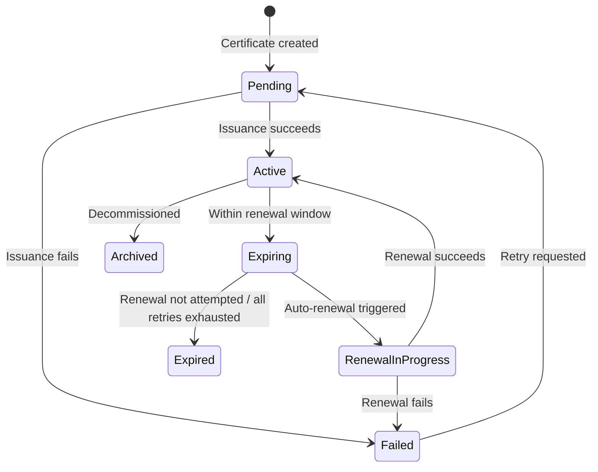

# Understanding Certificates: A Beginner's Guide

> Last reviewed: 2026-05-05

If you've never worked with TLS certificates before, this guide will get you up to speed. By the end, you'll understand what certificates are, why they matter, and why the industry's move toward shorter certificate lifespans — down to 47 days by 2029 — makes automated lifecycle management essential.

## Contents

1. [What Is a TLS Certificate?](#what-is-a-tls-certificate)
2. [Why Do Certificates Expire?](#why-do-certificates-expire)
3. [The Cast of Characters](#the-cast-of-characters)
   - [Certificate Authority (CA)](#certificate-authority-ca)
   - [ACME Protocol](#acme-protocol)
   - [EST Protocol (Enrollment over Secure Transport)](#est-protocol-enrollment-over-secure-transport)
   - [Private Key](#private-key)
   - [Subject Alternative Names (SANs)](#subject-alternative-names-sans)
   - [Certificate Chain](#certificate-chain)
4. [How certctl Works](#how-certctl-works)
   - [The Control Plane (Server)](#the-control-plane-server)
   - [Agents](#agents)
   - [Deployment Targets](#deployment-targets)
5. [The Certificate Lifecycle](#the-certificate-lifecycle)
6. [Why Not Just Use Certbot?](#why-not-just-use-certbot)
7. [Key Concepts in certctl](#key-concepts-in-certctl)
   - [Teams and Owners](#teams-and-owners)
   - [Agent Groups](#agent-groups)
   - [Certificate Profiles](#certificate-profiles)
   - [Interactive Renewal Approval](#interactive-renewal-approval)
   - [Certificate Revocation](#certificate-revocation)
   - [Short-Lived Certificates](#short-lived-certificates)
   - [Policies](#policies)
   - [Jobs](#jobs)
   - [Audit Trail](#audit-trail)
   - [Notifications](#notifications)
   - [CLI](#cli)
   - [MCP Server (AI Integration)](#mcp-server-ai-integration)
   - [EST Enrollment (Device Certificates)](#est-enrollment-device-certificates)
   - [Certificate Discovery](#certificate-discovery)
   - [Observability](#observability)
8. [What's Next](#whats-next)

## What Is a TLS Certificate?

When you visit `https://yourbank.com`, your browser checks a digital document called a **TLS certificate** before sending any data. That certificate proves two things: (1) you're really talking to yourbank.com and not an imposter, and (2) everything sent between you and the server is encrypted.

A TLS certificate is just a file — a small chunk of structured data that contains a **public key**, the **domain name** it belongs to, who **issued** it (the Certificate Authority), and when it **expires**. It's signed by a trusted third party so that browsers and clients can verify it's legitimate.

Think of it like a notarized ID badge for a website. The badge says "I am api.example.com," the notary (Certificate Authority) vouches for it, and anyone can check the notary's signature to confirm the badge is real.

## Why Do Certificates Expire?

Every certificate has an expiration date. This isn't a bug — it's a security feature. Short lifetimes limit the damage if a private key is compromised, and they force organizations to prove they still control their domains.

Certificate lifespans have been shrinking steadily. A decade ago, certificates lasted up to 5 years. Then the CA/Browser Forum — the industry body that sets certificate rules — reduced the maximum to 3 years, then 2 years, then 398 days. In April 2025, they passed Ballot SC-081v3 with zero opposition (25 CAs in favor, 5 abstentions, all 4 browser vendors in favor), setting a phased reduction to **200 days** (March 2026), **100 days** (March 2027), and **47 days** (March 2029). Let's Encrypt already issues 90-day certificates by default.

The trend is clear: shorter lifespans, more frequent renewals, and zero tolerance for manual processes.

When you have 5 certificates, tracking expiry dates is trivial. When you have 500 certificates spread across NGINX servers, Apache instances, HAProxy load balancers, F5 appliances, and IIS boxes in three environments — and each certificate needs renewal every 47 days — manual management becomes impossible. One missed renewal means a production outage: your site goes down, your API returns errors, and your customers see browser warnings.

**This is the core problem certctl solves**: end-to-end automation of the certificate lifecycle — issuance, renewal, and deployment — across your entire infrastructure, with no human intervention required.

## The Cast of Characters

### Certificate Authority (CA)

A CA is the trusted third party that signs your certificates. When a CA signs a cert, they're saying "we've verified that whoever asked for this certificate actually controls this domain." Browsers ship with a built-in list of CAs they trust.

Common CAs include Let's Encrypt (free, automated), DigiCert, Sectigo, and your organization's internal/private CA. Each issues certificates through different protocols and APIs.

certctl includes a built-in **Local CA** that can operate in two modes: self-signed (default, for development and demos) or as a **subordinate CA** under an enterprise root like Active Directory Certificate Services (ADCS). In sub-CA mode, you load a CA certificate and key signed by your enterprise root, and all certificates certctl issues automatically chain to the enterprise trust hierarchy — no manual trust configuration needed on clients that already trust your enterprise root. certctl also integrates with **step-ca** (Smallstep's private CA) via its native /sign API, providing a lightweight alternative to ACME for internal PKI.

### ACME Protocol

ACME (Automatic Certificate Management Environment) is the protocol Let's Encrypt created for automated certificate issuance. Instead of filling out forms and waiting for emails, ACME lets software request, validate, and receive certificates programmatically. The server proves domain ownership by responding to challenges — placing a specific file on the web server (HTTP-01), creating a DNS record (DNS-01), or maintaining a standing DNS record that persists across renewals (DNS-PERSIST-01).

certctl speaks ACME natively with HTTP-01, DNS-01, and DNS-PERSIST-01 challenges, so it can request certificates — including wildcard certificates — from Let's Encrypt or any ACME-compatible CA without manual intervention. HTTP-01 uses a built-in temporary HTTP server for domain validation; DNS-01 uses pluggable script-based hooks to create TXT records with any DNS provider (Cloudflare, Route53, Azure DNS, etc.); DNS-PERSIST-01 creates a standing `_validation-persist` TXT record once (containing the CA domain and account URI) that the CA revalidates on every renewal — no per-renewal DNS updates needed. If the CA doesn't yet support DNS-PERSIST-01, certctl automatically falls back to DNS-01.

### EST Protocol (Enrollment over Secure Transport)

EST (RFC 7030) is a standard protocol for devices to request certificates from a CA. While ACME was designed for web servers proving domain ownership, EST was designed for devices that need certificates without domain validation — think WiFi access points, corporate laptops connecting to 802.1X networks, IoT devices, and mobile devices managed by MDM platforms.

The workflow is straightforward: a device generates a key pair and a Certificate Signing Request (CSR), sends the CSR to the EST server, and gets back a signed certificate. The EST server also distributes its CA certificate chain so devices can build a complete trust path.

certctl includes a built-in EST server at `/.well-known/est/` with four operations: distributing the CA certificate chain (`/cacerts`), enrolling new devices (`/simpleenroll`), renewing existing certificates (`/simplereenroll`), and advertising CSR requirements (`/csrattrs`). EST enrollment uses the same issuer connectors as the REST API — so a certificate issued via EST and a certificate issued via the dashboard go through the same CA, appear in the same inventory, and follow the same policies.

### Private Key

Every certificate has a corresponding private key. The certificate is public — anyone can see it. The private key is secret — it's what allows your server to decrypt traffic. If someone gets your private key, they can impersonate your server.

**This is why certctl's architecture is built around a critical rule: private keys never leave the server they were generated on.** The control plane orchestrates certificate issuance and tracks state, but it never sees or stores private keys. Keys are generated locally by agents running on your infrastructure.

### Subject Alternative Names (SANs)

A single certificate can cover multiple domain names. The primary domain is the Common Name (CN), and additional domains are listed as Subject Alternative Names. For example, one cert might cover `example.com`, `www.example.com`, and `api.example.com`. This reduces the number of certificates you need to manage.

### Certificate Chain

When a CA signs your certificate, the CA itself has a certificate, which was signed by a higher-level CA, all the way up to a **root CA** that browsers trust directly. This chain of trust — your cert, signed by an intermediate CA, signed by a root CA — is called the certificate chain. Servers need to present the full chain so clients can verify the entire trust path.

## How certctl Works

certctl has three main components that work together:

### The Control Plane (Server)

This is the brain. It's a REST API server backed by PostgreSQL that tracks every certificate in your organization: what domain it covers, when it expires, who owns it, which servers it's deployed to, and its full audit history. It runs a scheduler that automatically checks for expiring certificates and triggers renewal jobs.

The control plane never touches private keys. It coordinates the certificate lifecycle — "this cert needs renewal," "deploy this cert to these targets" — but the actual cryptographic operations happen elsewhere.

### Agents

Agents are lightweight processes that run on or near your infrastructure. They do the actual work: generating private keys, creating Certificate Signing Requests (CSRs), receiving signed certificates, and deploying them to target systems. An agent typically runs on the same machine as the target (e.g., your NGINX or IIS server), deploying certificates locally. For network appliances where you can't install an agent, a proxy agent in the same network zone handles deployment via the appliance's API.

The flow looks like this:

1. The scheduler on the control plane decides a certificate needs renewal
2. The control plane creates a renewal job
3. An agent picks up the job, generates a new private key locally, and sends a CSR (which contains only the public key) to the control plane
4. The control plane submits the CSR to the CA and receives the signed certificate
5. The control plane sends the signed certificate (public material only) back to the agent
6. The agent deploys the certificate and private key to the target server
7. The agent reports success back to the control plane

At no point does the private key leave the agent. This is a fundamental security property.

Agents also report **metadata** about themselves — their operating system, CPU architecture, IP address, hostname, and version — with every heartbeat. This gives ops teams fleet-wide visibility (e.g., "how many agents are running on ARM?", "which agents are still on v1.0.0?") and powers **agent groups** — dynamic device grouping where policies can be scoped to specific agent criteria like OS type, architecture, or network subnet.

**Retiring an agent.** When you decommission a server, the certctl record for its agent needs to be retired, not deleted. certctl uses a **soft-delete** model: `DELETE /api/v1/agents/{id}` stamps the row with a retired-at timestamp and a reason, instead of removing it. This is deliberate — an audit trail of "who owned this certificate, on which host, for which team" stays intact forever, and the downstream deployment_targets, certificates, and jobs keep valid foreign keys. Retired agents are filtered out of default list views and the dashboard's agent counter, but remain visible through a separate retired-agents view for audit reconciliation. If the agent still has active deployment targets, deployed certificates, or pending jobs, retirement is blocked by default so you don't silently orphan those rows; the API responds with the exact counts so you can retire or reassign each dependency explicitly. A force-retire escape hatch (`?force=true&reason=...`) is available for true decommission scenarios — it transactionally retires the downstream targets, cancels pending jobs, and records the cascade in the audit trail with the reason you provided. Four internal sentinel agents that back the network scanner and the cloud secret-manager discovery sources cannot be retired at all, even with force, because retiring them would orphan their subsystems. Once retired, an agent that still attempts to heartbeat receives `410 Gone` — the agent process reads that as "you've been retired, shut down" and exits cleanly.

### Deployment Targets

Targets are the systems where certificates actually get installed — NGINX web servers, Apache httpd servers, HAProxy load balancers, Traefik reverse proxies, Caddy servers, Envoy gateways, Postfix/Dovecot mail servers, Microsoft IIS servers, and network appliances. Each target type has a **connector** that knows how to deploy certificates to that specific system (e.g., writing files and reloading NGINX or Apache config, building a combined PEM for HAProxy).

For targets where an agent runs directly on the machine (NGINX, Apache, HAProxy, Traefik, Caddy, Envoy, Postfix, Dovecot, IIS), the agent deploys certificates locally — no remote access needed. For network appliances where you can't install an agent (F5 BIG-IP, Palo Alto, etc.), a **proxy agent** in the same network zone picks up the deployment job and calls the appliance's API. The server never initiates outbound connections to any target.

## The Certificate Lifecycle

Every managed certificate in certctl goes through these states:

- **Pending**: Certificate record created, awaiting initial issuance
- **Active**: Certificate is valid and deployed, everything is healthy
- **Expiring**: Certificate is within the renewal window (e.g., 30 days before expiry) — renewal will be triggered automatically
- **Expired**: Certificate passed its expiration date without successful renewal — this is a problem
- **Failed**: Something went wrong during issuance or renewal — needs investigation
- **RenewalInProgress**: A renewal job is currently running
- **Archived**: Certificate was decommissioned and soft-deleted

## Why Not Just Use Certbot?

Certbot is great for a single server. It runs on one machine, gets one certificate, and installs it locally. But it doesn't solve the organizational problem: who owns which certificates? When do they expire across the fleet? Which servers need updating? Did the deployment succeed everywhere? Who changed what, and when?

certctl is for organizations that need visibility, automation, and accountability across their certificate infrastructure. It's the difference between a spreadsheet and a database — both store data, but one scales.

## Key Concepts in certctl

### Teams and Owners

Every certificate belongs to a **team** and has an **owner**. This answers the question "whose problem is it when this cert expires?" In a large organization, the platform team might own infrastructure certs while the payments team owns payment gateway certs. Notifications are routed to the owner's email address automatically.

### Agent Groups

Agent groups let you organize agents by criteria — OS, architecture, IP subnet, or version — for dynamic policy scoping. For example, you can create a group matching all Linux agents and scope a renewal policy to that group. Groups can use dynamic matching criteria (agents automatically join when they match) or manual membership (explicitly include/exclude specific agents). Agent groups are managed via the GUI and API.

### Certificate Profiles

Certificate profiles define the cryptographic and lifecycle constraints for a class of certificates. A profile specifies which key types are allowed (e.g., RSA-2048, ECDSA P-256), the maximum validity period, and other enrollment rules. When a certificate is assigned to a profile, certctl enforces these constraints during issuance — if an agent submits a CSR with a disallowed key type, issuance is rejected.

Profiles answer the question "what kind of certificate is this?" while policies answer "is this certificate compliant?" A production TLS profile might allow only ECDSA P-256 with a 90-day max TTL, while a development profile might allow RSA-2048 with a 365-day TTL. Short-lived profiles (TTL under 1 hour) enable machine-to-machine authentication patterns where certificates are issued frequently and expire quickly — these are exempt from CRL/OCSP since expiry itself is sufficient revocation.

Profiles are managed via the API (`/api/v1/profiles`) and the GUI, and can be assigned to certificates during creation or updated later.

### Interactive Renewal Approval

For policies with `auto_renew` disabled, renewal jobs enter an **AwaitingApproval** state instead of processing immediately. An operator must explicitly approve or reject the renewal via the API or GUI. Approved jobs transition to Pending and are picked up by the scheduler. Rejected jobs are cancelled with an optional reason. This is useful for high-value certificates where you want human oversight before renewal.

### Renewal Timing: Thresholds vs. ARI (RFC 9773)

**Traditional approach (thresholds):** By default, certctl uses static renewal thresholds — renew a certificate at a fixed number of days before expiry (default: 30 days). This simple, predictable model works for most use cases: it avoids unnecessary renewals near expiry and gives you a predictable window to catch failures.

**Advanced approach (ACME ARI):** Some Certificate Authorities support ACME Renewal Information (RFC 9773), which allows the CA to tell certctl the optimal time to renew. Instead of guessing "renew 30 days before expiry," the CA responds with a precise `suggestedWindow` containing start and end times. This is useful when:
- The CA is performing maintenance and wants to batch renewals in a specific window
- The CA is coordinating a mass revocation (e.g., due to a compromise) and needs to control renewal timing
- You want to avoid thundering herd renewal spikes by accepting the CA's suggested timing

**How it works:** Enable with `CERTCTL_ACME_ARI_ENABLED=true` on your ACME issuer. When a certificate approaches expiry, certctl queries the ARI endpoint with the certificate's DER encoding. The CA responds with a suggested renewal window. If the current time is within the window or past the start time, certctl renews immediately. Otherwise, it waits until the window opens.

**Graceful degradation:** If your CA doesn't support ARI (returns 404 from the ARI endpoint), certctl automatically falls back to the traditional threshold-based renewal. No configuration change needed — the fallback is transparent. Errors from the CA are logged as warnings and don't block the renewal process.

### Shorter Certificate Validity (45-Day and 6-Day Certs)

The industry is moving toward shorter certificate lifetimes. The CA/Browser Forum's SC-081v3 ballot mandates a phased reduction: 200-day max (March 2026), 100-day max (March 2027), and 47-day max (March 2029). Let's Encrypt has already begun reducing default validity to 45 days, and offers 6-day "shortlived" certificates via ACME profile selection.

certctl handles shorter-lived certificates correctly out of the box:

- **45-day certs** with the default 31-day renewal window trigger renewal at day 14 — at roughly 1/3 of the cert's lifetime.
- **6-day "shortlived" certs** are always within the renewal window. ARI (RFC 9773) is the expected renewal path for these — the CA directs timing. Short-lived certs also skip CRL/OCSP since expiry is sufficient revocation (per profile TTL < 1 hour exemption).
- **ACME profile selection** lets you request specific certificate profiles from your CA. Set `CERTCTL_ACME_PROFILE=shortlived` to get 6-day certificates from Let's Encrypt, or `CERTCTL_ACME_PROFILE=tlsserver` for standard TLS certificates.

### Certificate Revocation

When a private key is compromised, a certificate is superseded, or a service is decommissioned, you need to revoke the certificate immediately — not wait for it to expire. Revocation tells clients "stop trusting this certificate right now."

certctl implements revocation using three complementary mechanisms:

**Revocation API**: `POST /api/v1/certificates/{id}/revoke` marks a certificate as revoked in the inventory, records the revocation in a dedicated `certificate_revocations` table, notifies the issuing CA (best-effort — the revocation succeeds even if the CA is unreachable), creates an audit trail entry, and sends notifications. You can specify an RFC 5280 reason code (keyCompromise, superseded, cessationOfOperation, etc.) or let it default to "unspecified."

**Bulk Revocation** (Fleet-Level Incident Response): For large-scale incidents like CA compromise or team infrastructure decommissioning, `POST /api/v1/certificates/bulk-revoke` revokes all certificates matching filter criteria in a single operation. Filter by profile, owner, team, agent group, or issuer to target the affected certificate set. This is essential for incident response — instead of revoking certificates one-by-one, operators can revoke an entire fleet in minutes. Bulk revocation creates individual revocation jobs that reuse the existing revocation pipeline, ensuring every certificate is audited and notifications are sent.

**Certificate Revocation List (CRL)**: certctl serves DER-encoded X.509 CRLs per issuer at `GET /.well-known/pki/crl/{issuer_id}` (RFC 5280 §5 wire format, RFC 8615 well-known namespace). The endpoint is unauthenticated so any relying party — browser, TLS client, hardware appliance — can fetch it without a certctl API key. The CRL is signed by the issuing CA's key and has 24-hour validity; clients can download it periodically to check revocation status offline. The response carries `Content-Type: application/pkix-crl`. The CRL is **pre-generated** by a scheduler-driven loop (`crlGenerationLoop`, default interval 1 hour, configurable via `CERTCTL_CRL_GENERATION_INTERVAL`) and persisted in the `crl_cache` table — HTTP fetches read from the cache rather than rebuilding per request, so a busy CA does not DOS itself at scale. Concurrent regeneration requests for the same issuer are coalesced via an in-tree singleflight gate.

**OCSP Responder**: For real-time revocation checking, certctl includes an embedded OCSP responder serving both forms RFC 6960 §A.1.1 defines: `GET /.well-known/pki/ocsp/{issuer_id}/{serial}` (URL-path lookup, useful for ops curl-debugging) and `POST /.well-known/pki/ocsp/{issuer_id}` with a binary `application/ocsp-request` body (the form most production clients use — Firefox, OpenSSL `s_client -status`, cert-manager, Intune device-state validators). Both forms are unauthenticated and return signed OCSP responses (good, revoked, or unknown) with `Content-Type: application/ocsp-response`. OCSP responses are signed by a **dedicated per-issuer OCSP responder cert** (RFC 6960 §2.6 / §4.2.2.2) — NOT by the CA private key directly — that carries the `id-pkix-ocsp-nocheck` extension (RFC 6960 §4.2.2.2.1) so OCSP clients do not recursively check the responder cert's own revocation status. The responder cert auto-rotates within 7 days of expiry (configurable via `CERTCTL_OCSP_RESPONDER_ROTATION_GRACE`), letting the responder key live on disk or rotate frequently while the CA key stays cold. See [`crl-ocsp.md`](../reference/protocols/crl-ocsp.md) for endpoint examples (curl, OpenSSL, Firefox, Intune) and the responder cert lifecycle.

Short-lived certificates (those assigned to profiles with TTL under 1 hour) are exempt from CRL and OCSP — their rapid expiry is considered sufficient revocation. This is a deliberate design choice to reduce infrastructure overhead for ephemeral machine-to-machine credentials.

### Short-Lived Certificates

Short-lived certificates are certificates with a TTL under 1 hour, typically used for service-to-service authentication in microservice architectures. Instead of revoking these certificates when something goes wrong, you simply stop issuing new ones — the existing certificates expire within minutes.

certctl provides a dedicated dashboard view for short-lived credentials that shows active certificates with live TTL countdowns, auto-refreshes every 10 seconds, and filters by profile. This gives ops teams real-time visibility into ephemeral credential activity without cluttering the main certificate inventory.

Short-lived certificates are defined by their profile — assign a certificate to a profile with `max_validity_days` that translates to under 1 hour, and certctl automatically treats it as short-lived: no CRL/OCSP entries, no revocation overhead, just rapid issuance and natural expiry.

### Policies

Policies are guardrails. You can enforce rules like "production certificates must use specific issuers," "all certificates must have an owner," or "certificate lifetime cannot exceed 90 days." When a certificate violates a policy, certctl flags it with a policy violation so you can take action.

### Jobs

Every action in certctl — issuing a certificate, renewing one, deploying to a target — is tracked as a **job**. Jobs have states (Pending, AwaitingCSR, AwaitingApproval, Running, Completed, Failed, Cancelled), retry logic, and a full audit trail. AwaitingCSR means the job is waiting for an agent to generate a key and submit a CSR. AwaitingApproval means the job requires human approval before proceeding (used with non-auto-renew policies). If a deployment fails, you can see exactly what happened and when.

### Audit Trail

Every action is logged: who did it, what changed, when, and why. This is essential for audit and for debugging. You can trace a certificate's entire history from creation through every renewal and deployment.

### Notifications

certctl can alert you when certificates are expiring, when renewals fail, when deployments succeed, or when policy violations are detected. Notifications are delivered via six channels: Email, Webhook, Slack, Microsoft Teams, PagerDuty, and OpsGenie. Each notifier is configured independently via environment variables and can be enabled or disabled as needed.

### CLI

certctl ships with a command-line tool (`certctl-cli`) for operators who prefer terminal workflows or need to integrate certctl into shell scripts and CI/CD pipelines. The CLI wraps the REST API with 12 subcommands organized by resource: `certs list`, `certs get`, `certs renew`, `certs revoke`, `agents list`, `agents get`, `jobs list`, `jobs get`, `jobs cancel`, `import` (bulk PEM import), `status` (health + summary stats), and `version`.

The CLI supports both table and JSON output formats (`--format table` or `--format json`), connects to the server via `CERTCTL_SERVER_URL` and authenticates with `CERTCTL_API_KEY`. It's built with Go's standard library only — no external dependencies.

### MCP Server (AI Integration)

certctl includes an MCP (Model Context Protocol) server that exposes the entire REST API as MCP tools. This enables AI assistants like Claude, Cursor, and other MCP-compatible tools to interact with your certificate infrastructure using natural language — "show me all expiring certificates," "revoke the VPN cert," or "what agents are offline?"

The MCP server is a separate binary (`cmd/mcp-server/`) that communicates via stdio transport and acts as a stateless HTTP proxy to the certctl REST API. It requires no additional infrastructure — just point it at your certctl server URL and API key.

### EST Enrollment (Device Certificates)

certctl's EST server enables device certificate enrollment for use cases that don't fit the traditional "ops team requests a cert via API" model. When a RADIUS server is configured to use certctl for 802.1X WiFi authentication, or an MDM platform enrolls corporate devices, they use the EST protocol at `/.well-known/est/`. The EST server validates the CSR, issues a certificate via the configured issuer connector, and returns it in PKCS#7 format — the standard wire format that every EST client understands. Each enrollment is recorded in the audit trail with the protocol, common name, SANs, issuer, and serial number.

Enable it with `CERTCTL_EST_ENABLED=true`. Optionally bind enrollments to a specific issuer (`CERTCTL_EST_ISSUER_ID`) or certificate profile (`CERTCTL_EST_PROFILE_ID`) to constrain what EST clients can request.

### Certificate Discovery

Certificate discovery is the process of automatically finding existing certificates in your infrastructure — certificates you didn't issue through certctl, possibly issued by other CAs or tools. This is essential for building a complete inventory before you can manage everything.

**How it works:** There are two discovery modes. *Filesystem discovery* — agents scan configured directories (configured via `CERTCTL_DISCOVERY_DIRS`) for certificate files. On startup and every 6 hours, the agent walks directories recursively, parses PEM and DER files, extracts metadata, and reports findings to the control plane. *Network discovery* — the control plane itself probes TLS endpoints across configured CIDR ranges and ports (enabled via `CERTCTL_NETWORK_SCAN_ENABLED=true`). It connects to each endpoint, extracts certificates from the TLS handshake, and feeds results into the same discovery pipeline. This finds certificates on services you may not have agents on. In both cases, the server deduplicates by fingerprint and stores discovered certs with a status: **Unmanaged** (discovered but not yet managed), **Managed** (linked to a control plane cert), or **Dismissed** (operator decided not to manage it).

This gives you a three-step triage workflow:
1. **Discover** — Agents scan filesystems and the server probes network endpoints to find all existing certs
2. **Triage** — Operators review discoveries in the **Discovery** dashboard page and decide: claim it (link to a managed certificate) or dismiss it (not worth managing). The dashboard shows a summary stats bar (Unmanaged/Managed/Dismissed counts), filters by status and agent, and provides one-click claim and dismiss actions.
3. **Baseline** — Once triaged, you have a complete baseline of what's deployed, what you're managing, and what's unmanaged

Network scan targets are managed from the **Network Scans** dashboard page — create CIDR ranges and ports to probe, enable/disable targets, trigger on-demand scans, and view results. Discovered certificates from network scans appear in the same Discovery triage page alongside filesystem discoveries.

This is a prerequisite for multi-CA migration, audit reviews, and building confidence that you've found all the certificates that matter.

### Observability

certctl exposes metrics in two formats: a JSON endpoint at `GET /api/v1/metrics` and a Prometheus exposition format at `GET /api/v1/metrics/prometheus` (compatible with Prometheus, Grafana Agent, Datadog Agent, and Victoria Metrics). Both provide gauges (certificate totals by status, agent counts, pending jobs), counters (completed/failed jobs), and uptime. Five stats endpoints power the dashboard charts: summary statistics, certificates by status, expiration timeline, job trends, and issuance rate.

The agent fleet overview page groups agents by OS, architecture, and version, showing distribution charts that help ops teams track fleet health and identify outdated agents. All API requests are logged via structured `slog` middleware with request IDs for correlation.

## What's Next

Now that you understand the concepts, head to the [Quick Start Guide](quickstart.md) to get certctl running locally in under 5 minutes. You'll see a pre-loaded dashboard with demo certificates, explore the API, and understand how everything fits together.

For a deeper look at the system design, see the [Architecture Guide](../reference/architecture.md). For terminal-based workflows, check out the CLI Guide (docs coming soon). For AI-native integration, see the [MCP Server Guide](../reference/mcp.md). For the full API reference, see the [OpenAPI Spec Guide](../reference/api.md).
