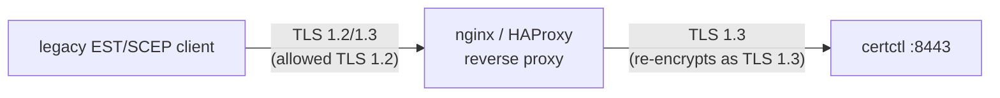

# Legacy Clients (TLS 1.2) — Reverse-Proxy Runbook

> Last reviewed: 2026-05-05

**Audit reference:** Bundle F / M-023. CWE-326 (Inadequate encryption strength).

## What this is

certctl's control plane pins `tls.Config.MinVersion = tls.VersionTLS13`
(`cmd/server/tls.go:131`). Some embedded EST (RFC 7030) and SCEP (RFC 8894)
clients only speak TLS 1.0/1.1/1.2 — those clients cannot complete the
handshake against certctl directly. This runbook documents the supported
operator pattern: terminate the legacy TLS version at a front-door reverse
proxy and pass the request through to certctl over TLS 1.3.

## Why TLS 1.3 minimum

certctl's audit posture and the M-001 PBKDF2 work factor both assume
modern transport crypto. TLS 1.2 with the cipher suites still in the
wild has known attack surface (BEAST, POODLE, ROBOT, raccoon — all
CVE-categorized); allowing TLS 1.2 directly on the certctl listener
would invalidate the guarantee that the server-side encryption chain
is the strongest the ecosystem currently supports.

## When this runbook applies

You need this if **all three** are true:

1. You operate certctl with EST or SCEP enabled (`CERTCTL_EST_ENABLED=true`
   or `CERTCTL_SCEP_ENABLED=true`).
2. Your enrolling clients are embedded devices (printers, network
   appliances, IoT boards, legacy MFPs, point-of-sale terminals) whose TLS
   stack pre-dates 2018 and only speaks TLS 1.2 or older.
3. Replacing those clients is not feasible on a 6-month horizon.

If your enrolling clients are modern (any current Linux/Windows/macOS
host, anything Go-based, anything Rust/Python/Node from 2019 onward),
they speak TLS 1.3 natively and this runbook is unnecessary — point them
straight at certctl on `:8443`.

## Architecture



The reverse proxy:

- Terminates the legacy-version TLS handshake on the public-facing port.
- Forwards the request to certctl over TLS 1.3 on a private network.
- (For EST mTLS) forwards the client certificate via an
  `X-SSL-Client-Cert` header that certctl reads only when the connection
  arrives from a configured-trusted source IP.

## nginx config

```nginx
upstream certctl_backend {
    # Private-network address; not reachable from outside the proxy host.
    server 10.0.0.10:8443;
}

server {
    listen 443 ssl http2;
    server_name est.example.com;

    # Public-facing legacy listener. ssl_protocols includes TLSv1.2 explicitly.
    # Keep ssl_ciphers conservative — only strong AEAD suites with forward
    # secrecy.
    ssl_certificate     /etc/nginx/certs/est.example.com.fullchain.pem;
    ssl_certificate_key /etc/nginx/certs/est.example.com.key;
    ssl_protocols       TLSv1.2 TLSv1.3;
    ssl_ciphers         ECDHE-ECDSA-AES256-GCM-SHA384:ECDHE-RSA-AES256-GCM-SHA384:ECDHE-ECDSA-CHACHA20-POLY1305:ECDHE-RSA-CHACHA20-POLY1305:ECDHE-ECDSA-AES128-GCM-SHA256:ECDHE-RSA-AES128-GCM-SHA256;
    ssl_prefer_server_ciphers on;

    # mTLS for EST: optional client cert, verified against the EST CA.
    ssl_client_certificate /etc/nginx/certs/est-clients-ca.pem;
    ssl_verify_client      optional;

    location ~ ^/\.well-known/(est|pki) {
        # Forward the client cert (if presented) to certctl over the
        # private hop. The current certctl implementation IGNORES the
        # X-SSL-Client-Cert header (header-agnostic by default — see
        # the certctl-side configuration section below). EST/SCEP
        # authentication still works correctly because both protocols
        # carry their own auth (CSR signature for EST, challengePassword
        # for SCEP) inside the request body.
        proxy_set_header X-SSL-Client-Cert  $ssl_client_escaped_cert;
        proxy_set_header X-Forwarded-For    $remote_addr;
        proxy_set_header X-Forwarded-Proto  $scheme;

        # The proxy-to-certctl hop is itself TLS 1.3.
        proxy_pass https://certctl_backend;
        proxy_ssl_protocols TLSv1.3;
        proxy_ssl_verify    on;
        proxy_ssl_trusted_certificate /etc/nginx/certs/certctl-internal-ca.pem;
    }

    # SCEP endpoints — same pattern, no client-cert requirement
    # (SCEP authenticates via challengePassword inside the CSR).
    location ^~ /scep {
        proxy_set_header X-Forwarded-For    $remote_addr;
        proxy_set_header X-Forwarded-Proto  $scheme;
        proxy_pass https://certctl_backend;
        proxy_ssl_protocols TLSv1.3;
        proxy_ssl_verify    on;
        proxy_ssl_trusted_certificate /etc/nginx/certs/certctl-internal-ca.pem;
    }
}
```

## HAProxy config (alternative)

```
frontend est_legacy
    bind *:443 ssl crt /etc/haproxy/certs/est.example.com.pem alpn h2,http/1.1 \
        ssl-min-ver TLSv1.2 \
        ciphers ECDHE-ECDSA-AES256-GCM-SHA384:ECDHE-RSA-AES256-GCM-SHA384

    acl is_est_path  path_beg /.well-known/est
    acl is_pki_path  path_beg /.well-known/pki
    acl is_scep_path path_beg /scep
    use_backend certctl_backend if is_est_path or is_pki_path or is_scep_path
    default_backend certctl_modern

backend certctl_backend
    server certctl 10.0.0.10:8443 ssl verify required \
        ca-file /etc/haproxy/certs/certctl-internal-ca.pem \
        ssl-min-ver TLSv1.3
    http-request set-header X-Forwarded-For %[src]
    http-request set-header X-Forwarded-Proto https
```

## certctl-side configuration

The current implementation is **header-agnostic**: certctl ignores any
`X-SSL-Client-Cert` / `X-Forwarded-For` headers from the proxy. EST
authentication still happens via in-protocol CSR signature + profile
policy (RFC 7030 §3.2.3); SCEP authentication still happens via the
`challengePassword` attribute embedded in the CSR (RFC 8894 §3.2). Both
mechanisms are inside the request body and survive the reverse-proxy
hop without server-side header trust.

**Why this is the correct default:** trusting a proxy-supplied header
for client identity opens a header-spoofing attack surface that requires
careful design (CIDR allowlist of trusted proxies, fail-closed defaults,
explicit operator opt-in). The Bundle F closure of M-023 ships the
TLS-bridge guidance as documentation only; a future commit can extend
certctl with proxy-header trust if and when an operator demonstrates a
deployment shape that requires it. Until that lands, the runbook above
is operationally complete: legacy EST and SCEP clients continue to
authenticate via their in-protocol mechanisms, and the reverse proxy is
purely a TLS-version bridge.

If your deployment requires proxy-supplied client identity (e.g., the
proxy terminates mTLS and you want certctl to record the client-cert
subject in the audit trail beyond what the CSR carries), open an issue
and a future commit will add a header-trust contract behind two
fail-closed env vars: a CIDR allowlist of trusted proxies, plus an
explicit opt-in toggle. Both knobs would be required together; setting
only one would fail loud at startup. Until that work ships, the
header-agnostic default described above is the only supported
configuration.

## TLS posture summary

The configuration above:

- Pins TLS 1.2 + TLS 1.3 only (no SSLv3, TLS 1.0, TLS 1.1).
- Uses only AEAD cipher suites with forward secrecy (ECDHE-* with GCM or
  ChaCha20-Poly1305).
- Re-encrypts to TLS 1.3 on the proxy-to-certctl hop so the certctl
  listener never speaks anything below 1.3.

That is the strongest posture currently achievable while still allowing
the legacy clients to enroll. Reviewers looking for the attestation
should be pointed at this section + the proxy's TLS config.

## What this runbook does NOT cover

- **Replacing the legacy clients.** That's the long-term fix; this
  runbook is the bridge while you're migrating.
- **Network segmentation.** The reverse proxy assumes the proxy-to-certctl
  hop is on a network that an external attacker can't reach. If it's
  not, you need a deeper architecture review.
- **Client-cert revocation.** EST mTLS revocation is the relying party's
  responsibility. certctl's EST handler accepts the cert; the proxy can
  enforce CRL/OCSP via `ssl_crl_path` (nginx) or `crl-file` (HAProxy).

## When TLS 1.2 itself sunsets

Major browsers and OS vendors will eventually deprecate TLS 1.2. When
that happens, this runbook becomes obsolete; the only path forward
will be to replace the legacy clients. Watch the IETF TLS working
group, the major browser vendors' announcement channels, and your
own embedded-device vendors for deprecation notices.

## Related docs

- [`docs/operator/tls.md`](tls.md) — the certctl-internal TLS configuration (HTTPS-only control plane, MinVersion pin)
- [`docs/operator/security.md`](security.md) — overall security posture
- [`docs/operator/database-tls.md`](database-tls.md) — Postgres TLS opt-in (Bundle B / M-018)
- [`docs/reference/protocols/scep-server.md`](../reference/protocols/scep-server.md) — SCEP RFC 8894 native server reference
- [`docs/reference/protocols/est.md`](../reference/protocols/est.md) — EST RFC 7030 server reference
