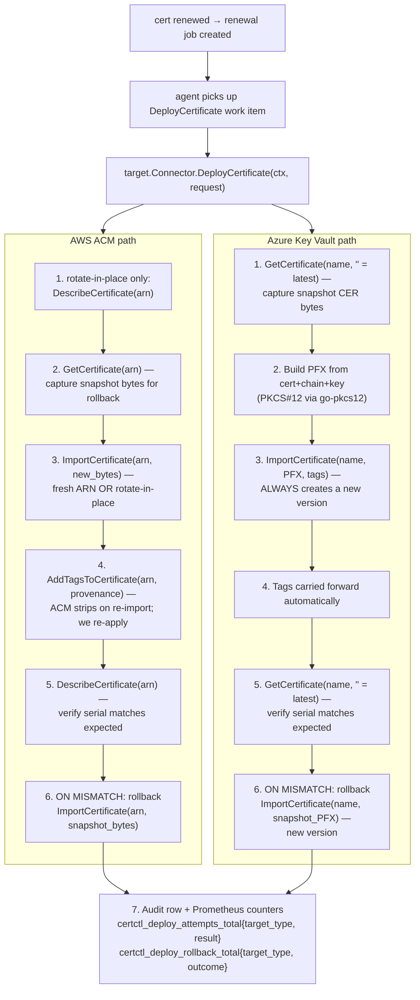

# Runbook: cloud-target deployment connectors (AWS ACM + Azure Key Vault)

> Last reviewed: 2026-05-05

This runbook covers the SDK-driven cloud target connectors that ship in
certctl post-2026-05-03 (Rank 5 of the Infisical deep-research
deliverable). It complements the operator-facing
[AWS Certificate Manager](connectors.md#aws-certificate-manager-acm) and
[Azure Key Vault](connectors.md#azure-key-vault) sections in
`docs/connectors.md`.

Audience: a platform sysadmin or SRE who needs to configure, debug, or
audit certctl's cloud-target deploys. Not a walkthrough of how to
install certctl.

---

## End-to-end flow (cloud targets)



---

## Configuring an AWS ACM target

### Minimum config

```bash
curl -X POST https://certctl.example.com/api/v1/targets \
  -H 'Authorization: Bearer ${TOKEN}' \
  -H 'Content-Type: application/json' \
  -d '{
    "name": "Production ALB cert",
    "type": "AWSACM",
    "agent_id": "ag-server",
    "config": {
      "region": "us-east-1",
      "tags": {"env": "production"}
    }
  }'
```

Empty `certificate_arn` on first deploy = ACM creates a fresh ARN; the
deployment record's Metadata captures it. Update the
`deployment_targets.config.certificate_arn` field via the GUI / API /
direct SQL to pin the ARN for subsequent renewals.

### Minimum IAM policy

```json
{
  "Version": "2012-10-17",
  "Statement": [{
    "Effect": "Allow",
    "Action": [
      "acm:ImportCertificate",
      "acm:GetCertificate",
      "acm:DescribeCertificate",
      "acm:ListCertificates",
      "acm:AddTagsToCertificate"
    ],
    "Resource": "arn:aws:acm:us-east-1:*:certificate/*"
  }]
}
```

Pin `Resource` to the specific region / account where the ALB lives.
Cross-account deploys use AssumeRole — configure the agent's role with
`sts:AssumeRole` against the target account's role ARN.

### Auth: IRSA (recommended for EKS-hosted agents)

```yaml
apiVersion: v1
kind: ServiceAccount
metadata:
  name: certctl-agent
  namespace: certctl-system
  annotations:
    eks.amazonaws.com/role-arn: arn:aws:iam::123456789012:role/certctl-acm-deployer
```

Trust policy on `certctl-acm-deployer`:

```json
{
  "Version": "2012-10-17",
  "Statement": [{
    "Effect": "Allow",
    "Principal": {
      "Federated": "arn:aws:iam::123456789012:oidc-provider/oidc.eks.us-east-1.amazonaws.com/id/EXAMPLE"
    },
    "Action": "sts:AssumeRoleWithWebIdentity",
    "Condition": {
      "StringEquals": {
        "oidc.eks.us-east-1.amazonaws.com/id/EXAMPLE:sub": "system:serviceaccount:certctl-system:certctl-agent"
      }
    }
  }]
}
```

---

## Configuring an Azure Key Vault target

### Minimum config

```bash
curl -X POST https://certctl.example.com/api/v1/targets \
  -H 'Authorization: Bearer ${TOKEN}' \
  -H 'Content-Type: application/json' \
  -d '{
    "name": "Production AGW cert",
    "type": "AzureKeyVault",
    "agent_id": "ag-server",
    "config": {
      "vault_url": "https://prod-vault.vault.azure.net",
      "certificate_name": "api-prod",
      "credential_mode": "managed_identity",
      "tags": {"env": "production"}
    }
  }'
```

### Minimum RBAC role

Off-the-shelf builtin: **Key Vault Certificates Officer** (assigns at
the vault scope).

Custom minimum-permission role:

```json
{
  "properties": {
    "roleName": "certctl-keyvault-deployer",
    "description": "Minimum permissions for certctl Key Vault target",
    "assignableScopes": [
      "/subscriptions/<sub>/resourceGroups/<rg>/providers/Microsoft.KeyVault/vaults/<vault-name>"
    ],
    "permissions": [{
      "actions": [],
      "notActions": [],
      "dataActions": [
        "Microsoft.KeyVault/vaults/certificates/import/action",
        "Microsoft.KeyVault/vaults/certificates/read",
        "Microsoft.KeyVault/vaults/certificates/listversions/read"
      ],
      "notDataActions": []
    }]
  }
}
```

### Auth: AKS workload identity (recommended for AKS-hosted agents)

Annotate the agent's ServiceAccount:

```yaml
apiVersion: v1
kind: ServiceAccount
metadata:
  name: certctl-agent
  namespace: certctl-system
  annotations:
    azure.workload.identity/client-id: <app-registration-client-id>
  labels:
    azure.workload.identity/use: "true"
```

Federated credential on the app registration:

```json
{
  "name": "certctl-agent-federated",
  "issuer": "https://<oidc-issuer-url>",
  "subject": "system:serviceaccount:certctl-system:certctl-agent",
  "audiences": ["api://AzureADTokenExchange"]
}
```

Set `credential_mode: workload_identity` on the deployment_target
config.

---

## Operator playbook

### "Did the cert get imported to ACM / Key Vault?"

**AWS:**

```bash
aws acm describe-certificate \
  --certificate-arn arn:aws:acm:us-east-1:...:certificate/<id> \
  --query 'Certificate.{Status:Status,Serial:Serial,Issued:IssuedAt,NotAfter:NotAfter,Tags:[Tags]}'
```

**Azure:**

```bash
az keyvault certificate show \
  --vault-name prod-vault \
  --name api-prod \
  --query '{Serial:x509ThumbprintHex, Version:id, NotAfter:attributes.expires}'
```

In both cases, the `certctl-managed-by` tag confirms the cert was
imported by certctl (and not someone running aws-cli directly).

### "Why did the rollback fail?"

The Prometheus counter
`certctl_deploy_rollback_total{outcome="also_failed"}` ticks when the
rollback's own ImportCertificate / Set call also returns an error. Look
at the agent's slog at ERROR level for the per-call diagnostic; the
underlying cloud SDK error message tells you whether it was IAM
denial, throttling, or a structural input problem.

Manual recovery:

**AWS ACM:**

```bash
# Get the snapshot of a known-good cert from S3 / Vault / wherever the
# operator stores backup PEMs:
aws acm import-certificate \
  --certificate fileb://known-good.crt \
  --private-key  fileb://known-good.key \
  --certificate-chain fileb://known-good.chain \
  --certificate-arn  arn:aws:acm:us-east-1:...:certificate/<id> \
  --tags Key=certctl-managed-by,Value=manual-recovery
```

**Azure Key Vault:**

```bash
# Import a fresh PFX as a new version under the same name:
az keyvault certificate import \
  --vault-name prod-vault \
  --name api-prod \
  --file known-good.pfx \
  --tags certctl-managed-by=manual-recovery
```

After the manual recovery, certctl's next renewal-loop tick re-verifies
the live cert via `ValidateDeployment` and resumes normal operation.

### "How do I know certctl is the only one writing to this ARN / vault cert?"

**AWS — via CloudTrail:**

```
EventName = "ImportCertificate"
Resources.ARN = "arn:aws:acm:us-east-1:...:certificate/<id>"
```

Filter by user identity to see which principal made each call. The
certctl agent's IAM role / IRSA-bound role should be the only writer.

**Azure — via Activity Log:**

```bash
az monitor activity-log list \
  --resource-id /subscriptions/<sub>/resourceGroups/<rg>/providers/Microsoft.KeyVault/vaults/<vault>/certificates/<name> \
  --offset 30d \
  --query "[?operationName.value=='Microsoft.KeyVault/vaults/certificates/import/action'].{caller:caller, time:eventTimestamp}"
```

---

## Cardinality + cost

- Per-target-type Prometheus counters: 2 new
  `certctl_deploy_attempts_total` series (AWSACM + AzureKeyVault) ×
  2 results = 4 series. Comfortable.
- AWS ACM costs: ImportCertificate is free; CloudTrail logs at $2 per
  GB. Renewing 100 certs/month adds ~10 KB to CloudTrail.
- Azure Key Vault costs: certificate operations $0.03 per 10K
  operations (V2 pricing as of 2026-05). 100 certs/month = $0.0009 in
  cert-op spend. Activity Log retention is configurable (default 90
  days, free).

---

## V3-Pro forward path

Tracked at `cowork/WORKSPACE-ROADMAP.md` under "Adapter hardening":

- **AWS CloudFront direct-attach** — UpdateDistribution after an ACM
  ImportCertificate so the CloudFront edge picks up the new cert
  without operator intervention. Requires `cloudfront:UpdateDistribution`
  IAM permission on top of the ACM minimum.
- **Azure Front Door direct-attach** — UpdateRoutingConfig equivalent.
- **AWS ALB / Azure App Gateway auto-bind** — currently operators
  attach the ARN / KID URI to the LB out-of-band (Terraform);
  V3-Pro adds the auto-attach step.
- **Soft-delete recovery for Azure Key Vault** — V2 always
  re-imports as a new version; V3 detects soft-deleted prior
  versions and offers operator-confirmed recovery.
- **GCP Certificate Manager target** — Google Cloud's equivalent to
  ACM; mirrors the AWS ACM connector shape. Separate cloud,
  separate connector.
