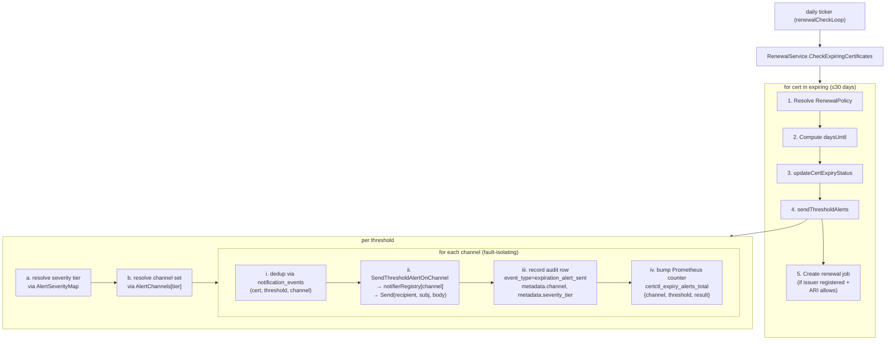

# Runbook: certificate-expiry alerts (multi-channel)

> Last reviewed: 2026-05-05

This runbook covers the per-policy multi-channel expiry-alert dispatch
path that ships in certctl post-2026-05-03 (Rank 4 of the Infisical
deep-research deliverable). It complements the operator-facing
[Routing expiry alerts across channels](connectors.md#routing-expiry-alerts-across-channels)
section in `docs/connectors.md`.

Audience: a platform sysadmin or on-call engineer who needs to
configure, debug, or audit certctl's expiry-alert routing. Not a
walkthrough of how to install certctl — that lives in the README.

---

## End-to-end flow



The dispatch loop's per-channel error handling is
**fault-isolating**: PagerDuty's failure does NOT skip Slack/Email
at the same threshold. Each channel runs independently, with its
own dedup row + audit row + metric increment.

---

## Configuring the per-policy channel matrix

The matrix is a property of `RenewalPolicy`. Two new JSONB columns
on the `renewal_policies` table back it (migration 000026):

- `alert_channels JSONB` — `map[severity_tier][]channel_name`. Default `{}`
  → fall through to `DefaultAlertChannels` (Email-only at every tier).
- `alert_severity_map JSONB` — `map[threshold_days]severity_tier`. Default
  `{}` → fall through to `DefaultAlertSeverityMap` (`30→informational,
  14→warning, 7→warning, 0→critical`).

### Example: production-grade routing

```bash
curl -X PUT https://certctl.example.com/api/v1/renewal-policies/rp-production \
  -H 'Authorization: Bearer ${TOKEN}' \
  -H 'Content-Type: application/json' \
  -d '{
    "name": "Production CDN renewal policy",
    "renewal_window_days": 30,
    "auto_renew": true,
    "max_retries": 3,
    "retry_interval_seconds": 300,
    "alert_thresholds_days": [30, 14, 7, 0],
    "alert_channels": {
      "informational": ["Slack"],
      "warning":       ["Slack", "Email"],
      "critical":      ["PagerDuty", "OpsGenie", "Email"]
    },
    "alert_severity_map": {
      "30": "informational",
      "14": "warning",
      "7":  "warning",
      "0":  "critical"
    }
  }'
```

After this PUT, the next renewal-loop tick that finds a cert under
this policy will fan out alerts as documented above.

### Example: opt out of informational alerts

If your team doesn't want T-30 informational alerts (you'd rather
hear about a cert only at warning tier and beyond):

```json
"alert_channels": {
  "informational": [],
  "warning":       ["Email"],
  "critical":      ["PagerDuty", "Email"]
}
```

The empty `informational` list causes the dispatch loop to record
an `expiration_alert_skipped_no_channels` audit row at T-30 and
skip the dispatch. Other tiers still fire.

---

## Operator playbook

### "Did the on-call team get paged?"

```sql
SELECT created_at,
       metadata->>'channel'        AS channel,
       metadata->>'threshold_days' AS threshold,
       metadata->>'severity_tier'  AS severity
FROM audit_events
WHERE event_type = 'expiration_alert_sent'
  AND resource_id = '<cert-id>'
ORDER BY created_at DESC;
```

One row per (channel, threshold) attempt. If you see a row with
`channel = 'PagerDuty'` and `severity = 'critical'`, the page went
out (or was at least dispatched to the notifier).

### "Why didn't I get an alert at T-7?"

Three places to look:

1. **Audit log** — `SELECT FROM audit_events WHERE event_type IN
   ('expiration_alert_sent','expiration_alert_skipped_no_channels',
   'expiration_alert_skipped_invalid_channel') AND resource_id =
   '<cert-id>'`. If `expiration_alert_skipped_no_channels` appears,
   your policy's tier list is empty for the resolved tier. If
   `expiration_alert_skipped_invalid_channel` appears, your matrix
   has a typo (the `metadata->>'invalid_channel'` field tells you
   which value).

2. **Notifications table** —
   `SELECT FROM notification_events WHERE certificate_id = '<cert-id>'
   AND type = 'ExpirationWarning' ORDER BY created_at DESC`. If
   rows exist with `channel = 'Slack'` and `status = 'failed'`,
   the dispatch reached the channel but the channel rejected the
   send. Look at the `error` column for the upstream message.

3. **Prometheus counters** —
   `curl /api/v1/metrics/prometheus | grep certctl_expiry_alerts_total`.
   Sustained `{result="failure"}` counts indicate a notifier
   connector misconfiguration (bad webhook URL, expired API key,
   etc.).

### "How do I test the matrix without waiting for a real expiry?"

certctl ships an admin endpoint for this:

```bash
curl -X POST https://certctl.example.com/api/v1/admin/notifications/test \
  -H 'Authorization: Bearer ${TOKEN}' \
  -H 'Content-Type: application/json' \
  -d '{
    "certificate_id": "mc-test-cert",
    "threshold_days": 0,
    "channel": "PagerDuty"
  }'
```

This calls `NotificationService.SendThresholdAlertOnChannel`
directly and bypasses the renewal loop's threshold check. Useful
for "did I configure PagerDuty correctly?" without having to set
up a deliberately-expiring cert. The admin endpoint requires
`role=admin` (V3-Pro RBAC); V2 deploys gate it on the bearer
token only.

### "How do I rotate a notifier credential without downtime?"

1. Update the `CERTCTL_PAGERDUTY_ROUTING_KEY` (or equivalent) env
   var in your deployment.
2. Restart `certctl-server`. The notifier registry rebuilds
   with the new credential.
3. Confirm with the admin-test endpoint above against the cert
   you most care about.

The renewal loop is idempotent — a missed tick during the restart
window does NOT cause double-dispatch on the next tick (per-channel
dedup on the `notification_events` table guards against that).

---

## Cardinality + cost

- Default 6 channels × 4 thresholds × 3 results = **72 Prometheus series**.
- Custom-thresholds policies (e.g. `[60, 45, 30, 14, 7, 3, 1, 0]`)
  expand the threshold dimension proportionally — 6 × 8 × 3 = 144 series.
- Closed-enum discipline at the dispatch site means typos in
  `alert_channels` do NOT grow this count.
- A daily renewal-loop tick over 10K certs each policy-bound to the
  matrix above produces O(channels × thresholds × certs) audit rows
  + notification rows in the worst case (every cert has crossed
  every threshold and no dedup applies). Operators sizing
  Postgres should plan for an `audit_events` row count on the
  order of `unique_certs × channels_per_critical_tier` per fan-out
  batch — which is ~3-5× the pre-Rank-4 row count.

---

## V3-Pro forward path

Tracked at `cowork/WORKSPACE-ROADMAP.md` under "Adapter hardening":

- Per-owner / per-team / per-tenant channel routing (the matrix is
  per-policy today, not per-owner).
- Calendar-aware suppression (no T-30 alerts on weekends for non-
  on-call teams).
- Escalation chains (T-1 unanswered for 30m → escalate to
  manager's PagerDuty).
- Per-channel rate limiting (downstream of I-005's retry+DLQ).
