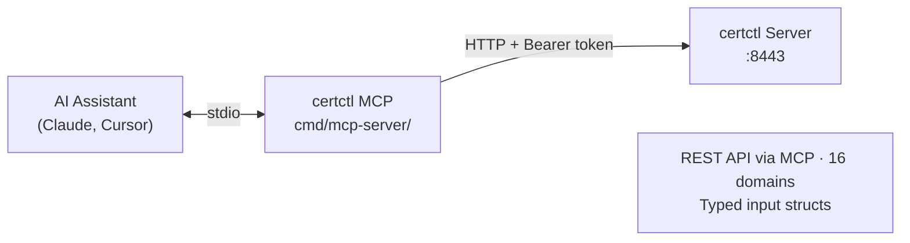

# MCP Server Guide

> Last reviewed: 2026-05-05

certctl ships with an MCP (Model Context Protocol) server that lets AI assistants manage your certificate infrastructure through natural language. Ask Claude to "show me all expiring certificates," "revoke the VPN cert," or "what agents are offline?" and the MCP server translates that into API calls against your certctl instance.

This guide covers setup, configuration, and usage with Claude, Cursor, and other MCP-compatible tools.

## What Is MCP?

MCP is an open protocol that connects AI assistants to external tools and data sources. Instead of copying and pasting API responses into a chat window, MCP lets the AI call your tools directly. The certctl MCP server exposes the certctl API as MCP tools (re-derive count via `grep -cE 'mcp\.AddTool\(' internal/mcp/tools.go`) — the AI sees typed schemas describing what each tool does, what parameters it accepts, and what it returns.

The MCP server is a separate binary (`cmd/mcp-server/`) that communicates via stdio transport. It's a stateless HTTP proxy: every MCP tool call becomes an HTTP request to the certctl REST API. No new state, no new database tables, no new attack surface beyond what the API already exposes.

## Prerequisites

You need:

1. A running certctl server (see [Quick Start](../getting-started/quickstart.md))
2. The MCP server binary — either built from source or from a Docker image
3. An MCP-compatible AI client (Claude Desktop, Cursor, VS Code with Copilot, etc.)

## Building the MCP Server

```bash
cd certctl
go build -o certctl-mcp ./cmd/mcp-server/
```

The binary has zero runtime dependencies beyond the certctl server it connects to.

## Configuration

The MCP server reads three environment variables:

| Variable | Required | Default | Description |
|----------|----------|---------|-------------|
| `CERTCTL_SERVER_URL` | No | `https://localhost:8443` | URL of the certctl REST API (HTTPS-only as of v2.2) |
| `CERTCTL_API_KEY` | No | (empty) | API key for authentication (passed as `Bearer` token) |
| `CERTCTL_SERVER_CA_BUNDLE_PATH` | Yes (for self-signed / internal CA) | (empty) | Path to PEM CA bundle that signed the server cert. Required when the server cert isn't rooted in the system trust store (the default compose stack ships a self-signed cert at `deploy/test/certs/ca.crt`). |

If your certctl server has auth enabled (the default), you must provide the API key. The MCP server passes it through to every HTTP request.

Since v2.2 the certctl control plane is HTTPS-only. If the server cert is self-signed or chained to an internal CA, set `CERTCTL_SERVER_CA_BUNDLE_PATH` so the MCP server can verify the TLS handshake. Never set `CERTCTL_SERVER_TLS_INSECURE_SKIP_VERIFY=true` outside local development — it disables all certificate validation.

## Setting Up with Claude Desktop

Add this to your Claude Desktop MCP configuration file (`~/Library/Application Support/Claude/claude_desktop_config.json` on macOS, `%APPDATA%\Claude\claude_desktop_config.json` on Windows):

```json
{
  "mcpServers": {
    "certctl": {
      "command": "/path/to/certctl-mcp",
      "env": {
        "CERTCTL_SERVER_URL": "https://localhost:8443",
        "CERTCTL_SERVER_CA_BUNDLE_PATH": "/path/to/certctl/deploy/test/certs/ca.crt",
        "CERTCTL_API_KEY": "your-api-key-here"
      }
    }
  }
}
```

Restart Claude Desktop. You should see "certctl" appear in the MCP tools list (the available-tools count varies by certctl version; the exact set is enumerated in `internal/mcp/tools.go`).

## Setting Up with Cursor

In Cursor, go to Settings → MCP Servers and add:

```json
{
  "certctl": {
    "command": "/path/to/certctl-mcp",
    "env": {
      "CERTCTL_SERVER_URL": "https://localhost:8443",
      "CERTCTL_SERVER_CA_BUNDLE_PATH": "/path/to/certctl/deploy/test/certs/ca.crt",
      "CERTCTL_API_KEY": "your-api-key-here"
    }
  }
}
```

## Setting Up with Claude Code

Add certctl as an MCP server in your project's `.mcp.json`:

```json
{
  "mcpServers": {
    "certctl": {
      "command": "/path/to/certctl-mcp",
      "env": {
        "CERTCTL_SERVER_URL": "https://localhost:8443",
        "CERTCTL_SERVER_CA_BUNDLE_PATH": "/path/to/certctl/deploy/test/certs/ca.crt",
        "CERTCTL_API_KEY": "your-api-key-here"
      }
    }
  }
}
```

## Available Tools

The MCP server exposes the full REST API organized across 16 resource domains:

| Domain | Tools | Examples |
|--------|-------|---------|
| Certificates | 9 | List, get, create, update, archive, versions, renew, deploy, revoke |
| CRL & OCSP | 3 | Get JSON CRL, get DER CRL by issuer, check OCSP status |
| Issuers | 6 | List, get, create, update, delete, test connection |
| Targets | 5 | List, get, create, update, delete |
| Agents | 8 | List, get, register, heartbeat, CSR submit, certificate pickup, get work, report job status |
| Jobs | 5 | List, get, cancel, approve, reject |
| Policies | 6 | List, get, create, update, delete, list violations |
| Profiles | 5 | List, get, create, update, delete |
| Teams | 5 | List, get, create, update, delete |
| Owners | 5 | List, get, create, update, delete |
| Agent Groups | 6 | List, get, create, update, delete, list members |
| Audit | 2 | List events (with filters), get event by ID |
| Notifications | 3 | List, get, mark as read |
| Stats | 5 | Summary, certs by status, expiration timeline, job trends, issuance rate |
| Metrics | 1 | System metrics (gauges, counters, uptime) |
| Health | 4 | Health check, readiness probe, auth info, auth check |

Every tool has typed input parameters with `jsonschema` descriptions, so the AI knows exactly what arguments to provide and what each field means.

## Example Conversations

Once configured, you can interact with certctl through natural language:

**"Show me all certificates expiring in the next 14 days"**
The AI calls `certctl_list_certificates` with `status=Expiring` and interprets the results.

**"Renew the API production certificate"**
The AI calls `certctl_trigger_renewal` with `id=mc-api-prod`.

**"Who owns the payments gateway cert?"**
The AI calls `certctl_get_certificate` with `id=mc-payments-prod` and reads the `owner_id` and `team_id` fields.

**"Are any agents offline?"**
The AI calls `certctl_list_agents` and checks the heartbeat timestamps.

**"Revoke the old VPN cert — the key was compromised"**
The AI calls `certctl_revoke_certificate` with `id=mc-vpn-old` and `reason=keyCompromise`.

**"Give me a summary of the certificate fleet"**
The AI calls `certctl_dashboard_summary` for aggregate stats, then optionally `certctl_certificates_by_status` for the breakdown.

**"Create a new cert for staging.api.example.com owned by the platform team"**
The AI calls `certctl_create_certificate` with the common name, team ID, and owner ID.

## Architecture



The MCP server is intentionally thin:

- **No state** — every request is a pass-through HTTP call. Restart it anytime.
- **No new auth** — uses the same API key as the REST API.
- **No new dependencies** — just the official MCP Go SDK (`modelcontextprotocol/go-sdk`).
- **No new attack surface** — the AI can only do what the API key allows.

## Security Considerations

The MCP server inherits the security properties of the REST API:

- **API key scoping**: The MCP server uses whatever API key you configure. If certctl gets API key scoping in a future release (per-resource or per-action permissions), the MCP server will automatically respect those restrictions.
- **Audit trail**: Every tool call results in an HTTP request that's logged in the API audit middleware — actor, method, path, status, and latency are all recorded.
- **Read-only usage**: For read-only AI access, you could configure a restricted API key (when key scoping ships). Until then, be aware that the AI can call write endpoints (create, update, delete, revoke) if the API key permits it.
- **No private key exposure**: The MCP server never sees or transmits private keys — the same architectural guarantee as the REST API.

## Troubleshooting

**"MCP server not connecting"**
Check that `CERTCTL_SERVER_URL` is reachable from where the MCP binary runs. Try `curl $CERTCTL_SERVER_URL/health` to verify.

**"401 Unauthorized on every tool call"**
Your `CERTCTL_API_KEY` is missing or wrong. Check the key matches what the certctl server expects.

**"Tool calls return empty results"**
The certctl server might have no data. Run the demo seed (`docker compose up`) to populate demo data, or check that your database has records.

## What's Next

- [Quick Start](quickstart.md) — Get certctl running locally
- [OpenAPI Spec](openapi.md) — Full API reference and SDK generation
- [Architecture](architecture.md) — System design deep dive
- [Concepts](concepts.md) — Certificate lifecycle fundamentals
