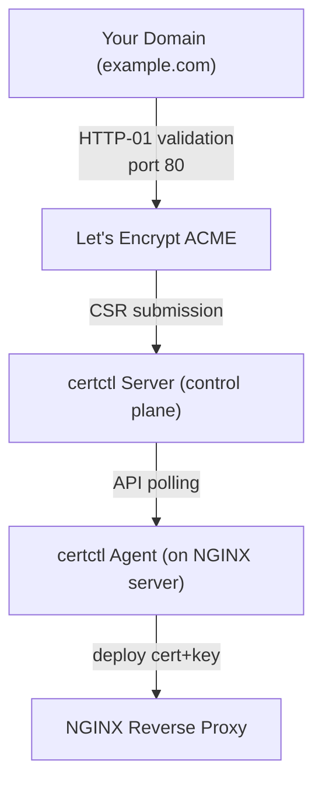

# certctl + NGINX + Let's Encrypt

This example demonstrates certctl's core use case: **automatically manage TLS certificates for NGINX using Let's Encrypt (ACME HTTP-01 challenges).**

## What This Does

- Deploys certctl server (control plane) with PostgreSQL
- Deploys certctl agent on the same network (in production: on your NGINX server)
- Configures Let's Encrypt as the certificate issuer via ACME v2
- Demonstrates HTTP-01 challenge solving (requires port 80 open to the internet)
- Shows how to set up 3 example domains for certificate enrollment and renewal
- Automatically renews certificates 30 days before expiration

## Architecture



## Prerequisites

1. **Docker & Docker Compose** (v20.10+)
2. **A domain name** pointing to your server (e.g., `example.com`)
3. **Ports 80 and 443 open** to the internet (ACME HTTP-01 needs port 80)
4. **Valid email address** for Let's Encrypt account (errors and renewal notices)

If you don't have a real domain or can't open port 80, see [Customization Tips](#customization-tips) below.

## Quick Start

### 1. Clone or copy this example

```bash
cd examples/acme-nginx
```

### 2. Create a `.env` file with your settings

```bash
cat > .env <<'EOF'
# Your email for Let's Encrypt account
ACME_EMAIL=admin@example.com

# Database password (change this in production!)
DB_PASSWORD=certctl-demo-password

# Agent API key (generate a real one in production)
AGENT_API_KEY=agent-demo-key

# Server port (certctl listens here internally on 8443; expose as needed)
SERVER_PORT=8443
EOF
```

### 3. (Optional) Create an NGINX config

If you have a real domain and want NGINX to route traffic:

```bash
cat > nginx.conf <<'EOF'
events {
    worker_connections 1024;
}

http {
    # HTTP block for ACME challenges
    server {
        listen 80;
        server_name example.com www.example.com api.example.com;

        # ACME challenge directory (certctl writes validation files here)
        location /.well-known/acme-challenge/ {
            root /var/www/certbot;
        }

        # Redirect HTTP to HTTPS
        location / {
            return 301 https://$server_name$request_uri;
        }
    }

    # HTTPS block (certificates deployed here by certctl agent)
    server {
        listen 443 ssl http2;
        server_name example.com www.example.com api.example.com;

        ssl_certificate /etc/nginx/ssl/example.com.crt;
        ssl_certificate_key /etc/nginx/ssl/example.com.key;
        ssl_protocols TLSv1.2 TLSv1.3;
        ssl_ciphers HIGH:!aNULL:!MD5;

        location / {
            proxy_pass http://upstream-service;
        }
    }
}
EOF
```

Or just accept the default empty NGINX config for demonstration.

### 4. Start the stack

```bash
docker compose up -d
```

Monitor logs:
```bash
docker compose logs -f certctl-server certctl-agent
```

### 5. Access the dashboard

Navigate to `http://localhost:8443` (or your `SERVER_PORT`)

You should see:
- An empty certificate inventory (no certs issued yet)
- One ACME issuer ("iss-acme") configured and ready
- One agent ("nginx-agent-01") online and heartbeating

### 6. Create a certificate profile

In the certctl dashboard:
1. Go to **Profiles** (sidebar)
2. Click **New Profile**
3. Set:
   - Name: `acme-prod`
   - Key Type: `RSA-2048` (or `ECDSA-P256`)
   - Max TTL: `90 days`
   - Allowed Key Types: `RSA-2048, ECDSA-P256`
4. Save

### 7. Request a certificate

In the certctl dashboard:
1. Go to **Certificates** (sidebar)
2. Click **Request New Certificate**
3. Set:
   - Common Name: `example.com`
   - SANs: `www.example.com`, `api.example.com` (optional)
   - Issuer: `iss-acme` (Let's Encrypt)
   - Profile: `acme-prod`
4. Click **Request**

Behind the scenes:
- Server creates an `Issuance` job
- Agent polls for work, fetches the job
- Agent generates a P-256 key (never sent to server)
- Agent submits CSR to server
- Server sends CSR to Let's Encrypt ACME
- Let's Encrypt provides HTTP-01 challenge token
- Server downloads ACME challenge, returns to agent
- Agent deploys challenge file to NGINX `/.well-known/acme-challenge/`
- Let's Encrypt validates (HTTP GET to `http://example.com/.well-known/acme-challenge/...`)
- Let's Encrypt issues certificate
- Server receives certificate, passes to agent
- Agent deploys cert+key to `/etc/nginx/ssl/example.com.crt` + `.key`
- Agent reloads NGINX (`nginx -s reload`)
- Certificate is now active

### 8. View the certificate

In the dashboard:
1. Go to **Certificates**
2. Click the certificate to see:
   - Common name, SANs, serial number
   - Issuer (Let's Encrypt), not-before/after dates
   - Status (Active, Expiring in N days, Expired)
   - Deployment history (timestamps, agent name, target)
   - Next auto-renewal date (30 days before expiration)

### 9. Set up automatic renewal

The server automatically checks for certificates expiring within 30 days and triggers renewal. You can:
- Adjust the threshold in the certificate's policy
- Manually trigger renewal via dashboard button
- View renewal job status and history

## How It Works

### Certificate Lifecycle

1. **Request** — Operator creates certificate request via dashboard or API
2. **CSR Generation** — Agent generates private key locally, submits CSR to server
3. **ACME Challenge** — Server communicates with Let's Encrypt ACME, obtains challenge
4. **Challenge Proof** — Agent deploys challenge proof to NGINX
5. **Issuance** — Let's Encrypt validates, issues certificate
6. **Deployment** — Agent receives certificate, deploys to NGINX SSL directory
7. **Reload** — Agent signals NGINX to reload (`nginx -s reload`)
8. **Verification** — Agent optionally verifies the live TLS endpoint (handshake fingerprint)
9. **Renewal** — 30 days before expiration, process repeats automatically

### HTTP-01 Challenge

ACME HTTP-01 works like this:
1. Let's Encrypt generates random token (e.g., `abc123def456`)
2. Server returns token to agent
3. Agent writes file: `/.well-known/acme-challenge/abc123def456` with value (random key material)
4. Let's Encrypt performs HTTP GET to `http://example.com/.well-known/acme-challenge/abc123def456`
5. If content matches, domain ownership is proven
6. Certificate is issued

**Requirements:**
- Port 80 must be open to the internet
- DNS must resolve your domain to your server
- NGINX must serve `/.well-known/acme-challenge/` (or certctl mounts a separate directory)

### Agent Key Generation

Keys are generated **on the agent**, never on the server:
1. Agent creates ECDSA P-256 keypair using `crypto/ecdsa`
2. Private key is stored locally on agent at `/var/lib/certctl/keys/` (readable only by certctl process)
3. Agent creates CSR (certificate signing request) with private key
4. Agent submits CSR to server
5. Server never sees the private key
6. Certificate is returned, agent stores it alongside key
7. Both key and cert used for NGINX deployment

This keeps private keys in the infrastructure where they're used, following zero-trust principles.

## Adding More Domains

### Option 1: Additional SANs on Same Certificate

Edit the existing certificate in the dashboard:
1. Click the certificate
2. Edit SANs to add `mail.example.com`, `ftp.example.com`, etc.
3. Trigger renewal
4. Agent generates new CSR with all SANs
5. Let's Encrypt validates each SAN (HTTP-01 for each)
6. Single certificate with multiple SANs is issued

### Option 2: Separate Certificates per Domain

If you want separate certificates (different issuance schedules, different targets):
1. Dashboard → **Certificates** → **Request New Certificate**
2. Common Name: `subdomain.example.com`
3. Set same issuer and profile
4. Request

Each domain gets its own cert, key, and renewal schedule.

### Wildcard Certificates (Not HTTP-01)

HTTP-01 does **not** support wildcard (`*.example.com`). To issue wildcards, use DNS-01 challenge (see [acme-wildcard-dns01](../acme-wildcard-dns01/) example).

## Customization Tips

### Using Let's Encrypt Staging (for testing)

Staging has higher rate limits and doesn't require real domains:

```bash
# In .env or docker-compose.yml override:
CERTCTL_ACME_DIRECTORY_URL=https://acme-staging-v02.api.letsencrypt.org/directory
```

Staging certificates won't be trusted by browsers (fake CA), but you can test the full flow without hitting production rate limits.

### Disabling Port 80 Requirement (Demo Mode)

If you can't open port 80, use ACME DNS-01 instead (requires DNS provider integration). See [acme-wildcard-dns01](../acme-wildcard-dns01/) example.

Or use Local CA for internal testing:
```bash
# Switch issuer to Local CA (not public-trusted, but no challenge needed)
CERTCTL_ACME_DIRECTORY_URL=  # Leave empty to disable ACME
# (then configure Local CA instead)
```

### Custom NGINX Config

Replace `nginx.conf` with your own before `docker compose up`. The agent doesn't manage the NGINX config — it only deploys certificates. You're responsible for:
- Configuring SSL paths (`ssl_certificate`, `ssl_certificate_key`)
- Setting up challenge directory (`/.well-known/acme-challenge/`)
- Pointing NGINX to agent-deployed certificates

### Database Persistence

PostgreSQL data is stored in the `postgres_data` volume. To reset:
```bash
docker compose down -v  # Destroy all volumes
```

### Viewing Agent Logs

```bash
docker compose logs -f certctl-agent
```

Look for:
- `Heartbeat successful` — agent is communicating with server
- `CSR submitted` — key generation and CSR submission worked
- `Deployment succeeded` — certificate deployed to NGINX
- `NGINX reload` — signal sent to reload

### Testing ACME Without Real Domain

Use `nip.io` (free DNS service):
1. Deploy to a server with a public IP
2. Use domain: `<your-ip>.nip.io` (e.g., `203.0.113.45.nip.io`)
3. Let's Encrypt will validate to that IP
4. Change ACME_EMAIL to a real email you control

## Production Checklist

Before running in production:

- [ ] Change `DB_PASSWORD` to a strong random password
- [ ] Generate a real API key for the agent (don't use the demo key)
- [ ] Enable `CERTCTL_AUTH_TYPE=api-key` and enforce authentication
- [ ] Use Let's Encrypt production directory (not staging)
- [ ] Configure `CERTCTL_CORS_ORIGINS` to restrict cross-origin access
- [ ] Use `CERTCTL_KEYGEN_MODE=agent` (default, but verify)
- [ ] Set `CERTCTL_LOG_LEVEL=warn` to reduce log noise
- [ ] Configure email notifications for certificate expiration alerts
- [ ] Set up log aggregation (Datadog, ELK, Splunk, etc.)
- [ ] Use docker secrets or external secret manager for credentials (not .env)
- [ ] Run agent on actual NGINX servers (not co-located with server for HA)
- [ ] Set up monitoring and alerting on agent heartbeat and job completion
- [ ] Implement backup/restore for PostgreSQL
- [ ] Use TLS for certctl server (terminate at reverse proxy or load balancer)

## Troubleshooting

### Agent heartbeat failing
```bash
docker compose logs certctl-agent
# Check: CERTCTL_SERVER_URL, CERTCTL_API_KEY, network connectivity
```

### ACME challenge failing
```bash
# Ensure port 80 is open: curl http://example.com/.well-known/acme-challenge/test
# Check NGINX is running and serving /.well-known/acme-challenge/
# Verify DNS resolves domain to your server: dig example.com
```

### NGINX reload failing
Check agent permissions on NGINX socket and that NGINX is reachable from agent container.

### Let's Encrypt rate limited
Let's Encrypt has rate limits (50 certs per domain per week). Use staging to test, or wait a week.

### Certificate not deployed to NGINX
Check agent logs for deployment errors. Verify `/etc/nginx/ssl` volume is writable by agent container.

## Next Steps

- **Wildcard certificates**: See [acme-wildcard-dns01](../acme-wildcard-dns01/) example
- **Multiple issuers**: See [multi-issuer](../multi-issuer/) example
- **Private CA**: See [private-ca-traefik](../private-ca-traefik/) example
- **Dashboard deep dive**: Read [docs/quickstart.md](../../docs/quickstart.md)
- **REST API**: Explore [api/openapi.yaml](../../api/openapi.yaml)

## Support

For issues or questions:
- Check [docs/troubleshooting.md](../../docs/troubleshooting.md)
- Open an issue on GitHub
- Review server and agent logs: `docker compose logs -f`
