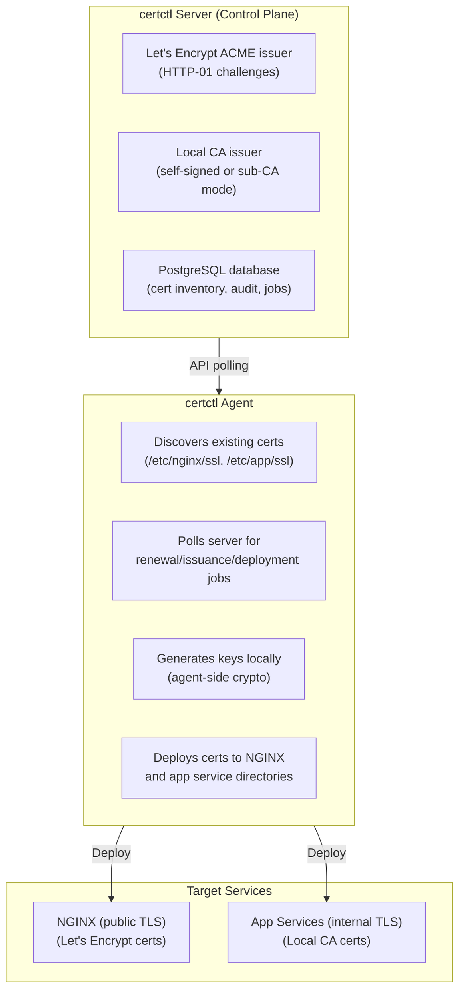

# Multi-Issuer Example: ACME + Local CA

This example demonstrates certctl managing **both public and internal certificates from a single dashboard**. Public-facing services use Let's Encrypt (ACME), while internal services use a private Local CA — all visible and managed in one place.

> **Operational notes** shared by every example (postgres password rotation trap, TLS provisioning, teardown semantics) live in [`../README.md`](../README.md). Read it first if you plan to change `DB_PASSWORD` after the initial `docker compose up` — the postgres volume binds the password on first boot only.

## The Use Case

You have:
- **Public-facing services** (web app, API, etc.) that need TLS certs signed by a trusted public CA (Let's Encrypt)
- **Internal services** (databases, microservices, middleware) that need TLS certs but don't require public trust
- **One team** managing certs across both, needing unified visibility and automated renewal

With certctl, both issuer types are configured and available. You assign each certificate to the appropriate issuer via its profile or at enrollment time. The dashboard shows all certs together, with renewal status, expiration timelines, and audit trails — regardless of which CA issued them.

## Architecture



## Prerequisites

- **Docker & Docker Compose** — containers run everything
- **Port access** — 80 (HTTP-01 challenges) and 443 (HTTPS) for Let's Encrypt
- **Domain for ACME** (optional) — if using real Let's Encrypt, not needed for demo
- **Internet connectivity** — to reach Let's Encrypt's API (demo can use staging directory)

## TLS Security

certctl is HTTPS-only as of v2.2. The demo compose stack provisions a self-signed certificate. When accessing `https://localhost:8443`, you can either:
- Use `curl --cacert ./deploy/test/certs/ca.crt ...` to pin the CA certificate
- Use `curl -k ...` for quick smoke tests (never in production)
- Import the CA at `./deploy/test/certs/ca.crt` into your OS trust store for browser visits

## Quick Start

### 1. Clone or navigate to this directory

```bash
cd examples/multi-issuer
```

### 2. Set environment variables (optional, defaults provided)

```bash
# Email for Let's Encrypt account
export ACME_EMAIL="your-email@example.com"

# Database password (for demo, default is fine)
export DB_PASSWORD="certctl-dev-password"

# Agent API key
export AGENT_API_KEY="agent-demo-key"

# Server port (default 8443)
export SERVER_PORT="8443"
```

### 3. Start the services

```bash
docker compose up -d
```

This spins up:
- **PostgreSQL** database (certctl data store)
- **certctl server** with ACME and Local CA issuers configured
- **certctl agent** discovering existing certs and polling for work
- **NGINX** web server (target for public TLS certs)

### 4. Access the dashboard

Open your browser to **https://localhost:8443** (or your configured SERVER_PORT)

You should see:
- Empty cert inventory (fresh start)
- Two configured issuers: "ACME" and "Local CA"
- One registered agent ("multi-issuer-agent-01")

### 5. Create test certificates

In the dashboard:

**For a public cert (Let's Encrypt):**
1. Go to **Certificates** > **+ New Certificate**
2. Common Name: `example.com` (or a test domain you control)
3. Issuer: Select "ACME"
4. Profile: Select default or create one (key type: RSA 2048, TTL: 90 days)
5. Create → The server submits an ACME order

**For an internal cert (Local CA):**
1. Go to **Certificates** > **+ New Certificate**
2. Common Name: `internal-api.internal` (or any internal name)
3. Issuer: Select "Local CA"
4. Profile: Select default
5. Create → The server issues immediately from the private CA

### 6. Monitor in the dashboard

- **Dashboard** — see cert counts by status and issuer
- **Certificates** page — filter by issuer, see renewal status, expiration timeline
- **Audit Trail** — track all operations (issuance, renewals, deployments)
- **Agents** — view agent health and pending work

## How Issuer Assignment Works

### Via Profiles
Create a profile for each issuer type:
- Profile **public-tls** → Issuer: ACME, TTL: 90 days, allowed domains: `*.example.com`
- Profile **internal-tls** → Issuer: Local CA, TTL: 1 year, allowed SANs: internal DNS names

Then create certificates using the appropriate profile.

### Via Direct Assignment
When creating a certificate, explicitly select the issuer. The certificate remembers which issuer it belongs to.

## ACME Configuration

The server is configured with Let's Encrypt's production directory:

```yaml
CERTCTL_ACME_DIRECTORY_URL: https://acme-v02.api.letsencrypt.org/directory
CERTCTL_ACME_EMAIL: admin@example.com
CERTCTL_ACME_CHALLENGE_TYPE: http-01
```

**For testing without a real domain**, use Let's Encrypt's staging directory:

```bash
# Edit docker-compose.yml and change:
CERTCTL_ACME_DIRECTORY_URL: https://acme-staging-v02.api.letsencrypt.org/directory
```

Staging certs are untrusted (for testing only) but unlimited rate limits.

## Local CA Configuration

The Local CA issuer can operate in two modes:

### Mode 1: Self-Signed (Default)
Leave `CERTCTL_CA_CERT_PATH` and `CERTCTL_CA_KEY_PATH` empty. The server generates a self-signed root CA on first run.

```yaml
CERTCTL_CA_CERT_PATH: ""
CERTCTL_CA_KEY_PATH: ""
```

**Use case:** Development, testing, internal services that trust a self-signed root.

### Mode 2: Sub-CA (Enterprise)
Provide an existing CA cert + key (e.g., from your organization's PKI). The Local CA issues certs signed by that intermediate.

```bash
# In docker-compose.yml, volume-mount your CA cert+key:
volumes:
  - /path/to/ca.crt:/etc/certctl/ca.crt:ro
  - /path/to/ca.key:/etc/certctl/ca.key:ro

# And set env vars:
CERTCTL_CA_CERT_PATH: /etc/certctl/ca.crt
CERTCTL_CA_KEY_PATH: /etc/certctl/ca.key
```

**Use case:** Enterprise internal PKI where certs need to chain to a trusted root (e.g., Windows ADCS, OpenSSL, Vault PKI).

## Deployment Flow

When you create a certificate and assign it for deployment:

1. **Issuance** — Server calls the issuer connector (ACME or Local CA)
   - ACME: submit challenge, poll until DNS/HTTP validated, retrieve cert
   - Local CA: generate and sign immediately

2. **Agent picks up work** — Agent polls `/api/v1/agents/{id}/work`

3. **Agent deployment** — Agent places cert+key in the target directory
   - NGINX: `/etc/nginx/ssl/` (mounted volume)
   - App services: `/etc/app/ssl/` (mounted volume)

4. **Service reload** — Agent triggers reload (NGINX: `nginx -s reload`, etc.)

5. **Dashboard reflects status** — Job transitions from `Running` → `Completed`, cert shows as `Active`

## Scaling Beyond Docker Compose

In production:

- **Deploy certctl server** on a single node (or HA cluster with external PostgreSQL)
- **Deploy certctl agents** on each server needing cert management
- **Point agents to server URL** via `CERTCTL_SERVER_URL` env var
- **Configure issuers on server** via env vars or (in V3+) the dashboard UI
- **Use profiles to segment issuers** — operators select a profile at cert creation time

Each agent independently manages its local cert inventory and deployments. The server coordinates all agent work and provides the unified dashboard.

## Troubleshooting

### Certs aren't being issued
- Check server logs: `docker compose logs certctl-server`
- Verify issuer configuration: Dashboard → Issuers, click "Test Connection"
- For ACME, ensure ports 80/443 are open and your domain resolves

### Agent can't reach server
- Check network: `docker compose exec certctl-agent curl http://certctl-server:8443/health`
- Verify `CERTCTL_SERVER_URL` environment variable

### No issuers showing up
- Ensure env vars are set on the server container
- Restart server: `docker compose restart certctl-server`
- Check server logs for validation errors

### Let's Encrypt rate limits
- Use the staging directory for testing (unlimited, untrusted certs)
- Production directory: 50 certs per domain per week
- Read more: https://letsencrypt.org/docs/rate-limits/

## Next Steps

- **Create a certificate profile** — Dashboard → Profiles → + New Profile
- **Configure team ownership** — Dashboard → Owners/Teams (assign certs to teams)
- **Set renewal policies** — Dashboard → Policies (expiration thresholds, auto-renewal)
- **Enable notifications** — Configure Slack/Teams webhook to get alerts on renewals and expirations
- **Explore discovery** — Agent scans `/etc/nginx/ssl` and `/etc/app/ssl`, Dashboard → Discovery shows what's already deployed

## Further Reading

- [certctl Architecture](../../docs/architecture.md)
- [ACME Connector Docs](../../docs/connectors.md#acme-letsencrypt)
- [Local CA Connector Docs](../../docs/connectors.md#local-ca)
- [Agent Configuration](../../docs/agent.md)
- [Deployment Targets](../../docs/connectors.md#deployment-targets)
