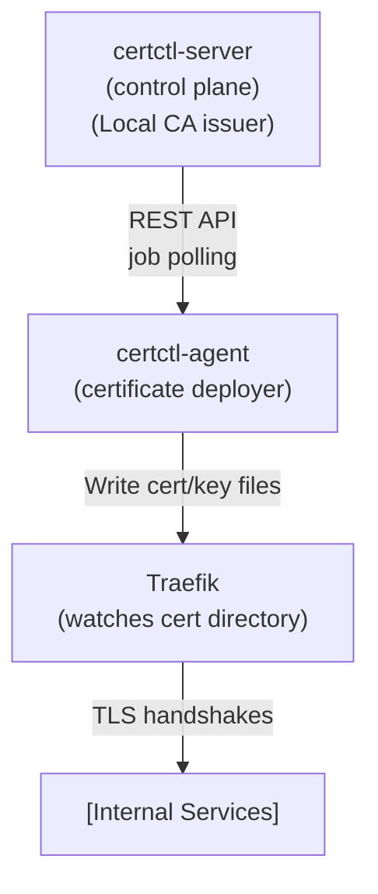

# Private CA + Traefik Example

> **Operational notes** shared by every example (postgres password rotation trap, TLS provisioning, teardown semantics) live in [`../README.md`](../README.md). Read it first if you plan to change `DB_PASSWORD` after the initial `docker compose up` — the postgres volume binds the password on first boot only.

This example demonstrates certctl managing certificates for **internal services without public CA dependency**. Ideal for enterprise environments where:

- All services are internal (VPN, private networks)
- You need unified certificate lifecycle management across multiple internal apps
- You want automatic cert deployment to your reverse proxy
- You may have an existing enterprise root CA (ADCS, OpenCA, etc.)

## What's Included

- **certctl server** with Local CA issuer (self-signed or sub-CA mode)
- **certctl agent** that deploys certificates to Traefik
- **Traefik** reverse proxy with file provider for dynamic cert discovery
- **PostgreSQL** database for certificate storage and audit trail
- Automatic certificate discovery for existing certs in Traefik

## Architecture



## TLS Security

certctl is HTTPS-only as of v2.2. The demo compose stack provisions a self-signed certificate. When accessing `https://localhost:8443`, you can either:
- Use `curl --cacert ./deploy/test/certs/ca.crt ...` to pin the CA certificate
- Use `curl -k ...` for quick smoke tests (never in production)
- Import the CA at `./deploy/test/certs/ca.crt` into your OS trust store for browser visits

## Quick Start (Self-Signed CA)

The simplest way to get running in 2 minutes:

```bash
# 1. Create directory structure
mkdir -p traefik-config ca-certs

# 2. Create a minimal Traefik dynamic config
cat > traefik-config/default.yaml << 'EOF'
# Traefik will auto-load certificates from /etc/traefik/certs
# Certctl deploys {cert-id}.crt and {cert-id}.key files here
http:
  routers:
    api:
      rule: "Host(`api.internal.local`)"
      service: api-service
      tls: {}
  services:
    api-service:
      loadBalancer:
        servers:
          - url: "http://localhost:3000"
EOF

# 3. Start the stack
docker compose up -d

# 4. Access the dashboards
# - certctl: https://localhost:8443 (API only, use the CLI or direct HTTP calls)
# - Traefik dashboard: http://localhost:8080
```

The self-signed CA will be automatically generated on first startup.

## Using Sub-CA Mode (Enterprise Root CA)

If you have an existing enterprise CA (ADCS, OpenCA, etc.) and want issued certs to chain to your root:

```bash
# 1. Create directory structure
mkdir -p traefik-config ca-certs

# 2. Copy your enterprise CA cert and key
cp /path/to/your/enterprise-ca.crt ca-certs/ca-cert.pem
cp /path/to/your/enterprise-ca-key.pem ca-certs/ca-key.pem

# 3. Edit docker-compose.yml and uncomment the sub-CA env vars:
#    CERTCTL_CA_CERT_PATH: /etc/certctl/ca-cert.pem
#    CERTCTL_CA_KEY_PATH: /etc/certctl/ca-key.pem

# 4. Create the dynamic config (same as above)
mkdir -p traefik-config
cat > traefik-config/default.yaml << 'EOF'
http:
  routers:
    api:
      rule: "Host(`api.internal.local`)"
      service: api-service
      tls: {}
  services:
    api-service:
      loadBalancer:
        servers:
          - url: "http://localhost:3000"
EOF

# 5. Start the stack
docker compose up -d
```

**Requirements for sub-CA mode:**
- CA certificate must have `X509v3 Basic Constraints: CA:TRUE`
- CA certificate must have `X509v3 Key Usage: Certificate Sign`
- Key format: RSA, ECDSA, or PKCS#8
- Paths: must be absolute paths to mounted files

## Creating a Certificate

Once the stack is running:

```bash
# 1. Create a certificate profile in certctl (defines allowed key types, TTL, etc.)
curl -X POST https://localhost:8443/api/v1/profiles \
  -H "Content-Type: application/json" \
  -d '{
    "id": "prof-internal",
    "name": "Internal Services",
    "description": "For internal APIs and web apps",
    "max_ttl_hours": 8760,
    "key_types": ["rsa-2048", "ecdsa-p256"]
  }'

# 2. Create a renewal policy (defines issuer, renewal thresholds, etc.)
curl -X POST https://localhost:8443/api/v1/policies \
  -H "Content-Type: application/json" \
  -d '{
    "id": "pol-internal",
    "name": "Internal Renewal Policy",
    "issuer_id": "iss-local",
    "profile_id": "prof-internal",
    "renewal_threshold_days": 30,
    "alert_thresholds_days": [30, 14, 7, 0]
  }'

# 3. Create a certificate (triggers issuance immediately)
curl -X POST https://localhost:8443/api/v1/certificates \
  -H "Content-Type: application/json" \
  -d '{
    "common_name": "api.internal.local",
    "sans": ["app.internal.local", "www.internal.local"],
    "policy_id": "pol-internal"
  }'

# 4. Create a Traefik target (agent will deploy to this)
curl -X POST https://localhost:8443/api/v1/targets \
  -H "Content-Type: application/json" \
  -d '{
    "id": "target-traefik-01",
    "name": "Traefik Primary",
    "type": "traefik",
    "config": {
      "cert_dir": "/etc/traefik/certs"
    }
  }'

# 5. Create a deployment job (agent picks this up and deploys)
curl -X POST https://localhost:8443/api/v1/certificates/{cert-id}/deploy \
  -H "Content-Type: application/json" \
  -d '{
    "target_ids": ["target-traefik-01"]
  }'
```

Once deployed, Traefik automatically loads the new certificate from the certs directory.

## How It Works

### Certificate Lifecycle

1. **Issue** — certctl-server generates certificate from Local CA (self-signed or sub-CA)
2. **Store** — certificate stored in PostgreSQL with full audit trail
3. **Deploy** — certctl-agent writes `{cert-id}.crt` + `{cert-id}.key` to `/etc/traefik/certs`
4. **Reload** — Traefik file provider detects new files and hot-loads them (zero downtime)
5. **Monitor** — certctl tracks deployment status and renewal timelines

### Self-Signed CA

- Generated automatically on first startup if `CERTCTL_CA_CERT_PATH` and `CERTCTL_CA_KEY_PATH` are not set
- Certificate stored in server's in-memory state (not persisted)
- All issued certs chain to this self-signed root
- Use this for: demos, development, internal labs

### Sub-CA Mode

- Requires you to provide an existing CA certificate and key
- Issued certificates chain to your enterprise root CA
- All issued certs are trustworthy to systems with your root CA in their trust store
- Use this for: production internal services, compliance requirements, enterprise PKI

## File Organization

```
private-ca-traefik/
├── docker-compose.yml          # Stack definition
├── traefik-config/             # Traefik dynamic config (you create)
│   └── default.yaml            # Routing rules and TLS settings
├── ca-certs/                   # CA certificate and key (for sub-CA mode)
│   ├── ca-cert.pem            # Your enterprise CA certificate
│   └── ca-key.pem             # Your enterprise CA private key
└── README.md                   # This file
```

## Monitoring

### certctl Dashboard
The server provides a REST API on port 8443. Example queries:

```bash
# List all certificates
curl https://localhost:8443/api/v1/certificates

# Check certificate status
curl https://localhost:8443/api/v1/certificates/{cert-id}

# View audit trail
curl https://localhost:8443/api/v1/audit

# Check renewal policy compliance
curl https://localhost:8443/api/v1/policies/{policy-id}
```

### Traefik Dashboard
http://localhost:8080 shows:
- HTTP routers and services
- TLS certificates currently loaded
- Request/response metrics

### Logs
```bash
# certctl server logs
docker compose logs certctl-server

# certctl agent logs
docker compose logs certctl-agent

# Traefik logs
docker compose logs traefik
```

## Customizing Traefik Config

Edit `traefik-config/default.yaml` to add routers for your services:

```yaml
http:
  routers:
    # Internal API
    api:
      rule: "Host(`api.internal.local`)"
      service: api-service
      tls: {}

    # Web application
    webapp:
      rule: "Host(`app.internal.local`)"
      service: webapp-service
      tls: {}

  services:
    api-service:
      loadBalancer:
        servers:
          - url: "http://api-backend:3000"

    webapp-service:
      loadBalancer:
        servers:
          - url: "http://webapp-backend:3001"
```

Changes are picked up automatically (file watcher enabled).

## Production Considerations

1. **Use sub-CA mode** — chain to your enterprise root for full trust
2. **Enable API key authentication** — set `CERTCTL_AUTH_TYPE: api-key` and `CERTCTL_API_KEY`
3. **Use agent-side key generation** — set `CERTCTL_KEYGEN_MODE: agent` (keys never leave agents)
4. **Back up PostgreSQL** — certificate data is authoritative; database loss means certificate loss
5. **Monitor renewal windows** — set up alerts on policy thresholds
6. **Rotate CA keys regularly** — plan for future CA refresh (sub-CA mode)
7. **Audit certificate usage** — review `certctl_audit_events` for compliance

## Troubleshooting

### Certificates not deploying
```bash
# Check agent is healthy
docker compose logs certctl-agent | grep heartbeat

# Check deployment job status
curl https://localhost:8443/api/v1/jobs | jq '.[] | select(.type == "Deployment")'

# Check Traefik is watching the directory
docker compose exec traefik ls -la /etc/traefik/certs/
```

### Traefik not reloading certs
```bash
# Verify file provider is enabled (check docker-compose.yml command)
# Verify certs volume is mounted at /etc/traefik/certs
# Check Traefik logs
docker compose logs traefik | grep "file"
```

### CA cert not loading in sub-CA mode
```bash
# Verify file permissions
docker compose exec certctl-server ls -la /etc/certctl/

# Check server logs for CA loading errors
docker compose logs certctl-server | grep -i "ca\|cert"

# Verify CA certificate format
openssl x509 -in ca-certs/ca-cert.pem -text -noout | grep -A 3 "Basic Constraints"
```

## Cleanup

```bash
# Stop all services
docker compose down

# Remove all data (certificates, database, etc.)
docker compose down -v

# Remove CA cert files (if using custom CA)
rm -rf ca-certs/
```

## Next Steps

1. **Add more services** — create additional routers and backends in `traefik-config/default.yaml`
2. **Set up renewal automation** — configure renewal policies with thresholds
3. **Integrate with monitoring** — expose certctl metrics to Prometheus
4. **Enable notifications** — configure email/Slack alerts on certificate events
5. **Scale to multiple environments** — deploy separate certctl stacks per environment (dev/staging/prod)

## Related Documentation

- [certctl Architecture](../../docs/architecture.md)
- [Traefik File Provider](https://doc.traefik.io/traefik/providers/file/)
- [Local CA Sub-CA Mode](../../docs/connectors.md#local-ca)
- [Certificate Profiles](../../docs/quickstart.md#profiles)
